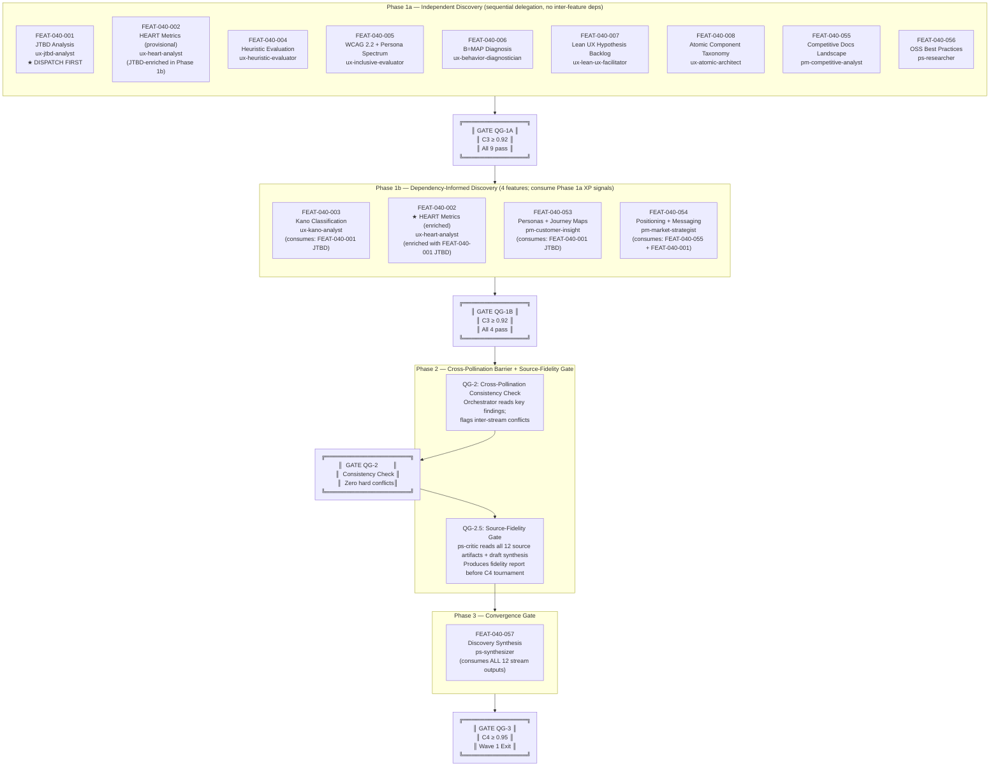

# Wave 1 Discovery: Orchestration Plan

> **Document ID:** PROJ-040-ORCH-PLAN-W1
> **Workflow ID:** wave-1-discovery-20260417-001
> **Project:** PROJ-040-documentation
> **Date:** 2026-04-20
> **Status:** APPROVED (full deliverable set)
> **Criticality:** C4 (Discovery Synthesis exit gate is irreversible planning input for Waves 2-4)
> **Baseline:** `reports/diataxis-audit-20260420.md` (C4 approved, 0.956 composite)
> **Iterations used:** plan-only 4/6, full-set 3/6
> **Plan-only review (iter-4):** PASS — tournament 0 Critical / 0 Major / 3 Minor; scoring 0.972
> **Plan-only trajectory:** 0.901 → 0.954 → 0.968 → 0.972
> **Full-set review (plan.md + ORCHESTRATION.yaml together, iter-3):** PASS — tournament 0 Critical / 0 Major / 5 Minor polish-level; scoring 0.977
> **Full-set trajectory:** 0.963 → 0.9665 → 0.977
> **Companion SSOT:** `projects/PROJ-040-documentation/ORCHESTRATION.yaml` (version 1.0.3, status APPROVED)
> **Worktracker Entity:** FEAT-040-058 (`projects/PROJ-040-documentation/work/EPIC-040-001/orch/FEAT-040-058/`)
> **Implements:** `projects/PROJ-040-documentation/PLAN.md` (Orchestration Architecture section)

---

## Document Sections

| Section | Purpose |
|---------|---------|
| [L0: Wave Overview](#l0-wave-overview) | What Wave 1 does and why it matters |
| [L1: Phase Structure](#l1-phase-structure) | Phases, concurrent batches, sync barriers, diagram |
| [Feature-to-Phase Mapping](#feature-to-phase-mapping) | Which feature runs when |
| [Dependency DAG](#dependency-dag) | Explicit upstream/downstream relationships |
| [Cross-Pollination Points](#cross-pollination-points) | Where streams inform each other |
| [Artifact Paths](#artifact-paths) | Output locations for every feature |
| [Handoff Catalog](#handoff-catalog) | All intra-stream and cross-stream handoffs |
| [State Schema](#state-schema) | Feature lifecycle states, state file format |
| [Quality Gates](#quality-gates) | Gate names, thresholds, escalation paths |
| [Checkpoint Strategy](#checkpoint-strategy) | When to write session-resumable checkpoints |
| [Worktracker Integration](#worktracker-integration) | Which transitions trigger WORKTRACKER.md updates |
| [Failure Handling](#failure-handling) | Circuit-breaker escalation protocol |
| [Orchestrator Runtime Behavior](#orchestrator-runtime-behavior) | Step-by-step main-context execution |
| [L2: Implementation Details](#l2-implementation-details) | State schema, path config, recovery strategies |
| [Internal Finding Code Index](#internal-finding-code-index) | Source document paths for all internal finding codes |
| [Revision Log](#revision-log) | Changes made in each iteration |
| [Consistency Audit](#consistency-audit-iter-4-pre-write-verification) | Cross-reference audit performed before iter-4 edits |
| [Disclaimer](#disclaimer) | Mandatory orch-planner output notice |

---

## L0: Wave Overview

Wave 1 is the discovery phase of PROJ-040. Before writing a single documentation page, the project needs to know three things: what users are trying to accomplish (UX stream), how Jerry should position itself in the OSS landscape (PM stream), and what production-grade documentation looks like in comparable projects (Research stream). Without these inputs, writing risks the same drift that made PROJ-016 unexecutable.

Wave 1 runs 12 discovery feature workers across three parallel streams — UX, PM, and Research — then feeds all outputs into a single convergence gate (Discovery Synthesis) that produces one typed document consumed by Waves 2, 3, and 4. This plan coordinates those 13 features (12 discovery + 1 synthesis) across three phases, enforces quality gates at every stream boundary, and ensures no wave-boundary synthesis fires until all per-feature reviews are complete.

This plan is the deliverable for FEAT-040-058 (Wave 1 orchestration plan — orch-planner) and implements the Orchestration Architecture defined in `projects/PROJ-040-documentation/PLAN.md`.

---

## L1: Phase Structure

### Phase Overview

Wave 1 executes in three sequential phases with internal concurrency. Each phase ends at a named quality gate before the next begins.

> **Concurrency note:** "Independent" phases allow sequential delegation without waiting for inter-feature outputs. Claude Code's Agent tool invokes workers serially within a session — workers are dispatched one at a time and the orchestrator awaits each return before dispatching the next. "Independent" means no *data dependency* between features within the phase, not simultaneous execution. See [Phase 1a Execution](#phase-1a-execution) for priority sequencing.

| Phase | Name | Features | Execution Model | Gate |
|-------|------|----------|-----------------|------|
| Phase 1a | Independent Discovery | 9 features | Sequential delegation (no inter-feature dependencies) | QG-1A: all C3 ≥ 0.92 |
| Phase 1b | Dependency-Informed Discovery | 4 features | Sequential delegation (consume Phase 1a XP signals) | QG-1B: all C3 ≥ 0.92 |
| Phase 2 | Cross-Pollination Barrier | (no new features; cross-check pass) | Orchestrator-executed with dedicated QG-2.5 fidelity checker | QG-2: consistency check; QG-2.5: source-fidelity gate |
| Phase 3 | Convergence Gate | 1 feature (synthesis) | Single delegation + C4 adversarial tournament | QG-3: C4 ≥ 0.95 |

> **Threshold rationale (C3 ≥ 0.92):** H-13 (`.context/rules/quality-enforcement.md` Quality Gate section) mandates quality threshold ≥ 0.92 for all C2+ deliverables. Individual Wave 1 features are classified C3 (significant: >10 files affected, API/cross-module impact on documentation IA). C3 falls within "C2+" scope; therefore 0.92 is the minimum compliant threshold. Setting any per-feature threshold below 0.92 would require an explicit H-13 exception ADR. No such exception is warranted — the simpler fix is compliance. Source: `quality-enforcement.md` H-13.

> **Iteration ceiling rationale (C3 = 7, C4 = 10):** RT-M-010 (`agent-routing-standards.md` Iteration Ceiling Standards) specifies criticality-mapped ceilings: C3 = 7, C4 = 10. Per-feature workers are C3 → max 7 iterations. Discovery Synthesis (QG-3) is C4 → max 10 iterations. This plan aligns with RT-M-010 exactly. Source: `agent-routing-standards.md` RT-M-010.

### Phase Diagram



> **Note on FEAT-040-002 (HEART Metrics):** HEART is split across phases. Phase 1a dispatches FEAT-040-002 as a **provisional** HEART spec (ux-heart-analyst defines goal-proxy metrics without validated JTBD input). Phase 1b dispatches FEAT-040-002 **enriched** (ux-heart-analyst revises HEART goals using FEAT-040-001 JTBD job statements). The Phase 1b enrichment is the authoritative output; the Phase 1a pass ensures the agent is familiar with the domain before the JTBD input arrives. See [Dependency DAG](#dependency-dag) for rationale.

### ASCII Workflow Diagram

```
STREAM 1 (UX)             STREAM 2 (PM)         STREAM 3 (Research)
─────────────────         ─────────────         ───────────────────

Phase 1a (sequential delegation; no inter-feature data deps):
DISPATCH ORDER: FEAT-040-001 first, then 007 remaining in any order.

  ★ FEAT-040-001 JTBD    FEAT-040-055           FEAT-040-056
  FEAT-040-002 HEART*    Competitive            OSS Research
  FEAT-040-004 Heuristic
  FEAT-040-005 WCAG
  FEAT-040-006 B=MAP
  FEAT-040-007 Lean UX
  FEAT-040-008 Atomic
         │                     │                       │
         └──────────────────────────────────────────────┘
                                │
                    ╔═══════════════════╗
                    ║      QG-1A        ║
                    ║  C3 >= 0.92       ║
                    ║  9 features pass  ║
                    ║  (H-13 compliant) ║
                    ╚═══════════════════╝
                                │
Phase 1b (4 features; consume Phase 1a XP signals):
  FEAT-040-003 Kano           FEAT-040-053 Personas
  (from: FEAT-040-001)        (from: FEAT-040-001)

  FEAT-040-002 HEART★         FEAT-040-054 Positioning
  (enriched: FEAT-040-001)    (from: FEAT-040-055 +
                               FEAT-040-001)

  *FEAT-040-002 Phase 1a = provisional; Phase 1b = authoritative
  ★ = HEART enriched pass; Phase 1b HEART output replaces Phase 1a output
         │                          │
         └──────────────────────────┘
                                │
                    ╔═══════════════════╗
                    ║      QG-1B        ║
                    ║  C3 >= 0.92       ║
                    ║  4 features pass  ║
                    ╚═══════════════════╝
                                │
                    ╔═══════════════════╗
                    ║  Phase 2: QG-2    ║
                    ║  Cross-Pollination║
                    ║  Consistency:     ║
                    ║  Zero hard        ║
                    ║  conflicts        ║
                    ╚═══════════════════╝
                                │
                    ╔═══════════════════╗
                    ║  Phase 2: QG-2.5  ║
                    ║  Source-Fidelity  ║
                    ║  Gate (ps-critic) ║
                    ║  MUST PASS before ║
                    ║  C4 tournament    ║
                    ╚═══════════════════╝
                                │
                    ╔═══════════════════╗
                    ║  Phase 3          ║
                    ║  FEAT-040-057     ║
                    ║  Discovery        ║
                    ║  Synthesis        ║
                    ╚═══════════════════╝
                                │
                    ╔═══════════════════╗
                    ║      QG-3         ║
                    ║  C4 >= 0.95       ║
                    ║  Wave 1 Exit      ║
                    ╚═══════════════════╝
                                │
                         WAVE 1 COMPLETE
                  (typed input for Waves 2-4)
```

---

## Feature-to-Phase Mapping

| Feature ID | Title | Stream | Phase | Agent | Depends On | Dep Type |
|------------|-------|--------|-------|-------|------------|----------|
| FEAT-040-001 | JTBD analysis for all 30 skills | UX | 1a | ux-jtbd-analyst | none | — |
| FEAT-040-002 | HEART metrics specification (provisional) | UX | 1a | ux-heart-analyst | none | — |
| FEAT-040-004 | Heuristic evaluation of README + docs/index.md | UX | 1a | ux-heuristic-evaluator | none | — |
| FEAT-040-005 | WCAG 2.2 + Persona Spectrum audit | UX | 1a | ux-inclusive-evaluator | none | — |
| FEAT-040-006 | B=MAP diagnosis on getting-started completion | UX | 1a | ux-behavior-diagnostician | none | — |
| FEAT-040-007 | Lean UX hypothesis backlog for doc decisions | UX | 1a | ux-lean-ux-facilitator | none | — |
| FEAT-040-008 | Atomic component taxonomy for doc patterns | UX | 1a | ux-atomic-architect | none | — |
| FEAT-040-055 | Competitive docs landscape benchmark | PM | 1a | pm-competitive-analyst | none | — |
| FEAT-040-056 | OSS docs best-practices research | Research | 1a | ps-researcher | none | — |
| FEAT-040-003 | Kano classification of planned doc artifacts | UX | 1b | ux-kano-analyst | FEAT-040-001 | enrichment |
| FEAT-040-002 | HEART metrics specification (enriched/authoritative) | UX | 1b | ux-heart-analyst | FEAT-040-001 | enrichment |
| FEAT-040-053 | Personas + journey maps | PM | 1b | pm-customer-insight | FEAT-040-001 | enrichment |
| FEAT-040-054 | Positioning + messaging framework | PM | 1b | pm-market-strategist | FEAT-040-055, FEAT-040-001 | enrichment |
| FEAT-040-057 | Discovery Synthesis | Synthesis | 3 | ps-synthesizer | all 12 above | hard |

> **Dep Type column:** "enrichment" = key_findings injected at handoff construction time; feature can start without upstream output but produces richer results with it. "hard" = cannot start until all upstream features are `complete`. This distinction is important for orchestration logic: enrichment deps only block Phase 1b from *starting* (not from being dispatched independently if upstream fails); hard deps block Phase 3 from starting if any upstream feature is `blocked`.

**Phase 1a count:** 9 features dispatched (8 independent + FEAT-040-002 provisional pass; FEAT-040-056 OSS Research also in 1a)
**Phase 1b count:** 4 features (FEAT-040-003, FEAT-040-002 enriched, FEAT-040-053, FEAT-040-054)
**Phase 3 count:** 1 feature (Synthesis)
**Total unique features:** 13 (12 discovery + 1 synthesis; FEAT-040-002 runs twice but counts once)

> **FEAT-040-002 dual-pass rationale:** HEART goal-signal-metric triples for "Happiness" and "Task Success" dimensions require knowing what tasks users are trying to accomplish — directly dependent on JTBD job statements (FEAT-040-001). Running HEART in Phase 1a without JTBD produces generic proxy metrics that may misalign with validated user goals. The dual-pass approach: (a) Phase 1a provisional pass produces domain-familiar HEART skeleton; (b) Phase 1b enriched pass revises HEART goals using JTBD job statements. The Phase 1b output is the authoritative artifact consumed by synthesis. Source: IN-002 and RT-003 findings from adversarial tournament (iter-1); CB-02 parallelism preservation principle (`agent-development-standards.md`).

### Why pm-market-strategist is Phase 1b

`pm-market-strategist` (FEAT-040-054) produces a positioning framework for Jerry's README. This output is substantially richer when it incorporates: (a) JTBD job statements identifying what users hire Jerry for (enrichment from FEAT-040-001), and (b) the competitive benchmark showing how comparable frameworks position themselves (enrichment from FEAT-040-055). Both enrichment sources complete in Phase 1a. The strategist does not require full document reads at delegation time — the handoff carries 3-5 key findings per CB-04 (`agent-development-standards.md`). Source: CB-04 (key findings sufficient for orientation), RT-M-006 ordering protocol (`agent-routing-standards.md`).

---

## Dependency DAG

```
FEAT-040-001 ──┬──► FEAT-040-003 (Kano needs JTBD job-level context) [enrichment]
               ├──► FEAT-040-002 Phase1b (HEART goals revised with JTBD actors) [enrichment]
               ├──► FEAT-040-053 (Personas complement JTBD actors) [enrichment]
               └──► FEAT-040-054 (Positioning anchored in user JTBD) [enrichment]

FEAT-040-055 ──┬──► FEAT-040-054 (Competitive benchmark informs positioning) [enrichment]

FEAT-040-002 (1a) ──► FEAT-040-002 (1b, enriched) [provisional → authoritative]
FEAT-040-004 ──► (independent; informs QG-2 conflict check)
FEAT-040-005 ──► (independent; informs QG-2 conflict check)
FEAT-040-006 ──► (independent; lean UX hypothesis source; XP-06 synthesis-time)
FEAT-040-007 ──► (independent; lean UX hypothesis source; XP-06 synthesis-time)
FEAT-040-008 ──► (independent; component taxonomy source)
FEAT-040-056 ──► (independent; research source for synthesis)

ALL 12 feature outputs ──► FEAT-040-057 (Discovery Synthesis consumes all) [hard]
```

**DAG notes:**

- FEAT-040-001 (JTBD) is the DAG root and highest-priority Phase 1a feature. It MUST be dispatched first within Phase 1a. If it enters `blocked` state, Wave 1 pauses (see [Failure Handling](#failure-handling)).
- FEAT-040-003 (Kano) is the most JTBD-dependent feature. Kano classification of doc artifacts (must-be / performance / attractive) is more precise when JTBD job statements are available to cross-reference. Placing Kano in Phase 1b avoids speculation.
- FEAT-040-002 (HEART) has a semantic dependency on JTBD: HEART "Happiness" and "Task Success" dimensions require knowing which tasks users are trying to accomplish. The Phase 1b enriched pass resolves this.
- FEAT-040-054 (Positioning) is the most dependency-dense Phase 1b feature: it needs competitive benchmarks (what others say) and JTBD (what users need) to avoid producing generic positioning copy.
- No Phase 1a feature has upstream dependencies within Wave 1. All Phase 1a features consume the audit (`reports/diataxis-audit-20260420.md`) as a read-only shared input.

---

## Cross-Pollination Points

Cross-pollination occurs when one stream's key findings structurally inform a sibling feature. The orchestrator injects these findings as context in the delegating handoff — not as inline content, but as file-path references plus 3-5 key findings bullets per CB-04.

| XP ID | From | To | Mechanism | Phase Boundary | Source Rule |
|-------|------|----|-----------|----------------|-------------|
| XP-01 | FEAT-040-001 (JTBD job statements) | FEAT-040-003 (Kano) | Orchestrator includes JTBD artifact path + top 5 job statements in Kano handoff | 1a → 1b | CB-04 |
| XP-01b | FEAT-040-001 (JTBD actors) | FEAT-040-002 Phase1b (HEART) | Orchestrator includes JTBD artifact path + JTBD actors/goals in HEART enrichment handoff | 1a → 1b | IN-002, RT-003 |
| XP-02 | FEAT-040-001 (JTBD actors) | FEAT-040-053 (Personas) | Orchestrator includes JTBD artifact path + actor segments in Personas handoff | 1a → 1b | CB-04 |
| XP-03 | FEAT-040-055 (competitive benchmark) | FEAT-040-054 (Positioning) | Orchestrator includes competitive artifact path + top 3 patterns in Positioning handoff | 1a → 1b | CB-04 |
| XP-04 | FEAT-040-001 (JTBD) | FEAT-040-054 (Positioning) | Orchestrator includes JTBD artifact path + top 5 jobs in Positioning handoff | 1a → 1b | CB-04 |
| XP-05 | FEAT-040-004 (Heuristic) + FEAT-040-005 (WCAG) | QG-2 consistency check | Orchestrator reads both key-findings returns; flags if accessibility severity contradicts heuristic severity for same surface element | 1b → Phase 2 | see QG-2 hard conflict definition |
| XP-06 | FEAT-040-006 (B=MAP) | FEAT-040-007 (Lean UX) | Synthesis-time enrichment: ps-synthesizer explicitly cross-references B=MAP barriers against Lean UX hypotheses in Phase 3 | Phase 3 synthesis | see note below |
| XP-07 | All 12 stream outputs | FEAT-040-057 (Synthesis) | Orchestrator builds synthesis handoff with all 12 artifact paths + per-stream key findings (max 3 bullets per stream per DA-003) | 1b → Phase 3 | CB-04 |

**XP-06 handling note:** Both FEAT-040-006 (B=MAP) and FEAT-040-007 (Lean UX) are Phase 1a features with no declared dependency. In true sequential dispatch both run without waiting for each other. The orchestrator flags XP-06 as a **synthesis-time enrichment**: the ps-synthesizer in Phase 3 reads both outputs and explicitly cross-references B=MAP barriers against Lean UX hypotheses to verify alignment. This avoids forcing sequential execution within Phase 1a while still capturing the cross-pollination signal. Parallelism preserved per CB-02 (`agent-development-standards.md`); context budget priority maintained.

---

## Artifact Paths

All paths are relative to `projects/PROJ-040-documentation/`.

### UX Stream Artifacts

| Feature | Agent | Phase | Output File |
|---------|-------|-------|-------------|
| FEAT-040-001 | ux-jtbd-analyst | 1a | `work/EPIC-040-001/ux/FEAT-040-001/ux-jtbd-analyst-output.md` |
| FEAT-040-002 | ux-heart-analyst | 1a (provisional) | `work/EPIC-040-001/ux/FEAT-040-002/ux-heart-analyst-provisional-output.md` |
| FEAT-040-002 | ux-heart-analyst | 1b (authoritative) | `work/EPIC-040-001/ux/FEAT-040-002/ux-heart-analyst-output.md` |
| FEAT-040-003 | ux-kano-analyst | 1b | `work/EPIC-040-001/ux/FEAT-040-003/ux-kano-analyst-output.md` |
| FEAT-040-004 | ux-heuristic-evaluator | 1a | `work/EPIC-040-001/ux/FEAT-040-004/ux-heuristic-evaluator-output.md` |
| FEAT-040-005 | ux-inclusive-evaluator | 1a | `work/EPIC-040-001/ux/FEAT-040-005/ux-inclusive-evaluator-output.md` |
| FEAT-040-006 | ux-behavior-diagnostician | 1a | `work/EPIC-040-001/ux/FEAT-040-006/ux-behavior-diagnostician-output.md` |
| FEAT-040-007 | ux-lean-ux-facilitator | 1a | `work/EPIC-040-001/ux/FEAT-040-007/ux-lean-ux-facilitator-output.md` |
| FEAT-040-008 | ux-atomic-architect | 1a | `work/EPIC-040-001/ux/FEAT-040-008/ux-atomic-architect-output.md` |

### PM Stream Artifacts

| Feature | Agent | Phase | Output File |
|---------|-------|-------|-------------|
| FEAT-040-053 | pm-customer-insight | 1b | `work/EPIC-040-001/pm/FEAT-040-053/pm-customer-insight-output.md` |
| FEAT-040-054 | pm-market-strategist | 1b | `work/EPIC-040-001/pm/FEAT-040-054/pm-market-strategist-output.md` |
| FEAT-040-055 | pm-competitive-analyst | 1a | `work/EPIC-040-001/pm/FEAT-040-055/pm-competitive-analyst-output.md` |

### Research Stream Artifact

| Feature | Agent | Phase | Output File |
|---------|-------|-------|-------------|
| FEAT-040-056 | ps-researcher | 1a | `work/EPIC-040-001/research/FEAT-040-056/ps-researcher-output.md` |

### Synthesis Artifact

| Feature | Agent | Output File |
|---------|-------|-------------|
| FEAT-040-057 | ps-synthesizer | `work/EPIC-040-001/synthesis/discovery-synthesis.md` |

### Source-Fidelity Gate Artifact

| Gate | Agent | Output File |
|------|-------|-------------|
| QG-2.5 | ps-critic | `orchestration/reviews/qg-25-source-fidelity-report.md` |

### State Files

| Purpose | Path |
|---------|------|
| Feature state (one per feature) | `orchestration/state/FEAT-040-{NNN}.yaml` |
| Phase checkpoint (one per phase boundary) | `orchestration/checkpoints/phase-{N}-checkpoint.yaml` |
| Wave summary | `orchestration/checkpoints/wave-1-summary.yaml` |

---

## Handoff Catalog

The orchestrator constructs each handoff immediately before delegating the corresponding feature. All handoffs conform to the canonical schema at `docs/schemas/handoff-v2.schema.json` (repo root; per `agent-development-standards.md` Handoff Protocol section).

### Intra-Stream Handoffs (orchestrator → worker, single stream)

| Handoff ID | From | To | Artifact Inputs | Criticality | Notes |
|------------|------|----|-----------------|-------------|-------|
| HO-W1-001 | orchestrator | ux-jtbd-analyst | audit path | C3 | Phase 1a; ★ DISPATCH FIRST |
| HO-W1-002 | orchestrator | ux-heart-analyst (provisional) | audit path | C3 | Phase 1a; provisional pass; explicit note to worker: "produce HEART skeleton flagged for JTBD validation in Phase 1b" |
| HO-W1-003 | orchestrator | ux-heuristic-evaluator | audit path, README path, docs/index.md path | C3 | Phase 1a; reads live files |
| HO-W1-004 | orchestrator | ux-inclusive-evaluator | audit path, README path, docs/index.md path | C3 | Phase 1a; WCAG requires rendered surfaces |
| HO-W1-005 | orchestrator | ux-behavior-diagnostician | audit path, getting-started path | C3 | Phase 1a; B=MAP requires behavior surface |
| HO-W1-006 | orchestrator | ux-lean-ux-facilitator | audit path | C3 | Phase 1a; hypothesis backlog |
| HO-W1-007 | orchestrator | ux-atomic-architect | audit path, docs/ glob | C3 | Phase 1a; component taxonomy |
| HO-W1-008 | orchestrator | pm-competitive-analyst | audit path | C3 | Phase 1a; web research |
| HO-W1-009 | orchestrator | ps-researcher | audit path | C3 | Phase 1a; web research |

### Cross-Stream Handoffs (Phase 1b; consume Phase 1a outputs)

| Handoff ID | From | To | Artifact Inputs | Cross-Pollination | Criticality |
|------------|------|----|-----------------|-------------------|-------------|
| HO-W1-010 | orchestrator | ux-kano-analyst | audit path + FEAT-040-001 artifact (XP-01) | XP-01 | C3 |
| HO-W1-010b | orchestrator | ux-heart-analyst (enriched) | audit path + FEAT-040-001 artifact + provisional HEART artifact (XP-01b) | XP-01b | C3 |
| HO-W1-011 | orchestrator | pm-customer-insight | audit path + FEAT-040-001 artifact (XP-02) | XP-02 | C3 |
| HO-W1-012 | orchestrator | pm-market-strategist | audit path + FEAT-040-055 artifact + FEAT-040-001 artifact (XP-03, XP-04) | XP-03, XP-04 | C3 |

### QG-2.5 Source-Fidelity Handoff

| Handoff ID | From | To | Artifact Inputs | Notes |
|------------|------|----|-----------------|-------|
| HO-W1-013a | orchestrator | ps-critic | All 12 feature artifact paths + all 12 feature state file paths + synthesis path (if draft exists; omit on first pre-check) | Source-fidelity gate; ps-critic reads state file `key_findings[]` as the canonical key-finding set; MUST complete before QG-3 tournament |

### Synthesis Handoff (Phase 3)

| Handoff ID | From | To | Artifact Inputs | Notes |
|------------|------|----|-----------------|-------|
| HO-W1-013 | orchestrator | ps-synthesizer | All 12 feature artifact paths + per-stream key findings (max 3 bullets per stream) | XP-07; C4 gate; capped at 36 total bullets + 12 paths per DA-003 |

### Handoff Schema Template (representative structure — HO-W1-010)

> Note: key_findings below are populated by the orchestrator at Phase 1b start from FEAT-040-001 state file. This block shows the schema structure; actual content is runtime-generated. This is a schema template with unfilled fields, not a valid schema instance.

```yaml
# HO-W1-010: orchestrator → ux-kano-analyst (schema template)
from_agent: "orchestrator"
to_agent: "ux-kano-analyst"
task: >
  Classify all planned PROJ-040 documentation artifacts using the Kano model
  (must-be, performance, attractive, indifferent, reverse). Use the JTBD job
  statements from FEAT-040-001 as the primary lens for classification. Output
  covers: tutorials (30 skill slots), how-to guides (26 skill slots), explanations
  (5-10 skill slots), reference catalog (1 slot), README, docs/index.md.
success_criteria:
  - "All 30 skill tutorial slots classified with Kano category + confidence"
  - "All 26 how-to guide slots classified"
  - "Priority ordering of must-be artifacts with JTBD traceability"
  - "S-014 composite >= 0.92"
artifacts:
  - "projects/PROJ-040-documentation/reports/diataxis-audit-20260420.md"
  - "projects/PROJ-040-documentation/work/EPIC-040-001/ux/FEAT-040-001/ux-jtbd-analyst-output.md"
key_findings:
  - "[FROM FEAT-040-001] Top 5 JTBD job statements — injected at Phase 1b start from state file"
  - "[XP-01] JTBD actors — injected at Phase 1b start from state file"
  - "[XP-01] Top job categories — injected at Phase 1b start from state file"
blockers: []
confidence: "[planning estimate; orch-tracker populates at execution time]"
criticality: "C3"
```

### Handoff Schema Template (representative structure — HO-W1-013)

```yaml
# HO-W1-013: orchestrator → ps-synthesizer (schema template)
# DA-003 compliance: per-stream key_findings capped at 3 bullets; total ~36 bullets + 12 paths
from_agent: "orchestrator"
to_agent: "ps-synthesizer"
task: >
  Synthesize all 12 Wave 1 stream outputs into a single Discovery Synthesis document.
  The synthesis must: (1) identify convergent signals across all three streams,
  (2) produce a prioritized documentation IA recommendation for Waves 2-4,
  (3) surface conflicts and unresolved tensions between streams,
  (4) cross-reference B=MAP barriers (FEAT-040-006) against Lean UX hypotheses
  (FEAT-040-007) per XP-06, (5) cross-reference heuristic findings (FEAT-040-004)
  against WCAG findings (FEAT-040-005) per XP-05.
success_criteria:
  - "JTBD job statements for all 30 skills present (sourced from FEAT-040-001)"
  - "HEART metric specifications with JTBD-validated goals (from FEAT-040-002 Phase 1b)"
  - "Kano classification for each planned doc artifact (from FEAT-040-003)"
  - "Heuristic violations resolved against WCAG findings (XP-05)"
  - "Positioning framework ready for Wave 2 README revision (from FEAT-040-054)"
  - "OSS peer benchmark patterns table (from FEAT-040-055 + FEAT-040-056)"
  - "Prioritized documentation IA recommendation covering Waves 2-4 sequence"
  - "S-014 composite >= 0.95"
artifacts:
  - "projects/PROJ-040-documentation/work/EPIC-040-001/ux/FEAT-040-001/ux-jtbd-analyst-output.md"
  - "projects/PROJ-040-documentation/work/EPIC-040-001/ux/FEAT-040-002/ux-heart-analyst-output.md"
  - "projects/PROJ-040-documentation/work/EPIC-040-001/ux/FEAT-040-003/ux-kano-analyst-output.md"
  - "projects/PROJ-040-documentation/work/EPIC-040-001/ux/FEAT-040-004/ux-heuristic-evaluator-output.md"
  - "projects/PROJ-040-documentation/work/EPIC-040-001/ux/FEAT-040-005/ux-inclusive-evaluator-output.md"
  - "projects/PROJ-040-documentation/work/EPIC-040-001/ux/FEAT-040-006/ux-behavior-diagnostician-output.md"
  - "projects/PROJ-040-documentation/work/EPIC-040-001/ux/FEAT-040-007/ux-lean-ux-facilitator-output.md"
  - "projects/PROJ-040-documentation/work/EPIC-040-001/ux/FEAT-040-008/ux-atomic-architect-output.md"
  - "projects/PROJ-040-documentation/work/EPIC-040-001/pm/FEAT-040-053/pm-customer-insight-output.md"
  - "projects/PROJ-040-documentation/work/EPIC-040-001/pm/FEAT-040-054/pm-market-strategist-output.md"
  - "projects/PROJ-040-documentation/work/EPIC-040-001/pm/FEAT-040-055/pm-competitive-analyst-output.md"
  - "projects/PROJ-040-documentation/work/EPIC-040-001/research/FEAT-040-056/ps-researcher-output.md"
blockers: []
confidence: "[planning estimate; orch-tracker populates at execution time]"
criticality: "C4"
```

---

## State Schema

### Feature Lifecycle States

```
pending → planning → in_progress → under_review → revising → complete
                                         │
                                    [gate_fail]
                                         │
                                    revising ──► under_review (loop, max 7 for C3; max 10 for C4)
                                         │
                                  [circuit_break] → blocked (escalate to user)
```

| State | Description | Who Sets |
|-------|-------------|----------|
| `pending` | Feature not yet started | Initial; orch-planner |
| `planning` | Orchestrator constructing handoff | Orchestrator |
| `in_progress` | Worker executing in delegated context | Orchestrator (on delegation) |
| `under_review` | Worker returned; quality scoring in progress | Orchestrator (on return) |
| `revising` | Score < threshold; revision requested | Orchestrator (on gate fail) |
| `complete` | Gate passed; artifact persisted | Orchestrator (on gate pass) |
| `blocked` | Circuit breaker fired; awaiting user escalation | Orchestrator (on CB activation) |

### State File Format (per feature)

```yaml
# orchestration/state/FEAT-040-001.yaml
feature_id: "FEAT-040-001"
title: "JTBD analysis for all 30 skills"
agent: "ux-jtbd-analyst"
phase: "1a"
stream: "ux"
state: "pending"                 # current lifecycle state
iteration: 0                     # quality revision count
quality_score: null              # S-014 composite; null until scored
score_history: []                # [float, ...] — appended each time quality_score updates; enables plateau detection
quality_threshold: 0.92          # C3 threshold (H-13 compliant: quality-enforcement.md H-13)
circuit_breaker_max: 7           # C3 ceiling per RT-M-010 (agent-routing-standards.md)
plateau_detection: false         # true when max(score_history[-3:]) - min(score_history[-3:]) < 0.01
artifact_path: null              # populated when state = complete
phase_completions: []            # FEAT-040-002 only: tracks ["1a-provisional"] and/or ["1b-authoritative"]
                                 # Resume rule: if phase_completions lacks "1b-authoritative", Phase 1b
                                 # enriched pass is still outstanding even if state == complete.
                                 # All other features leave this field as [].
key_findings: []                 # populated when state = under_review
confidence: null                 # worker self-assessed confidence
last_updated: null               # ISO 8601 timestamp
github_issue_url: null           # H-32: populated at Pre-Wave Initialization
blockers: []
history:
  []                             # [{state, timestamp, note}]
```

> **Plateau detection formula:** After each scoring, append `quality_score` to `score_history`. Compute `max(score_history[-3:]) - min(score_history[-3:])`. If result < 0.01 and `len(score_history) >= 3`, set `plateau_detection: true`. This is the mechanically computable plateau condition. Source: PM-003 finding (iter-1); RT-M-010 (`agent-routing-standards.md`).

### Orchestrator State Protocol

The orchestrator (main context) owns all state file writes. Workers MUST NOT write state files. Protocol:

1. Before delegating: set `state: planning`, write file.
2. On delegation: set `state: in_progress`, write file.
3. **On worker return: write the state file FIRST (before scoring or further delegations).** Set `state: under_review`, populate `key_findings` and `confidence`. This minimizes the race window where key_findings could be lost to context compaction. Source: CV-003 finding (iter-1).
4. After scoring: append `quality_score` to `score_history`. If pass → `state: complete`, populate `artifact_path`. For FEAT-040-002: append `"1a-provisional"` to `phase_completions` when Phase 1a pass completes; append `"1b-authoritative"` when Phase 1b pass completes. If fail → `state: revising`, increment `iteration`. Compute plateau condition.
5. If `iteration >= circuit_breaker_max` or `plateau_detection == true`: `state: blocked`, log escalation.

> **Resume logic for FEAT-040-002:** On session resume, check `phase_completions` in `FEAT-040-002.yaml`. If `"1a-provisional"` is present but `"1b-authoritative"` is absent — even if `state: complete` — the Phase 1b enriched pass is outstanding and MUST be dispatched. Do not treat Phase 1a `complete` as both phases done. Source: FM2-001 / SR2-002 (iter-2 tournament); REG-003.

---

## Quality Gates

### Gate Definitions

| Gate ID | Name | Trigger | Threshold | Escalation Path | Source |
|---------|------|---------|-----------|-----------------|--------|
| QG-1A | Phase 1a Completion | All 9 Phase 1a dispatches reach `complete` | C3 ≥ 0.92 per feature | If any feature is `blocked`: pause Wave 1, escalate to user, ask for guidance per H-31 | H-13 |
| QG-1B | Phase 1b Completion | All 4 Phase 1b features reach `complete` | C3 ≥ 0.92 per feature | Same as QG-1A | H-13 |
| QG-2 | Cross-Pollination Consistency | Phase 2 barrier pass | Zero hard conflicts between streams | If hard conflict found: orchestrator flags conflict, presents to user, requests resolution decision before proceeding | XP-05, XP-06 |
| QG-2.5 | Source-Fidelity Gate | ps-critic fidelity report complete | PASS (all key findings traceable or explicitly excluded with rationale) | If FAIL: ps-synthesizer must revise before QG-3 tournament runs | IN-001 finding |
| QG-3 | Wave 1 Exit / Discovery Synthesis | FEAT-040-057 `complete` | C4 ≥ 0.95 | If synthesis scores 0.90-0.94: revise (C4 adversarial tournament; all 10 strategies). If blocked after 10 iterations: Synthesis Review Package to human (see Failure Handling) | H-13 |

### QG-2 Hard Conflict Definition and Examples

**Hard conflict:** Two findings that directly contradict each other in a way that would produce conflicting recommendations in the Discovery Synthesis. Hard conflicts block QG-2.

**Soft conflict:** Different emphasis, different severity on non-overlapping issues, or two valid perspectives on the same issue that can coexist. Soft conflicts are noted and passed to synthesis for reconciliation.

**Classification matrix:** A conflict is HARD if all three conditions hold: (a) the same surface element is referenced, (b) severity or recommendation divergence is ≥ 2 levels (e.g., Critical vs. Low), and (c) accepting both would require contradictory documentation recommendations.

> **QG-2 threshold derivation (RB-002):** A 2-level divergence on the 4-level severity scale (Cosmetic/Minor/Major/Critical) represents disagreement across the threshold that divides acceptable-for-release from release-blocking (Minor↔Major is the key boundary). 1-level divergence is normal inter-rater variance; 2-level is a material disagreement requiring reconciliation. Source: internal heuristic; formalize in trade study if QG-2 false-positive rate exceeds 15% during execution.

| Type | Example | Classification |
|------|---------|----------------|
| Hard | Heuristic says "getting-started is clear (low friction)" vs WCAG says "getting-started has Critical accessibility failures" for the same page | Hard: same surface, severity gap ≥ 2, contradictory doc recommendations |
| Soft | Heuristic says "navigation is moderate friction" vs WCAG says "navigation labels need ARIA" | Soft: different dimensions, non-contradictory; both can be addressed |
| Soft | B=MAP identifies "motivation barrier" vs Lean UX hypotheses assume "motivated users" | Soft: competing frame; synthesizer notes tension, recommends resolution approach |
| Hard | Personas show "primary user is CLI power-user who prefers reference docs" vs JTBD shows "primary job is onboarding new users who need tutorials" | Hard: contradictory IA recommendations would follow |

### QG-2.5 Source-Fidelity Gate Protocol

After QG-2 passes (zero hard conflicts), and before ps-synthesizer begins Phase 3:

1. Orchestrator delegates `ps-critic` via HO-W1-013a with all 12 source artifact paths + all 12 feature state file paths. **On first pass (before ps-synthesizer has been delegated):** QG-2.5 runs as a source-readability pre-check — ps-critic confirms all 12 artifacts are readable and that state-file `key_findings[]` bullets are extractable. No synthesis document is required at this stage; the synthesis path is omitted from the handoff. **On revision passes (after ps-synthesizer has returned a synthesis draft):** also include the current synthesis artifact path; ps-critic performs a full fidelity assessment against the synthesis. Source: RT2-002, IN2-002 (iter-2 tournament).
2. ps-critic produces a fidelity report at `orchestration/reviews/qg-25-source-fidelity-report.md` containing:
   - Per-source coverage percentage (what % of each artifact's key findings appear in synthesis)
   - Any omitted findings (present in source; absent from synthesis without exclusion rationale)
   - Any distorted claims (synthesis claim diverges from source artifact content)
   - Pass/Fail verdict
3. **"Key finding" definition for ps-critic:** A key finding is (a) each bullet in the feature's `key_findings[]` field in its state file (the 3-5 bullets the worker returned to the orchestrator at `under_review` time), AND (b) the feature's primary named deliverable (e.g., "JTBD job statements table" for FEAT-040-001, "Kano classification matrix" for FEAT-040-003, "HEART goal-signal-metric triples" for FEAT-040-002, "B=MAP barrier list" for FEAT-040-006). The orchestrator includes all 12 feature state file paths in HO-W1-013a so ps-critic can read `key_findings[]` directly — it does not independently determine which artifact sections are "key." Source: CV2-001 (iter-2 tournament).
4. QG-2.5 PASSES if: all state-file `key_findings` bullets either appear in synthesis OR are explicitly listed in synthesis's "excluded findings" section with rationale. All primary named deliverables are present in synthesis at their declared scope.
5. QG-2.5 FAILS if: any state-file `key_findings` bullet is silently omitted from synthesis without rationale, OR any primary named deliverable is absent from synthesis.
6. On FAIL: orchestrator returns the fidelity report to ps-synthesizer along with a revision package containing: (a) path to the fidelity report, (b) source artifact paths for all flagged gaps (extracted from state files), and (c) the current synthesis artifact path for targeted revision. ps-synthesizer must read the source artifacts directly to incorporate missing findings. ps-synthesizer revises and QG-2.5 re-runs (max 3 iterations before escalating to user). Source: PM2-001 (iter-2 tournament).
7. **QG-2.5 escalation package (on 3-iteration non-convergence):** Orchestrator assembles: fidelity reports from all 3 iterations, the specific missing/distorted findings by source feature, and a scope-reduction option (e.g., "reduce synthesis scope to 8 streams; defer 4 to supplemental synthesis"). Present to user with explicit action required. Source: FM2-002 (iter-2 tournament).
8. QG-3 C4 tournament MUST NOT run until QG-2.5 PASSES. Source: IN-001 finding (iter-1); P-022 (no misrepresentation of accuracy).

> **Why QG-2.5 exists:** The Discovery Synthesis is a Single Point of Failure consuming all 3 downstream waves. A synthesis that is internally coherent but omits or distorts upstream findings would pass the C4 tournament (which scores quality, not accuracy) and cascade errors into Waves 2-4. QG-2.5 adds an independent source-fidelity check before the tournament, separating quality assessment from accuracy verification. Source: IN-001 finding from C4 adversarial tournament (iter-1).

### Quality Review Protocol (per feature)

> **P-003 Compliance Note:** adv-scorer is invoked directly from main context (single delegation hop — orchestrator → adv-scorer). At QG-3, each of the 10 tournament strategies is invoked as a separate direct delegation from main context (orchestrator → adv-executor, 10 sequential invocations). No chained delegation through adv-executor as coordinator. Main context retains control of all strategy orchestration. Source: CC-001 finding (iter-1); H-01/P-003.

Every feature follows the H-13/H-14/H-17 quality protocol. For step-by-step execution, follow the [Orchestrator Runtime Behavior](#orchestrator-runtime-behavior) section — the numbered runtime steps are the authoritative execution protocol.

> **C3 per-feature adversarial strategy set (required):** S-007 (Constitutional AI Critique), S-002 (Devil's Advocate), S-014 (LLM-as-Judge), S-004 (Pre-Mortem), S-012 (FMEA), S-013 (Inversion). These six are required at C3 = C2 required set (S-007, S-002, S-014) + C3 additions (S-004, S-012, S-013). Optional at C3: S-001, S-003, S-010, S-011. If S-003 (Steelman) is run, it MUST precede S-002 (H-16). Source: `.context/rules/quality-enforcement.md` — Criticality Levels table — C3 row. (Fix: FM-FS-001 / RB-001 — iter-5)

1. Worker produces output and self-reviews (S-010).
2. Orchestrator receives artifact path + key findings + confidence + self-assessed quality score.
3. **Orchestrator writes state file FIRST (before scoring).** Then invokes `/adversary` adv-executor on the artifact with the C3 required strategy set (S-007, S-002, S-014, S-004, S-012, S-013). Write adv-executor/adv-scorer output to `orchestration/reviews/{feature-id}-adv-review.md` (path template from L2 Implementation Details).
4. If score < threshold: orchestrator constructs revision handoff with critic findings; worker revises; increment `iteration`; append score to `score_history`; check plateau.
5. If score ≥ threshold: feature transitions to `complete`; state file updated.
6. At C4 threshold (QG-3): full adversarial tournament via `/adversary` adv-executor (all 10 strategies S-001 through S-014 selected set — all required at C4; none optional).

### QG-2 Consistency Check Protocol

After QG-1B passes, the orchestrator performs the cross-pollination consistency check:

**Orchestrator reads key findings from:**
- FEAT-040-004 (heuristic evaluation findings)
- FEAT-040-005 (WCAG/accessibility findings)
- FEAT-040-006 (B=MAP behavior barriers)
- FEAT-040-007 (Lean UX hypotheses)
- FEAT-040-053 (Personas)
- FEAT-040-054 (Positioning)

**Consistency check asks:**
1. Do heuristic severity ratings conflict with WCAG severity ratings for the same surface? (XP-05) — apply hard/soft classification matrix above
2. Do B=MAP barriers align with or contradict Lean UX hypotheses? (XP-06) — note tensions as soft conflicts for synthesis
3. Does the personas segmentation align with JTBD actor segments? — divergence > 2 primary actors = hard conflict
4. Does the positioning framework reference the correct user needs from JTBD? — positioning targeting wrong user segment = hard conflict

**Post-QG-2, pre-QG-3 mandatory step:** QG-2.5 Source-Fidelity Gate must PASS before ps-synthesizer is delegated.

---

## Checkpoint Strategy

Checkpoints are YAML snapshots of the full wave state. They enable session resume without losing progress.

### Checkpoint Triggers

| Trigger | Checkpoint File | Content | Source |
|---------|-----------------|---------|--------|
| Phase 1a completes (QG-1A pass) | `orchestration/checkpoints/phase-1a-checkpoint.yaml` | State of all 9 Phase 1a dispatches + gate score + cross_pollination_ready flags | — |
| Phase 1b completes (QG-1B pass) | `orchestration/checkpoints/phase-1b-checkpoint.yaml` | State of all 13 features + gate score | — |
| QG-2 consistency check result | `orchestration/checkpoints/phase-2-xp-checkpoint.yaml` | Consistency findings + any flagged conflicts + resolution decisions | — |
| QG-2.5 fidelity gate result | `orchestration/checkpoints/phase-2-fidelity-checkpoint.yaml` | Fidelity report path + pass/fail + any omitted findings | IN-001 |
| QG-3 pass (Wave 1 exit) | `orchestration/checkpoints/wave-1-complete-checkpoint.yaml` | Final state of all 13 features + synthesis path | — |
| Any circuit-breaker activation | `orchestration/checkpoints/cb-{feature-id}-{timestamp}.yaml` | Feature state + iteration history + score_history + escalation note | RT-M-010 |
| Before any gate evaluation | `orchestration/checkpoints/pre-gate-{gate-id}-{timestamp}.yaml` | State snapshot before gate scoring begins | — |
| AE-006c: context fill >= 0.80 | `orchestration/checkpoints/ae006c-{timestamp}.yaml` | Full wave state; orchestrator reduces verbosity after this | AE-006c |
| AE-006d: context fill >= 0.88 | `orchestration/checkpoints/ae006d-{timestamp}.yaml` | Full wave state + handoff preparation; orchestrator warns user + prepares handoff | AE-006d |
| AE-006e: compaction detected | `orchestration/checkpoints/ae006e-compaction-{timestamp}.yaml` | Full wave state; mandatory human escalation for any in-flight C3+ features | AE-006e |
| Phase 1b exit — context fill >= 0.80 | `orchestration/checkpoints/ae006c-phase1b-{timestamp}.yaml` | Full wave state; QG-2 delegated to fresh-context ps-critic rather than orchestrator-executed | RT2-001 |

> **AE-006 monitoring integration:** During Phase 1a execution (after every 3 feature completions) and at Phase 1b exit, the orchestrator notes context fill level. If >= 0.80: write AE-006c checkpoint, reduce verbosity. If >= 0.88: write AE-006d checkpoint, warn user, prepare phase handoff before continuing. If compaction detected: write AE-006e checkpoint, mandatory human escalation per H-19. Source: CC-003 finding (iter-1); RT2-001 (iter-2); `quality-enforcement.md` AE-006c/d/e.

### Checkpoint Schema

```yaml
# orchestration/checkpoints/phase-1a-checkpoint.yaml
checkpoint_id: "phase-1a-checkpoint"
wave: "wave-1"
phase: "1a"
timestamp: "2026-04-17T..."
gate: "QG-1A"
gate_result: "pass"             # pass | fail | pending
worktracker_updated: false      # FM-002 mitigation: flag set to true only after WORKTRACKER.md write completes
features:
  FEAT-040-001:
    state: complete
    quality_score: 0.92
    score_history: [0.89, 0.92]
    artifact_path: "projects/PROJ-040-documentation/work/EPIC-040-001/ux/FEAT-040-001/ux-jtbd-analyst-output.md"
    key_findings: [...]
    github_issue_url: "https://github.com/geekatron/jerry/issues/..."
  FEAT-040-002:
    state: complete
    quality_score: 0.93
    score_history: [0.93]
    artifact_path: "projects/PROJ-040-documentation/work/EPIC-040-001/ux/FEAT-040-002/ux-heart-analyst-provisional-output.md"
    key_findings: [...]
    github_issue_url: "https://github.com/geekatron/jerry/issues/..."
  # ... all 9 Phase 1a dispatches
cross_pollination_ready:
  XP-01_jtbd_for_kano: true
  XP-01b_jtbd_for_heart: true
  XP-02_jtbd_for_personas: true
  XP-03_competitive_for_positioning: true
  XP-04_jtbd_for_positioning: true
  FEAT-040-004_for_qg2: true
  FEAT-040-005_for_qg2: true
  FEAT-040-006_for_qg2: true
  FEAT-040-007_for_qg2: true
  FEAT-040-008_for_synthesis: true
  FEAT-040-056_for_synthesis: true
session_resume_instruction: >
  Resume from phase-1b. Delegate FEAT-040-003 (Kano), FEAT-040-002 enriched (HEART),
  FEAT-040-053 (Personas), and FEAT-040-054 (Positioning) in sequence.
  XP signals available: XP-01 (JTBD for Kano), XP-01b (JTBD for HEART),
  XP-02 (JTBD for Personas), XP-03+XP-04 (for Positioning).
  See handoff catalog HO-W1-010, HO-W1-010b, HO-W1-011, HO-W1-012.
  NOTE: XP key_findings are stored in feature state files; read state files to
  reconstruct Phase 1b handoffs on resume (not stored inline in this checkpoint).
```

> **Resume note for XP handoffs (CV-003 mitigation):** On session resume, Phase 1b handoffs (HO-W1-010/010b/011/012) require key_findings extracted from FEAT-040-001 and FEAT-040-055 state files. Those state files store key_findings populated at Phase 1a completion. The orchestrator reads them from `orchestration/state/FEAT-040-001.yaml` and `orchestration/state/FEAT-040-055.yaml` to reconstruct Phase 1b handoffs. If a Phase 1a state file shows `key_findings: []` (meaning the feature completed but key_findings were not yet written before compaction), the orchestrator must re-read the completed artifact directly before constructing the Phase 1b handoff.

### Session Resume Protocol

When resuming a session mid-wave:

1. Read the most recent checkpoint in `orchestration/checkpoints/` (sort by `timestamp`).
2. Identify the current phase and last gate result.
3. For any feature in `in_progress` or `planning` state: re-delegate. Use the same artifact path from the original state file as the required output path in the revised handoff, ensuring path consistency. Source: IN-003 finding.
4. For any feature in `complete` state: do not re-run; use artifact path from state file. Exception: for FEAT-040-002, check `phase_completions` — if `"1b-authoritative"` is absent, the Phase 1b enriched pass is outstanding regardless of `state: complete`.
5. Continue from the identified resume point in the Orchestrator Runtime Behavior steps.
6. On re-delegation, include "prior work" context: pass the original state file path and any partial artifact path to the worker, enabling it to build on prior progress rather than starting from scratch.

---

## Worktracker Integration

The orchestrator (via `orch-tracker`) updates `WORKTRACKER.md` on these state transitions:

| Transition | Trigger | WORKTRACKER.md Update |
|-----------|---------|----------------------|
| `pending` → `in_progress` | Feature delegated | Feature status column: `Pending` → `In Progress` |
| `in_progress` → `under_review` | Worker returns artifact | Feature status column: `In Progress` → `Under Review` |
| `revising` → `under_review` | Revision iteration | Feature status column: adds `(rev N)` suffix |
| `under_review` → `complete` | Gate passes | Feature status column: `Under Review` → `Complete` |
| `under_review` → `blocked` | Circuit breaker fires | Feature status column: `Under Review` → `Blocked — escalated` |
| Phase gate passes | QG-1A / QG-1B / QG-2 / QG-2.5 / QG-3 | Add gate result row to wave log section |
| Wave 1 complete | QG-3 passes | EPIC-040-001 status: `Pending` → `Complete`; add synthesis artifact link |

**Batching rule:** WORKTRACKER.md updates are batched by phase boundary. The orchestrator does not update WORKTRACKER.md after each individual feature completes; it updates at QG-1A, QG-1B, QG-2, and QG-3. After each gate passes, WORKTRACKER.md is written BEFORE proceeding to the next phase. The checkpoint's `worktracker_updated: false` flag is set to `true` only after the WORKTRACKER.md write completes — enabling detection and replay if a session ends between gate evaluation and batch write. Source: FM-002 (iter-1).

**H-32 GitHub Issue Parity:** At Pre-Wave Initialization (step 0 in runtime), the orchestrator verifies GitHub Issues exist for all 13 Wave 1 features. For any feature without a corresponding GitHub Issue, the orchestrator creates one via `gh issue create` with matching title and worktracker ID in the body. The GitHub Issue URL is recorded in the feature's state file `github_issue_url` field. Source: CC-002 finding (iter-1); H-32 (`project-workflow.md` GitHub Issue Parity section).

---

## Failure Handling

### Per-Feature Failure (quality gate not met)

**Iterations 1 through (ceiling-1):** Orchestrator constructs a revision handoff including:
- The worker's current artifact path
- The adv-scorer's S-014 dimension-level breakdown (which dimensions are below threshold)
- The adv-executor critic findings
- Instruction to address specific weaknesses

**C3 features — ceiling 7 (RT-M-010):** On iteration 7 (ceiling reached) or plateau detected:
1. Orchestrator sets feature state to `blocked`.
2. Writes circuit-breaker checkpoint.
3. Presents to user (per H-36):
   - Current best artifact path
   - Best quality score achieved
   - Score trajectory across iterations (from `score_history`)
   - Specific dimensions that never passed
   - Three options: (a) proceed with current score noting the shortfall, (b) skip this feature and note gap in synthesis, (c) provide additional context to unblock the feature
4. **Time-bounded escalation:** If no user response is received within 5 business days, the orchestrator auto-selects option (a) — proceed-with-gap using the best-available artifact — documents the shortfall, and flags it as a risk in the synthesis handoff. This prevents indefinite Wave 1 suspension. Source: PM-001 finding (iter-1).
5. Documents decision in checkpoint.

**C4 features (QG-3 synthesis) — ceiling 10 (RT-M-010):** If synthesis cannot reach C4 ≥ 0.95 in 10 iterations, the orchestrator assembles a **Synthesis Review Package (SRP)** and presents to user:
- Current best synthesis artifact path
- S-014 dimension scores across all iterations (from `score_history`)
- Critic findings from each strategy across all iterations
- QG-2.5 fidelity report
- Proposal for one of: (a) approve at current score with documented exception, (b) scope-reduce synthesis and retry, (c) defer Wave 2-4 planning pending human revision
Human approver must explicitly confirm one option before Wave 2 begins. Source: PM-002 finding (iter-1).

**Plateau detection:** If `max(score_history[-3:]) - min(score_history[-3:]) < 0.01` and `len(score_history) >= 3` (before ceiling), orchestrator treats this as an early circuit-breaker trigger and presents to user using the same SRP protocol as ceiling reached. Source: PM-003 finding (iter-1).

### Phase Gate Failure

If any feature in a phase is `blocked` when the phase gate is evaluated:

- **QG-1A with FEAT-040-001 blocked:** Wave 1 pauses immediately. FEAT-040-001 is the DAG root — all Phase 1b features depend on its JTBD outputs. Escalate to user. Time-bounded: if no response within 5 business days, user is notified via checkpoint and orchestrator holds state pending explicit decision. **Asymmetry note:** FEAT-040-001 does NOT auto-proceed-with-gap after the 5-day time-box — unlike non-root features. This asymmetry is intentional: FEAT-040-001 is the DAG root; auto-proceed-with-gap is not available because all Phase 1b features require JTBD outputs as enrichment inputs. After 5 business days without response, the orchestrator escalates to "Wave 1 suspended — awaiting human decision" status and logs this in the wave summary checkpoint. Source: PM2-002 (iter-2 tournament).
- **QG-1A with non-DAG-root feature blocked:** User chooses: proceed with gap noted, or wait. Non-root Phase 1a features (FEAT-040-002 through FEAT-040-008, FEAT-040-055, FEAT-040-056) do not block Phase 1b from starting.
- **QG-1B with a blocked feature:** All Phase 1b features are enrichment-dependent on Phase 1a outputs; none are hard dependencies for each other. Orchestrator notes which Phase 3 synthesis inputs will be partial and flags in the synthesis handoff. **Special case — FEAT-040-002 (HEART enriched) blocked:** If the Phase 1b authoritative HEART pass fails, synthesis falls back to the Phase 1a provisional artifact (`ux-heart-analyst-provisional-output.md`). The synthesis handoff (HO-W1-013) substitutes the provisional path. Provisional output must be flagged in synthesis scope-limitations section as lower-confidence input. See `ORCHESTRATION.yaml` barriers.QG-3 `fallback_artifact` entry. (Fix: FM-FS-004 — iter-5)
- **QG-3:** Synthesis cannot proceed without Discovery Synthesis passing C4 ≥ 0.95 (or explicit human exception approval per SRP). If blocked, mandatory human review is required before Wave 2 planning begins.

### Pre-Synthesis Artifact Existence Check (FM-003 mitigation)

Before constructing HO-W1-013 (synthesis handoff), the orchestrator:
1. Verifies all 12 expected artifact paths exist using Read/Glob.
2. If any path is missing or unresolvable: escalates to user with the missing artifact list before delegating ps-synthesizer.
3. Documents in pre-gate checkpoint.

Source: FM-003 finding (iter-1).

---

## Orchestrator Runtime Behavior

This section defines what the main context (orchestrator) does step by step. This is the authoritative runtime specification; the orchestrator follows this sequence on each Wave 1 execution session.

### Pre-Wave Initialization

```
0. H-32 GitHub Issue Parity check:
   - Verify active repo: gh repo view --json nameWithOwner
     If nameWithOwner != "geekatron/jerry": skip issue creation and note H-32 scope exception
     in Pre-Wave Initialization log (H-32 scope: Jerry repo only per project-workflow.md).
   - For each of the 13 Wave 1 features: verify GitHub Issue exists via gh issue list.
   - Create missing issues: gh issue create --title "{feature title}" --body "Worktracker: {feature-id}\nEpic: EPIC-040-001"
   - Record GitHub Issue URL in each feature's state file github_issue_url field.
   Source: CC2-001 (iter-2 tournament).

1. Read PLAN.md and WORKTRACKER.md (already done if continuing).
2. Read this plan file (wave-1-discovery-plan.md).
3. Check orchestration/state/ for any existing state files.
   - If state files exist: resume from most recent checkpoint (see Checkpoint Strategy).
   - If no state files: fresh start; proceed to Phase 1a.
4. Create output directories on demand as each feature is delegated:
   - mkdir -p projects/PROJ-040-documentation/work/EPIC-040-001/ux/FEAT-040-{NNN}/
   - mkdir -p projects/PROJ-040-documentation/work/EPIC-040-001/pm/FEAT-040-{NNN}/
   - mkdir -p projects/PROJ-040-documentation/work/EPIC-040-001/research/FEAT-040-{NNN}/
   - mkdir -p projects/PROJ-040-documentation/work/EPIC-040-001/synthesis/
   - mkdir -p projects/PROJ-040-documentation/orchestration/state/
   - mkdir -p projects/PROJ-040-documentation/orchestration/checkpoints/
   - mkdir -p projects/PROJ-040-documentation/orchestration/reviews/
   (Use absolute paths in all mkdir -p commands relative to repo root.)
5. Initialize state files for all 13 features (state: pending).
```

### Phase 1a Execution

```
6. Construct handoffs HO-W1-001 through HO-W1-009 (9 dispatches).
   - For each: set feature state → planning; write state file.
   - Include audit path as shared input in all handoffs.
   - Include additional live file paths where noted in Handoff Catalog.

   PRIORITY SEQUENCING: Dispatch FEAT-040-001 (JTBD) FIRST. FEAT-040-001 is
   the DAG root for Phase 1b. If the session compacts before all Phase 1a
   features complete, FEAT-040-001 completion protects Phase 1b from blockage.
   Dispatch remaining Phase 1a features in any order after FEAT-040-001 returns.

   HEART note: HO-W1-002 to ux-heart-analyst must include explicit instruction:
   "Produce provisional HEART spec flagged for JTBD validation. Mark all goal
   definitions as provisional; they will be revised in Phase 1b using JTBD output."

7. Delegate Phase 1a features sequentially (one at a time; await return before next).
   - Set each to state: in_progress; write state file.
   - Workers execute in isolated context per P-003 / H-01.
   - Workers persist output to declared artifact path.
   - Workers return: { artifact_path, key_findings[3-5], confidence, quality_score }.

   AE-006 MONITORING: After every 3 feature completions, note context fill level:
   - >= 0.80: write ae006c checkpoint; reduce verbosity going forward.
   - >= 0.88: write ae006d checkpoint; warn user; prepare phase handoff before continuing.
   - Compaction detected: write ae006e checkpoint; mandatory human escalation.
   Source: CC-003 finding (iter-1); AE-006c/d/e (quality-enforcement.md).

   RETURN PROCESSING: Process all pending returns before delegating next worker.
   Do not allow under_review features to accumulate without scoring.
   Source: FM-004 (iter-1).

8. On each return:
   a. FIRST ACTION: write state file — set state → under_review; record key_findings
      and confidence. Do not perform scoring until state file is written.
      Source: CV-003 finding (iter-1).
   b. For each C3 per-feature review: invoke /adversary adv-executor on artifact_path
      with the 6 required C3 strategies (S-007, S-002, S-014, S-004, S-012, S-013);
      then invoke adv-scorer to compute S-014 composite. Pass threshold >= 0.92 per H-13.
      See adversarial.strategy_sets.C3_per_feature in ORCHESTRATION.yaml for canonical list.
      Write adv-executor/adv-scorer output to:
      projects/PROJ-040-documentation/orchestration/reviews/{feature-id}-adv-review.md
      Source: Quality Review Protocol step 3; adversarial.strategy_sets.C3_per_feature.required.
   c. Append quality_score to score_history in state file.
      Compute plateau: if len(score_history) >= 3 and
      max(score_history[-3:]) - min(score_history[-3:]) < 0.01, set plateau_detection: true.
   d. If score >= 0.92: set state → complete; record quality_score and artifact_path.
   e. If score < 0.92 and iteration < 7 and not plateau: construct revision handoff;
      re-delegate; increment iteration counter; set state → revising.
   f. If score < 0.92 and (iteration == 7 OR plateau_detection == true):
      activate circuit breaker (see Failure Handling). Set state → blocked.

9. When all 9 Phase 1a dispatches reach complete or blocked:
   a. Evaluate QG-1A: all 9 complete with score >= 0.92?
   b. If yes: write phase-1a-checkpoint.yaml (worktracker_updated: false).
      Write WORKTRACKER.md batch update. Set checkpoint worktracker_updated: true.
   c. If any blocked: follow Phase Gate Failure protocol.
```

### Phase 1b Execution

```
10. Retrieve XP signals:
    - Read key_findings from FEAT-040-001 state file (top JTBD jobs for XP-01/01b/02/04).
    - Read key_findings from FEAT-040-055 state file (top competitive patterns for XP-03).
    - Read artifact paths for both.

11. Construct and delegate FEAT-040-003 (Kano) via HO-W1-010 with XP-01 enrichment.
12. Construct and delegate FEAT-040-002 enriched (HEART) via HO-W1-010b with XP-01b enrichment.
    Pass provisional HEART artifact path from Phase 1a as "prior work" context.
    Include explicit de-anchoring instruction in HO-W1-010b: "The provisional HEART artifact is
    provided as context, not as a structural constraint. If JTBD job statements suggest a different
    goal framing, revise the HEART structure from JTBD first principles. JTBD job statements take
    precedence over provisional structure when the two conflict." Source: IN2-001 (iter-2 tournament).
13. Construct and delegate FEAT-040-053 (Personas) via HO-W1-011 with XP-02 enrichment.
14. Construct and delegate FEAT-040-054 (Positioning) via HO-W1-012 with XP-03+XP-04.
    [Features may be dispatched in sequence; no inter-feature deps within Phase 1b]

15. Apply the same return protocol as Step 8 to all four Phase 1b features.
    The HEART Phase 1b artifact (ux-heart-analyst-output.md) SUPERSEDES the
    Phase 1a provisional artifact. Synthesis will use Phase 1b HEART output.

16. When all 4 Phase 1b features reach complete or blocked:
    a. Evaluate QG-1B.
    b. Write phase-1b-checkpoint.yaml (worktracker_updated: false).
       Write WORKTRACKER.md batch update. Set checkpoint worktracker_updated: true.

    AE-006 MONITORING (Phase 1b exit): Before executing QG-2, note current context fill level.
    - >= 0.80: write ae006c checkpoint; delegate QG-2 consistency check to a fresh-context
      ps-critic worker (P-003 compliant single hop: orchestrator → ps-critic) rather than
      executing in main context. Pass: all 6 feature state file paths + QG-2 protocol from
      this plan. ps-critic applies the hard/soft conflict classification matrix and returns
      a structured conflict report. Source: RT2-001 (iter-2 tournament); FM-001 (iter-1, RPN 189).
    - < 0.80: orchestrator executes QG-2 consistency check directly (steps 17-18).
    This makes QG-2 fresh-context delegation conditional on fill level; it does not change
    the QG-2 protocol or output format.
```

### Phase 2 — Cross-Pollination Consistency Check + Source-Fidelity Gate

```
17. Orchestrator reads key_findings (from state files) for:
    FEAT-040-004, FEAT-040-005, FEAT-040-006, FEAT-040-007, FEAT-040-053, FEAT-040-054.

18. Apply QG-2 consistency check protocol (defined in Quality Gates section).
    Use the hard/soft conflict classification matrix.

19. If zero hard conflicts: write phase-2-xp-checkpoint.yaml; proceed to QG-2.5.

20. If hard conflicts found:
    a. Document each conflict in phase-2-xp-checkpoint.yaml.
    b. Present conflicts to user with specific feature pairs and conflicting claims.
    c. Ask user for resolution decision: (a) instruct ps-synthesizer to note conflict and
       recommend resolution, (b) request revision of one of the conflicting features,
       (c) accept both findings as competing perspectives and note in synthesis.
    d. Apply user decision; write updated checkpoint; proceed.

21. QG-2.5 Source-Fidelity Gate:
    a. Verify all 12 artifact paths exist (FM-003 mitigation).
       If any path missing: escalate to user before proceeding.
    b. Delegate ps-critic via HO-W1-013a with all 12 artifact paths + all 12 state file paths
       (no synthesis path on this first-pass delegation; synthesis does not yet exist).
       ps-critic performs a source-readability pre-check: confirms all 12 artifacts are readable
       and state-file key_findings[] are extractable.
       ps-critic produces fidelity report at:
       projects/PROJ-040-documentation/orchestration/reviews/qg-25-source-fidelity-report.md
    c. Read fidelity report. If PASS: proceed to Phase 3 (steps 22-23).
    d. If FAIL: construct revision package for ps-synthesizer — include: (a) fidelity report path,
       (b) source artifact paths for all flagged gaps (from state files), (c) current synthesis path.
       ps-synthesizer must read source artifacts directly to incorporate missing findings.
       Re-run QG-2.5 after each revision. Max 3 iterations before user escalation.
       On 3-iteration non-convergence: assemble escalation package (see QG-2.5 Protocol step 7).
       Source: PM2-001, FM2-002 (iter-2 tournament).
    e. Write phase-2-fidelity-checkpoint.yaml.
```

### Phase 3 — Convergence Gate

```
22. Construct HO-W1-013 (synthesis handoff):
    - Collect all 12 artifact paths from state files.
    - Collect per-stream key findings (max 3 bullets per stream = max 36 bullets total).
      Source: DA-003 finding; CB-04 (agent-development-standards.md).
    - Note any QG-2 conflicts and their resolution decisions.
    - Note XP-06 enrichment requirement (B=MAP ↔ Lean UX cross-reference).
    - Note XP-05 enrichment requirement (Heuristic ↔ WCAG cross-reference).

23. Delegate FEAT-040-057 (Discovery Synthesis) to ps-synthesizer.
    Set state → in_progress.

24. On return:
    a. FIRST ACTION: write state file — set state → under_review.
    b. Apply QG-2.5 fidelity check before tournament. On FIRST synthesis pass, QG-2.5 was
       already completed at step 21 (source-readability pre-check confirmed all 12 artifacts
       readable and key findings extractable). On REVISION passes, re-run QG-2.5 (full fidelity
       assessment against the revised synthesis) before re-entering tournament.
       Source: RT2-002, IN2-002 (iter-2 tournament); scoring advisory step 24b.
    c. Invoke /adversary full adversarial tournament (C4):
       - Orchestrator invokes adv-executor DIRECTLY for each strategy (10 sequential
         direct delegations from main context; no adv-executor as coordinator).
       - For each strategy invocation, pass: Strategy ID, Template Path =
         `.context/templates/adversarial/s-{NNN}-{slug}.md`, Deliverable Path =
         synthesis artifact path from FEAT-040-057 state file.
         Refer to `quality-enforcement.md` Strategy Catalog for all 10 strategy IDs and slugs.
       - All 10 selected strategies required: S-001, S-002, S-003, S-004, S-007,
         S-010, S-011, S-012, S-013, S-014. None optional at C4.
         Source: SR-003 finding; quality-enforcement.md C4 required strategies; CC2-002 (iter-2).
       - adv-scorer produces S-014 composite.
    d. Append quality_score to score_history; check plateau.
    e. If score >= 0.95: set state → complete.
    f. If score 0.90-0.94 (REVISE band): revision cycle with full tournament feedback.
    g. If score < 0.90: significant rework; present to user.
    h. Circuit breaker at 10 iterations (C4 per RT-M-010); SRP assembled for human review.

25. On QG-3 pass:
    a. Write wave-1-complete-checkpoint.yaml.
    b. Write WORKTRACKER.md: EPIC-040-001 → Complete; FEAT-040-057 → Complete.
    c. Record synthesis artifact path: work/EPIC-040-001/synthesis/discovery-synthesis.md.
    d. Log: "Wave 1 complete. Discovery Synthesis approved at C4 >= 0.95.
              Typed input ready for Waves 2-4 planning."
```

---

## L2: Implementation Details

### State Schema Summary

All state files live in `projects/PROJ-040-documentation/orchestration/state/FEAT-040-{NNN}.yaml`. The orchestrator maintains an in-memory registry of all state files during a session; on resume it re-reads all state files from disk to reconstruct the in-memory registry.

### Path Configuration

| Path Component | Template |
|----------------|----------|
| Base | `projects/PROJ-040-documentation/` |
| UX artifacts | `{base}work/EPIC-040-001/ux/{feature-id}/{agent}-output.md` |
| PM artifacts | `{base}work/EPIC-040-001/pm/{feature-id}/{agent}-output.md` |
| Research artifacts | `{base}work/EPIC-040-001/research/{feature-id}/{agent}-output.md` |
| Synthesis artifact | `{base}work/EPIC-040-001/synthesis/discovery-synthesis.md` |
| State files | `{base}orchestration/state/{feature-id}.yaml` |
| Checkpoints | `{base}orchestration/checkpoints/{checkpoint-id}.yaml` |
| Adversary reviews | `{base}orchestration/reviews/{feature-id}-adv-review.md` |
| QG-2.5 fidelity report | `{base}orchestration/reviews/qg-25-source-fidelity-report.md` |

> **Directory creation:** All `mkdir -p` commands in the runtime behavior use absolute paths prefixed with `projects/PROJ-040-documentation/`. If the orchestrator's working directory is the repo root, prepend nothing. Confirm CWD at step 0 if resuming from an unknown entry point. Source: Actionability gap (iter-1 scoring).

### Recovery Strategies

| Failure Mode | Recovery | Source |
|-------------|---------|--------|
| Worker context exhaustion mid-feature | Resume: re-delegate feature using original artifact path from state file as required output path (path consistency) | IN-003 |
| State file write failure | Write to `projects/PROJ-040-documentation/orchestration/state/.fallback/{feature-id}.yaml`; log warning | — |
| QG-2 hard conflict that cannot be resolved by orchestrator alone | Escalate to user with specific conflict; note gap in synthesis handoff | — |
| QG-2.5 fidelity failure after 3 iterations | Escalate to user with fidelity report; request targeted revision or scope reduction | IN-001 |
| ps-synthesizer cannot reach C4 ≥ 0.95 in 10 iterations | Assemble SRP; present to human approver; halt Wave 2 until explicit approval | PM-002 |
| Session ends mid-phase | On resume: read latest checkpoint; re-delegate any `in_progress` or `planning` features with original artifact paths; skip `complete` features | — |
| FEAT-040-001 (JTBD) blocked | Wave 1 pauses; escalate to user; 5-business-day time-box; orchestrator holds state and escalates to "Wave 1 suspended — awaiting human decision" (DOES NOT auto-proceed-with-gap; FEAT-040-001 is DAG root) | PM-001, PM2-002 |
| Pre-synthesis artifact missing | Escalate to user before delegating ps-synthesizer | FM-003 |
| Context fill >= 0.88 mid-phase | Write AE-006d checkpoint; warn user; prepare handoff before continuing | CC-003 |
| WORKTRACKER.md write fails at gate | `worktracker_updated: false` flag in checkpoint enables replay; retry write on next session | FM-002 |

### Quality Section (initialized for orch-tracker)

```yaml
quality:
  threshold_per_feature: 0.92          # H-13 compliant (C2+ minimum); quality-enforcement.md H-13
  threshold_synthesis: 0.95
  criticality: "C4"
  scoring_mechanism: "S-014"
  iteration_ceiling_per_feature: 7     # C3 ceiling per RT-M-010 (agent-routing-standards.md)
  iteration_ceiling_synthesis: 10      # C4 ceiling per RT-M-010
  all_strategies_in_workflow:    # informational — all 10 strategies used anywhere in Wave 1; NOT all required for every feature
    scope_note: "per-feature (C3) scope: see adversarial.strategy_sets.C3_per_feature.required (6 strategies); synthesis (C4) scope: QG-3 full tournament (10 strategies)"
    catalog:
      - "S-007"    # constitutional compliance — C3 per-feature (required) + C4 synthesis (required)
      - "S-002"    # devil's advocate        — C3 per-feature (required) + C4 synthesis (required)
      - "S-014"    # LLM-as-Judge            — C3 per-feature (required) + C4 synthesis (required)
      - "S-004"    # pre-mortem              — C3 per-feature (required) + C4 synthesis (required)
      - "S-012"    # FMEA                    — C3 per-feature (required) + C4 synthesis (required)
      - "S-013"    # inversion               — C3 per-feature (required) + C4 synthesis (required)
      - "S-010"    # self-review             — C3 per-feature (optional) + C4 synthesis (required)
      - "S-001"    # red team                — C3 per-feature (optional) + C4 synthesis (required)
      - "S-003"    # steelman                — C3 per-feature (optional; MUST precede S-002 if run, H-16) + C4 synthesis (required)
      - "S-011"    # chain-of-verification   — C3 per-feature (optional) + C4 synthesis (required)
  full_tournament_at:
    - "QG-3"     # synthesis exit gate — all 10 strategies required at C4
  optional_strategies: []              # No optional strategies at C4; all 10 are required
  source_fidelity_gate: "QG-2.5"      # ps-critic source-fidelity check before QG-3
  phase_scores: {}       # populated by orch-tracker
  barrier_scores: {}     # populated by orch-tracker
  workflow_quality: {}   # populated by orch-tracker (aggregate)
```

---

## Internal Finding Code Index

Internal finding codes cited throughout this plan reference two tournament reports. Readers can look up any code in the source document to read the full finding text.

| Code Pattern | Source Document |
|--------------|-----------------|
| DA-NNN, IN-NNN, PM-NNN, FM-NNN, CV-NNN, CC-NNN, RT-NNN, SR-NNN | `projects/PROJ-040-documentation/orchestration/reviews/wave-1-plan-iter-1-tournament.md` |
| DA2-NNN, RT2-NNN, PM2-NNN, CC2-NNN, SR2-NNN, CV2-NNN, FM2-NNN, IN2-NNN, REG-NNN | `projects/PROJ-040-documentation/orchestration/reviews/wave-1-plan-iter-2-tournament.md` |
| Scoring advisory items | `projects/PROJ-040-documentation/orchestration/reviews/wave-1-plan-iter-2-scoring.md` |

> **Note on DA-003:** The `DA-003` code referenced in XP-07 ("capped at 36 total bullets + 12 paths per DA-003") and runtime step 22 is a finding from the iter-1 tournament report above. It specifies the CB-04-derived cap on synthesis handoff key_findings size to prevent context overload.

---

## Revision Log

| Iter | Change | Blocker/Finding | Section(s) Affected |
|------|--------|-----------------|---------------------|
| 2 | Raised per-feature quality threshold from 0.90 to 0.92 everywhere (H-13 compliance) | Critical 1 / DA-001 | Phase Overview, Gate Definitions, State Schema, Quality YAML, Handoff success_criteria, ASCII diagram, Mermaid diagram |
| 2 | Raised C3 iteration ceiling from 6 to 7 (RT-M-010); raised C4 ceiling from 6 to 10 (RT-M-010) | Critical 1 / DA-001 | Phase Overview, State Schema, Quality Gates, Failure Handling, Quality YAML, Runtime Behavior |
| 2 | Added QG-2.5 Source-Fidelity Gate (ps-critic reads all 12 sources + synthesis; produces fidelity report; MUST PASS before QG-3 tournament) | Critical 2 / IN-001 | Phase Overview, Phase Diagram, ASCII Diagram, Gate Definitions, Quality Gates, Checkpoint Strategy, Runtime Behavior Phase 3 |
| 2 | Renamed "max parallel" to "sequential delegation" throughout; added explicit concurrency note in Phase Overview; added FEAT-040-001 priority dispatch instruction | Critical 3 / CV-001, RT-002 | Phase Overview, ASCII Diagram, Feature-to-Phase Mapping, Runtime Behavior Phase 1a |
| 2 | Fixed Phase Overview Phase 1b from "2 features / Parallel pair" to "4 features / Sequential delegation"; updated QG-1B "both" → "all 4" | Blocker 4 (scoring) | Phase Overview, Gate Definitions |
| 2 | Added Source/Rationale citations to all architectural decisions: threshold (H-13), iteration ceiling (RT-M-010), XP-06 (CB-02), HEART Phase 1a provisional (IN-002, RT-003), Phase 1b placement (CB-04, RT-M-006) | Blocker 5 | Feature-to-Phase Mapping, Cross-Pollination Points, Quality Gates, State Schema |
| 2 | Added Worktracker Entity field to plan frontmatter; added self-reference to FEAT-040-058; clarified handoff-v2.schema.json as "repo root" | Blocker 6 / Traceability gap | Frontmatter, Handoff Catalog |
| 2 | Added FEAT-040-002 (HEART) dual-phase pass with provisional → authoritative split; moved HEART enriched to Phase 1b; updated Phase counts, DAG, XP catalog, Artifact Paths, Handoff Catalog, Runtime Behavior | IN-002, RT-003 findings | Feature-to-Phase Mapping, Dependency DAG, Cross-Pollination Points, Artifact Paths, Handoff Catalog, Runtime Behavior |
| 2 | Added AE-006c/d/e as checkpoint triggers; added context-fill monitoring step in Phase 1a execution (after every 3 completions) | CC-003 / Blocker 5 | Checkpoint Strategy, Runtime Behavior |
| 2 | Added score_history[] to state file schema; added plateau detection formula to State Schema and Runtime Behavior step 8 | PM-003 | State Schema, Runtime Behavior |
| 2 | Added H-32 GitHub Issue Parity step to Pre-Wave Initialization (step 0); added github_issue_url field to state file schema | CC-002 | State Schema, Pre-Wave Initialization, Worktracker Integration |
| 2 | Added P-003 compliance note to Quality Review Protocol (direct delegation architecture; no chained adv-executor coordination) | CC-001 | Quality Gates |
| 2 | Added pre-synthesis artifact existence check step to Runtime Behavior Phase 3 | FM-003 | Runtime Behavior |
| 2 | Changed state file first-write protocol: write BEFORE scoring on worker return | CV-003 | State Schema, Runtime Behavior |
| 2 | Added worktracker_updated: false flag to checkpoint schema; WORKTRACKER.md write before next-phase start | FM-002 | Checkpoint Strategy, Runtime Behavior |
| 2 | Added time-boxed escalation (5 business days) for human-escalated blockages | PM-001 | Failure Handling |
| 2 | Added Synthesis Review Package (SRP) definition for QG-3 terminal failure | PM-002 | Failure Handling |
| 2 | Removed optional_strategies from C4 quality YAML; all 10 strategies required at C4 | SR-003 | L2 Implementation Details Quality YAML |
| 2 | Renamed handoff YAML sections from "representative schema instance" to "schema template"; added runtime-generated note | CV-002 | Handoff Catalog |
| 2 | Fixed L0 feature count: "12 discovery workers + 1 synthesis = 13 total" | SR-001 | L0 Wave Overview |
| 2 | Added Dep Type column to Feature-to-Phase Mapping (hard / enrichment) | SR-002 | Feature-to-Phase Mapping |
| 2 | Added sequential return-processing rule and adv-scorer output path to Runtime Behavior step 8 | Methodological rigor gap (scoring) | Runtime Behavior |
| 2 | Replaced relative mkdir paths with absolute path construction | Actionability gap (scoring) | Runtime Behavior Pre-Wave |
| 2 | Added back-reference to PLAN.md in plan frontmatter and L0 | Traceability gap (scoring) | Frontmatter, L0 |
| 2 | Added QG-2 hard conflict classification matrix with 4 concrete examples | DA-002 | Quality Gates |
| 2 | Added FEAT-040-056 (OSS Research) to Phase 1a feature count | Phase count accuracy | Phase Overview, cross-references |
| 2 | Added XP-01b cross-pollination point for HEART enrichment | HEART dependency fix | Cross-Pollination Points |
| 2 | Updated iteration: 2 and status: under-review in frontmatter | P-002 / plan governance | Frontmatter |
| **3** | **Iter-3 changes (regression clearance + Major resolution + advisory polish)** | | |
| 3 | Fixed Phase Overview table Phase 1a "8 features" → "9 features"; fixed Mermaid QG-1A label "All 8 pass" → "All 9 pass" | REG-001 / DA2-001, SR2-001 | Phase Overview table, Mermaid diagram |
| 3 | Fixed Mermaid Phase Diagram gate order: `XP → QG2 → QG25 → Phase3` (was `XP → QG25 → QG2`) to match ASCII diagram and runtime behavior | REG-002 / DA2-002 | Mermaid diagram |
| 3 | Added `phase_completions: []` field to state file schema; added resume rule for FEAT-040-002 (check `phase_completions` to distinguish Phase 1a vs Phase 1b completion); updated Orchestrator State Protocol step 4; updated Session Resume Protocol step 4 | REG-003 / FM2-001, SR2-002 | State Schema, Orchestrator State Protocol, Session Resume Protocol |
| 3 | Defined "key finding" for QG-2.5 ps-critic: state-file `key_findings[]` bullets + feature's primary named deliverable; orchestrator includes all 12 state file paths in HO-W1-013a; updated QG-2.5 Protocol steps 3-5 | CV2-001 | QG-2.5 Source-Fidelity Gate Protocol, Handoff Catalog |
| 3 | Added explicit revision handoff schema for QG-2.5 FAIL path: includes fidelity report path, source artifact paths for flagged gaps, and current synthesis path; updated QG-2.5 Protocol step 6 and runtime step 21d | PM2-001 | QG-2.5 Protocol, Runtime Behavior Phase 2 |
| 3 | Added AE-006 monitoring at Phase 1b exit (step 16) before QG-2: if context fill >= 0.80, delegate QG-2 consistency check to fresh-context ps-critic (P-003 compliant); if < 0.80, orchestrator-executed as before | RT2-001 | Runtime Behavior Phase 1b |
| 3 | Added de-anchoring instruction to HO-W1-010b (HEART Phase 1b): "provisional HEART is context, not constraint; JTBD takes precedence when the two conflict" | IN2-001 | Runtime Behavior Phase 1b step 12 |
| 3 | Clarified QG-2.5 Protocol step 1 and runtime step 21b: first-pass = source-readability pre-check only (no synthesis required); revision-pass = full fidelity assessment against synthesis; clarified step 24b to remove first-pass ambiguity | RT2-002, IN2-002 (scoring advisory) | QG-2.5 Protocol, Runtime Behavior Phase 3 steps 21, 24b |
| 3 | Added QG-2.5 escalation package definition (step 7): 3-iteration non-convergence package includes fidelity reports from all iterations + missing/distorted findings + scope-reduction option | FM2-002 | QG-2.5 Protocol |
| 3 | Added JTBD escalation asymmetry rationale to Phase Gate Failure: FEAT-040-001 holds state (not auto-proceeds) because it is DAG root; makes intentional asymmetry explicit | PM2-002 | Failure Handling |
| 3 | Added repo assertion to H-32 step 0: verify `gh repo view` returns `geekatron/jerry` before issue creation; skip with scope note if not | CC2-001 | Pre-Wave Initialization step 0 |
| 3 | Added adv-executor invocation inputs to step 24c: Strategy ID, Template Path `.context/templates/adversarial/s-{NNN}-{slug}.md`, Deliverable Path from FEAT-040-057 state file | CC2-002 | Runtime Behavior Phase 3 step 24c |
| 3 | Added Internal Finding Code Index section resolving all internal codes (DA-NNN, IN-NNN, FM-NNN, etc.) to their source tournament report paths | Scoring advisory — Evidence Quality / Traceability | New section before Revision Log |
| 3 | Updated frontmatter: iteration 3, status under-review | P-002 / plan governance | Frontmatter |
| **4** | **Iter-4 changes (REG-004, REG-005, RT3-002, RT3-001, CC3-001 — comprehensive consistency sweep)** | | |
| 4 | Updated frontmatter: iteration 4, status under-review | P-002 / plan governance | Frontmatter |
| 4 | Added F056 node to Mermaid Phase 1a subgraph (was 8 nodes; now 9 nodes: F001, F002, F004, F005, F006, F007, F008, F055, F056); Mermaid Phase 1a subgraph now matches QG-1A gate label "All 9 pass", Phase Overview table, ASCII diagram, Feature-to-Phase Mapping, Handoff Catalog, runtime step 9, and footer | REG-004 / DA3-001, SR3-001 | Mermaid Phase Diagram — Phase 1a subgraph |
| 4 | Restructured ASCII Phase 2 section: replaced three-box sequence (Phase 2 XP container → QG-2.5 → QG-2) with two clearly labeled non-duplicate boxes in correct order (Phase 2: QG-2 → Phase 2: QG-2.5); removed duplicate QG-2 box that appeared after QG-2.5; ASCII now matches Mermaid (`XP → QG2 → QG25 → Phase3`) and runtime behavior (step 18 = QG-2, step 21 = QG-2.5) | REG-005 / PM3-001, IN3-001 | ASCII Workflow Diagram — Phase 2 section |
| 4 | Updated Recovery Strategies table JTBD row: replaced "5-business-day time-box before auto-proceed-with-gap" with "holds state and escalates to Wave 1 suspended — awaiting human decision (DOES NOT auto-proceed-with-gap; FEAT-040-001 is DAG root)"; both Recovery Strategies and Failure Handling now describe identical JTBD blockage behavior | RT3-002 / FM3-001 | Recovery Strategies table — JTBD row |
| 4 | Added Phase 1b exit checkpoint row to Checkpoint Strategy table: "Phase 1b exit — context fill >= 0.80 → ae006c-phase1b-{timestamp}.yaml → QG-2 delegated to fresh-context ps-critic → RT2-001"; updated AE-006 monitoring note to say "During Phase 1a (after every 3 feature completions) and at Phase 1b exit" | RT3-001 | Checkpoint Strategy — Checkpoint Triggers table and monitoring note |
| 4 | Added QG-2.5 to Worktracker Integration phase gate row: "QG-1A / QG-1B / QG-2 / QG-2.5 / QG-3" | CC3-001 | Worktracker Integration — Phase gate passes row |
| 4 | Added Consistency Audit appendix (pre-write cross-reference audit) per tournament recommendation to break the recurring regression cycle | Recurring regression pattern (DA3-001, SR3-001 analysis) | New appendix after Revision Log |
| **5** | **Iter-5 surgical fixes (full-set review FM-FS-001/RB-001/RB-002/FM-FS-004/FM-FS-005)** | | |
| 5 | Updated frontmatter: iteration 5, status under-review; added full-set adversary verdict (REVISE 0.939/0.963) | P-002 / plan governance | Frontmatter |
| 5 | Fixed C3 per-feature adversarial strategy set in Quality Review Protocol: expanded required set from {S-010, S-002, S-014} to constitutional C3 set {S-007, S-002, S-014, S-004, S-012, S-013}; added SSOT citation; updated adv-executor invocation to reference full set | FM-FS-001 / RB-001 | Quality Gates — Quality Review Protocol |
| 5 | Added QG-2 "severity divergence >= 2 levels" threshold derivation note (Cosmetic/Minor/Major/Critical scale; Minor↔Major boundary; 1-level = normal variance, 2-level = material disagreement) | RB-002 | Quality Gates — QG-2 Hard Conflict Definition |
| 5 | Added QG-1B HEART blocked special-case fallback: if FEAT-040-002 Phase 1b fails, synthesis uses provisional Phase 1a artifact with scope-limitations flag; reference to ORCHESTRATION.yaml QG-3 fallback_artifact entry | FM-FS-004 | Failure Handling — Phase Gate Failure |
| **6** | **Iter-6 surgical fixes (full-set review iter-2: RG-001/RG-002/REM-001/MI-001/MI-002)** | | |
| 6 | Updated frontmatter: iteration 6, status under-review; added iter-2 full-set adversary verdict (REVISE 0.944/0.9665) | P-002 / plan governance | Frontmatter |
| 6 | Fixed Runtime Behavior step 8b: replaced single adv-scorer/S-014 invocation with full C3 adv-executor invocation (6 required strategies: S-007, S-002, S-014, S-004, S-012, S-013); added SSOT cross-reference to ORCHESTRATION.yaml adversarial.strategy_sets.C3_per_feature.required; step 8b now consistent with Quality Review Protocol step 3 | RG-001 | Orchestrator Runtime Behavior step 8b |
| 6 | Renamed L2 `required_strategies` block to `all_strategies_in_workflow`; added scope_note distinguishing C3 per-feature set (6 strategies) from C4 synthesis full tournament (10 strategies); added per-entry scope annotations (C3 required/optional, C4 required) | REM-001 / FM-FS-002 | L2 Implementation Details Quality YAML |

---

## Consistency Audit (Iter-4 Pre-Write Verification)

> This appendix documents the cross-reference audit performed before writing iter-4. Its purpose is to break the recurring pattern where fixing one count/diagram location introduces a regression at a different location. All five fix categories were audited across ALL sections before any edits were made.

### Category 1: Phase 1a Feature Count (must be 9 everywhere)

| Location | Section | Value Before Fix | Value After Fix | Status |
|----------|---------|-----------------|-----------------|--------|
| Phase Overview table | L1: Phase Structure | "9 features" | — | PASS (no change needed) |
| Mermaid Phase 1a subgraph nodes | Phase Diagram | 8 nodes (F001, F002, F004, F005, F006, F007, F008, F055) | 9 nodes (added F056) | FIXED |
| Mermaid QG-1A label | Phase Diagram | "All 9 pass" | — | PASS (no change needed) |
| ASCII QG-1A box | ASCII Workflow Diagram | "9 features pass" | — | PASS (no change needed) |
| ASCII Phase 1a column | ASCII Workflow Diagram | F001, F002, F004, F005, F006, F007, F008 (UX=7) + F055 (PM=1) + F056 (Research=1) = 9 | — | PASS (no change needed) |
| Feature-to-Phase Mapping footnote | Feature-to-Phase Mapping | "9 features dispatched" | — | PASS (no change needed) |
| QG-1A gate definition | Quality Gates | "All 9 Phase 1a dispatches" | — | PASS (no change needed) |
| Handoff Catalog Phase 1a | Handoff Catalog | HO-W1-001 through HO-W1-009 = 9 handoffs | — | PASS (no change needed) |
| Runtime step 9 | Orchestrator Runtime Behavior | "all 9 Phase 1a dispatches" | — | PASS (no change needed) |
| Footer | Plan footer | "9 Phase 1a dispatches" | — | PASS (no change needed) |

**Result: 10/10 references now say 9. Mermaid subgraph (the only outlier at 8) fixed to 9.**

### Category 2: Gate Names (QG-1A, QG-1B, QG-2, QG-2.5, QG-3 must appear in all gate lists)

| Location | Section | Missing? | Fix Applied |
|----------|---------|----------|-------------|
| Gate Definitions table | Quality Gates | All 5 present | PASS |
| Mermaid diagram subgraphs | Phase Diagram | All 5 present (QG1A, QG1B, Phase2 contains QG2+QG25, QG3) | PASS |
| ASCII diagram boxes | ASCII Workflow Diagram | QG-2 duplicate removed; now QG-1A, QG-1B, QG-2, QG-2.5, QG-3 each appear once | FIXED |
| Checkpoint Strategy table | Checkpoint Strategy | All 5 present (QG-1A, QG-1B, QG-2, QG-2.5, QG-3 rows) + new Phase 1b row | FIXED (RT3-001) |
| Worktracker Integration gate row | Worktracker Integration | QG-2.5 was absent; now "QG-1A / QG-1B / QG-2 / QG-2.5 / QG-3" | FIXED (CC3-001) |
| Failure Handling Phase Gate Failure | Failure Handling | QG-1A, QG-1B, QG-3 explicitly called out; QG-2 implicit in "Phase 2" reference | PASS |

### Category 3: Phase Transitions in Diagrams (correct order: Phase 1a → QG-1A → Phase 1b → QG-1B → QG-2 → QG-2.5 → Phase 3 → QG-3)

| Location | Sequence Before Fix | Sequence After Fix | Status |
|----------|--------------------|--------------------|--------|
| Mermaid arrows (lines 113-120) | `Phase1a→QG1A→Phase1b→QG1B→Phase2; XP→QG2→QG25→Phase3→QG3` | unchanged | PASS |
| ASCII diagram post-QG-1B | QG-2 container → QG-2.5 → QG-2 (duplicate) | QG-2 → QG-2.5 → Phase 3 | FIXED (REG-005) |
| Runtime steps 17-21 | Step 18 = QG-2; step 21 = QG-2.5 | unchanged | PASS |
| Quality Gates table | QG-2 before QG-2.5 in gate sequence | unchanged | PASS |

### Category 4: Feature IDs (FEAT-040-001 through FEAT-040-058 consistency)

Audit scope: confirm FEAT-040-056 appears consistently in Phase 1a context across all tables and diagrams (this was the missing node).

| Location | FEAT-040-056 Present? |
|----------|----------------------|
| Feature-to-Phase Mapping table | Yes (Phase 1a, ps-researcher) |
| Dependency DAG | Yes ("independent; research source for synthesis") |
| ASCII Phase 1a column | Yes ("FEAT-040-056 / OSS Research") |
| Artifact Paths — Research Stream | Yes |
| Handoff Catalog — HO-W1-009 | Yes (ps-researcher, Phase 1a) |
| Mermaid Phase 1a subgraph | FIXED — F056 node added |
| Synthesis Handoff HO-W1-013 artifacts | Yes (ps-researcher-output.md) |
| Phase 1a checkpoint schema | Yes (FEAT-040-056_for_synthesis flag) |

**Result: FEAT-040-056 now consistently present in all 8 locations.**

### Category 5: Threshold Values and Iteration Ceilings

| Value | Locations Checked | All Consistent? |
|-------|-------------------|-----------------|
| 0.92 per-feature (C3) | Phase Overview, QG-1A def, QG-1B def, State Schema, Quality YAML, ASCII diagram, Mermaid labels, Runtime steps 8d/8e, Handoff success_criteria | Yes — all say 0.92 |
| 0.95 wave-boundary (C4) | Phase Overview QG-3, Quality YAML threshold_synthesis, Runtime step 24, QG-3 def, L0 description, footer | Yes — all say 0.95 |
| C3 = 7 (iteration ceiling) | State Schema circuit_breaker_max, Quality YAML iteration_ceiling_per_feature, Runtime steps 8f/8e, Failure Handling, Feature Lifecycle States diagram, footer | Yes — all say 7 |
| C4 = 10 (iteration ceiling) | State Schema note for C4, Quality YAML iteration_ceiling_synthesis, Runtime step 24h, Failure Handling, footer | Yes — all say 10 |

### Category 6: JTBD Blockage Policy (must be "hold state / Wave 1 suspended" everywhere)

| Location | Before Fix | After Fix |
|----------|-----------|-----------|
| Recovery Strategies table JTBD row | "auto-proceed-with-gap" | "holds state; DOES NOT auto-proceed-with-gap; Wave 1 suspended" |
| Failure Handling Phase Gate Failure JTBD paragraph | "holds state; Wave 1 suspended — awaiting human decision" | unchanged (already correct) |

**Result: Both locations now describe identical JTBD blockage behavior.**

---

## Disclaimer

This orchestration plan was generated by orch-planner agent for PROJ-040-documentation Wave 1 Discovery. It is a planning artifact, not an execution guarantee. Human review is recommended before initiating Wave 1 execution. All quality scores, iteration counts, and escalation paths are targets derived from `projects/PROJ-040-documentation/PLAN.md` governance and `quality-enforcement.md` SSOT; actual execution may require adjustments based on worker output quality and session context constraints.

This document does not constitute official NASA guidance and was not produced under NASA Systems Engineering methodology. It applies Jerry Framework orchestration patterns to a documentation quality project.

---

*Plan Version: 6.0.0*
*Orch-Planner Version: 2.2.0*
*Created: 2026-04-17*
*Revised: 2026-04-17 (Iteration 6)*
*Workflow ID: wave-1-discovery-20260417-001*
*Worktracker Entity: FEAT-040-058 (EPIC-040-001)*
*Features: 13 total (9 Phase 1a dispatches + 4 Phase 1b + 1 Phase 3; FEAT-040-002 runs twice)*
*Streams: UX (8), PM (3), Research (1), Synthesis (1)*
*Quality Gate: C3 ≥ 0.92 per feature (H-13 compliant); C4 ≥ 0.95 Discovery Synthesis exit*
*Iteration Ceilings: C3 = 7 (RT-M-010); C4 = 10 (RT-M-010)*
