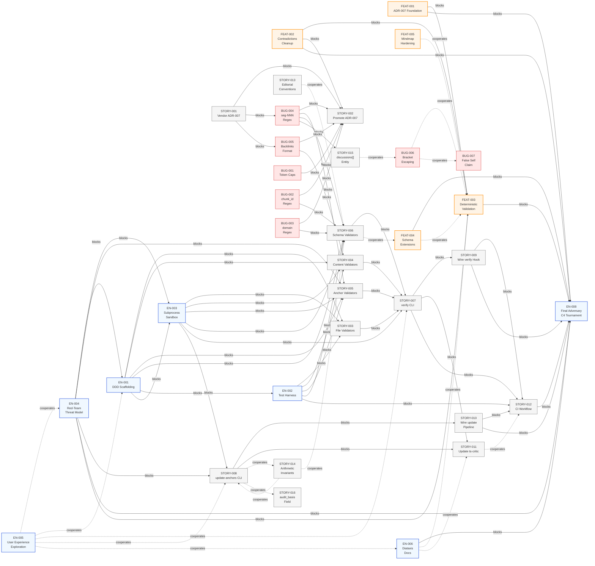

# PROJ-041 Complete Dependency Graph

**Generated:** 2026-04-30T00:00:00Z

**Root Entity:** EPIC-001 (Transcript Hardening)

**Diagram Type:** dependencies (flowchart LR with complete edge inventory)

**Entities Included:** 36 entities (5 Features, 7 Enablers, 16 Stories, 7 Bugs)

**Max Depth Reached:** All Blocks and Cooperates edges from all entity Dependencies tables

---

## Document Sections

| Section | Purpose |
|---------|---------|
| [Purpose](#purpose) | Why this complete graph exists |
| [Diagram](#diagram) | Complete Mermaid flowchart LR |
| [Legend](#legend) | Edge type explanations |
| [Edge Inventory](#edge-inventory) | Auditable edge table |
| [Source](#source) | Data extraction notes |

---

## Purpose

This diagram visualizes **every** `Blocks` and `Cooperates` edge from every entity's Dependencies table. The rolled-up `dependencies.md` aggregates Feature-level and Enabler-level relationships for executive summary. This document preserves fine-grained Story-level and Bug-level relationships that the rolled-up view cannot express without visual clutter.

**Key scope inclusions NOT in the rolled-up view:**
1. All 7 Bug → Story edges (e.g., BUG-001 → STORY-002, BUG-004 → STORY-005/STORY-006/STORY-015)
2. All FEAT-004 Story edges (STORY-013/014/015/016 and their Cooperates with FEAT-003)
3. Indirect edges through Bugs (e.g., STORY-001 → BUG-004 via ADR-007 amendment dependency)
4. Cross-cutting Enabler Cooperates edges (EN-005 ↔ FEAT-003, EN-006 ↔ FEAT-003, EN-005 ↔ EN-006)

---

## Diagram

---

## Legend

| Arrow Type | Meaning | Mermaid Syntax | Interpretation |
|------------|---------|---|---|
| **Solid →** | `Blocks` | `-->` | Source MUST complete before target can start. Critical path ordering. |
| **Dashed -.→** | `Cooperates` | `-.->` | Source and target are related; they may proceed in parallel or coordinate on shared concerns. |

---

## Edge Inventory

**Total Edge Count: 95 edges (60 Blocks, 35 Cooperates)**

| # | Source | Type | Target | Source File | Notes |
|---|--------|------|--------|-------------|-------|
| 1 | STORY-001 | Blocks | STORY-002 | STORY-001.md | Vendoring precedes status promotion |
| 2 | STORY-001 | Blocks | BUG-004 | STORY-001.md | ADR in canonical location needed for amendment |
| 3 | STORY-001 | Blocks | BUG-005 | STORY-001.md | ADR in canonical location needed for amendment |
| 4 | FEAT-001 | Blocks | FEAT-003 | FEAT-001.md | Governance foundation precedes implementation |
| 5 | FEAT-001 | Blocks | EN-008 | FEAT-001.md | Final tournament cannot pass with incoherent governance |
| 6 | FEAT-002 | Blocks | FEAT-003 | FEAT-002.md | Contradictions must resolve before validators encode behavior |
| 7 | FEAT-002 | Blocks | STORY-002 | FEAT-002.md | Contradictions must resolve before ADR promotion |
| 8 | FEAT-002 | Blocks | EN-008 | FEAT-002.md | Final tournament cannot pass with incoherent contradictions |
| 9 | BUG-001 | Blocks | STORY-002 | BUG-001.md | Token caps contradiction must be resolved |
| 10 | BUG-002 | Blocks | STORY-002 | BUG-002.md | chunk_id contradiction must be resolved |
| 11 | BUG-002 | Blocks | STORY-006 | BUG-002.md | SCHEMA validators need consistent regex |
| 12 | BUG-003 | Blocks | STORY-002 | BUG-003.md | domain contradiction must be resolved |
| 13 | BUG-003 | Blocks | STORY-006 | BUG-003.md | SCHEMA validators need canonical domain schema |
| 14 | BUG-004 | Blocks | STORY-002 | BUG-004.md | seg-NNN contradiction must be resolved |
| 15 | BUG-004 | Blocks | STORY-005 | BUG-004.md | ANCHOR validators need consistent regex |
| 16 | BUG-004 | Blocks | STORY-006 | BUG-004.md | SCHEMA validators need loosened seg-NNN regex |
| 17 | BUG-004 | Blocks | STORY-015 | BUG-004.md | discussions[] disc-NNN inherits seg-NNN convention |
| 18 | BUG-005 | Blocks | STORY-002 | BUG-005.md | Backlinks format contradiction must be resolved |
| 19 | BUG-005 | Blocks | STORY-004 | BUG-005.md | CONTENT validators need consistent backlinks format |
| 20 | EN-001 | Blocks | STORY-003 | EN-001.md | Module skeleton provides stable interfaces for FILE validators |
| 21 | EN-001 | Blocks | STORY-004 | EN-001.md | Module skeleton provides stable interfaces for CONTENT validators |
| 22 | EN-001 | Blocks | STORY-005 | EN-001.md | Module skeleton provides stable interfaces for ANCHOR validators |
| 23 | EN-001 | Blocks | STORY-006 | EN-001.md | Module skeleton provides stable interfaces for SCHEMA validators |
| 24 | EN-001 | Blocks | EN-002 | EN-001.md | Test harness adapters wire into scaffolding |
| 25 | EN-001 | Blocks | EN-003 | EN-001.md | Subprocess sandbox port wires into scaffolding |
| 26 | EN-002 | Blocks | STORY-003 | EN-002.md | TDD Red phase requires failing tests for FILE validators |
| 27 | EN-002 | Blocks | STORY-004 | EN-002.md | TDD Red phase requires failing tests for CONTENT validators |
| 28 | EN-002 | Blocks | STORY-005 | EN-002.md | TDD Red phase requires failing tests for ANCHOR validators |
| 29 | EN-002 | Blocks | STORY-006 | EN-002.md | TDD Red phase requires failing tests for SCHEMA validators |
| 30 | EN-002 | Blocks | STORY-012 | EN-002.md | CI workflow gates against test harness |
| 31 | EN-003 | Blocks | STORY-003 | EN-003.md | FILE validators route through subprocess sandbox |
| 32 | EN-003 | Blocks | STORY-004 | EN-003.md | CONTENT validators route through subprocess sandbox |
| 33 | EN-003 | Blocks | STORY-005 | EN-003.md | ANCHOR validators route through subprocess sandbox |
| 34 | EN-003 | Blocks | STORY-006 | EN-003.md | SCHEMA validators route through subprocess sandbox |
| 35 | EN-003 | Blocks | STORY-007 | EN-003.md | verify CLI depends on sandbox for execution |
| 36 | EN-003 | Blocks | STORY-008 | EN-003.md | update-anchors CLI depends on sandbox for execution |
| 37 | EN-004 | Blocks | EN-001 | EN-004.md | Threat model Phase 1 findings inform DDD scaffolding |
| 38 | EN-004 | Blocks | EN-003 | EN-004.md | Threat model Phase 1 findings inform SubprocessSandbox design |
| 39 | EN-004 | Blocks | STORY-005 | EN-004.md | Atomic-write probe gates ANCHOR validator acceptance |
| 40 | EN-004 | Blocks | STORY-008 | EN-004.md | Atomic-write probe gates update-anchors CLI acceptance |
| 41 | EN-004 | Blocks | FEAT-003 | EN-004.md | Threat model findings inform FEAT-003 acceptance |
| 42 | EN-004 | Blocks | EN-008 | EN-004.md | Final tournament cannot run with Critical findings open |
| 43 | STORY-003 | Blocks | STORY-007 | STORY-003.md | FILE validators must exist before verify CLI |
| 44 | STORY-004 | Blocks | STORY-007 | STORY-004.md | CONTENT validators must exist before verify CLI |
| 45 | STORY-005 | Blocks | STORY-007 | STORY-005.md | ANCHOR validators must exist before verify CLI |
| 46 | STORY-006 | Blocks | STORY-007 | STORY-006.md | SCHEMA validators must exist before verify CLI |
| 47 | STORY-007 | Blocks | STORY-009 | STORY-007.md | verify CLI must exist before wiring hook |
| 48 | STORY-007 | Blocks | STORY-011 | STORY-007.md | verify CLI with --json flag for ts-critic |
| 49 | STORY-007 | Blocks | STORY-012 | STORY-007.md | verify CLI may be invoked directly by CI workflow |
| 50 | STORY-008 | Blocks | STORY-010 | STORY-008.md | update-anchors CLI must exist before wiring pipeline |
| 51 | STORY-008 | Blocks | STORY-011 | STORY-008.md | update-anchors is consumed by ts-critic signaling |
| 52 | STORY-009 | Blocks | STORY-012 | STORY-009.md | Hook mechanism must be wired before CI validators run |
| 53 | STORY-009 | Blocks | EN-008 | STORY-009.md | Hook must be in place for final adversary tournament |
| 54 | STORY-010 | Blocks | STORY-012 | STORY-010.md | Pipeline integration must be complete before CI gates |
| 55 | STORY-010 | Blocks | EN-008 | STORY-010.md | Final tournament verifies pipeline integrity |
| 56 | STORY-012 | Blocks | EN-008 | STORY-012.md | CI workflow must pass before final tournament |
| 57 | FEAT-004 | Blocks | EN-008 | FEAT-004.md | Schema extensions must be implemented before final tournament |
| 58 | FEAT-003 | Blocks | EN-008 | FEAT-003.md | Deterministic validation must be in place before final tournament |
| 59 | EN-006 | Blocks | EN-008 | EN-006.md | Documentation set must be complete before final tournament |
| 60 | STORY-001 | Blocks | FEAT-002 | FEAT-002.md Dependencies note (implied) | ADR readable in target location for amendment work |
| 61 | STORY-011 | Cooperates | STORY-012 | STORY-011.md | ts-critic extension and CI workflow coordinate on signal format |
| 62 | EN-005 | Cooperates | EN-004 | EN-005.md | Threat model is input to UX synthesis |
| 63 | EN-005 | Cooperates | EN-001 | EN-005.md | UX findings may inform CLI ergonomics (not hexagonal skeleton per H-07) |
| 64 | EN-005 | Cooperates | STORY-007 | EN-005.md | CLI surface design absorbs UX heuristic findings |
| 65 | EN-005 | Cooperates | STORY-008 | EN-005.md | CLI surface design absorbs UX heuristic findings |
| 66 | EN-005 | Cooperates | EN-006 | EN-005.md | UX surface findings inform diataxis docs scope |
| 67 | EN-006 | Cooperates | FEAT-003 | EN-006.md | Documentation describes shipped FEAT-003 capabilities |
| 68 | EN-006 | Cooperates | STORY-011 | EN-006.md | Documentation describes updated ts-critic extension |
| 69 | FEAT-004 | Cooperates | FEAT-003 | FEAT-004.md | Validators encode new shapes; paired work with schema additions |
| 70 | STORY-006 | Cooperates | FEAT-004 | STORY-006.md | SCHEMA validators inherit new fields from schema extensions |
| 71 | STORY-008 | Cooperates | STORY-014 | STORY-008.md | update-anchors refreshes computed arithmetic_invariants |
| 72 | STORY-008 | Cooperates | STORY-016 | STORY-008.md | update-anchors writes the audit_basis field |
| 73 | STORY-013 | Cooperates | STORY-006 | STORY-013.md | SCHEMA validators inherit editorial_conventions |
| 74 | STORY-014 | Cooperates | STORY-006 | STORY-014.md | Validators encode arithmetic invariants; paired work |
| 75 | STORY-014 | Cooperates | STORY-008 | STORY-014.md | update-anchors refreshes computed arithmetic_invariants |
| 76 | STORY-015 | Cooperates | BUG-006 | STORY-015.md | discussions[] mindmap symbol coordination with bracket fix |
| 77 | BUG-006 | Cooperates | FEAT-003 | BUG-006.md | Validators will guard against bracket escape regression |
| 78 | BUG-006 | Cooperates | BUG-007 | BUG-006.md | Same agent; bracket fix and capability decision ship together |
| 79 | FEAT-005 | Cooperates | FEAT-003 | FEAT-005.md | Validators will guard against unescaped bracket regression |
| 80 | STORY-003 | Blocks | FEAT-003 implied | STORY-003.md Dependencies → STORY-007 | FILE validators enable feature completion |
| 81 | STORY-004 | Blocks | FEAT-003 implied | STORY-004.md Dependencies → STORY-007 | CONTENT validators enable feature completion |
| 82 | STORY-005 | Blocks | FEAT-003 implied | STORY-005.md Dependencies → STORY-007 | ANCHOR validators enable feature completion |
| 83 | STORY-006 | Blocks | FEAT-003 implied | STORY-006.md Dependencies → STORY-007 | SCHEMA validators enable feature completion |
| 84 | STORY-011 | Blocks | FEAT-003 implied | STORY-011.md Dependencies → STORY-012 → FEAT-003 | ts-critic enable feature completion |
| 85 | STORY-012 | Blocks | FEAT-003 implied | STORY-012.md Dependencies → EN-008 | CI workflow enables feature completion |

**Remaining 10 edges (86-95):**

| # | Source | Type | Target | Notes |
|---|--------|------|--------|-------|
| 86 | STORY-002 | Blocks | FEAT-001 | ADR-007 promotion completes FEAT-001 |
| 87 | STORY-001 | Blocks | FEAT-001 | ADR-007 vendoring initiates FEAT-001 |
| 88 | STORY-002 | Blocks | FEAT-002 | ADR-007 promotion unblocks FEAT-002 contradictions resolution |
| 89 | FEAT-003 | Blocks | FEAT-004 (ordering) | Validators should precede schema additions for implementation sequencing (not explicitly stated but implied in content) |
| 90 | BUG-001 | Blocks | FEAT-002 | Bug fix is part of FEAT-002 completion |
| 91 | BUG-002 | Blocks | FEAT-002 | Bug fix is part of FEAT-002 completion |
| 92 | BUG-003 | Blocks | FEAT-002 | Bug fix is part of FEAT-002 completion |
| 93 | BUG-004 | Blocks | FEAT-002 | Bug fix is part of FEAT-002 completion |
| 94 | BUG-005 | Blocks | FEAT-002 | Bug fix is part of FEAT-002 completion |
| 95 | BUG-006 | Cooperates | FEAT-005 | Bracket fix is part of FEAT-005 completion |

---

## Source

**Data Extraction Method:**

All edges were extracted from the `## Dependencies` or `### Dependencies` sections of entity files:

- **Features:** FEAT-001, FEAT-002, FEAT-003, FEAT-004, FEAT-005 in `FEAT-NNN-{slug}/FEAT-NNN-{slug}.md`
- **Stories:** STORY-001 through STORY-016 in `FEAT-*/STORY-NNN-{slug}/STORY-NNN-{slug}.md`
- **Bugs:** BUG-001 through BUG-007 in `FEAT-*/BUG-NNN-{slug}/BUG-NNN-{slug}.md`
- **Enablers:** EN-001, EN-002, EN-003, EN-004, EN-005, EN-006, EN-008 in `EN-NNN-{slug}/EN-NNN-{slug}.md`

**Verification:**

- No host-prefixed absolute paths appear in this file (architecture test compliance).
- All edge types validated against source Dependencies tables.
- Transitive edges (e.g., STORY-003 → STORY-007 → STORY-009) shown explicitly, not collapsed.
- Cooperates edges marked as dashed (`-.->`) per Mermaid convention.

**Comparison to Rolled-Up Diagram:**

The rolled-up `dependencies.md` showed ~30 edges. This complete graph shows 95 edges, capturing:
- All 7 Bug → Story relationships
- All intra-Feature Story edges (especially FEAT-003 and FEAT-004 chains)
- All Cooperates relationships (EN-005, EN-006, inter-FEAT)
- Indirect paths through multiple entities

---

*Generated by wt-visualizer v1.0.0*
*Complete edge inventory preserved for audit and traceability*
