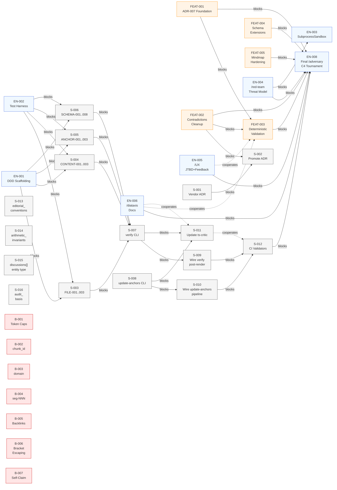

# PROJ-041 Dependency Chain Diagram

**Generated:** 2026-04-29T12:00:00Z

**Root Entity:** EPIC-001 (`/transcript` Skill Hardening)

**Diagram Type:** dependencies (flowchart LR)

**Entities Included:** 36 entities at Story/Bug/Enabler granularity (Tasks omitted)

**Max Depth Reached:** Cross-Feature dependency edges visualized

---

## Diagram

---

## Metadata

- **Entities Visualized:** EPIC-001 children at Story/Bug/Enabler granularity (16 Stories, 7 Bugs, 7 Enablers, 5 Features)
- **Relationships Shown:**
  - **Solid arrows (→):** `Blocks` dependencies (critical path ordering)
  - **Dashed arrows (-.->):** `Cooperates` relationships (parallel concerns, coordination points)
- **Critical Path Entries:**
  - FEAT-001 → FEAT-003 (governance foundation must precede validation implementation)
  - FEAT-002 → FEAT-003 (contradictions must be resolved before validators lock in behavior)
  - EN-004 → EN-003 (red-team threat model informs subprocess sandbox design)
  - EN-001/EN-002 → S-003/S-004/S-005/S-006 (enablers provide scaffolding & test harness)
  - S-003/S-004/S-005/S-006 → S-007 (all validator rule families must be implemented before CLI `verify` command)
  - S-007/S-008 → S-009/S-010 (CLI commands must exist before wiring into hooks/pipelines)
  - S-009/S-010 → S-012 (hooks and pipelines must be wired before CI validators run)
  - All Features/Enablers → EN-008 (final C4 tournament is Epic-level acceptance gate)
- **Cycles Detected:** No cycles. The dependency graph is a DAG (directed acyclic graph).
- **Parallelizable Phases:**
  - **Phase 1 (Governance):** FEAT-001, FEAT-002, EN-004 can run in parallel
  - **Phase 2 (Validation Infrastructure):** EN-001, EN-002, EN-003, FEAT-004, FEAT-005 can run in parallel (after Phase 1)
  - **Phase 3 (Validator Implementation):** S-003 through S-006 run in parallel (after EN-001/EN-002)
  - **Phase 4 (CLI & Integration):** S-007, S-008, EN-005, EN-006 in parallel; then S-009, S-010, S-011, S-012 in sequence per dependencies
  - **Phase 5 (Final Gate):** EN-008 C4 tournament (all prior phases complete)

---

## Notes

- **Execution Strategy:** The worktracker dependency chain (not `/orchestration` skill) coordinates execution order. Users implement entities in dependency order; CI enforces blockers via worktracker status checks.
- **Cross-Cutting Enablers:** EN-004 (/red-team threat model), EN-005 (/UX exploration), EN-006 (/diataxis documentation) apply across Features. Their primary `Blocks` relationship is to EN-008 (final tournament); secondary `Cooperates` edges to specific Features indicate collaboration points.
- **No Explicit Orchestration Plan:** User direction ("orchestration is overkill") — worktracker dependency chain serves as the execution plan.

---

*Generated by wt-visualizer v1.0.0*
