# PROJ-041 Hierarchy Diagram

**Generated:** 2026-04-29T12:00:00Z

**Root Entity:** EPIC-001 (`/transcript` Skill Hardening from External Packet Audit)

**Diagram Type:** hierarchy (flowchart TD)

**Entities Included:** 36 total (1 Epic, 5 Features, 4 cross-cutting Enablers, 3 in-feature Enablers, 16 Stories, 7 Bugs)

**Max Depth Reached:** 4 (Project → Epic → Feature/Enabler → Story/Bug → Tasks)

---

## Diagram

```mermaid
flowchart TD
    PROJ["PROJ-041<br/>transcript-hardening"]

    PROJ --> EPIC["EPIC-001<br/>Transcript Skill Hardening<br/>(from External Audit)"]

    EPIC --> EN004["EN-004<br/>/red-team threat model<br/>(cross-cutting)"]
    EPIC --> EN005["EN-005<br/>/user-experience JTBD<br/>(cross-cutting)"]
    EPIC --> EN006["EN-006<br/>/diataxis documentation<br/>(cross-cutting)"]
    EPIC --> EN008["EN-008<br/>Final /adversary C4<br/>tournament<br/>(cross-cutting)"]

    EPIC --> FEAT001["FEAT-001<br/>ADR-007 Foundation<br/>& Governance<br/>(2 stories)"]
    EPIC --> FEAT002["FEAT-002<br/>Framework-Internal<br/>Contradictions<br/>(5 bugs)"]
    EPIC --> FEAT003["FEAT-003<br/>Deterministic<br/>Substrate Validation<br/>(3 enablers + 10 stories)"]
    EPIC --> FEAT004["FEAT-004<br/>Schema Extensions<br/>(4 stories)"]
    EPIC --> FEAT005["FEAT-005<br/>Mindmap Hardening<br/>(2 bugs)"]

    FEAT001 --> S001["STORY-001<br/>Vendor ADR-007<br/>(contains tasks)"]
    FEAT001 --> S002["STORY-002<br/>Promote PROPOSED→<br/>ACCEPTED<br/>(contains tasks)"]

    FEAT002 --> B001["BUG-001<br/>Token caps<br/>disambiguation<br/>(contains tasks)"]
    FEAT002 --> B002["BUG-002<br/>chunk_id regex<br/>divergence<br/>(contains tasks)"]
    FEAT002 --> B003["BUG-003<br/>domain regex<br/>schemas conflict<br/>(contains tasks)"]
    FEAT002 --> B004["BUG-004<br/>seg-NNN regex<br/>ADR-007 vs schemas<br/>(contains tasks)"]
    FEAT002 --> B005["BUG-005<br/>Backlinks format<br/>direct contradiction<br/>(contains tasks)"]

    FEAT003 --> EN001["EN-001<br/>DDD scaffolding<br/>for validation<br/>(in-feature)<br/>(contains tasks)"]
    FEAT003 --> EN002["EN-002<br/>Test harness +<br/>golden packets<br/>(in-feature)<br/>(contains tasks)"]
    FEAT003 --> EN003["EN-003<br/>SubprocessSandbox<br/>port + adapter<br/>(in-feature)<br/>(contains tasks)"]
    FEAT003 --> S003["STORY-003<br/>FILE-001..003<br/>validators<br/>(contains tasks)"]
    FEAT003 --> S004["STORY-004<br/>CONTENT-001..003<br/>validators<br/>(contains tasks)"]
    FEAT003 --> S005["STORY-005<br/>ANCHOR-001..003<br/>validators<br/>(contains tasks)"]
    FEAT003 --> S006["STORY-006<br/>SCHEMA-001..008<br/>validators<br/>(contains tasks)"]
    FEAT003 --> S007["STORY-007<br/>jerry transcript<br/>verify CLI<br/>(contains tasks)"]
    FEAT003 --> S008["STORY-008<br/>jerry transcript<br/>update-anchors CLI<br/>(contains tasks)"]
    FEAT003 --> S009["STORY-009<br/>Wire verify into<br/>post-render hook<br/>(contains tasks)"]
    FEAT003 --> S010["STORY-010<br/>Wire update-anchors<br/>into write pipeline<br/>(contains tasks)"]
    FEAT003 --> S011["STORY-011<br/>Update ts-critic-<br/>extension.md<br/>(contains tasks)"]
    FEAT003 --> S012["STORY-012<br/>CI workflow<br/>validator runs<br/>(contains tasks)"]

    FEAT004 --> S013["STORY-013<br/>Add editorial_<br/>conventions block<br/>(contains tasks)"]
    FEAT004 --> S014["STORY-014<br/>Add arithmetic_<br/>invariants<br/>(contains tasks)"]
    FEAT004 --> S015["STORY-015<br/>Add discussions[]<br/>as 5th entity type<br/>(contains tasks)"]
    FEAT004 --> S016["STORY-016<br/>Add audit_basis<br/>field<br/>(contains tasks)"]

    FEAT005 --> B006["BUG-006<br/>ts-mindmap-mermaid<br/>bracket-escaping<br/>(contains tasks)"]
    FEAT005 --> B007["BUG-007<br/>ts-mindmap-mermaid<br/>false self-claim<br/>(contains tasks)"]

    style PROJ fill:#E8F4F8
    style EPIC fill:#E8F4F8
    style FEAT001 fill:#FFF4E6
    style FEAT002 fill:#FFF4E6
    style FEAT003 fill:#FFF4E6
    style FEAT004 fill:#FFF4E6
    style FEAT005 fill:#FFF4E6
    style EN001 fill:#F0F8FF
    style EN002 fill:#F0F8FF
    style EN003 fill:#F0F8FF
    style EN004 fill:#F0F8FF
    style EN005 fill:#F0F8FF
    style EN006 fill:#F0F8FF
    style EN008 fill:#F0F8FF
    style S001 fill:#F5F5F5
    style S002 fill:#F5F5F5
    style S003 fill:#F5F5F5
    style S004 fill:#F5F5F5
    style S005 fill:#F5F5F5
    style S006 fill:#F5F5F5
    style S007 fill:#F5F5F5
    style S008 fill:#F5F5F5
    style S009 fill:#F5F5F5
    style S010 fill:#F5F5F5
    style S011 fill:#F5F5F5
    style S012 fill:#F5F5F5
    style S013 fill:#F5F5F5
    style S014 fill:#F5F5F5
    style S015 fill:#F5F5F5
    style S016 fill:#F5F5F5
    style B001 fill:#FFE6E6
    style B002 fill:#FFE6E6
    style B003 fill:#FFE6E6
    style B004 fill:#FFE6E6
    style B005 fill:#FFE6E6
    style B006 fill:#FFE6E6
    style B007 fill:#FFE6E6
```

---

## Metadata

- **Entities Visualized:** EPIC-001, FEAT-001 through FEAT-005, EN-001 through EN-008, STORY-001 through STORY-016, BUG-001 through BUG-007
- **Relationships Shown:** Parent-child containment (36 total)
- **Status Color Coding:** Enabled (all pending — light coloring)
- **Task Granularity:** Tasks (210 materialized) shown as "(contains tasks)" notation per Story/Bug/Enabler; no individual Task nodes to avoid diagram explosion
- **Notes:**
  - Cross-cutting Enablers (EN-004, EN-005, EN-006, EN-008) appear at Epic level because they apply across all five Features.
  - In-feature Enablers (EN-001, EN-002, EN-003) under FEAT-003 because their scope is bounded to that Feature's validation domain.
  - All 36 top-level entities (Epic, Features, Enablers, Stories, Bugs) are shown; 210 Tasks are aggregated per parent to maintain readability.

---

*Generated by wt-visualizer v1.0.0*
