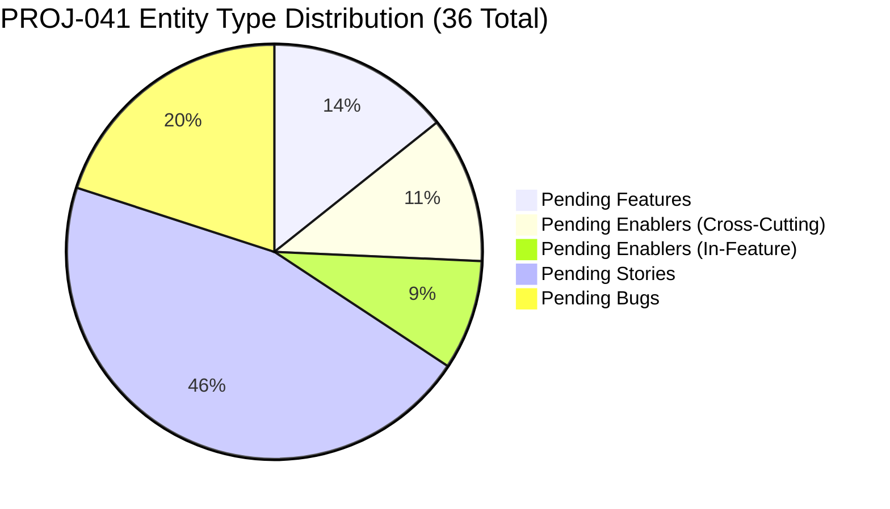
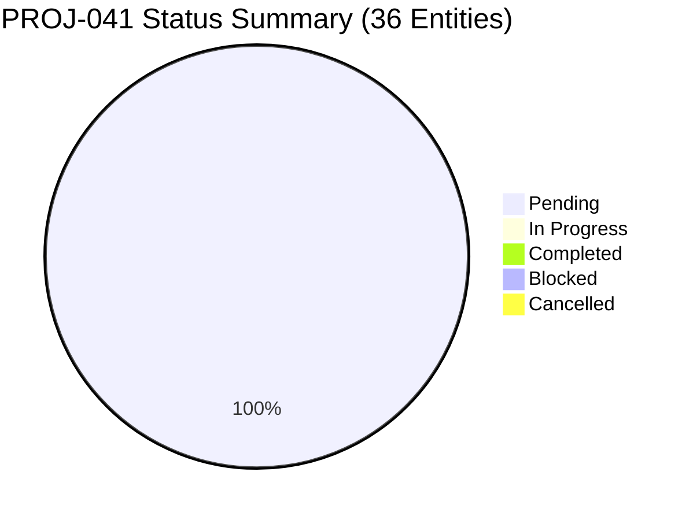

# PROJ-041 Status Overview Diagram

**Generated:** 2026-04-29T12:00:00Z

**Root Entity:** EPIC-001 (`/transcript` Skill Hardening)

**Diagram Type:** status overview (pie chart + entity count breakdown)

**Entities Included:** All 36 top-level entities (Epic, Features, Enablers, Stories, Bugs)

**Status Snapshot:** All entities in `pending` state (project starts execution phase)

---

## Entity Count Breakdown



---

## Status Distribution (All Entities)



---

## Entity Inventory

| Entity Type | Count | Status | Notes |
|---|---|---|---|
| **Epic** | 1 | pending | EPIC-001 — top-level container |
| **Features** | 5 | pending | FEAT-001 through FEAT-005; each contains Stories/Bugs |
| **Cross-Cutting Enablers** | 4 | pending | EN-004 (/red-team), EN-005 (/UX), EN-006 (/diataxis), EN-008 (C4 tournament) |
| **In-Feature Enablers** | 3 | pending | EN-001, EN-002, EN-003 (under FEAT-003 Deterministic Validation) |
| **Stories** | 16 | pending | S-001 through S-016; distributed across FEAT-001 (2), FEAT-003 (10), FEAT-004 (4) |
| **Bugs** | 7 | pending | B-001 through B-007; distributed across FEAT-002 (5), FEAT-005 (2) |
| **Tasks** | 210 | pending | Materialized but aggregated in parent diagrams to avoid visual explosion |
| **TOTAL (Top-Level)** | **36** | pending | Epic + Features + Enablers + Stories + Bugs |

---

## Feature Status by Priority

| Feature | Priority | Stories | Enablers | Bugs | Total Children | Status |
|---|---|---|---|---|---|---|
| FEAT-001 (ADR-007 Foundation) | high | 2 | 0 | 0 | 2 | pending |
| FEAT-002 (Contradictions Cleanup) | high | 0 | 0 | 5 | 5 | pending |
| FEAT-003 (Deterministic Validation) | high | 10 | 3 | 0 | 13 | pending |
| FEAT-004 (Schema Extensions) | medium | 4 | 0 | 0 | 4 | pending |
| FEAT-005 (Mindmap Hardening) | high | 0 | 0 | 2 | 2 | pending |

---

## Detailed Status Breakdown by Category

### Feature Statuses (5 total)

All Features are `pending` with `high` or `medium` priority:

```
FEAT-001 ████████████████████ pending (high priority)
FEAT-002 ████████████████████ pending (high priority)
FEAT-003 ████████████████████ pending (high priority)
FEAT-004 ████████████████████ pending (medium priority)
FEAT-005 ████████████████████ pending (high priority)

Progress: 0% (0/5 completed)
```

### Enabler Statuses (7 total)

Cross-cutting (4): EN-004, EN-005, EN-006, EN-008 — all `pending`
In-feature (3): EN-001, EN-002, EN-003 (under FEAT-003) — all `pending`

```
EN-001 ████████████████████ pending (under FEAT-003)
EN-002 ████████████████████ pending (under FEAT-003)
EN-003 ████████████████████ pending (under FEAT-003)
EN-004 ████████████████████ pending (cross-cutting)
EN-005 ████████████████████ pending (cross-cutting)
EN-006 ████████████████████ pending (cross-cutting)
EN-008 ████████████████████ pending (cross-cutting)

Progress: 0% (0/7 completed)
```

### Story Statuses (16 total)

All Stories are `pending`:

```
STORY-001 ████████████████████ pending (FEAT-001)
STORY-002 ████████████████████ pending (FEAT-001)
STORY-003 ████████████████████ pending (FEAT-003)
STORY-004 ████████████████████ pending (FEAT-003)
STORY-005 ████████████████████ pending (FEAT-003)
STORY-006 ████████████████████ pending (FEAT-003)
STORY-007 ████████████████████ pending (FEAT-003)
STORY-008 ████████████████████ pending (FEAT-003)
STORY-009 ████████████████████ pending (FEAT-003)
STORY-010 ████████████████████ pending (FEAT-003)
STORY-011 ████████████████████ pending (FEAT-003)
STORY-012 ████████████████████ pending (FEAT-003)
STORY-013 ████████████████████ pending (FEAT-004)
STORY-014 ████████████████████ pending (FEAT-004)
STORY-015 ████████████████████ pending (FEAT-004)
STORY-016 ████████████████████ pending (FEAT-004)

Progress: 0% (0/16 completed)
```

### Bug Statuses (7 total)

All Bugs are `pending`:

```
BUG-001 ████████████████████ pending (FEAT-002)
BUG-002 ████████████████████ pending (FEAT-002)
BUG-003 ████████████████████ pending (FEAT-002)
BUG-004 ████████████████████ pending (FEAT-002)
BUG-005 ████████████████████ pending (FEAT-002)
BUG-006 ████████████████████ pending (FEAT-005)
BUG-007 ████████████████████ pending (FEAT-005)

Progress: 0% (0/7 completed)
```

---

## Work Distribution by Feature

| Feature | Focus Area | Entity Count | Status |
|---|---|---|---|
| **FEAT-001** | Governance (vendor ADR, promote status) | 2 Stories | pending |
| **FEAT-002** | Bug Fixes (resolve contradictions) | 5 Bugs | pending |
| **FEAT-003** | Implementation (validators, CLI, hooks) | 13 (3 EN + 10 Stories) | pending |
| **FEAT-004** | Schema Design (4 new fields/extensions) | 4 Stories | pending |
| **FEAT-005** | Bug Fixes (mindmap rendering) | 2 Bugs | pending |
| **Cross-Cutting** | Assurance & Documentation | 4 Enablers (EN-004..008) | pending |
| **TOTAL** | — | **36 entities** | **0% complete** |

---

## Closure Criteria Status

From EPIC-001 Acceptance Criteria (all items require evidence):

| Criterion | Current Status | Evidence Required |
|---|---|---|
| All 5 Features completed with delivery evidence | ❌ Not started | Commits, validator runs, test passes |
| All 5 cross-cutting Enablers completed | ❌ Not started | Threat model report, UX findings, docs, tournament report |
| All 7 Bugs verified fixed with regression tests | ❌ Not started | Commits, CI test runs |
| All 16 Stories closed with delivery evidence | ❌ Not started | Commits, validator runs, adversary scores |
| Final `/adversary` C4 tournament ≥0.95 | ❌ Not started | S-014 weighted composite + dimension scores |
| `/eng-team` final-gate review passes | ❌ Not started | Architecture review report |
| CI gate: validators on golden packets | ❌ Not started | CI workflow execution, test passes |
| `ts-formatter` post-render hook validation | ❌ Not started | Hook integration + verification run |
| `update-anchors` in write pipeline | ❌ Not started | Pipeline integration confirmation |
| No cross-document disagreement on rules | ❌ Not started | Contradiction resolution validation |
| ADR-007 at `docs/adrs/` with `ACCEPTED` status | ❌ Not started | File existence + frontmatter check |
| Issue #273 closed with Epic completion link | ❌ Not started | GitHub Issue closure comment |

---

## Next Steps (Execution Phase 1)

Based on dependency order (from dependencies.md):

1. **Parallel start (Phase 1):**
   - FEAT-001: Vendor ADR-007 and promote to ACCEPTED (STORY-001, STORY-002)
   - FEAT-002: Fix 5 contradictions (BUG-001..005)
   - EN-004: Run /red-team threat model on subprocess surface

2. **Phase 2 (after Phase 1):**
   - FEAT-003 enablers (EN-001, EN-002, EN-003) set up scaffolding/test infrastructure
   - EN-005, EN-006 run in parallel

3. **Phase 3 (after Phase 2):**
   - STORY-003..006 implement validators in parallel
   - FEAT-004 schema extensions in parallel

4. **Phase 4 (after Phase 3):**
   - STORY-007, STORY-008 build CLI commands
   - STORY-009, STORY-010 wire into hooks/pipelines
   - STORY-011, STORY-012 integration and CI

5. **Phase 5 (final):**
   - EN-008: Final /adversary C4 tournament (acceptance gate)

---

## Project Health Summary

**Status:** Project initialized, 0% complete, ready for execution
**Risk Level:** Low (all dependencies explicitly mapped, clear closure criteria)
**Blockers:** None (all entities ready to start per dependency order)
**Quality Gate:** Final /adversary C4 tournament ≥0.95 composite (S-014 LLM-as-Judge)

---

*Generated by wt-visualizer v1.0.0*
