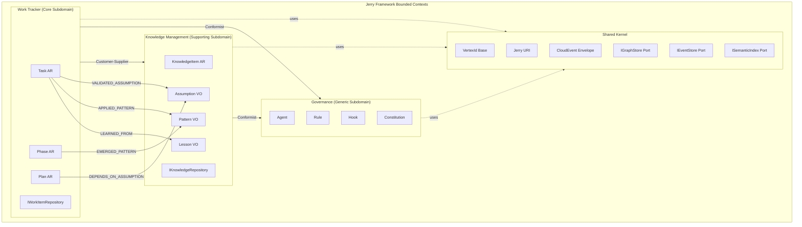
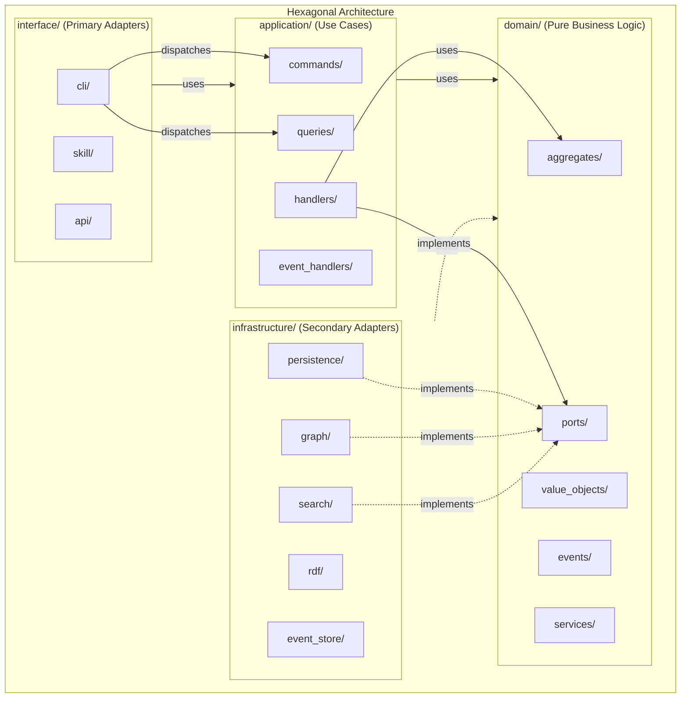
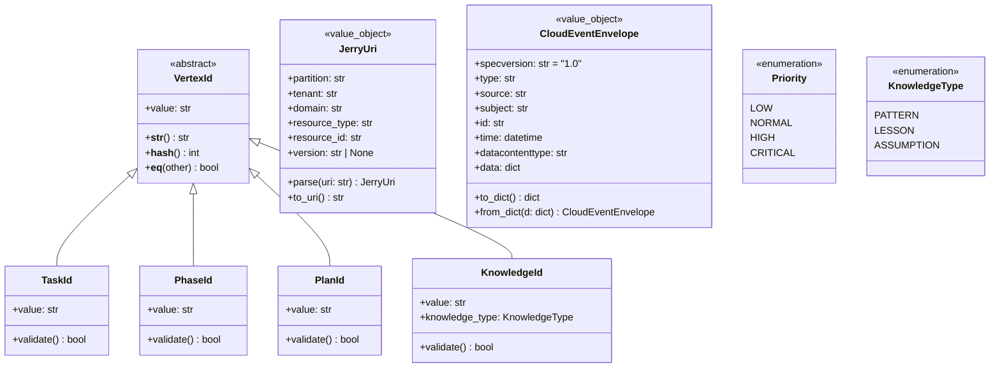
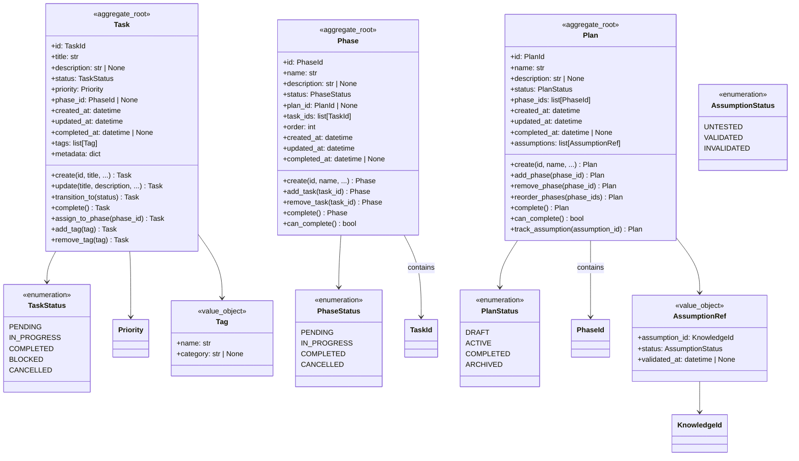
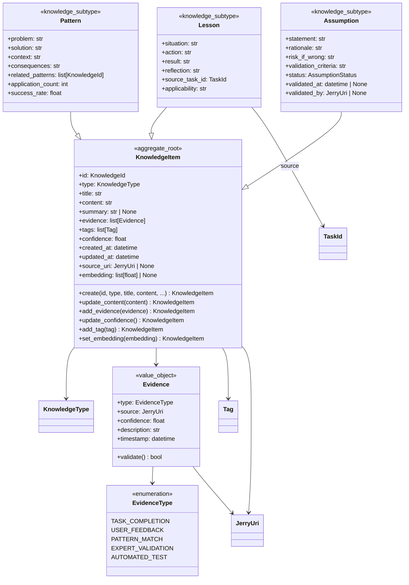
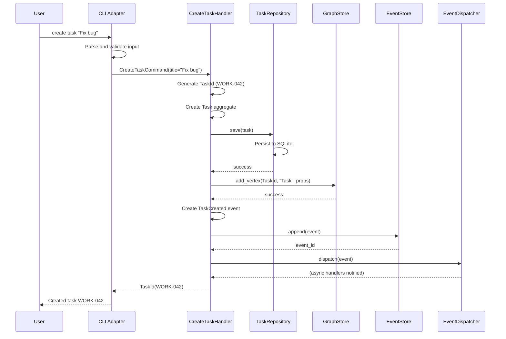
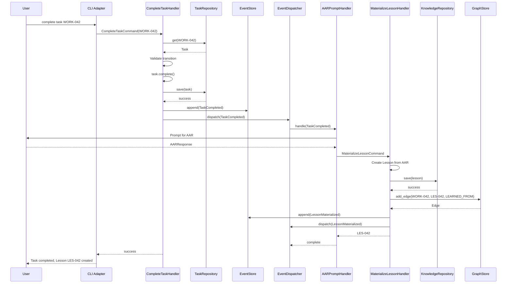
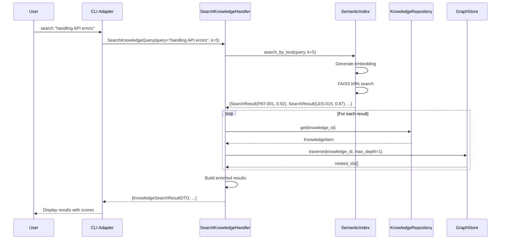
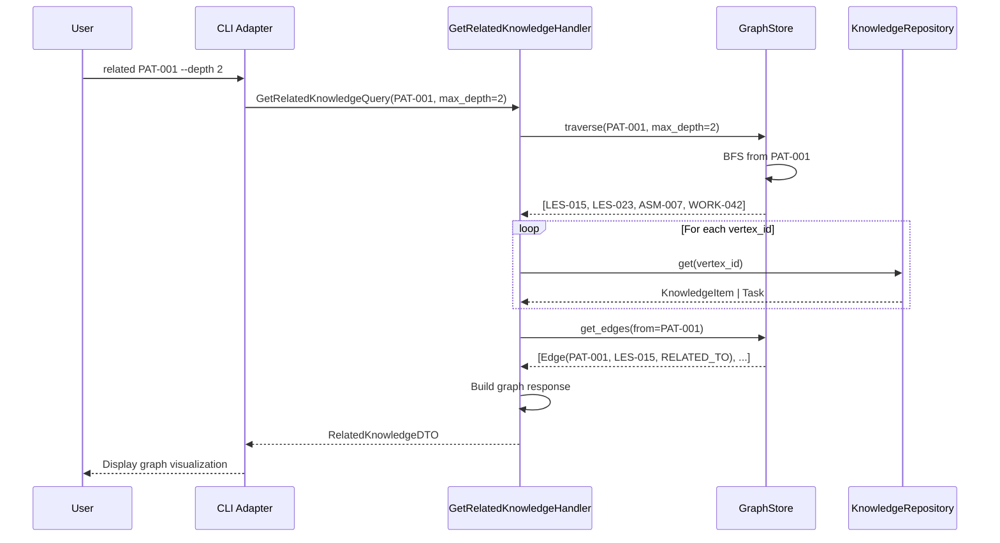

# WORK-034 Unified Design: Work Tracker + Knowledge Management Integration

## Metadata

| Field | Value |
|-------|-------|
| **PS ID** | work-034 |
| **Entry ID** | e-003 |
| **Date** | 2026-01-09 |
| **Author** | ps-architect v2.0.0 |
| **Input** | work-034-e-002-domain-synthesis.md (54KB), work-034-e-001-domain-analysis.md (93KB) |
| **Reference** | WORK_TRACKER_PLAN.md (89KB) |
| **Output Target** | 60-80KB |
| **Status** | COMPLETE |

---

## Executive Summary

This unified design document specifies the complete technical architecture for integrating the Work Tracker and Knowledge Management (KM) bounded contexts within the Jerry Framework. The design addresses the core challenge of context rot in AI coding assistants by establishing Work Tracker as a proving ground for KM infrastructure patterns before scaling to full knowledge graph capabilities.

The architecture establishes a shared kernel containing VertexId, JerryUri, and CloudEvents infrastructure that both domains inherit. Work Tracker entities (Task, Phase, Plan) naturally materialize into KM entities (Lesson, Pattern, Assumption) through event-driven completion workflows. This bidirectional relationship enables knowledge accumulation without requiring explicit knowledge capture—completing a Task can automatically prompt for lessons learned, phases can surface patterns, and plans track assumptions.

The design specifies Hexagonal Architecture with clear port definitions for all external concerns: IGraphStore (NetworkX adapter), ISemanticIndex (FAISS adapter), IRDFSerializer (RDFLib adapter), IEventStore (SQLite adapter), and domain-specific repositories. The CQRS pattern separates read and write operations, with commands emitting CloudEvents 1.0-compliant events that drive cross-domain integration.

The four-phase implementation plan (32 weeks total) validates infrastructure at Work Tracker's smaller scale (~500 nodes) before scaling to KM's target (~5,000+ nodes), reducing risk by enabling 4x faster issue discovery and 10x smaller fix costs compared to direct KM implementation. Key risks include performance degradation at scale, supernode formation in the knowledge graph, and user adoption of AAR (After Action Review) prompts.

Expected outcomes include: persistent task state across Claude Code sessions, automated knowledge capture from completed work, semantic search across patterns and lessons, and a validated infrastructure ready for full Knowledge Management deployment.

---

## 1. 5W1H Analysis

### 1.1 WHO: Stakeholders, Users, and Systems

| Stakeholder | Role | Primary Concerns | Success Metrics |
|-------------|------|------------------|-----------------|
| **Claude Code Users** | End users | Task persistence, knowledge reuse | Session continuity, pattern discovery |
| **Jerry Framework Developers** | Maintainers | Architecture quality, testability | Test coverage >80%, clean boundaries |
| **AI Agents (ps-*)** | Automated actors | Reliable task tracking, knowledge access | Response latency <100ms |
| **Claude Code Platform** | Host environment | Resource efficiency, stability | Memory <100MB, no crashes |

**System Actors:**

```python
class Actor(Enum):
    """All actors that interact with the unified system."""
    USER = "user"                    # Human via CLI/Skill
    ORCHESTRATOR = "orchestrator"    # Jerry orchestrator agent
    PS_RESEARCHER = "ps-researcher"  # Problem-solving researcher
    PS_ARCHITECT = "ps-architect"    # Problem-solving architect
    PS_VALIDATOR = "ps-validator"    # Problem-solving validator
    SYSTEM = "system"                # Automated triggers (timers, events)
    HOOK = "hook"                    # Claude Code hooks
```

### 1.2 WHAT: Components, Entities, and Interfaces

**Aggregate Roots (Domain Entities with Identity):**

| Aggregate | Context | Key Attributes | Invariants |
|-----------|---------|----------------|------------|
| Task | Work Tracker | id, title, status, phase_id | Status transitions must be valid |
| Phase | Work Tracker | id, name, tasks[], status | Phase cannot complete with pending tasks |
| Plan | Work Tracker | id, name, phases[], status | Plan cannot complete with pending phases |
| KnowledgeItem | KM | id, content, type, evidence[], tags[] | Content is required, type must be valid |

**Value Objects (Immutable, Identity-less):**

| Value Object | Context | Properties | Validation Rules |
|--------------|---------|------------|------------------|
| TaskId | Shared | value: str | Format: WORK-NNN |
| PhaseId | Shared | value: str | Format: PHASE-NNN |
| PlanId | Shared | value: str | Format: PLAN-NNN |
| KnowledgeId | Shared | value: str | Format: PAT-NNN, LES-NNN, ASM-NNN |
| JerryUri | Shared | partition, tenant, domain, resource_type, resource_id, version | Valid URI format |
| Status | Work Tracker | value: StatusEnum | One of: PENDING, IN_PROGRESS, COMPLETED, BLOCKED |
| Priority | Shared | value: PriorityEnum | One of: LOW, NORMAL, HIGH, CRITICAL |
| Evidence | KM | type, source, confidence, timestamp | Confidence in [0.0, 1.0] |
| Tag | KM | name, category | Name non-empty |

**Primary Interfaces (Ports):**

| Port | Type | Purpose | Adapters |
|------|------|---------|----------|
| IWorkItemRepository | Secondary | Work Tracker persistence | SQLiteWorkItemRepository |
| IKnowledgeRepository | Secondary | KM persistence | SQLiteKnowledgeRepository |
| IGraphStore | Secondary | Graph operations | NetworkXGraphStore |
| ISemanticIndex | Secondary | Vector search | FAISSSemanticIndex |
| IEventStore | Secondary | Event persistence | SQLiteEventStore |
| IRDFSerializer | Secondary | RDF export | RDFLibSerializer |
| ICommandHandler[C, R] | Primary | Command execution | Per-command handlers |
| IQueryHandler[Q, R] | Primary | Query execution | Per-query handlers |

### 1.3 WHEN: Timeline, Phases, and Triggers

**Implementation Timeline:**

| Phase | Duration | Weeks | Key Deliverables |
|-------|----------|-------|------------------|
| Phase 1: Foundation | 8 weeks | 1-8 | Work Tracker entities, SQLite repos, CQRS, CLI |
| Phase 2: Shared Infrastructure | 8 weeks | 9-16 | NetworkX, FAISS, RDFLib adapters |
| Phase 3: KM Integration | 8 weeks | 17-24 | KM entities, cross-domain handlers |
| Phase 4: Advanced Features | 8 weeks | 25-32 | HybridRAG, SPARQL, enriched queries |

**Event Triggers:**

| Event | Trigger Condition | Handler | Side Effects |
|-------|-------------------|---------|--------------|
| TaskCreated | User creates task | EventDispatcher | Audit log, notification |
| TaskCompleted | Task status → COMPLETED | AARPromptHandler | Prompt for lesson |
| PhaseCompleted | All phase tasks complete | PatternAnalyzer | Analyze for patterns |
| LessonMaterialized | AAR response captured | GraphUpdateHandler | Create Task→Lesson edge |
| PatternDiscovered | Similarity threshold met | KnowledgeAlertHandler | Notify user |

### 1.4 WHERE: Deployment, Storage, and Integration Points

**Storage Architecture:**

```
~/.jerry/                          # User data directory
├── data/
│   ├── work_tracker.db            # SQLite: Work Tracker entities
│   ├── knowledge.db               # SQLite: KM entities
│   └── events.db                  # SQLite: Event store (append-only)
├── graph/
│   ├── knowledge_graph.gpickle    # NetworkX: Property graph
│   └── semantic.index             # FAISS: Vector index
├── export/
│   ├── knowledge.ttl              # RDFLib: Turtle export
│   └── knowledge.jsonld           # RDFLib: JSON-LD export
└── cache/
    └── embeddings/                # Cached embeddings
```

**Integration Points:**

| Integration | Type | Protocol | Purpose |
|-------------|------|----------|---------|
| Claude Code CLI | Primary Adapter | stdin/stdout | User interaction |
| Skills Layer | Primary Adapter | SKILL.md format | Natural language interface |
| Hooks | Event Consumer | Python callback | Governance enforcement |
| MCP Servers | External | JSON-RPC | Extended capabilities |
| Context7 | External | REST API | Documentation retrieval |

### 1.5 WHY: Business Drivers and Technical Rationale

**Business Drivers:**

1. **Context Rot Mitigation**: AI assistants degrade as context fills; persistent state prevents loss
2. **Knowledge Accumulation**: Patterns and lessons learned compound over time
3. **Session Continuity**: Work resumes seamlessly after context compaction or session restart
4. **Quality Improvement**: Captured patterns inform better solutions in future sessions

**Technical Rationale:**

| Decision | Rationale | Trade-off |
|----------|-----------|-----------|
| Hexagonal Architecture | Testable boundaries, adapter swapping | Initial complexity |
| Work Tracker First | Proves infrastructure at small scale | Delayed KM features |
| Event Sourcing | Full audit trail, temporal queries | Storage growth |
| NetworkX over Neo4j | Zero dependencies, sufficient scale | Limited query language |
| FAISS over Pinecone | Local execution, no network | Manual index management |
| SQLite over Postgres | Single file, no server | Concurrent write limits |

### 1.6 HOW: Implementation Approach and Patterns

**Core Patterns:**

| Pattern | Application | Implementation Notes |
|---------|-------------|----------------------|
| Hexagonal Architecture | All layers | Ports in domain, adapters in infrastructure |
| CQRS | All operations | Commands return events, queries return DTOs |
| Event Sourcing | Audit and replay | Events are immutable, state is derived |
| Repository | Aggregate persistence | One repository per aggregate root |
| Domain Events | Cross-aggregate communication | CloudEvents 1.0 envelope |
| Saga | Multi-step workflows | Orchestration via event handlers |
| Unit of Work | Transaction management | Commit/rollback semantic |

**Technology Stack:**

| Component | Technology | Version | Purpose |
|-----------|------------|---------|---------|
| Runtime | Python | 3.11+ | Zero-dependency core |
| Graph | NetworkX | 3.2.1 | Property graph |
| Vector Search | FAISS | 1.7.4 | Semantic similarity |
| RDF | RDFLib | 7.0.0 | Knowledge export |
| Persistence | SQLite | 3.x | Entity and event storage |
| Testing | pytest | 8.x | BDD scenarios |
| CLI | argparse | stdlib | Command-line interface |

---

## 2. Bounded Context Diagram



**Context Relationship Types:**

| Relationship | From | To | Description |
|--------------|------|-----|-------------|
| Customer-Supplier | Work Tracker | KM | WT produces events, KM consumes |
| Conformist | Work Tracker | Governance | WT follows governance rules |
| Conformist | KM | Governance | KM follows governance rules |
| Shared Kernel | All | Shared Kernel | Common infrastructure |

---

## 3. Package Diagram



**Package Dependencies (Enforced by Architecture Tests):**

| Package | May Import From | Must Not Import From |
|---------|-----------------|----------------------|
| domain/ | stdlib only | application/, infrastructure/, interface/ |
| application/ | domain/, stdlib | infrastructure/, interface/ |
| infrastructure/ | domain/, application/, libs | interface/ |
| interface/ | all inner layers | - |

---

## 4. Domain Model - Class Diagrams

### 4.1 Shared Kernel



### 4.2 Work Tracker Domain



### 4.3 Knowledge Management Domain



### 4.4 Cross-Domain Integration

```mermaid
classDiagram
    class TaskCompletedHandler {
        +handle(event: TaskCompleted) None
        -prompt_for_aar(task: Task) AARResponse | None
        -materialize_lesson(task: Task, aar: AARResponse) KnowledgeItem
    }

    class PhaseCompletedHandler {
        +handle(event: PhaseCompleted) None
        -analyze_patterns(phase: Phase) list[PatternCandidate]
        -suggest_patterns(candidates: list[PatternCandidate]) None
    }

    class PatternApplicationHandler {
        +handle(event: PatternApplied) None
        -update_application_count(pattern_id: KnowledgeId) None
        -track_outcome(task_id: TaskId, pattern_id: KnowledgeId) None
    }

    class AssumptionValidationHandler {
        +handle(event: TaskCompleted) None
        -check_assumption_validation(task: Task) list[KnowledgeId]
        -mark_validated(assumption_id: KnowledgeId, evidence: Evidence) None
    }

    class KnowledgeMaterializer {
        +materialize_lesson(task: Task, aar: AARResponse) Lesson
        +materialize_pattern(analysis: PatternAnalysis) Pattern
        +materialize_assumption(statement: str, context: str) Assumption
        -create_graph_edge(from_id: VertexId, to_id: VertexId, label: str) None
    }

    class AARResponse {
        <<value_object>>
        +situation: str
        +action: str
        +result: str
        +reflection: str
        +suggested_tags: list[str]
    }

    class PatternCandidate {
        <<value_object>>
        +problem: str
        +solution: str
        +occurrences: int
        +similarity_score: float
        +source_tasks: list[TaskId]
    }

    TaskCompletedHandler --> KnowledgeMaterializer
    TaskCompletedHandler --> AARResponse
    PhaseCompletedHandler --> PatternCandidate
    PhaseCompletedHandler --> KnowledgeMaterializer
    PatternApplicationHandler --> KnowledgeId
    AssumptionValidationHandler --> Evidence
```



---

## 5. Port Definitions

### 5.1 IWorkItemRepository

```python
from abc import ABC, abstractmethod
from typing import Protocol, Iterator

from src.domain.aggregates.task import Task
from src.domain.aggregates.phase import Phase
from src.domain.aggregates.plan import Plan
from src.domain.value_objects.ids import TaskId, PhaseId, PlanId


class IWorkItemRepository(Protocol):
    """
    Secondary port for Work Tracker aggregate persistence.

    Implementations must ensure:
    - Atomic operations per aggregate
    - Optimistic concurrency control
    - Proper identity map caching
    """

    # Task operations
    def get_task(self, task_id: TaskId) -> Task | None:
        """
        Retrieve a task by its unique identifier.

        Args:
            task_id: The unique task identifier.

        Returns:
            The Task aggregate if found, None otherwise.
        """
        ...

    def save_task(self, task: Task) -> None:
        """
        Persist a task aggregate.

        Args:
            task: The Task aggregate to persist.

        Raises:
            ConcurrencyError: If optimistic lock fails.
        """
        ...

    def delete_task(self, task_id: TaskId) -> bool:
        """
        Remove a task from persistence.

        Args:
            task_id: The unique task identifier.

        Returns:
            True if deleted, False if not found.
        """
        ...

    def list_tasks(
        self,
        phase_id: PhaseId | None = None,
        status: str | None = None,
        limit: int = 100,
        offset: int = 0
    ) -> Iterator[Task]:
        """
        List tasks with optional filtering.

        Args:
            phase_id: Filter by phase assignment.
            status: Filter by task status.
            limit: Maximum results to return.
            offset: Number of results to skip.

        Yields:
            Task aggregates matching the criteria.
        """
        ...

    # Phase operations
    def get_phase(self, phase_id: PhaseId) -> Phase | None:
        """Retrieve a phase by its unique identifier."""
        ...

    def save_phase(self, phase: Phase) -> None:
        """Persist a phase aggregate."""
        ...

    def delete_phase(self, phase_id: PhaseId) -> bool:
        """Remove a phase from persistence."""
        ...

    def list_phases(
        self,
        plan_id: PlanId | None = None,
        status: str | None = None,
        limit: int = 100,
        offset: int = 0
    ) -> Iterator[Phase]:
        """List phases with optional filtering."""
        ...

    # Plan operations
    def get_plan(self, plan_id: PlanId) -> Plan | None:
        """Retrieve a plan by its unique identifier."""
        ...

    def save_plan(self, plan: Plan) -> None:
        """Persist a plan aggregate."""
        ...

    def delete_plan(self, plan_id: PlanId) -> bool:
        """Remove a plan from persistence."""
        ...

    def list_plans(
        self,
        status: str | None = None,
        limit: int = 100,
        offset: int = 0
    ) -> Iterator[Plan]:
        """List plans with optional filtering."""
        ...
```

### 5.2 IKnowledgeRepository

```python
from abc import ABC, abstractmethod
from typing import Protocol, Iterator

from src.domain.aggregates.knowledge_item import KnowledgeItem
from src.domain.value_objects.ids import KnowledgeId
from src.domain.value_objects.knowledge_type import KnowledgeType


class IKnowledgeRepository(Protocol):
    """
    Secondary port for Knowledge Management aggregate persistence.

    Implementations must ensure:
    - Support for all knowledge types (Pattern, Lesson, Assumption)
    - Tag-based retrieval
    - Embedding storage and retrieval
    """

    def get(self, knowledge_id: KnowledgeId) -> KnowledgeItem | None:
        """
        Retrieve a knowledge item by its unique identifier.

        Args:
            knowledge_id: The unique knowledge identifier (PAT-NNN, LES-NNN, ASM-NNN).

        Returns:
            The KnowledgeItem aggregate if found, None otherwise.
        """
        ...

    def save(self, item: KnowledgeItem) -> None:
        """
        Persist a knowledge item aggregate.

        Args:
            item: The KnowledgeItem aggregate to persist.

        Raises:
            ConcurrencyError: If optimistic lock fails.
        """
        ...

    def delete(self, knowledge_id: KnowledgeId) -> bool:
        """
        Remove a knowledge item from persistence.

        Args:
            knowledge_id: The unique knowledge identifier.

        Returns:
            True if deleted, False if not found.
        """
        ...

    def list_by_type(
        self,
        knowledge_type: KnowledgeType,
        limit: int = 100,
        offset: int = 0
    ) -> Iterator[KnowledgeItem]:
        """
        List knowledge items of a specific type.

        Args:
            knowledge_type: PATTERN, LESSON, or ASSUMPTION.
            limit: Maximum results to return.
            offset: Number of results to skip.

        Yields:
            KnowledgeItem aggregates of the specified type.
        """
        ...

    def list_by_tags(
        self,
        tags: list[str],
        match_all: bool = False,
        limit: int = 100,
        offset: int = 0
    ) -> Iterator[KnowledgeItem]:
        """
        List knowledge items with specified tags.

        Args:
            tags: Tags to filter by.
            match_all: If True, item must have ALL tags; if False, ANY tag.
            limit: Maximum results to return.
            offset: Number of results to skip.

        Yields:
            KnowledgeItem aggregates with matching tags.
        """
        ...

    def get_by_source(self, source_uri: str) -> Iterator[KnowledgeItem]:
        """
        Retrieve knowledge items linked to a source URI.

        Args:
            source_uri: Jerry URI of the source entity.

        Yields:
            KnowledgeItem aggregates linked to the source.
        """
        ...
```

### 5.3 IGraphStore

```python
from typing import Protocol, Iterator, Any
from dataclasses import dataclass

from src.domain.value_objects.ids import VertexId


@dataclass(frozen=True)
class Edge:
    """Represents a directed edge in the graph."""
    from_id: VertexId
    to_id: VertexId
    label: str
    properties: dict[str, Any]


@dataclass(frozen=True)
class Vertex:
    """Represents a vertex in the graph."""
    id: VertexId
    label: str
    properties: dict[str, Any]


class IGraphStore(Protocol):
    """
    Secondary port for property graph operations.

    Implementations:
    - NetworkXGraphStore: In-memory using NetworkX
    - Future: Neo4jGraphStore for scaled deployments
    """

    # Vertex operations
    def add_vertex(
        self,
        id: VertexId,
        label: str,
        properties: dict[str, Any] | None = None
    ) -> None:
        """
        Add a vertex to the graph.

        Args:
            id: Unique vertex identifier (TaskId, KnowledgeId, etc.).
            label: Vertex type label (Task, Pattern, Lesson, etc.).
            properties: Optional vertex properties.

        Raises:
            DuplicateVertexError: If vertex already exists.
        """
        ...

    def get_vertex(self, id: VertexId) -> Vertex | None:
        """
        Retrieve a vertex by its identifier.

        Args:
            id: Unique vertex identifier.

        Returns:
            The Vertex if found, None otherwise.
        """
        ...

    def update_vertex(
        self,
        id: VertexId,
        properties: dict[str, Any]
    ) -> None:
        """
        Update vertex properties (merge, not replace).

        Args:
            id: Unique vertex identifier.
            properties: Properties to merge.

        Raises:
            VertexNotFoundError: If vertex does not exist.
        """
        ...

    def remove_vertex(self, id: VertexId) -> bool:
        """
        Remove a vertex and all its edges.

        Args:
            id: Unique vertex identifier.

        Returns:
            True if removed, False if not found.
        """
        ...

    # Edge operations
    def add_edge(
        self,
        from_id: VertexId,
        to_id: VertexId,
        label: str,
        properties: dict[str, Any] | None = None
    ) -> Edge:
        """
        Add a directed edge between vertices.

        Args:
            from_id: Source vertex identifier.
            to_id: Target vertex identifier.
            label: Edge relationship label (LEARNED_FROM, APPLIED_PATTERN, etc.).
            properties: Optional edge properties.

        Returns:
            The created Edge.

        Raises:
            VertexNotFoundError: If either vertex does not exist.
        """
        ...

    def get_edges(
        self,
        from_id: VertexId | None = None,
        to_id: VertexId | None = None,
        label: str | None = None
    ) -> Iterator[Edge]:
        """
        Retrieve edges with optional filtering.

        Args:
            from_id: Filter by source vertex.
            to_id: Filter by target vertex.
            label: Filter by edge label.

        Yields:
            Edges matching the criteria.
        """
        ...

    def remove_edge(
        self,
        from_id: VertexId,
        to_id: VertexId,
        label: str
    ) -> bool:
        """
        Remove a specific edge.

        Args:
            from_id: Source vertex identifier.
            to_id: Target vertex identifier.
            label: Edge relationship label.

        Returns:
            True if removed, False if not found.
        """
        ...

    # Traversal operations
    def traverse(
        self,
        start_id: VertexId,
        edge_label: str | None = None,
        max_depth: int = 2
    ) -> list[VertexId]:
        """
        Traverse outgoing edges from a vertex.

        Args:
            start_id: Starting vertex identifier.
            edge_label: Filter by edge label (None for all).
            max_depth: Maximum traversal depth.

        Returns:
            List of reachable vertex identifiers.
        """
        ...

    def traverse_incoming(
        self,
        end_id: VertexId,
        edge_label: str | None = None,
        max_depth: int = 2
    ) -> list[VertexId]:
        """
        Traverse incoming edges to a vertex.

        Args:
            end_id: Target vertex identifier.
            edge_label: Filter by edge label (None for all).
            max_depth: Maximum traversal depth.

        Returns:
            List of source vertex identifiers.
        """
        ...

    def shortest_path(
        self,
        from_id: VertexId,
        to_id: VertexId
    ) -> list[VertexId] | None:
        """
        Find the shortest path between two vertices.

        Args:
            from_id: Source vertex identifier.
            to_id: Target vertex identifier.

        Returns:
            Ordered list of vertex IDs in the path, or None if no path exists.
        """
        ...

    # Query operations
    def query_vertices(
        self,
        label: str | None = None,
        properties: dict[str, Any] | None = None,
        limit: int = 100
    ) -> Iterator[Vertex]:
        """
        Query vertices by label and/or properties.

        Args:
            label: Filter by vertex label.
            properties: Filter by property values (exact match).
            limit: Maximum results to return.

        Yields:
            Vertices matching the criteria.
        """
        ...

    # Persistence
    def save(self, path: str) -> None:
        """Persist graph to disk."""
        ...

    def load(self, path: str) -> None:
        """Load graph from disk."""
        ...
```

### 5.4 ISemanticIndex

```python
from typing import Protocol
from dataclasses import dataclass

from src.domain.value_objects.ids import VertexId


@dataclass(frozen=True)
class SearchResult:
    """Result from semantic search."""
    id: VertexId
    score: float  # Similarity score [0.0, 1.0]
    distance: float  # L2 distance


class ISemanticIndex(Protocol):
    """
    Secondary port for vector similarity search.

    Implementations:
    - FAISSSemanticIndex: Using FAISS library
    - Future: PineconeSemanticIndex for cloud deployments
    """

    def add(
        self,
        id: VertexId,
        embedding: list[float],
        metadata: dict | None = None
    ) -> None:
        """
        Add an embedding to the index.

        Args:
            id: Entity identifier.
            embedding: Vector embedding (typically 1536 dimensions).
            metadata: Optional metadata for filtering.

        Raises:
            DimensionMismatchError: If embedding dimension doesn't match index.
        """
        ...

    def update(
        self,
        id: VertexId,
        embedding: list[float]
    ) -> None:
        """
        Update an existing embedding.

        Args:
            id: Entity identifier.
            embedding: New vector embedding.

        Raises:
            NotFoundError: If id not in index.
        """
        ...

    def remove(self, id: VertexId) -> bool:
        """
        Remove an embedding from the index.

        Args:
            id: Entity identifier.

        Returns:
            True if removed, False if not found.
        """
        ...

    def search(
        self,
        query_embedding: list[float],
        k: int = 10,
        threshold: float = 0.0
    ) -> list[SearchResult]:
        """
        Find k-nearest neighbors to the query embedding.

        Args:
            query_embedding: Query vector.
            k: Number of results to return.
            threshold: Minimum similarity score (0.0 = no threshold).

        Returns:
            List of SearchResult ordered by similarity (descending).
        """
        ...

    def search_by_text(
        self,
        query_text: str,
        k: int = 10,
        threshold: float = 0.0
    ) -> list[SearchResult]:
        """
        Search using text (embedding generated internally).

        Args:
            query_text: Natural language query.
            k: Number of results to return.
            threshold: Minimum similarity score.

        Returns:
            List of SearchResult ordered by similarity (descending).
        """
        ...

    def get_embedding(self, id: VertexId) -> list[float] | None:
        """
        Retrieve stored embedding for an entity.

        Args:
            id: Entity identifier.

        Returns:
            The embedding vector if found, None otherwise.
        """
        ...

    # Persistence
    def save(self, path: str) -> None:
        """Persist index to disk."""
        ...

    def load(self, path: str) -> None:
        """Load index from disk."""
        ...

    # Index management
    def rebuild(self) -> None:
        """Rebuild index for optimal search performance."""
        ...

    @property
    def dimension(self) -> int:
        """Return the embedding dimension of this index."""
        ...

    @property
    def count(self) -> int:
        """Return the number of embeddings in the index."""
        ...
```

### 5.5 IEventStore

```python
from typing import Protocol, Iterator
from datetime import datetime

from src.domain.events.base import CloudEventEnvelope


class IEventStore(Protocol):
    """
    Secondary port for event persistence.

    Implements append-only log semantics for event sourcing.
    Events are immutable once stored.
    """

    def append(self, event: CloudEventEnvelope) -> str:
        """
        Append an event to the store.

        Args:
            event: CloudEvents 1.0 compliant event.

        Returns:
            The assigned event ID.

        Raises:
            EventStoreError: If append fails.
        """
        ...

    def get(self, event_id: str) -> CloudEventEnvelope | None:
        """
        Retrieve a specific event by ID.

        Args:
            event_id: The unique event identifier.

        Returns:
            The event if found, None otherwise.
        """
        ...

    def get_by_subject(
        self,
        subject: str,
        after: datetime | None = None,
        before: datetime | None = None
    ) -> Iterator[CloudEventEnvelope]:
        """
        Retrieve events for a specific subject (entity).

        Args:
            subject: The entity URI (Jerry URI format).
            after: Only events after this time.
            before: Only events before this time.

        Yields:
            Events in chronological order.
        """
        ...

    def get_by_type(
        self,
        event_type: str,
        after: datetime | None = None,
        limit: int = 100
    ) -> Iterator[CloudEventEnvelope]:
        """
        Retrieve events of a specific type.

        Args:
            event_type: The event type (e.g., "work-tracker/TaskCompleted").
            after: Only events after this time.
            limit: Maximum events to return.

        Yields:
            Events in chronological order.
        """
        ...

    def replay(
        self,
        after: datetime | None = None,
        before: datetime | None = None,
        types: list[str] | None = None
    ) -> Iterator[CloudEventEnvelope]:
        """
        Replay events for reconstruction.

        Args:
            after: Start time for replay.
            before: End time for replay.
            types: Filter by event types.

        Yields:
            Events in chronological order.
        """
        ...

    @property
    def last_sequence(self) -> int:
        """Return the last sequence number."""
        ...

    def get_snapshot(self, subject: str) -> dict | None:
        """
        Get the latest snapshot for a subject.

        Args:
            subject: The entity URI.

        Returns:
            Snapshot data if available, None otherwise.
        """
        ...

    def save_snapshot(self, subject: str, data: dict, sequence: int) -> None:
        """
        Save a snapshot for faster replay.

        Args:
            subject: The entity URI.
            data: Snapshot state.
            sequence: Event sequence at snapshot time.
        """
        ...
```

### 5.6 IRDFSerializer

```python
from typing import Protocol

from src.domain.value_objects.ids import VertexId


class IRDFSerializer(Protocol):
    """
    Secondary port for RDF serialization.

    Enables knowledge export in standard semantic web formats
    for interoperability with external tools.
    """

    def add_triple(
        self,
        subject: str,
        predicate: str,
        object_: str,
        object_type: str = "uri"
    ) -> None:
        """
        Add a triple to the graph.

        Args:
            subject: Subject URI.
            predicate: Predicate URI.
            object_: Object value.
            object_type: "uri", "literal", or "typed_literal".
        """
        ...

    def add_entity(
        self,
        id: VertexId,
        rdf_type: str,
        properties: dict
    ) -> None:
        """
        Add an entity with properties.

        Args:
            id: Entity identifier.
            rdf_type: RDF type URI.
            properties: Property name-value pairs.
        """
        ...

    def serialize(self, format: str = "turtle") -> str:
        """
        Serialize the graph to a string.

        Args:
            format: Output format ("turtle", "xml", "json-ld", "n3").

        Returns:
            Serialized RDF string.
        """
        ...

    def save(self, path: str, format: str = "turtle") -> None:
        """
        Save the graph to a file.

        Args:
            path: Output file path.
            format: Output format.
        """
        ...

    def load(self, path: str, format: str | None = None) -> None:
        """
        Load a graph from file.

        Args:
            path: Input file path.
            format: Input format (auto-detected if None).
        """
        ...

    def query(self, sparql: str) -> list[dict]:
        """
        Execute a SPARQL query.

        Args:
            sparql: SPARQL query string.

        Returns:
            List of result bindings.
        """
        ...

    def clear(self) -> None:
        """Clear all triples from the graph."""
        ...

    @property
    def triple_count(self) -> int:
        """Return the number of triples in the graph."""
        ...
```

### 5.7 Generic CQRS Handlers

```python
from typing import Protocol, TypeVar, Generic
from abc import abstractmethod

C = TypeVar("C")  # Command type
Q = TypeVar("Q")  # Query type
R = TypeVar("R")  # Result type


class ICommandHandler(Protocol[C, R]):
    """
    Primary port for command handling.

    Commands represent write operations that modify state.
    They return a result and may emit domain events.
    """

    @abstractmethod
    def handle(self, command: C) -> R:
        """
        Execute the command.

        Args:
            command: The command to execute.

        Returns:
            Command result (may include emitted events).

        Raises:
            ValidationError: If command validation fails.
            DomainError: If business rules violated.
        """
        ...


class IQueryHandler(Protocol[Q, R]):
    """
    Primary port for query handling.

    Queries represent read operations that return data.
    They must not modify state.
    """

    @abstractmethod
    def handle(self, query: Q) -> R:
        """
        Execute the query.

        Args:
            query: The query to execute.

        Returns:
            Query result (DTO, not domain entity).

        Raises:
            NotFoundError: If requested entity not found.
        """
        ...


class IEventDispatcher(Protocol):
    """
    Primary port for event dispatch.

    Routes domain events to registered handlers.
    """

    def dispatch(self, event: CloudEventEnvelope) -> None:
        """
        Dispatch an event to all registered handlers.

        Args:
            event: The event to dispatch.
        """
        ...

    def register(
        self,
        event_type: str,
        handler: callable
    ) -> None:
        """
        Register a handler for an event type.

        Args:
            event_type: Event type to handle.
            handler: Callback function.
        """
        ...

    def unregister(
        self,
        event_type: str,
        handler: callable
    ) -> None:
        """
        Unregister a handler.

        Args:
            event_type: Event type.
            handler: Previously registered callback.
        """
        ...
```

---

## 6. CQRS Operations

### 6.1 Work Tracker Commands

| Command | Purpose | Input Parameters | Output | Events |
|---------|---------|------------------|--------|--------|
| CreateTaskCommand | Create new task | title: str, description: str?, priority: Priority, tags: list[str] | TaskId | TaskCreated |
| UpdateTaskCommand | Update task details | task_id: TaskId, title: str?, description: str?, priority: Priority? | None | TaskUpdated |
| TransitionTaskCommand | Change task status | task_id: TaskId, new_status: TaskStatus | None | TaskStatusChanged |
| CompleteTaskCommand | Mark task complete | task_id: TaskId, completion_notes: str? | None | TaskCompleted |
| AssignTaskToPhaseCommand | Assign task to phase | task_id: TaskId, phase_id: PhaseId | None | TaskAssigned |
| AddTaskTagCommand | Add tag to task | task_id: TaskId, tag: str | None | TaskTagAdded |
| DeleteTaskCommand | Delete a task | task_id: TaskId | bool | TaskDeleted |
| CreatePhaseCommand | Create new phase | name: str, description: str?, plan_id: PlanId? | PhaseId | PhaseCreated |
| CompletePhaseCommand | Mark phase complete | phase_id: PhaseId | None | PhaseCompleted |
| ReorderPhasesCommand | Change phase order | plan_id: PlanId, phase_ids: list[PhaseId] | None | PhasesReordered |
| CreatePlanCommand | Create new plan | name: str, description: str? | PlanId | PlanCreated |
| ActivatePlanCommand | Activate a plan | plan_id: PlanId | None | PlanActivated |
| CompletePlanCommand | Mark plan complete | plan_id: PlanId | None | PlanCompleted |
| ArchivePlanCommand | Archive a plan | plan_id: PlanId | None | PlanArchived |
| TrackAssumptionCommand | Link assumption to plan | plan_id: PlanId, assumption_id: KnowledgeId | None | AssumptionTracked |

### 6.2 Work Tracker Queries

| Query | Purpose | Input Parameters | Output |
|-------|---------|------------------|--------|
| GetTaskQuery | Get task by ID | task_id: TaskId | TaskDTO |
| ListTasksQuery | List tasks with filters | phase_id: PhaseId?, status: TaskStatus?, tags: list[str]?, page: int, page_size: int | PagedResult[TaskDTO] |
| GetPhaseQuery | Get phase by ID | phase_id: PhaseId | PhaseDTO |
| ListPhasesQuery | List phases with filters | plan_id: PlanId?, status: PhaseStatus?, page: int, page_size: int | PagedResult[PhaseDTO] |
| GetPhaseProgressQuery | Get phase completion % | phase_id: PhaseId | PhaseProgressDTO |
| GetPlanQuery | Get plan by ID | plan_id: PlanId | PlanDTO |
| ListPlansQuery | List plans with filters | status: PlanStatus?, page: int, page_size: int | PagedResult[PlanDTO] |
| GetPlanProgressQuery | Get plan completion % | plan_id: PlanId | PlanProgressDTO |
| GetTaskHistoryQuery | Get task event history | task_id: TaskId | list[TaskEventDTO] |
| SearchTasksQuery | Full-text search | query: str, filters: dict?, page: int, page_size: int | PagedResult[TaskDTO] |

### 6.3 Knowledge Management Commands

| Command | Purpose | Input Parameters | Output | Events |
|---------|---------|------------------|--------|--------|
| CreatePatternCommand | Create pattern | title: str, problem: str, solution: str, context: str, consequences: str, tags: list[str] | KnowledgeId | PatternCreated |
| UpdatePatternCommand | Update pattern | pattern_id: KnowledgeId, title: str?, problem: str?, solution: str? | None | PatternUpdated |
| CreateLessonCommand | Create lesson | title: str, situation: str, action: str, result: str, reflection: str, source_task_id: TaskId?, tags: list[str] | KnowledgeId | LessonCreated |
| UpdateLessonCommand | Update lesson | lesson_id: KnowledgeId, title: str?, reflection: str? | None | LessonUpdated |
| CreateAssumptionCommand | Create assumption | title: str, statement: str, rationale: str, risk_if_wrong: str, validation_criteria: str | KnowledgeId | AssumptionCreated |
| ValidateAssumptionCommand | Mark validated/invalidated | assumption_id: KnowledgeId, validated: bool, evidence: Evidence | None | AssumptionValidated |
| AddEvidenceCommand | Add evidence | knowledge_id: KnowledgeId, evidence: Evidence | None | EvidenceAdded |
| AddKnowledgeTagCommand | Add tag | knowledge_id: KnowledgeId, tag: str | None | KnowledgeTagAdded |
| DeleteKnowledgeCommand | Delete knowledge item | knowledge_id: KnowledgeId | bool | KnowledgeDeleted |
| LinkKnowledgeCommand | Create relationship | from_id: KnowledgeId, to_id: KnowledgeId, relationship: str | None | KnowledgeLinked |
| ApplyPatternCommand | Record pattern usage | pattern_id: KnowledgeId, task_id: TaskId, outcome: str? | None | PatternApplied |

### 6.4 Knowledge Management Queries

| Query | Purpose | Input Parameters | Output |
|-------|---------|------------------|--------|
| GetKnowledgeQuery | Get by ID | knowledge_id: KnowledgeId | KnowledgeDTO |
| ListPatternsQuery | List patterns | tags: list[str]?, page: int, page_size: int | PagedResult[PatternDTO] |
| ListLessonsQuery | List lessons | source_task_id: TaskId?, tags: list[str]?, page: int, page_size: int | PagedResult[LessonDTO] |
| ListAssumptionsQuery | List assumptions | status: AssumptionStatus?, plan_id: PlanId?, page: int, page_size: int | PagedResult[AssumptionDTO] |
| SearchKnowledgeQuery | Semantic search | query: str, types: list[KnowledgeType]?, k: int, threshold: float | list[KnowledgeSearchResultDTO] |
| GetRelatedKnowledgeQuery | Graph traversal | knowledge_id: KnowledgeId, relationship: str?, max_depth: int | list[KnowledgeDTO] |
| GetPatternApplicationsQuery | Pattern usage history | pattern_id: KnowledgeId, page: int, page_size: int | PagedResult[PatternApplicationDTO] |
| GetKnowledgeHistoryQuery | Event history | knowledge_id: KnowledgeId | list[KnowledgeEventDTO] |
| ExportKnowledgeQuery | RDF export | format: str, types: list[KnowledgeType]? | str |

### 6.5 Cross-Domain Commands

| Command | Purpose | Input Parameters | Output | Events |
|---------|---------|------------------|--------|--------|
| MaterializeLessonCommand | Task → Lesson | task_id: TaskId, aar_response: AARResponse | KnowledgeId | LessonMaterialized |
| DiscoverPatternCommand | Phase → Pattern | phase_id: PhaseId, pattern_candidate: PatternCandidate | KnowledgeId | PatternDiscovered |
| RecordPatternUsageCommand | Track pattern application | task_id: TaskId, pattern_id: KnowledgeId, outcome: str | None | PatternUsageRecorded |
| ValidateAssumptionFromTaskCommand | Task validates assumption | task_id: TaskId, assumption_id: KnowledgeId, validated: bool | None | AssumptionValidatedByTask |

---

## 7. Use Case Specifications

### 7.1 UC-001: Create and Track Task

| Field | Value |
|-------|-------|
| **ID** | UC-001 |
| **Name** | Create and Track Task |
| **Primary Actor** | User |
| **Preconditions** | User has CLI/Skill access |
| **Postconditions** | Task exists in Work Tracker, graph vertex created |

**Main Success Scenario:**

1. User issues task creation command with title and optional parameters
2. System validates input (title required, non-empty)
3. System generates unique TaskId (WORK-NNN format)
4. System creates Task aggregate with PENDING status
5. System persists Task to repository
6. System creates graph vertex for Task
7. System emits TaskCreated event
8. System returns TaskId to user

**Alternative Flows:**

- 2a. Validation fails:
  - 2a1. System returns ValidationError with details
  - 2a2. Use case ends

- 6a. Graph store unavailable:
  - 6a1. System logs warning but continues (graph is eventually consistent)
  - 6a2. Task is marked for graph sync retry

**Events Emitted:**
- TaskCreated (type: "work-tracker/TaskCreated")

### 7.2 UC-002: Complete Task with AAR

| Field | Value |
|-------|-------|
| **ID** | UC-002 |
| **Name** | Complete Task with After Action Review |
| **Primary Actor** | User |
| **Preconditions** | Task exists with IN_PROGRESS status |
| **Postconditions** | Task marked complete, optional Lesson created |

**Main Success Scenario:**

1. User issues complete command for TaskId
2. System retrieves Task from repository
3. System validates status transition (IN_PROGRESS → COMPLETED allowed)
4. System updates Task status to COMPLETED
5. System persists updated Task
6. System emits TaskCompleted event
7. AAR handler receives event
8. System prompts user for AAR (situation, action, result, reflection)
9. User provides AAR response
10. System creates Lesson from AAR
11. System creates LEARNED_FROM edge: Task → Lesson
12. System emits LessonMaterialized event
13. System returns success to user

**Alternative Flows:**

- 3a. Invalid transition (e.g., PENDING → COMPLETED):
  - 3a1. System returns InvalidStateError
  - 3a2. Use case ends

- 8a. User declines AAR:
  - 8a1. System skips Lesson creation
  - 8a2. Task is still marked complete
  - 8a3. Use case ends at step 7

- 9a. AAR response validation fails:
  - 9a1. System prompts for correction
  - 9a2. Return to step 9

**Events Emitted:**
- TaskCompleted
- LessonMaterialized (if AAR provided)

### 7.3 UC-003: Semantic Knowledge Search

| Field | Value |
|-------|-------|
| **ID** | UC-003 |
| **Name** | Semantic Knowledge Search |
| **Primary Actor** | User, ps-* Agents |
| **Preconditions** | Knowledge items exist with embeddings |
| **Postconditions** | Relevant knowledge returned to actor |

**Main Success Scenario:**

1. Actor issues search query with natural language text
2. System generates embedding for query text
3. System queries semantic index for k-nearest neighbors
4. System filters results by optional type and threshold
5. System retrieves full KnowledgeItem for each result
6. System enriches results with graph context (related items)
7. System returns ranked results with similarity scores

**Alternative Flows:**

- 2a. Embedding generation fails:
  - 2a1. System falls back to keyword search
  - 2a2. Continue from step 4 with keyword matches

- 3a. No results above threshold:
  - 3a1. System returns empty result with suggestion to lower threshold
  - 3a2. Use case ends

- 6a. Graph traversal times out:
  - 6a1. System returns results without enrichment
  - 6a2. Results flagged as "partial"

**Events Emitted:**
- (Query - no events)

### 7.4 UC-004: Pattern Discovery from Phase

| Field | Value |
|-------|-------|
| **ID** | UC-004 |
| **Name** | Pattern Discovery from Completed Phase |
| **Primary Actor** | System (automated) |
| **Preconditions** | Phase completed with 3+ tasks |
| **Postconditions** | Pattern candidates identified, user notified |

**Main Success Scenario:**

1. PhaseCompleted event triggers handler
2. System retrieves all tasks from completed phase
3. System retrieves Lessons linked to those tasks
4. System analyzes Lessons for common themes (embedding clustering)
5. System identifies pattern candidates with confidence scores
6. For each candidate above threshold:
   - 6a. System creates PatternCandidate record
   - 6b. System notifies user of discovery
7. User reviews and optionally confirms pattern
8. If confirmed:
   - 8a. System creates Pattern knowledge item
   - 8b. System creates EMERGED_PATTERN edge: Phase → Pattern
   - 8c. System emits PatternDiscovered event

**Alternative Flows:**

- 3a. No Lessons linked to tasks:
  - 3a1. System skips pattern analysis
  - 3a2. Use case ends

- 5a. No candidates above threshold:
  - 5a1. System logs analysis result
  - 5a2. Use case ends without notification

- 7a. User rejects all candidates:
  - 7a1. Candidates marked as rejected
  - 7a2. Use case ends

**Events Emitted:**
- PatternDiscovered (for each confirmed pattern)

### 7.5 UC-005: Apply Pattern to Task

| Field | Value |
|-------|-------|
| **ID** | UC-005 |
| **Name** | Apply Pattern to Task |
| **Primary Actor** | User |
| **Preconditions** | Task exists, Pattern exists |
| **Postconditions** | Pattern application recorded, success rate updated |

**Main Success Scenario:**

1. User indicates pattern application for task
2. System retrieves Pattern by ID
3. System retrieves Task by ID
4. System creates APPLIED_PATTERN edge: Task → Pattern
5. System increments pattern application count
6. System emits PatternApplied event
7. System returns success

**Alternative Flows:**

- 2a. Pattern not found:
  - 2a1. System suggests similar patterns via semantic search
  - 2a2. User selects alternative or cancels
  - 2a3. If selected, continue from step 2

- 3a. Task not found:
  - 3a1. System returns NotFoundError
  - 3a2. Use case ends

**Post-Task Update (After Task Completion):**
- When task completes, system prompts for outcome
- Outcome updates pattern success rate
- LessonMaterialized event may reference applied pattern

**Events Emitted:**
- PatternApplied

---

## 8. Sequence Diagrams

### 8.1 Task Creation Flow



### 8.2 Task Completion with Lesson Materialization



### 8.3 Semantic Search Flow



### 8.4 Knowledge Graph Traversal



---

## 9. CloudEvents Schemas

### 9.1 TaskCreated

```json
{
  "$schema": "https://json-schema.org/draft/2020-12/schema",
  "type": "object",
  "properties": {
    "specversion": { "const": "1.0" },
    "type": { "const": "work-tracker/TaskCreated" },
    "source": {
      "type": "string",
      "pattern": "^jer:jer:work-tracker:system$"
    },
    "subject": {
      "type": "string",
      "pattern": "^jer:jer:work-tracker:task:WORK-\\d+$"
    },
    "id": { "type": "string", "format": "uuid" },
    "time": { "type": "string", "format": "date-time" },
    "datacontenttype": { "const": "application/json" },
    "data": {
      "type": "object",
      "properties": {
        "task_id": { "type": "string", "pattern": "^WORK-\\d+$" },
        "title": { "type": "string", "minLength": 1 },
        "description": { "type": ["string", "null"] },
        "status": { "const": "PENDING" },
        "priority": { "enum": ["LOW", "NORMAL", "HIGH", "CRITICAL"] },
        "tags": { "type": "array", "items": { "type": "string" } },
        "phase_id": { "type": ["string", "null"] },
        "created_at": { "type": "string", "format": "date-time" }
      },
      "required": ["task_id", "title", "status", "priority", "created_at"]
    }
  },
  "required": ["specversion", "type", "source", "subject", "id", "time", "data"]
}
```

### 9.2 TaskCompleted

```json
{
  "$schema": "https://json-schema.org/draft/2020-12/schema",
  "type": "object",
  "properties": {
    "specversion": { "const": "1.0" },
    "type": { "const": "work-tracker/TaskCompleted" },
    "source": {
      "type": "string",
      "pattern": "^jer:jer:work-tracker:system$"
    },
    "subject": {
      "type": "string",
      "pattern": "^jer:jer:work-tracker:task:WORK-\\d+$"
    },
    "id": { "type": "string", "format": "uuid" },
    "time": { "type": "string", "format": "date-time" },
    "datacontenttype": { "const": "application/json" },
    "data": {
      "type": "object",
      "properties": {
        "task_id": { "type": "string", "pattern": "^WORK-\\d+$" },
        "title": { "type": "string" },
        "previous_status": { "type": "string" },
        "completion_notes": { "type": ["string", "null"] },
        "completed_at": { "type": "string", "format": "date-time" },
        "duration_hours": { "type": "number" },
        "phase_id": { "type": ["string", "null"] }
      },
      "required": ["task_id", "title", "previous_status", "completed_at"]
    }
  },
  "required": ["specversion", "type", "source", "subject", "id", "time", "data"]
}
```

### 9.3 LessonMaterialized

```json
{
  "$schema": "https://json-schema.org/draft/2020-12/schema",
  "type": "object",
  "properties": {
    "specversion": { "const": "1.0" },
    "type": { "const": "knowledge/LessonMaterialized" },
    "source": {
      "type": "string",
      "pattern": "^jer:jer:knowledge:system$"
    },
    "subject": {
      "type": "string",
      "pattern": "^jer:jer:knowledge:les:LES-\\d+$"
    },
    "id": { "type": "string", "format": "uuid" },
    "time": { "type": "string", "format": "date-time" },
    "datacontenttype": { "const": "application/json" },
    "data": {
      "type": "object",
      "properties": {
        "lesson_id": { "type": "string", "pattern": "^LES-\\d+$" },
        "title": { "type": "string" },
        "source_task_id": { "type": "string", "pattern": "^WORK-\\d+$" },
        "situation": { "type": "string" },
        "action": { "type": "string" },
        "result": { "type": "string" },
        "reflection": { "type": "string" },
        "tags": { "type": "array", "items": { "type": "string" } },
        "confidence": { "type": "number", "minimum": 0, "maximum": 1 },
        "created_at": { "type": "string", "format": "date-time" }
      },
      "required": ["lesson_id", "title", "source_task_id", "situation", "action", "result", "reflection", "created_at"]
    }
  },
  "required": ["specversion", "type", "source", "subject", "id", "time", "data"]
}
```

### 9.4 PatternDiscovered

```json
{
  "$schema": "https://json-schema.org/draft/2020-12/schema",
  "type": "object",
  "properties": {
    "specversion": { "const": "1.0" },
    "type": { "const": "knowledge/PatternDiscovered" },
    "source": {
      "type": "string",
      "pattern": "^jer:jer:knowledge:system$"
    },
    "subject": {
      "type": "string",
      "pattern": "^jer:jer:knowledge:pat:PAT-\\d+$"
    },
    "id": { "type": "string", "format": "uuid" },
    "time": { "type": "string", "format": "date-time" },
    "datacontenttype": { "const": "application/json" },
    "data": {
      "type": "object",
      "properties": {
        "pattern_id": { "type": "string", "pattern": "^PAT-\\d+$" },
        "title": { "type": "string" },
        "problem": { "type": "string" },
        "solution": { "type": "string" },
        "context": { "type": "string" },
        "consequences": { "type": "string" },
        "source_phase_id": { "type": ["string", "null"] },
        "source_lessons": {
          "type": "array",
          "items": { "type": "string", "pattern": "^LES-\\d+$" }
        },
        "confidence": { "type": "number", "minimum": 0, "maximum": 1 },
        "discovery_method": { "enum": ["MANUAL", "AUTOMATED_CLUSTERING", "USER_SUGGESTION"] },
        "created_at": { "type": "string", "format": "date-time" }
      },
      "required": ["pattern_id", "title", "problem", "solution", "discovery_method", "created_at"]
    }
  },
  "required": ["specversion", "type", "source", "subject", "id", "time", "data"]
}
```

---

## 10. BDD Test Specifications

### 10.1 Task Aggregate

```gherkin
Feature: Task Lifecycle Management
  As a Jerry Framework user
  I want to create and manage tasks
  So that I can track work across Claude Code sessions

  Background:
    Given the Work Tracker system is initialized
    And no tasks exist

  Scenario: Create a new task with minimum required fields
    When I create a task with title "Fix authentication bug"
    Then a task should be created with ID matching "WORK-\\d+"
    And the task status should be "PENDING"
    And the task priority should be "NORMAL"
    And a TaskCreated event should be emitted

  Scenario: Create a task with all optional fields
    When I create a task with:
      | field       | value                    |
      | title       | Implement user dashboard |
      | description | Build the main dashboard |
      | priority    | HIGH                     |
      | tags        | frontend, ui, sprint-1   |
    Then a task should be created
    And the task description should be "Build the main dashboard"
    And the task priority should be "HIGH"
    And the task should have 3 tags

  Scenario: Transition task from PENDING to IN_PROGRESS
    Given a task exists with status "PENDING"
    When I transition the task to "IN_PROGRESS"
    Then the task status should be "IN_PROGRESS"
    And a TaskStatusChanged event should be emitted

  Scenario: Complete a task from IN_PROGRESS
    Given a task exists with status "IN_PROGRESS"
    When I complete the task
    Then the task status should be "COMPLETED"
    And the task completed_at should be set
    And a TaskCompleted event should be emitted

  Scenario: Cannot complete task from PENDING status
    Given a task exists with status "PENDING"
    When I attempt to complete the task
    Then an InvalidStateError should be raised
    And the task status should remain "PENDING"

  Scenario: Cannot transition completed task
    Given a task exists with status "COMPLETED"
    When I attempt to transition the task to "IN_PROGRESS"
    Then an InvalidStateError should be raised
    And the task status should remain "COMPLETED"

  Scenario: Add tags to existing task
    Given a task exists with tags "bug"
    When I add tag "critical" to the task
    Then the task should have tags "bug, critical"
    And a TaskTagAdded event should be emitted

  Scenario: Delete a task
    Given a task exists with ID "WORK-001"
    When I delete the task
    Then no task should exist with ID "WORK-001"
    And a TaskDeleted event should be emitted
```

### 10.2 Phase Aggregate

```gherkin
Feature: Phase Lifecycle Management
  As a Jerry Framework user
  I want to organize tasks into phases
  So that I can manage work in logical groups

  Background:
    Given the Work Tracker system is initialized

  Scenario: Create a phase
    When I create a phase with name "Implementation"
    Then a phase should be created with ID matching "PHASE-\\d+"
    And the phase status should be "PENDING"
    And a PhaseCreated event should be emitted

  Scenario: Add task to phase
    Given a phase exists with ID "PHASE-001"
    And a task exists with ID "WORK-001"
    When I add task "WORK-001" to phase "PHASE-001"
    Then the task should be assigned to the phase
    And a TaskAssigned event should be emitted

  Scenario: Complete phase with all tasks completed
    Given a phase exists with ID "PHASE-001"
    And the phase has tasks:
      | task_id  | status    |
      | WORK-001 | COMPLETED |
      | WORK-002 | COMPLETED |
    When I complete the phase
    Then the phase status should be "COMPLETED"
    And a PhaseCompleted event should be emitted

  Scenario: Cannot complete phase with pending tasks
    Given a phase exists with ID "PHASE-001"
    And the phase has tasks:
      | task_id  | status      |
      | WORK-001 | COMPLETED   |
      | WORK-002 | IN_PROGRESS |
    When I attempt to complete the phase
    Then an InvalidStateError should be raised
    And the error message should contain "pending tasks"

  Scenario: Phase completion triggers pattern analysis
    Given a phase exists with 5 completed tasks
    And 3 tasks have linked lessons
    When I complete the phase
    Then pattern analysis should be triggered
    And the user should be notified of any pattern candidates
```

### 10.3 KnowledgeItem Aggregate

```gherkin
Feature: Knowledge Item Management
  As a Jerry Framework user
  I want to capture and retrieve knowledge
  So that I can learn from past experiences

  Background:
    Given the Knowledge Management system is initialized

  Scenario: Create a lesson from task completion
    Given a task "WORK-042" was just completed
    When I provide AAR response:
      | field      | value                                |
      | situation  | API was returning 500 errors         |
      | action     | Added retry logic with backoff       |
      | result     | Error rate dropped from 5% to 0.1%   |
      | reflection | Retry patterns should be standard    |
    Then a lesson should be created with ID matching "LES-\\d+"
    And a LEARNED_FROM edge should exist from "WORK-042" to the lesson
    And a LessonMaterialized event should be emitted

  Scenario: Create a pattern manually
    When I create a pattern with:
      | field        | value                              |
      | title        | Retry with Exponential Backoff     |
      | problem      | Transient failures cause cascading |
      | solution     | Implement retry with backoff       |
      | context      | Distributed systems, API calls     |
      | consequences | Increased latency on failures      |
    Then a pattern should be created with ID matching "PAT-\\d+"
    And a PatternCreated event should be emitted

  Scenario: Add evidence to knowledge item
    Given a lesson exists with ID "LES-001"
    And confidence is 0.6
    When I add evidence:
      | type              | confidence |
      | TASK_COMPLETION   | 0.8        |
    Then the evidence should be added
    And the lesson confidence should be recalculated
    And an EvidenceAdded event should be emitted

  Scenario: Validate an assumption
    Given an assumption exists with status "UNTESTED"
    And validation criteria "API handles 1000 RPS"
    When I mark the assumption as validated with evidence from "WORK-050"
    Then the assumption status should be "VALIDATED"
    And an AssumptionValidated event should be emitted

  Scenario: Semantic search returns relevant results
    Given knowledge items exist:
      | id      | type    | content                          |
      | PAT-001 | PATTERN | Retry with exponential backoff   |
      | PAT-002 | PATTERN | Circuit breaker pattern          |
      | LES-001 | LESSON  | Learned about API error handling |
    When I search for "handling API failures"
    Then the results should include "PAT-001"
    And the results should include "LES-001"
    And results should be ordered by relevance score

  Scenario: Graph traversal finds related knowledge
    Given knowledge relationships:
      | from    | to      | relationship |
      | PAT-001 | LES-001 | RELATED_TO   |
      | LES-001 | WORK-042| SOURCE_TASK  |
    When I traverse from "PAT-001" with depth 2
    Then the results should include "LES-001"
    And the results should include "WORK-042"
```

### 10.4 Cross-Domain Integration

```gherkin
Feature: Cross-Domain Knowledge Flow
  As a Jerry Framework user
  I want knowledge to flow between Work Tracker and KM
  So that completed work automatically enriches the knowledge base

  Background:
    Given both Work Tracker and KM systems are initialized

  Scenario: Task completion prompts for lesson capture
    Given a task exists with ID "WORK-042"
    And the task status is "IN_PROGRESS"
    When I complete the task
    Then I should be prompted for After Action Review
    And the AAR prompt should include task details

  Scenario: Declining AAR still completes task
    Given a task exists in progress
    When I complete the task
    And I decline the AAR prompt
    Then the task should be marked completed
    And no lesson should be created

  Scenario: Pattern application is tracked
    Given a pattern exists with ID "PAT-001"
    And a task exists with ID "WORK-050"
    When I record that "PAT-001" was applied to "WORK-050"
    Then an APPLIED_PATTERN edge should exist
    And the pattern application count should increment
    And a PatternApplied event should be emitted

  Scenario: Pattern success rate updates on task completion
    Given pattern "PAT-001" was applied to task "WORK-050"
    When I complete task "WORK-050" with outcome "SUCCESS"
    Then the pattern success rate should be recalculated
    And the success should be recorded as evidence

  Scenario: Phase completion triggers pattern discovery
    Given a phase with 5 completed tasks
    And 4 tasks have lessons with similar themes
    When the phase is completed
    Then pattern candidates should be identified
    And candidates with score > 0.7 should be surfaced
    And the user should be notified

  Scenario: Plan tracks assumption validation
    Given a plan exists with tracked assumption "ASM-001"
    And "ASM-001" has status "UNTESTED"
    When task "WORK-060" completes and validates "ASM-001"
    Then the assumption status should be "VALIDATED"
    And the plan should show updated assumption status
```

---

## 11. Implementation Plan

### Phase 1: Work Tracker Foundation (Weeks 1-8)

**Deliverables:**

| Week | Deliverable | Files | Acceptance Criteria |
|------|-------------|-------|---------------------|
| 1-2 | Domain entities | `src/domain/aggregates/task.py`, `phase.py`, `plan.py` | All BDD scenarios pass |
| 1-2 | Value objects | `src/domain/value_objects/*.py` | Immutable, validated |
| 3-4 | Repository port | `src/domain/ports/work_item_repository.py` | Interface complete |
| 3-4 | SQLite adapter | `src/infrastructure/persistence/sqlite_work_item_repo.py` | CRUD operations work |
| 5-6 | CQRS commands | `src/application/commands/work_tracker/*.py` | Commands emit events |
| 5-6 | CQRS queries | `src/application/queries/work_tracker/*.py` | Queries return DTOs |
| 7-8 | CLI adapter | `src/interface/cli/work_tracker_cli.py` | Full CRUD via CLI |
| 7-8 | BDD tests | `tests/bdd/work_tracker/*.py` | 100% scenario coverage |

**Dependencies:**
- Python 3.11+ runtime
- pytest for testing
- SQLite (stdlib)

**Risks:**
- Scope creep into KM features
- Event schema evolution during development

### Phase 2: Shared Infrastructure (Weeks 9-16)

**Deliverables:**

| Week | Deliverable | Files | Acceptance Criteria |
|------|-------------|-------|---------------------|
| 9-10 | Event store port | `src/domain/ports/event_store.py` | CloudEvents 1.0 compliant |
| 9-10 | SQLite event store | `src/infrastructure/event_store/sqlite_event_store.py` | Append-only, queryable |
| 11-12 | Graph store port | `src/domain/ports/graph_store.py` | Traversal operations |
| 11-12 | NetworkX adapter | `src/infrastructure/graph/networkx_graph_store.py` | All port methods implemented |
| 13-14 | Semantic index port | `src/domain/ports/semantic_index.py` | kNN search |
| 13-14 | FAISS adapter | `src/infrastructure/search/faiss_semantic_index.py` | Embedding storage/search |
| 15-16 | RDF serializer port | `src/domain/ports/rdf_serializer.py` | Export to Turtle/JSON-LD |
| 15-16 | RDFLib adapter | `src/infrastructure/rdf/rdflib_serializer.py` | SPARQL queries |

**Dependencies:**
- NetworkX 3.2.1
- FAISS 1.7.4
- RDFLib 7.0.0

**Risks:**
- Library compatibility issues
- Performance not meeting targets

### Phase 3: Knowledge Management Integration (Weeks 17-24)

**Deliverables:**

| Week | Deliverable | Files | Acceptance Criteria |
|------|-------------|-------|---------------------|
| 17-18 | KM domain entities | `src/domain/aggregates/knowledge_item.py` | Pattern/Lesson/Assumption types |
| 17-18 | KM value objects | `src/domain/value_objects/knowledge/*.py` | Evidence, EvidenceType |
| 19-20 | KM repository | `src/domain/ports/knowledge_repository.py` | Full interface |
| 19-20 | KM SQLite adapter | `src/infrastructure/persistence/sqlite_knowledge_repo.py` | All operations |
| 21-22 | KM CQRS | `src/application/commands/km/*.py`, `queries/km/*.py` | All commands/queries |
| 21-22 | KM event handlers | `src/application/event_handlers/km/*.py` | AAR, pattern analysis |
| 23-24 | KM CLI | `src/interface/cli/km_cli.py` | Full KM operations |
| 23-24 | KM SKILL.md | `skills/km/SKILL.md` | Natural language interface |

**Dependencies:**
- Phase 1 & 2 complete
- Embedding model selection

**Risks:**
- AAR adoption rate
- Pattern detection accuracy

### Phase 4: Advanced Features (Weeks 25-32)

**Deliverables:**

| Week | Deliverable | Files | Acceptance Criteria |
|------|-------------|-------|---------------------|
| 25-26 | Cross-domain handlers | `src/application/event_handlers/cross_domain/*.py` | Task→Lesson flow |
| 25-26 | Graph integration | Enhanced traversal, enriched queries | Performance targets met |
| 27-28 | HybridRAG | `src/application/services/hybrid_rag.py` | Semantic + graph retrieval |
| 27-28 | Pattern discovery | `src/application/services/pattern_discovery.py` | Clustering, candidates |
| 29-30 | SPARQL endpoint | `src/interface/api/sparql_endpoint.py` | External queries |
| 29-30 | Export/import | `src/application/commands/export.py`, `import.py` | RDF interchange |
| 31-32 | Integration tests | `tests/integration/*.py` | Full system validation |
| 31-32 | Documentation | `docs/user-guide/*.md` | Complete user docs |

**Dependencies:**
- Phase 1-3 complete

**Risks:**
- HybridRAG complexity
- SPARQL security

---

## 12. Risk Analysis

### 12.1 Risk Register

| ID | Risk | Probability | Impact | Score | Mitigation |
|----|------|-------------|--------|-------|------------|
| R-001 | Performance degradation at scale | Medium | High | 6 | Validate at WT scale first; establish baselines |
| R-002 | Supernode formation in graph | Medium | High | 6 | Edge count validator; alert at 100 edges |
| R-003 | Event store scaling limits | Low | Medium | 3 | Measure throughput on WT workload; snapshot strategy |
| R-004 | User AAR adoption | Medium | Medium | 4 | Track completion rate; streamline UX |
| R-005 | Schema evolution complexity | Medium | High | 6 | Version envelope pattern; migration scripts |
| R-006 | Library dependency conflicts | Low | Medium | 3 | Pin versions; isolation testing |
| R-007 | Pattern detection false positives | Medium | Low | 3 | User confirmation required; confidence thresholds |
| R-008 | Embedding model quality | Low | High | 4 | Benchmark multiple models; allow swapping |
| R-009 | Graph query performance | Medium | Medium | 4 | Index hot paths; query caching |
| R-010 | Cross-context transaction failures | Low | High | 4 | Saga pattern; compensating transactions |

### 12.2 Risk Matrix

```
Impact
  ^
  |
High   | R-006   R-001   |
       |   R-008  R-002   |
       |          R-005   |
       |          R-010   |
Medium | R-003   R-004   |
       |          R-009   |
       |                  |
Low    |         R-007   |
       |                  |
       +-------------------> Probability
         Low    Medium  High
```

### 12.3 Risk Mitigation Strategies

**R-001 Performance Degradation:**
- Phase 1-2 establishes performance baselines at WT scale (~500 nodes)
- Performance regression tests in CI
- Profile and optimize hot paths before KM scale-up
- Acceptance criteria: <100ms p95 for common operations

**R-002 Supernode Formation:**
- Implement edge count validator in domain layer
- Alert when vertex approaches 100 edges
- Document edge creation guidelines
- Consider edge bucketing for hot vertices

**R-005 Schema Evolution:**
- CloudEvents envelope provides version insulation
- Data payload versioned separately
- Migration scripts for breaking changes
- Never delete fields, only deprecate

**R-010 Cross-Context Transactions:**
- Implement Saga pattern for multi-aggregate operations
- Each step has compensating action
- Event-driven coordination (no distributed transactions)
- Idempotent handlers with deduplication

---

## Appendix A: Technology Stack Reference

| Category | Technology | Version | Purpose | License |
|----------|------------|---------|---------|---------|
| Runtime | Python | 3.11+ | Core language | PSF |
| Graph Store | NetworkX | 3.2.1 | Property graph | BSD |
| Vector Search | FAISS | 1.7.4 | Semantic index | MIT |
| RDF | RDFLib | 7.0.0 | Knowledge export | BSD |
| Persistence | SQLite | 3.x | Relational store | Public Domain |
| Testing | pytest | 8.x | Test framework | MIT |
| BDD | pytest-bdd | 7.x | BDD scenarios | MIT |
| CLI | argparse | stdlib | Command line | PSF |
| Logging | logging | stdlib | Diagnostics | PSF |
| JSON | json | stdlib | Serialization | PSF |

## Appendix B: Jerry URI Specification

```
jerry://{partition}:{tenant}:{domain}:{resource_type}:{resource_id}[/{version}]

Components:
- partition: Logical partition (default: "jer")
- tenant: Tenant identifier (default: "jer" for single-tenant)
- domain: Bounded context name
- resource_type: Entity type identifier
- resource_id: Unique identifier within type
- version: Optional version suffix

Examples:
- jer:jer:work-tracker:task:WORK-042
- jer:jer:work-tracker:phase:PHASE-001
- jer:jer:work-tracker:plan:PLAN-001
- jer:jer:knowledge:pat:PAT-001
- jer:jer:knowledge:les:LES-042
- jer:jer:knowledge:asm:ASM-007
- jer:jer:governance:agent:orchestrator

Short Form (within same tenant):
- wt:task:WORK-042
- km:pat:PAT-001
```

## Appendix C: CloudEvents Extensions

```json
{
  "jerry_extensions": {
    "x-jerry-correlation-id": {
      "type": "string",
      "description": "Correlation ID for distributed tracing"
    },
    "x-jerry-causation-id": {
      "type": "string",
      "description": "ID of event that caused this event"
    },
    "x-jerry-session-id": {
      "type": "string",
      "description": "Claude Code session identifier"
    },
    "x-jerry-actor": {
      "type": "string",
      "description": "Actor that triggered the event (user, agent, system)"
    },
    "x-jerry-domain-version": {
      "type": "string",
      "description": "Domain model version for schema evolution"
    }
  }
}
```

## Appendix D: Graph Schema Reference

### Vertex Labels

| Label | Domain | Description | Properties |
|-------|--------|-------------|------------|
| Task | Work Tracker | Work item | title, status, priority, created_at |
| Phase | Work Tracker | Task grouping | name, status, order |
| Plan | Work Tracker | Phase container | name, status |
| Pattern | KM | Reusable solution | problem, solution, context, success_rate |
| Lesson | KM | Learned insight | situation, action, result, reflection |
| Assumption | KM | Tracked belief | statement, status, risk |

### Edge Labels

| Label | From | To | Description |
|-------|------|-----|-------------|
| CONTAINS | Phase | Task | Phase contains task |
| CONTAINS | Plan | Phase | Plan contains phase |
| LEARNED_FROM | Lesson | Task | Lesson derived from task |
| APPLIED_PATTERN | Task | Pattern | Task used pattern |
| VALIDATED_ASSUMPTION | Task | Assumption | Task validated assumption |
| EMERGED_PATTERN | Phase | Pattern | Pattern discovered in phase |
| DEPENDS_ON_ASSUMPTION | Plan | Assumption | Plan depends on assumption |
| RELATED_TO | Knowledge | Knowledge | Generic relationship |
| SUPERSEDES | Knowledge | Knowledge | Newer knowledge replaces older |

### Index Definitions

| Index | Vertex/Edge | Properties | Purpose |
|-------|-------------|------------|---------|
| idx_task_status | Task | status | Filter by status |
| idx_task_phase | Task | phase_id | Tasks in phase |
| idx_phase_plan | Phase | plan_id | Phases in plan |
| idx_knowledge_type | Pattern/Lesson/Assumption | type | Filter by type |
| idx_knowledge_tags | Pattern/Lesson/Assumption | tags | Tag-based retrieval |
| idx_edge_label | All edges | label | Traversal optimization |

---

**Document End**

*Generated by ps-architect v2.0.0 for WORK-034 Entry e-003*
