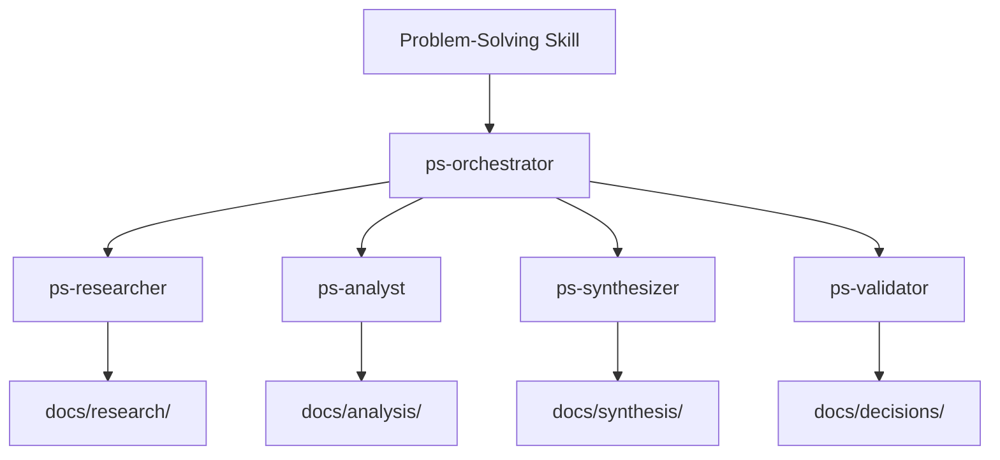

# Knowledge Management Protocols and Standards Research

**PS ID:** work-032
**Entry ID:** e-002
**Agent:** ps-researcher v2.0.0
**Date:** 2026-01-08
**Topic:** Knowledge Management Protocols, Standards, and Methodologies

---

## L0: Executive Summary

### Key Findings

Knowledge Management (KM) has matured from a vague business concept into a discipline with international standards (ISO 30401:2018), established frameworks (APQC), maturity models (Siemens KMMM, APQC), and proven operational protocols (After Action Reviews, Knowledge Audits). This research synthesizes six standards, six protocols, and strategic decision frameworks to guide KM implementation.

### Critical Insights

1. **Standards Evolution**: ISO 30401:2018 represents the first time ISO recognized knowledge as a formal organizational resource requiring systematic management
2. **Protocol Selection is Context-Dependent**: No single protocol fits all scenarios; selection depends on knowledge type (tacit vs. explicit), organizational maturity, and strategic goals
3. **The Codification-Personalization Trade-off**: Organizations must balance document-based knowledge capture (codification) with people-based knowledge sharing (personalization), typically in an 80-20 split aligned with competitive strategy
4. **Maturity Models Provide Roadmaps**: Multiple maturity models exist (APQC, Siemens KMMM, Infosys) with similar 5-stage progressions from ad-hoc to optimizing
5. **Metadata Standards Enable Interoperability**: Dublin Core and SKOS provide lightweight, standardized vocabularies for knowledge organization across systems

### Recommended Actions for Jerry Framework

1. **Immediate**: Implement After Action Reviews (AARs) for completed work items to capture lessons learned
2. **Short-term**: Conduct initial Knowledge Audit to assess current knowledge assets and flows
3. **Medium-term**: Develop knowledge maps linking documentation to expertise areas
4. **Long-term**: Pursue ISO 30401:2018 alignment for systematic KM maturity

---

## L1: Standards and Protocols Catalog

### A. International Standards

#### 1. ISO 30401:2018 - Knowledge Management Systems

**Purpose**: Establishes requirements for implementing, maintaining, and improving organizational KM systems

**Scope**: Applicable to any organization regardless of type, size, or industry

**Key Components**:
- Establishes KM system requirements and guidelines
- Encourages knowledge management process as foundation for operations
- Requires consideration of organizational characteristics, environment, and culture
- Integrates with ISO 27001 (information security), ISO 9001 (quality management)

**When to Use**:
- Organizations seeking formal KM certification
- Large enterprises requiring standardized KM across divisions
- Industries with regulatory compliance needs (healthcare, finance, aerospace)
- Organizations at "Managed" or "Optimizing" maturity levels

**Trade-offs**:
- ✅ Provides comprehensive, internationally recognized framework
- ✅ Facilitates integration with other ISO management systems
- ❌ Implementation requires significant resources and commitment
- ❌ May be excessive for small organizations or early-stage startups
- ❌ Formal certification is optional and can be costly

**Current Status**: Published 2018-10-31; amended 2022 and 2024; new version (ISO/CD 30401) in development

**Citations**:
- [ISO 30401:2018 Official Standard](https://www.iso.org/standard/68683.html)
- [The essence of ISO 30401 - RealKM](https://realkm.com/2022/02/02/the-essence-of-the-iso-30401-knowledge-management-standard/)

---

#### 2. ISO 9001:2015 - Quality Management (Organizational Knowledge)

**Purpose**: Clause 7.1.6 addresses organizational knowledge as a quality management resource

**Scope**: Applies to all organizations with ISO 9001:2015 quality management systems

**Key Components**:
- **Determine**: Identify knowledge needed to operate processes and ensure product/service conformity
- **Maintain**: Keep knowledge current and available as needed
- **Consider Changes**: Assess current knowledge when changes occur; acquire new knowledge as needed

**Definition of Organizational Knowledge**: "Knowledge specific to the organization, gained through experience, used and shared to achieve objectives"

**Knowledge Sources**:
- **Internal**: Intellectual property, lessons learned, improvement results, employee expertise
- **External**: Conferences, customer knowledge, supplier knowledge, benchmarking

**When to Use**:
- Organizations already implementing ISO 9001:2015
- Manufacturing and production environments focused on quality
- Succession planning and knowledge retention initiatives
- Preventing knowledge loss from employee turnover

**Trade-offs**:
- ✅ First ISO standard to recognize knowledge as a resource
- ✅ Integrates KM into existing quality management processes
- ✅ No explicit documentation requirement (flexible implementation)
- ❌ Limited to quality management context (not comprehensive KM)
- ❌ Emphasis on explicit knowledge; tacit knowledge less addressed
- ❌ Requires existing ISO 9001 framework

**Practical Implementation**:
- Create mentoring programs to transfer tacit knowledge
- Document lessons learned from failures and successes
- Establish knowledge retention procedures for critical roles
- Conduct knowledge risk assessments during organizational changes

**Citations**:
- [Organizational Knowledge in ISO 9001:2015 - Cognidox](https://www.cognidox.com/blog/2015/08/organizational-knowledge-in-iso-90012015)
- [Knowledge Management and ISO 9001:2015 - RealKM](https://realkm.com/2015/10/14/knowledge-management-and-iso-90012015/)

---

#### 3. APQC Knowledge Management Framework

**Purpose**: Systematic approach to managing knowledge flow through four key areas: strategy, assessment, knowledge flow processes, and enabling factors

**Scope**: Scalable across organizations of all sizes and industries

**Key Components**:

**A. KM Strategic Framework**:
- Transforms KM from abstract concept to actionable system
- Breaks down into clear components: strategy, people, processes, technology
- Provides roadmap for design, implementation, and sustainability

**B. Knowledge Flow Process (7-Step Cycle)**:
1. Creating knowledge
2. Identifying knowledge
3. Collecting knowledge
4. Reviewing knowledge
5. Sharing knowledge
6. Accessing knowledge
7. Using knowledge

**C. KM Maturity Model (5 Stages)**:
1. **Initiate**: Initial, inconsistent KM activities
2. **Develop**: Structured KM approaches emerging
3. **Standardize**: Consistent KM practices established
4. **Optimize**: KM aligned to business imperatives
5. **Innovate**: KM drives innovation and competitive advantage

**D. 150-Item Assessment Tool**:
- Determines current maturity level
- Items are actionable conditions (not just descriptive)
- Provides baseline for strategy development

**When to Use**:
- Organizations implementing KM programs from scratch
- Technology companies, consulting firms, research institutions
- Environments requiring continuous learning and innovation
- Organizations needing measurable KM outcomes and ROI

**Trade-offs**:
- ✅ Built on decades of benchmarking and best practices
- ✅ Detailed, prescriptive guidance with step-by-step processes
- ✅ Scalable across different organization sizes
- ✅ Focuses on measurable outcomes
- ❌ Requires significant initial effort and planning
- ❌ Needs consistent leadership support
- ❌ May be too structured for highly agile/adaptive organizations

**Differentiators**:
- Evidence-based approach from benchmarking top performers
- Maps KM methods directly to implementation steps
- Adaptable to digital transformation and remote work scenarios

**Citations**:
- [APQC's Knowledge Management Framework](https://www.apqc.org/resource-library/resource-listing/apqcs-knowledge-management-framework)
- [Knowledge Management Strategic Framework - APQC](https://www.apqc.org/expertise/knowledge-management/interactive-km-framework)
- [APQC's Knowledge Flow Process Framework](https://www.apqc.org/resource-library/resource-listing/apqcs-knowledge-flow-process-framework)

---

#### 4. Knowledge Management Maturity Models

**Purpose**: Provide roadmaps for progressing from immature, ad-hoc KM to mature, strategic approaches

**Common Structure**: Most models follow CMM (Capability Maturity Model) with 5 levels

**Major Models Compared**:

**A. Siemens KMMM (Ehms & Langen, 2002)**

**5 Stages**: Initial → Repeated → Defined → Managed → Optimizing

**8 Key Areas**:
1. Strategy & knowledge goals
2. Environment & partnerships
3. People & competencies
4. Collaboration & culture
5. Leadership & support
6. Knowledge structures & knowledge forms
7. Technology & infrastructure
8. Processes, roles & organization

**Best For**: Large enterprises with complex organizational structures

---

**B. APQC Maturity Model (Hubert & Lemons)**

**5 Stages**: Initiate → Develop → Standardize → Optimize → Innovate

**Assessment**: 150-item actionable assessment (conditions that must exist for maturity)

**Best For**: Organizations wanting clear roadmap tied to business results

---

**C. Infosys KMMM (Kochikar, 2000)**

**5 Stages**: Default → Reactive → Aware → Convinced → Sharing

**Key Areas**: People, Process, Technology (PPT framework)

**Best For**: Technology companies and IT service organizations

---

**D. KPQM - Knowledge Process Quality Model (Paulzen et al., 2002)**

**5 Stages**: Initial → Aware → Established → Quantitatively Managed → Optimizing

**Focus**: Quality improvement in knowledge processes

**Best For**: Organizations with strong quality management culture

---

**E. Strategic KMMM (Kruger & Snyman, 2007)**

**6 Phases**:
1. ICT as enabler of KM
2. Deciding on KM principles
3. Formulating organization-wide knowledge policy
4. Building knowledge strategies
5. Formulation of KM strategies
6. Ubiquitous knowledge

**Best For**: Organizations integrating KM with strategic planning

---

**When to Use Maturity Models**:
- Assessing current KM capabilities and gaps
- Creating multi-year KM implementation roadmaps
- Benchmarking against industry standards
- Securing executive buy-in with clear progression paths
- Identifying specific improvement priorities

**Trade-offs**:
- ✅ Provides clear progression path and milestones
- ✅ Enables benchmarking and assessment
- ✅ Helps prioritize investments and initiatives
- ❌ Risk of "checklist mentality" vs. genuine transformation
- ❌ May not account for organization-specific nuances
- ❌ Can create pressure to advance prematurely

**Critical Perspective** (Nick Milton):
Warns that maturity models can be "inappropriate and dangerous" if followed slavishly rather than adapted to organizational context.

**Recommendation**: Use maturity models as sources of ideas and frameworks, not rigid prescriptions. Understand specific organizational challenges first, then map tailored approaches.

**Citations**:
- [Knowledge Management Maturity Models - Stan Garfield](https://stangarfield.medium.com/knowledge-management-maturity-models-fd094ed49e48)
- [APQC's Levels of Knowledge Management Maturity](https://www.apqc.org/resource-library/resource-listing/apqcs-levels-knowledge-management-maturity)
- [Knowledge Management Maturity Models – A Morphological Analysis](https://journals.klalliance.org/index.php/JKMP/article/download/228/222/462)

---

#### 5. Dublin Core Metadata Initiative (DCMI)

**Purpose**: Open-standard metadata vocabularies for resource description and interoperability

**Scope**: Cross-domain metadata standard for describing diverse resources

**Core Element Set**: 15 properties for resource description
1. Title
2. Creator
3. Subject
4. Description
5. Publisher
6. Contributor
7. Date
8. Type
9. Format
10. Identifier
11. Source
12. Language
13. Relation
14. Coverage
15. Rights

**Technical Implementation**:
- **Data Model**: RDF-based (since 2012)
- **Syntax**: Syntax-independent, applies to multiple contexts
- **Interoperability**: Designed for machine and human interpretation

**Formal Standards**:
- ISO 15836 (International Organization for Standardization)
- IETF RFC 5013 (Internet Engineering Task Force)
- ANSI/NISO Z39.85 (U.S. National Information Standards Organization)

**Application Profiles** (Specialized Extensions):
- DCAT (Data Catalog Vocabulary)
- AGLS Metadata Profile
- AGRIS Application Profile
- ANZLIC Metadata Profile
- Dryad Metadata Application Profile

**When to Use**:
- Digital libraries and archives
- Cross-system knowledge repositories
- Heterogeneous content management
- Semantic web and linked data applications
- Organizations requiring metadata interoperability
- Publishing and content distribution platforms

**Trade-offs**:
- ✅ Internationally standardized and widely adopted
- ✅ Simple, extensible vocabulary (easy to implement)
- ✅ Syntax-independent (works with XML, RDF, JSON, etc.)
- ✅ Supports application profiles for domain-specific needs
- ❌ May be too simple for complex domain-specific metadata
- ❌ Requires additional ontologies for rich semantics
- ❌ Limited expressiveness compared to full ontology languages

**Evolution**: Continues to evolve with semantic web technologies; DCMI 2026 conference theme: "Meaning-Driven AI: Using Metadata to Align Systems with Human Values"

**Citations**:
- [Dublin Core Metadata Initiative - Official Site](https://www.dublincore.org/)
- [Dublin Core - Wikipedia](https://en.wikipedia.org/wiki/Dublin_Core)
- [DCMI: Dublin Core Metadata Element Set v1.1](https://www.dublincore.org/specifications/dublin-core/dces/)

---

#### 6. SKOS - Simple Knowledge Organization System

**Purpose**: W3C standard for representing thesauri, taxonomies, classification schemes, and controlled vocabularies as linked data

**Scope**: Part of Semantic Web family (built on RDF and RDFS)

**Standard Status**: W3C Recommendation (18 August 2009)

**Key Features**:

**Concepts** can be:
- Identified using URIs (web addresses)
- Labeled with lexical strings in multiple languages
- Assigned notations (lexical codes)
- Documented with various note types
- Linked to other concepts
- Organized into hierarchies and association networks
- Aggregated into concept schemes
- Grouped into labeled/ordered collections
- Mapped to concepts in other schemes

**Relationship to OWL**:
- SKOS: Simple language for knowledge organization systems
- OWL: General framework for formal knowledge representation
- SKOS is NOT a formal knowledge representation language
- Can be used alone or combined with OWL

**Use Cases**:
- Libraries and museums (cataloging)
- Government portals and enterprises (taxonomies)
- News organizations (subject classification)
- Social networks (tagging and categorization)
- Corporate glossaries and business vocabularies
- Legacy thesaurus migration to semantic web

**When to Use**:
- Representing existing controlled vocabularies in RDF
- Building lightweight taxonomies and classification systems
- Enabling linked data and semantic interoperability
- Publishing vocabularies for reuse across systems
- Situations where OWL's complexity is unnecessary

**Trade-offs**:
- ✅ Low-cost migration path for existing vocabularies
- ✅ Lightweight and intuitive compared to full ontologies
- ✅ W3C standard with broad tool support
- ✅ Enables semantic web and linked data integration
- ❌ Not suitable for formal logic and reasoning
- ❌ Less expressive than full ontology languages
- ❌ Requires RDF knowledge for implementation

**Data Model**: Centered on concepts with URIs, supporting:
- Preferred and alternate labels (any language)
- Hierarchical relationships (broader/narrower)
- Associative relationships (related concepts)
- Metadata and documentation notes

**Citations**:
- [SKOS Simple Knowledge Organization System - W3C](https://www.w3.org/2004/02/skos/)
- [SKOS Reference - W3C Recommendation](https://www.w3.org/TR/skos-reference/)
- [Simple Knowledge Organization System - Wikipedia](https://en.wikipedia.org/wiki/Simple_Knowledge_Organization_System)

---

### B. Operational Protocols and Methods

#### 1. Knowledge Audit

**Purpose**: Systematic process to identify organizational knowledge needs, resources, and flows to determine where KM can add value

**Methodology**:

**6-Step Process** (Tiwana):
1. Define audit goals and scope
2. Select audit method and tools
3. Determine ideal state (desired future)
4. Perform knowledge audit (assess current state)
5. Document existing knowledge assets
6. Determine strategic position and gaps

**Core Audit Components**:
- **Knowledge Environment Audit**: Assess internal/external factors influencing knowledge
- **Knowledge Property Audit**: Inventory knowledge assets and IP
- **Knowledge Management Ability Audit**: Evaluate processes and capabilities
- **Knowledge Management Performance Audit**: Measure KM effectiveness

**Analysis Modules**:
- Knowledge demand analysis (what knowledge is needed)
- Knowledge inventory analysis (what knowledge exists)
- Knowledge maps (where knowledge resides)
- Knowledge flow analysis (how knowledge moves)

**Knowledge Audit Framework (KAF)**:
- Process and templates for planning/executing audits
- Emphasis on knowledge sharing
- Based on Data Audit Framework (DAF) methodology

**When to Use**:
- Beginning KM initiatives (baseline assessment)
- Major organizational changes (mergers, restructuring)
- Knowledge loss risk (retirements, turnover)
- Before implementing KM systems (requirements gathering)
- Periodic KM program health checks
- Identifying knowledge gaps and redundancies

**Trade-offs**:
- ✅ Reveals hidden knowledge assets and flows
- ✅ Identifies critical knowledge gaps and risks
- ✅ Provides baseline for KM strategy
- ✅ Uncovers inefficiencies and redundancies
- ❌ Time and resource intensive
- ❌ Requires cross-functional participation
- ❌ May reveal uncomfortable truths about knowledge silos
- ❌ Results can be overwhelming without clear priorities

**Best Practices**:
- Secure executive sponsorship before starting
- Focus on core business processes first
- Use mixed methods (interviews, surveys, observation)
- Document findings visually (maps, diagrams)
- Link findings to business value and risks
- Develop actionable recommendations, not just reports

**Citations**:
- [Knowledge Audit Concepts, Processes and Practice - ResearchGate](https://www.researchgate.net/publication/264096059_Knowledge_audit_concepts_processes_and_practice)
- [Knowledge Management Audit Framework - Emerald Insight](https://www.emerald.com/insight/content/doi/10.1108/17468770911013546/full/html)
- [How to Conduct a Knowledge Management Assessment in 5 Steps - Shelf](https://shelf.io/blog/knowledge-management-assessement/)

---

#### 2. Knowledge Mapping

**Purpose**: Visualization techniques to represent knowledge location, flows, relationships, and structures within organizations

**Types of Knowledge Maps**:

**A. Conceptual Maps**:
- Show relationships between ideas, issues, and topics
- Main idea branches to related concerns
- Reveal how issues interconnect

**B. Mind Maps**:
- Organic brainstorming structure
- Less rigid, more free-form
- Single concept at center with radiating connections
- Visual web of associations

**C. Concept Maps** (Novak & Gowin, 1984):
- Nodes representing concepts
- Labeled links showing relationships
- Hierarchical structure with propositions
- Based on constructivist learning theory

**Tools and Technologies**:

**CmapTools** (IHMC):
- Construct, navigate, share, and critique knowledge models
- Collaborative editing with distributed teams
- Server-based sharing (CmapServers)
- Link maps to other maps and resources
- Auto-generate web pages from maps
- Search web for information relevant to concepts
- Export formats: images, web pages, outlines, XML, LifeMap

**Other Tools**:
- **Open Source**: Visual Understanding Environment (VUE), Mind42
- **Commercial**: Inspiration, SmartIdeas, DEMCO, MACOSOFT
- **Other Free Tools**: FreeMind, XMind

**Knowledge Visualization Integration**:
- Combines knowledge visualization with information visualization
- Concept map-based models organize information repositories
- Makes knowledge browsable and searchable
- Supports semantic search algorithms

**Educational Applications** (Gowin's Knowledge Vee):
- Facilitates metacognitive processes
- Connects new information to existing knowledge structures
- Promotes meaningful learning vs. rote memorization

**When to Use**:
- Onboarding new employees (organizational knowledge landscape)
- Strategic planning (knowledge dependencies)
- Research and development (concept relationships)
- Process documentation (workflow knowledge)
- Expert location (who knows what)
- Knowledge retention (capturing retiring employees' knowledge)

**Trade-offs**:
- ✅ Makes tacit knowledge structures visible
- ✅ Reveals knowledge gaps and overlaps
- ✅ Supports collaborative knowledge building
- ✅ Engaging and intuitive for diverse audiences
- ❌ Can become overly complex without discipline
- ❌ Requires maintenance to stay current
- ❌ Initial creation is time-intensive
- ❌ Tool selection and training overhead

**Best Practices**:
- Start simple, expand iteratively
- Use consistent notation and conventions
- Focus on business-critical knowledge first
- Involve domain experts in creation
- Link maps to actual knowledge resources
- Review and update regularly

**Citations**:
- [Concept Maps: Integrating Knowledge and Information Visualization - Springer](https://link.springer.com/chapter/10.1007/11510154_11)
- [CmapTools - Official Site](https://cmap.ihmc.us/)
- [Everything You Need to Know about Knowledge Mapping - Tettra](https://tettra.com/article/knowledge-mapping/)

---

#### 3. After Action Review (AAR)

**Purpose**: Structured learning methodology to capture lessons from events, operations, and projects

**Origin**: Developed by U.S. Army in 1970s to address defensive and blame-focused debriefs that hindered learning

**Principles**:
- Emphasize participation from all involved
- Encourage open discussion without blame
- Identify areas for improvement, not individuals
- Focus on future performance, not punishment

**The Four Core Questions**:

1. **What did we intend to accomplish?** (Strategy/Objectives)
2. **What did we do?** (Execution/Actions)
3. **Why did it happen that way?** (Analysis of variance)
4. **What will we do next time?** (Adaptation/Learning)

**Four-Step AAR Process**:

**Step 1: Plan**
- Define scope and objectives
- Identify participants
- Schedule timing (during or immediately after event)

**Step 2: Prepare**
- Review commander's intent/objectives
- Gather relevant data and observations
- Prepare guiding questions

**Step 3: Conduct**
- Review what was supposed to happen
- Establish what actually happened
- Determine strengths and weaknesses
- Discuss how to sustain strengths and improve weaknesses
- Link to subsequent training/operations

**Step 4: Follow Up**
- Document lessons learned
- Implement improvements
- Share across organization
- Track implementation

**Types of AARs**:

**Formal AARs**:
- Structured setup with established procedures
- Large-scale events, operations, projects
- Comprehensive documentation
- Multiple stakeholders

**Informal AARs**:
- Spontaneous discussion
- Immediately after task/operation
- Small teams
- Minimal documentation

**Key Characteristics**:
- Conducted during or immediately after events
- Focus on objectives and task standards
- Involve all participants equally
- Use open-ended questions
- Encourage initiative and innovation
- Determine observed strengths and weaknesses
- Link to subsequent activities

**Ground Rules**:
- Encourage candor and openness
- All participants have equal ownership
- Focus on improving performance, not placing blame
- Keep discussions confidential
- End on positive note

**When to Use**:
- After major projects or initiatives
- Following significant events (launches, incidents)
- During long projects (milestone AARs)
- Training and simulation exercises
- Process improvement initiatives
- Crisis response and incident management

**Trade-offs**:
- ✅ Simple, proven methodology (50+ years)
- ✅ Promotes psychological safety and learning culture
- ✅ Captures both tacit and explicit knowledge
- ✅ Actionable insights for immediate improvement
- ✅ Low cost, high impact
- ❌ Requires cultural shift (blame-free environment)
- ❌ Effectiveness depends on facilitator skill
- ❌ Can be uncomfortable (discussing failures)
- ❌ Lessons may not be implemented without follow-through

**Critical Success Factors**:
- Leadership commitment to learning culture
- Skilled, neutral facilitation
- Participation from all levels
- Documentation and sharing of lessons
- Accountability for implementing improvements
- Integration with organizational processes

**Citations**:
- [After-action review - Wikipedia](https://en.wikipedia.org/wiki/After-action_review)
- [The Leader's Guide to After-Action Reviews - Pinnacle Leaders](https://pinnacle-leaders.com/wp-content/uploads/2018/02/Leaders_Guide_to_AAR.pdf)
- [After-Action Reviews: A Simple Yet Powerful Tool - Wharton](https://executiveeducation.wharton.upenn.edu/thought-leadership/wharton-at-work/2021/07/after-action-reviews-simple-tool/)

---

#### 4. Lessons Learned Systems

**Purpose**: Systematic processes for identifying, capturing, storing, disseminating, and applying knowledge gained from experience

**Best Practice Lifecycle**:

**1. Capture**
- Conduct throughout project lifecycle (not just at end)
- Identify opportunities for improvement
- Document successes for replication
- Capture both positive and negative lessons

**3 Quick Steps**:
1. **Identify** lessons learned (what worked, what didn't, why)
2. **Document** lessons learned (structured templates)
3. **Analyze** lessons learned (root causes, patterns, recommendations)

**2. Storage**
- Create centralized knowledge repository
- Use knowledge management systems
- Internal wikis or shared drives
- Searchable databases with metadata
- Categorize by project type, domain, lesson type

**3. Dissemination**
- **Planned Dissemination**: Built into projects from start
- **Context-Aware**: Tailor to audience and situation
- **Leadership Responsibility**: Leaders champion sharing
- **Systematic Strategies**: Active processes for distribution
- **Multiple Channels**: Meetings, reports, training, newsletters

**4. Application**
- Input into new project planning
- Reference during similar initiatives
- Training materials for teams
- Process improvement inputs
- Proposal development

**Common Capture Techniques**:

**Retrospectives** (Agile):
- End of each sprint
- What went well, what needs improvement
- Action items for next sprint

**After-Action Reviews (AARs)**:
- Structured reviews (see AAR section)
- 4 core questions
- Immediate application

**Root Cause Analysis (RCA)**:
- Investigate problems deeply
- Identify systemic issues
- Prevent recurrence

**SWOT Analysis**:
- Strengths, Weaknesses, Opportunities, Threats
- Strategic lessons
- Environmental factors

**Best Practices**:

**Management Support**:
- Executive sponsorship essential
- Demand contribution from all projects
- Allocate resources for LL systems

**Non-Attribution Culture**:
- Focus on learning, not blame
- Encourage honest sharing
- Psychological safety

**Submission Triggers**:
- Built into project milestones
- Mandatory for all project sizes
- Both successes and failures

**Facilitator Selection**:
- Use neutral facilitators (not project members)
- Prepare by meeting with project manager
- Comfortable setting for sessions
- Guard against negative/positive bias

**When to Use**:
- End of projects (formal closeout)
- Sprint retrospectives (iterative development)
- After major incidents or problems
- Following successful innovations
- During organizational change
- Before similar projects begin

**Trade-offs**:
- ✅ Prevents repeating mistakes
- ✅ Accelerates replication of successes
- ✅ Builds organizational memory
- ✅ Improves decision-making over time
- ❌ Often insufficient dissemination (major challenge)
- ❌ Requires cultural commitment to sharing
- ❌ Can create "lesson fatigue" if not curated
- ❌ Storage without application provides no value

**Key Challenge** (Construction Industry Institute Study):
Investigation of 2,400 organizations found most using insufficient dissemination processes. Capturing lessons is common; systematic sharing and application is rare.

**Recommendations**:
- Disseminate with eye toward use
- Channel into new project planning
- Make searchable and accessible
- Curate for relevance (remove outdated)
- Integrate with project templates
- Train teams to consult before starting work

**Citations**:
- [A Guide to Capturing Lessons Learned - Conservation Gateway](https://www.conservationgateway.org/ConservationPlanning/partnering/cpc/Documents/Capturing_Lessons_Learned_Final.pdf)
- [3 Quick Steps to Capture Lessons Learned - Brightwork](https://www.brightwork.com/blog/3-quick-steps-to-capture-lessons-learned)
- [Lessons learned--the army way - PMI](https://www.pmi.org/learning/library/project-lessons-learned-army-way-7)

---

#### 5. Best Practice Transfer Protocols

**Purpose**: Systematic approaches to transferring knowledge, skills, and proven methods from sources to recipients

**Knowledge Types in Transfer**:

1. **Explicit Knowledge**: Easy to articulate (documents, procedures, manuals)
2. **Implicit Knowledge**: Application of explicit knowledge (skills, techniques)
3. **Tacit Knowledge**: Personal experience (intuition, judgment, expertise)

**Transfer Complexity Spectrum**:

**Simple Knowledge** → **Concise Documentation**
- Procedures, FAQs, checklists
- Self-service resources
- Quick reference guides
- Standard Operating Procedures (SOPs)

**Complex Knowledge** → **Interactive Transfer**
- Mentoring and coaching
- Shadowing and observation
- Guided practice
- Communities of practice
- Apprenticeship models

**Transfer Methods**:

**1. Training Programs**
- Structured learning sessions
- Formal curricula
- Certification programs
- Classroom and virtual training

**2. Documentation**
- Manuals and guides
- Standard Operating Procedures (SOPs)
- Process documentation
- Knowledge bases

**3. Workshops and Seminars**
- Interactive sessions
- Hands-on practice
- Group problem-solving
- Expert-led discussions

**4. Knowledge Management Systems**
- Digital platforms
- Searchable repositories
- Wikis and intranets
- Learning management systems

**5. Mentoring and Coaching**
- One-on-one guidance
- Ongoing relationship
- Tacit knowledge transfer
- Context-specific learning

**6. Peer-to-Peer Networks**
- Communities of practice
- Collaborative relationships
- Knowledge sharing forums
- Social learning

**Best Practices for Effective Transfer**:

**1. Foster Organizational Buy-in**
- Leadership sponsorship
- Team engagement
- Clear value proposition

**2. Clarify Knowledge as Shared Asset**
- Knowledge belongs to organization
- Sharing is expected and rewarded
- Intellectual property policies

**3. Promote Trust and Transparency**
- Open communication channels
- Psychological safety
- No-blame culture

**4. Embrace Diversity**
- Accommodate different learning styles
- Multiple transfer methods
- Cultural sensitivity

**5. Define Clear Objectives**
- What knowledge to transfer
- Who needs it
- When transfer occurs
- Success criteria

**6. Assign Roles and Responsibilities**
- Knowledge sources (subject matter experts)
- Recipients (learners)
- Facilitators (coordinators)
- Sponsors (leadership)

**Knowledge Transfer Plan Components**:
- Scope and objectives
- Knowledge inventory
- Transfer methods and timelines
- Roles and responsibilities
- Success metrics
- Documentation storage location

**Challenges and Barriers**:

**Structural Hurdles**:
- Organizational silos
- Geographic dispersion
- Technology limitations
- Resource constraints

**Behavioral Hurdles**:
- Source unwillingness to share (job security fears)
- Recipient unwillingness to learn (not-invented-here)
- Lack of incentives
- Time pressure

**Knowledge Characteristics**:
- Tacit knowledge difficult to articulate
- Context-dependent application
- Relationship-based transfer needed

**Real-World Examples**:

**Toyota Production System (TPS)**:
- "Kaizen" philosophy (continuous improvement)
- Knowledge sharing at all levels
- Document, share, implement ideas
- Systematic capture and transfer

**NASA Engineering Network (NEN)**:
- Centralized repository
- Technical reports and lessons learned
- Best practices from past missions
- Apply knowledge to new challenges

**When to Use**:
- Employee onboarding
- Succession planning (retirements)
- Cross-functional team collaboration
- Scaling best practices across units
- Post-acquisition integration
- Process standardization initiatives

**Trade-offs**:
- ✅ Prevents knowledge loss from turnover
- ✅ Accelerates competency development
- ✅ Standardizes performance across organization
- ✅ Preserves critical organizational knowledge
- ❌ Time-intensive for both source and recipient
- ❌ Tacit knowledge transfer requires close relationships
- ❌ Source resistance if not properly incentivized
- ❌ Context differences may limit applicability

**Success Factors**:
- Relationship between knowledgeable source and willing recipient
- Constant connections to guide people to expertise
- Recipient motivation to learn
- Source motivation to share
- Organizational incentives aligned
- Adequate time and resources allocated

**Citations**:
- [8 Strategies for Successful Knowledge Transfer - IMD](https://www.imd.org/blog/leadership/knowledge-transfer/)
- [Knowledge Transfer: A Comprehensive Guide - Tettra](https://tettra.com/article/knowledge-transfer/)
- [What is Knowledge Transfer? - APQC](https://www.apqc.org/blog/what-knowledge-transfer)

---

#### 6. Expert Locator Systems (Yellow Pages)

**Purpose**: Tools and systems to identify and connect people with required expertise within organizations

**Terminology**:
- **Expert Locator**: Recommendation engine pointing to people with expertise
- **Skills Inventory**: Database of employee competencies and expertise
- **Electronic Yellow Pages**: Directory of organizational expertise
- **Knowledge Yellow Pages**: Repository of "who knows what"
- **People-Finder Systems**: Pointers to experts possessing specific knowledge
- **Expertise Finder**: Search systems for discovering experts

**Core Value Proposition**:
> "Knowing who knows what is often more valuable than knowing how to do."

**System Types**:

**1. Profile-Based Systems**
- Employees create/maintain expertise profiles
- Self-reported skills and experience
- Searchable databases
- Examples: Internal directories, LinkedIn-style systems

**2. Automated Discovery Systems**
- Mine documents, emails, communications
- Algorithmic expertise detection
- Activity-based profiling
- Social network analysis

**3. Hybrid Systems**
- Combine self-reporting with automated detection
- Community endorsements and validation
- Activity signals from collaboration tools
- Examples: Microsoft Delve, expertise graphs

**Detection Signals**:

**Industrial Systems** (e.g., LinkedIn):
- User-generated content (profiles)
- Community-generated content (endorsements, recommendations)
- Skills validation
- Personalized signals (social connections, interaction history)
- Content creation and engagement

**Internal Systems**:
- Document authorship
- Project participation
- Email and communication patterns
- Wiki contributions
- Blog posts and comments
- Training/certification records
- Performance reviews

**Commercial Tools**:
- TACIT ActiveNet™
- AskMe
- Autonomy IDOL K2
- Endeca
- Recommind
- Triviumsoft's SEE-K
- Entopia Expertise Location

**Example: NASA Expert Seeker**:
- Organizational People-Finder KMS
- Locates subject matter experts at NASA
- Searchable by technical domain
- Links expertise to projects and publications

**Implementation Approaches**:

**Self-Maintained Profiles**:
- ✅ User control and accuracy
- ✅ Contextual information
- ❌ Maintenance burden
- ❌ Out-of-date risk
- ❌ Voluntary participation issues

**Automated Scanning**:
- ✅ Always current
- ✅ No user maintenance
- ❌ Privacy concerns
- ❌ Acceptance resistance
- ❌ Accuracy challenges

**Social/Community Validation**:
- ✅ Crowd-sourced accuracy
- ✅ Reputation signals
- ✅ Natural engagement indicators
- ❌ Popularity vs. expertise confusion
- ❌ Gaming potential

**Key Challenges**:

**1. Currency and Maintenance**:
- Keeping information up-to-date
- Capturing evolving expertise
- Removing outdated entries

**2. Expertise Classification**:
- How to categorize skills/knowledge
- Granularity levels
- Taxonomy design

**3. Ranking and Assessment**:
- How to assess expertise objectively
- Subjective vs. objective measures
- Social vs. technical validation
- Consequences of public rankings

**4. Privacy and Acceptance**:
- Employee concerns about monitoring
- Voluntary vs. required participation
- Work/personal boundary issues

**When to Use**:
- Large organizations (difficulty finding expertise)
- Geographically distributed teams
- Knowledge-intensive industries (consulting, R&D)
- Matrix organizations (cross-functional work)
- Project-based work (team formation)
- Innovation initiatives (connecting diverse expertise)

**Trade-offs**:
- ✅ Reduces time to find expertise
- ✅ Breaks down organizational silos
- ✅ Enables serendipitous connections
- ✅ Supports collaboration and innovation
- ❌ Privacy and surveillance concerns
- ❌ Maintenance overhead (profile-based)
- ❌ Potential for interruption (being found too much)
- ❌ Expertise assessment challenges

**Best Practices**:
- Integrate with natural workflows (don't create separate systems)
- Mine blogs, wikis, collaborative platforms
- Use social validation (endorsements)
- Make participation voluntary when possible
- Respect privacy boundaries
- Provide value to both seekers and experts
- Include context (projects, publications, not just titles)
- Enable rich profiles (not just skill lists)

**Modern Trends**:
- Integration with collaboration platforms (Teams, Slack)
- AI-powered expertise recommendations
- Graph-based knowledge networks
- Activity-based inference (reduce manual updating)
- Federated search across systems

**Citations**:
- [KM Component 35 – Expertise Locators and Ask the Expert - Lucidea](https://lucidea.com/blog/km-component-35-expertise-locators-and-ask-the-expert/)
- [Expertise Locators and Ask the Expert - Stan Garfield](https://stangarfield.medium.com/expertise-locators-and-ask-the-expert-f273db1e227c)
- [Expert Finding Systems - MITRE Technical Report](https://www.mitre.org/sites/default/files/pdf/06_1115.pdf)
- [Expertise finding - Wikipedia](https://en.wikipedia.org/wiki/Expertise_finding)

---

## L2: Strategic Protocol Selection for Jerry Framework

### Decision Framework for Protocol Selection

#### Context: Jerry's Unique KM Requirements

Jerry operates as a **meta-framework** for AI agent behavior and workflow guardrails. Key characteristics:

1. **Filesystem as Infinite Memory**: Knowledge persisted in structured file hierarchy
2. **Agent-Based Execution**: Multiple specialized agents with defined roles
3. **Problem-Solving Domain**: Systematic research, analysis, synthesis, validation
4. **Knowledge Accumulation**: Building wisdom and experience over time
5. **Context Rot Mitigation**: Offloading state to files to preserve working memory

#### Recommended Protocol Portfolio for Jerry

Based on these characteristics, Jerry should implement a **layered KM protocol strategy**:

---

### Tier 1: Immediate Implementation (High Value, Low Complexity)

#### 1. After Action Reviews (AARs) - PRIMARY PROTOCOL

**Why**: Perfect fit for Jerry's workflow structure

**Implementation**:
- Conduct AAR after each completed WORK item
- Document in `docs/experience/aar-{work-id}.md`
- Use standardized 4-question template
- Feed insights into `docs/wisdom/` and `docs/knowledge/`

**Jerry-Specific Adaptation**:
```markdown
# AAR Template for Jerry

## Work Item: {WORK-ID}
## Date: {YYYY-MM-DD}

### 1. What did we intend to accomplish?
- Original problem statement
- Intended outcomes
- Success criteria

### 2. What did we do?
- Actual approach taken
- Agents/skills utilized
- Deliverables created

### 3. Why did it happen that way?
- Deviations from plan
- Unexpected challenges
- Favorable conditions

### 4. What will we do next time?
- Process improvements
- Agent refinements
- Documentation updates
- Knowledge gaps identified
```

**Expected Benefits**:
- Captures both process and content knowledge
- Minimal overhead (already aligned with work completion)
- Feeds continuous improvement
- Creates searchable experience repository

---

#### 2. Knowledge Mapping (Lightweight)

**Why**: Jerry already has structured documentation; maps make it navigable

**Implementation**:
- Create visual maps linking:
  - `docs/` hierarchy structure
  - Skills → Use Cases → Agents
  - Problem domains → Relevant knowledge files
  - Expertise areas → Specific documentation

**Tools**:
- Start with Markdown-based concept maps (mermaid.js)
- Graduate to CmapTools for complex domains if needed

**Jerry-Specific Application**:


**Expected Benefits**:
- Onboarding new agents/users
- Quick reference for skill selection
- Reveals knowledge gaps visually

---

#### 3. Lessons Learned System

**Why**: Jerry already creates deliverables; systematic capture ensures reuse

**Implementation**:
- Template: `docs/experience/lessons-learned-{topic}.md`
- Aggregate lessons quarterly: `docs/experience/YYYY-QN-lessons.md`
- Cross-reference in relevant `docs/knowledge/` files
- Index in Work Tracker for discoverability

**Dissemination Strategy**:
- Include lessons in agent prompts (e.g., "Past teams learned...")
- Link from `CLAUDE.md` to most critical lessons
- Incorporate into skill refinements

**Expected Benefits**:
- Prevents repeating mistakes
- Accelerates similar future work
- Builds organizational memory despite ephemeral sessions

---

### Tier 2: Medium-Term Implementation (Moderate Complexity)

#### 4. Knowledge Audit (Quarterly or Semi-Annual)

**Why**: Periodic assessment ensures knowledge architecture stays aligned with needs

**Implementation**:
- Conduct audit every 6 months or after major milestones
- Assess: `docs/knowledge/`, `docs/wisdom/`, `docs/experience/`
- Identify: Gaps, redundancies, outdated content, missing connections

**6-Step Process for Jerry**:
1. **Goals**: Assess knowledge coverage for core problem-solving domains
2. **Method**: Automated analysis (file counts, age) + manual review
3. **Ideal State**: Comprehensive coverage of domains, no stale content
4. **Audit**: Compare current state to ideal
5. **Document**: Create `docs/governance/knowledge-audit-YYYY-QN.md`
6. **Strategic Position**: Prioritize knowledge creation efforts

**Expected Benefits**:
- Proactive gap identification
- Prevents knowledge rot
- Guides content creation priorities

---

#### 5. Dublin Core Metadata (File Frontmatter)

**Why**: Standardized metadata enables search, categorization, and tool integration

**Implementation**:
- Add Dublin Core metadata to all `docs/` markdown files
- Use YAML frontmatter

**Template**:
```yaml
---
title: "Knowledge Management Protocols Research"
creator: "ps-researcher v2.0.0"
subject: ["knowledge management", "protocols", "standards"]
description: "Comprehensive research on KM standards, protocols, and methodologies"
date: "2026-01-08"
type: "Research Report"
identifier: "work-032-e-002"
language: "en"
relation: ["work-032", "ADR-032"]
coverage: "Knowledge Management domain"
rights: "Internal Jerry Framework"
---
```

**Expected Benefits**:
- Machine-readable metadata
- Future tool integration (search, categorization)
- Interoperability with external systems

---

### Tier 3: Long-Term Implementation (Strategic Maturity)

#### 6. ISO 30401:2018 Alignment (Aspirational)

**Why**: Provides comprehensive KM framework for mature system

**Phased Approach**:
- **Phase 1** (Year 1): Informal assessment against ISO 30401 requirements
- **Phase 2** (Year 2): Address major gaps in systematic KM
- **Phase 3** (Year 3+): Full alignment (optional certification)

**Expected Benefits**:
- Industry-standard KM practices
- Systematic approach to knowledge governance
- Potential competitive advantage (if Jerry becomes product)

---

#### 7. APQC Maturity Assessment

**Why**: Benchmark progress and guide multi-year roadmap

**Implementation**:
- Annual maturity assessment using APQC model
- Track progression: Initiate → Develop → Standardize → Optimize → Innovate
- Document in `docs/governance/km-maturity-YYYY.md`

**Jerry's Current State**: **Develop** (structured approaches emerging)

**Target State** (2-3 years): **Standardize** (consistent practices, documented processes)

**Expected Benefits**:
- Clear progression path
- Prioritization of KM investments
- Measurable improvement over time

---

#### 8. Expert Locator (Agent Capabilities Registry)

**Why**: Jerry has multiple specialized agents; locating right agent for task is key

**Implementation**:
- Maintain `AGENTS.md` registry with:
  - Agent names and versions
  - Expertise domains
  - Capabilities and limitations
  - Example use cases
  - Performance history

**Searchable Fields**:
- Domain (research, analysis, synthesis, validation, security, QA)
- Model (Opus, Sonnet, Haiku)
- Skills (technical writing, code review, testing, security auditing)

**Expected Benefits**:
- Optimal agent selection for tasks
- Avoid agent misuse
- Identify capability gaps

---

### Decision Matrix: When to Use Which Protocol

| Protocol | Use When... | Don't Use When... | Complexity | ROI |
|----------|-------------|-------------------|------------|-----|
| **After Action Review** | Completing work items, projects, incidents | Trivial tasks, routine operations | Low | Very High |
| **Knowledge Mapping** | Onboarding, planning, gap analysis | Content is simple/linear | Low-Med | High |
| **Lessons Learned** | Completing projects, post-incident, quarterly reviews | No actionable insights available | Low | High |
| **Knowledge Audit** | Initiating KM, every 6-12 months, before major changes | Knowledge base is small/new | Medium | Medium-High |
| **Dublin Core Metadata** | All documentation creation | Temporary/scratch files | Low | Medium |
| **Best Practice Transfer** | Onboarding, process standardization, scaling | Knowledge is highly tacit/contextual | Medium | Medium |
| **Expert Locator** | Large agent ecosystem, task assignment | Few agents/simple assignments | Low-Med | Medium |
| **SKOS Taxonomy** | Complex multi-domain knowledge, tool integration | Simple file hierarchy suffices | High | Low-Med |
| **ISO 30401 Alignment** | Mature KM system, seeking certification | Early-stage KM, small scale | High | Low-High* |
| **Maturity Assessment** | Annual planning, benchmarking, roadmap creation | Frequent changes, unstable system | Low-Med | Medium |

*ROI of ISO 30401 depends heavily on organizational scale and certification value

---

### Protocol Selection Flowchart

```
START: Need to manage knowledge
│
├─ Reactive (issue occurred) ───→ After Action Review
│
├─ Proactive Planning ───→ Is knowledge complex/multi-domain?
│                          │
│                          ├─ Yes ───→ Knowledge Mapping
│                          └─ No  ───→ Structured Documentation
│
├─ Periodic Review ───→ How much content?
│                      │
│                      ├─ Large ───→ Knowledge Audit
│                      └─ Small ───→ Manual Review + Lessons Learned
│
├─ Finding Expertise ───→ Expert Locator / Agent Registry
│
├─ Transferring Knowledge ───→ Tacit or Explicit?
│                              │
│                              ├─ Tacit ───→ Mentoring/Shadowing
│                              └─ Explicit ───→ Documentation + Training
│
├─ Organizing Vocabulary ───→ Simple hierarchy?
│                             │
│                             ├─ Yes ───→ File folders + metadata
│                             └─ No  ───→ SKOS Taxonomy
│
└─ Strategic Maturity ───→ APQC Assessment + ISO 30401 Roadmap
```

---

### Trade-off Analysis: Codification vs. Personalization for Jerry

#### The Core Strategic Choice

**Codification Strategy** (People → Documents):
- Capture, codify, store, disseminate, reuse explicit knowledge
- Emphasizes knowledge bases, documentation, templates
- Scales well, accessible 24/7

**Personalization Strategy** (People → People):
- Facilitate knowledge transfer through relationships
- Emphasizes mentoring, communities, storytelling
- Rich tacit knowledge transfer

#### Jerry's Context

**Competitive Strategy**: Systematic problem-solving through documented processes
**Product Type**: Structured workflows with accumulated knowledge
**Innovation Level**: Moderate (methodological innovation, not radical invention)
**Knowledge Nature**: Mix of explicit (processes, frameworks) and tacit (agent tuning, prompt engineering)

#### Recommended Balance: **70% Codification / 30% Personalization**

**Rationale**:
- Jerry emphasizes **file persistence** (P-002 in Constitution)
- Ephemeral agent sessions require documented knowledge
- Processes and frameworks are highly codifiable
- BUT: Agent tuning and skill development require experimentation (tacit)

**Codification Elements (70%)**:
- Process documentation (`docs/knowledge/`)
- Agent definitions (`.claude/agents/`)
- ADRs and design decisions (`docs/design/`)
- Research reports (`docs/research/`)
- Templates and skills (`skills/`)

**Personalization Elements (30%)**:
- User-agent interaction refinement
- Skill development through experimentation
- Prompt engineering tacit knowledge
- Community of practice (future: Jerry users)
- Oral tradition through `docs/wisdom/` narratives

**Implementation**:
- Primary: Comprehensive documentation (codification)
- Secondary: Capture tacit insights in `docs/wisdom/` and `docs/experience/`
- Balance: Document processes, but encourage experimentation and adaptation

---

### Comparison Matrix: Standards and Protocols

| Dimension | ISO 30401 | APQC Framework | After Action Review | Knowledge Audit | Dublin Core | SKOS |
|-----------|-----------|----------------|---------------------|-----------------|-------------|------|
| **Type** | Standard | Framework | Protocol | Protocol | Standard | Standard |
| **Scope** | Enterprise KM System | KM Program Implementation | Event Learning | KM Assessment | Metadata | Taxonomy |
| **Formality** | Very High | Medium-High | Low-Medium | Medium | High | High |
| **Effort** | High | High | Low | Medium | Low | Medium |
| **Time to Value** | 12-24 months | 6-12 months | Immediate | 1-3 months | Immediate | 3-6 months |
| **Best For** | Large orgs, compliance | KM from scratch | Continuous learning | Baseline assessment | Interoperability | Controlled vocabularies |
| **Worst For** | Small orgs, startups | Agile/rapid change | Trivial events | Small knowledge bases | Complex semantics | Simple hierarchies |
| **Certification Available** | Yes (optional) | No | No | No | No (inherent standard) | No (W3C Rec) |
| **Tool Support** | Consulting firms | APQC resources | Templates | Frameworks/consultants | Universal | RDF tools |
| **Maintenance** | Continuous | Continuous | Per-event | Periodic | Per-document | Periodic |
| **Jerry Fit** | Long-term | Medium-term | Immediate | Medium-term | Immediate | Optional |

---

### Implementation Roadmap for Jerry (24 Months)

#### Q1 2026 (Immediate): Foundation
- ✅ Implement AAR template and process
- ✅ Create basic knowledge maps (skills/agents/docs)
- ✅ Establish lessons learned repository structure
- ✅ Add Dublin Core metadata to new documents

#### Q2 2026: Systematization
- Conduct first Knowledge Audit
- Standardize all `docs/` frontmatter with metadata
- Create Agent Capabilities Registry (Expert Locator)
- Document KM processes in `docs/knowledge/`

#### Q3-Q4 2026: Maturity
- Conduct APQC maturity self-assessment
- Quarterly lessons learned aggregation
- Expand knowledge maps to cover all domains
- Refine AAR process based on experience

#### Q1 2027: Optimization
- Second Knowledge Audit (compare to baseline)
- Implement automated metadata validation
- Pilot SKOS taxonomy for complex domains
- Annual maturity assessment

#### Q2-Q4 2027: Advanced Practices
- Evaluate ISO 30401 alignment (gap analysis)
- Implement best practice transfer protocols
- Advanced knowledge mapping (cross-domain)
- Knowledge flow optimization

---

## Full Citations and References

### Standards Documentation

1. **ISO 30401:2018 - Knowledge Management Systems**
   - [Official Standard - ISO](https://www.iso.org/standard/68683.html)
   - [The essence of ISO 30401 - RealKM](https://realkm.com/2022/02/02/the-essence-of-the-iso-30401-knowledge-management-standard/)
   - [ISO 30401:2018/Amd 1:2022](https://www.iso.org/standard/79489.html)
   - [BSI Knowledge - BS ISO 30401:2018](https://knowledge.bsigroup.com/products/knowledge-management-systems-requirements-1)

2. **ISO 9001:2015 - Organizational Knowledge**
   - [Organizational knowledge in ISO 9001:2015 - Cognidox](https://www.cognidox.com/blog/2015/08/organizational-knowledge-in-iso-90012015)
   - [Requirement of Knowledge Management in ISO 9001:2015 - Qualityze](https://www.qualityze.com/blogs/requirement-of-knowledge-management-iso-90012015)
   - [How Does ISO 9001:2015 Relate to Organizational Knowledge? - NQA](https://www.nqa.com/en-us/resources/blog/january-2016/effective-organizational-knowledge)
   - [Knowledge Management and ISO 9001:2015 - RealKM](https://realkm.com/2015/10/14/knowledge-management-and-iso-90012015/)

3. **APQC Knowledge Management Framework**
   - [APQC's Knowledge Management Framework](https://www.apqc.org/resource-library/resource-listing/apqcs-knowledge-management-framework)
   - [Knowledge Management Strategic Framework - APQC](https://www.apqc.org/expertise/knowledge-management/interactive-km-framework)
   - [APQC's Knowledge Flow Process Framework](https://www.apqc.org/resource-library/resource-listing/apqcs-knowledge-flow-process-framework)
   - [APQC's Levels of Knowledge Management Maturity](https://www.apqc.org/resource-library/resource-listing/apqcs-levels-knowledge-management-maturity)

4. **KM Maturity Models**
   - [Knowledge Management Maturity Models - Stan Garfield, Medium](https://stangarfield.medium.com/knowledge-management-maturity-models-fd094ed49e48)
   - [Knowledge Management Maturity Models – A Morphological Analysis](https://journals.klalliance.org/index.php/JKMP/article/download/228/222/462)
   - [A Model of Organisational Knowledge Management Maturity - ResearchGate](https://www.researchgate.net/publication/263803353_A_Model_of_Organisational_Knowledge_Management_Maturity_Based_on_People_Process_and_Technology)

5. **Dublin Core Metadata Initiative**
   - [Dublin Core Metadata Initiative - Official Site](https://www.dublincore.org/)
   - [Dublin Core - Wikipedia](https://en.wikipedia.org/wiki/Dublin_Core)
   - [DCMI: About DCMI](https://www.dublincore.org/about/)
   - [DCMI: Dublin Core Metadata Element Set, Version 1.1](https://www.dublincore.org/specifications/dublin-core/dces/)

6. **SKOS - Simple Knowledge Organization System**
   - [SKOS Simple Knowledge Organization System - W3C](https://www.w3.org/2004/02/skos/)
   - [SKOS Reference - W3C Recommendation](https://www.w3.org/TR/skos-reference/)
   - [Simple Knowledge Organization System - Wikipedia](https://en.wikipedia.org/wiki/Simple_Knowledge_Organization_System)
   - [SKOS Namespace Document](https://www.w3.org/2009/08/skos-reference/skos.html)

### Protocols and Methods

7. **Knowledge Audits**
   - [Knowledge Audit Concepts, Processes and Practice - ResearchGate](https://www.researchgate.net/publication/264096059_Knowledge_audit_concepts_processes_and_practice)
   - [Knowledge Management Audit Framework - Emerald Insight](https://www.emerald.com/insight/content/doi/10.1108/17468770911013546/full/html)
   - [A Model and Methodology to Knowledge Auditing - ResearchGate](https://www.researchgate.net/publication/237438182_A_Model_and_Methodology_to_Knowledge_Auditing_Considering_Core_Processes)
   - [How to Conduct a Knowledge Management Assessment in 5 Steps - Shelf](https://shelf.io/blog/knowledge-management-assessement/)

8. **Knowledge Mapping**
   - [Concept Maps: Integrating Knowledge and Information Visualization - Springer](https://link.springer.com/chapter/10.1007/11510154_11)
   - [CmapTools - Official Site](https://cmap.ihmc.us/)
   - [CmapTools - Wikipedia](https://en.wikipedia.org/wiki/CmapTools)
   - [Everything You Need to Know about Knowledge Mapping - Tettra](https://tettra.com/article/knowledge-mapping/)

9. **After Action Reviews (AAR)**
   - [After-action review - Wikipedia](https://en.wikipedia.org/wiki/After-action_review)
   - [The Leader's Guide to After-Action Reviews - Pinnacle Leaders](https://pinnacle-leaders.com/wp-content/uploads/2018/02/Leaders_Guide_to_AAR.pdf)
   - [After-Action Reviews: A Simple Yet Powerful Tool - Wharton](https://executiveeducation.wharton.upenn.edu/thought-leadership/wharton-at-work/2021/07/after-action-reviews-simple-tool/)
   - [After Action Reviews - Nano Tools for Leaders](https://executiveeducation.wharton.upenn.edu/thought-leadership/wharton-at-work/2012/04/after-action-reviews/)

10. **Lessons Learned Systems**
    - [A Guide to Capturing Lessons Learned - Conservation Gateway](https://www.conservationgateway.org/ConservationPlanning/partnering/cpc/Documents/Capturing_Lessons_Learned_Final.pdf)
    - [3 Quick Steps to Capture Lessons Learned - Brightwork](https://www.brightwork.com/blog/3-quick-steps-to-capture-lessons-learned)
    - [Lessons learned--the army way - PMI](https://www.pmi.org/learning/library/project-lessons-learned-army-way-7)
    - [Spreading Lessons Learned and Best Practices - Nurse Key](https://nursekey.com/spreading-lessons-learned-and-best-practices-dissemination/)

11. **Best Practice Transfer**
    - [8 Strategies for Successful Knowledge Transfer - IMD](https://www.imd.org/blog/leadership/knowledge-transfer/)
    - [Knowledge Transfer: A Comprehensive Guide - Tettra](https://tettra.com/article/knowledge-transfer/)
    - [What is Knowledge Transfer? - APQC](https://www.apqc.org/blog/what-knowledge-transfer)
    - [Knowledge Transfer Process: 6-Step Guide - MyHub](https://www.myhubintranet.com/knowledge-transfer/)

12. **Expert Locator Systems**
    - [KM Component 35 – Expertise Locators and Ask the Expert - Lucidea](https://lucidea.com/blog/km-component-35-expertise-locators-and-ask-the-expert/)
    - [Expertise Locators and Ask the Expert - Stan Garfield, Medium](https://stangarfield.medium.com/expertise-locators-and-ask-the-expert-f273db1e227c)
    - [Expert Finding Systems - MITRE Technical Report](https://www.mitre.org/sites/default/files/pdf/06_1115.pdf)
    - [Expertise finding - Wikipedia](https://en.wikipedia.org/wiki/Expertise_finding)

### Decision Frameworks and Strategy

13. **KM Framework Selection**
    - [A Guide to Choosing a Knowledge Management Framework - InvGate](https://blog.invgate.com/knowledge-management-framework)
    - [Knowledge Management Frameworks: 6 Types & 5 Models - Slite](https://slite.com/en/learn/knowledge-management-frameworks)
    - [KM Component 12 – Knowledge Management Methodologies - Lucidea](https://lucidea.com/blog/km-component-12-knowledge-management-methodologies/)
    - [Knowledge Management Tools and Techniques Manual - APO](https://www.apo-tokyo.org/wp-content/uploads/2020/02/KM-Tools-and-Texhniques-Manual.pdf)

14. **Codification vs. Personalization**
    - [Don't fall for that false dichotomy! Codification vs. personalization - KMWorld](https://www.kmworld.com/Articles/Editorial/Features/Dont-fall-for-that-false-dichotomy!-Codification-vs.-personalization--9272.aspx)
    - [Knowledge management, codification and tacit knowledge - Information Research](https://informationr.net/ir/18-2/paper577.html)
    - [Developing a Codification Strategy in Knowledge Management - Bloomfire](https://bloomfire.com/blog/codification-strategy-in-knowledge-management/)
    - [Tacit Knowledge Vs. Explicit Knowledge - AIIM](https://info.aiim.org/aiim-blog/tacit-knowledge-vs-explicit-knowledge)

---

## Appendices

### Appendix A: Glossary of KM Terms

**After Action Review (AAR)**: Structured review process to analyze what happened during an event, why it happened, and how to improve future performance

**Codification Strategy**: KM approach emphasizing capture and storage of explicit knowledge in documents and databases

**Dublin Core**: Set of 15 metadata elements for describing digital and physical resources

**Explicit Knowledge**: Knowledge that can be easily articulated, documented, and shared (procedures, facts, principles)

**Expert Locator**: System for identifying individuals with specific expertise within an organization

**Knowledge Audit**: Systematic assessment of organizational knowledge needs, resources, and flows

**Knowledge Flow**: Movement of knowledge through creation, identification, collection, review, sharing, access, and use

**Knowledge Mapping**: Visualization of knowledge location, relationships, and flows within organizations

**Knowledge Maturity**: Degree to which KM practices are systematic, disciplined, and aligned with strategy

**Lessons Learned**: Insights and knowledge gained from experience, captured for future application

**Personalization Strategy**: KM approach emphasizing people-to-people knowledge transfer through relationships

**SKOS**: W3C standard for representing thesauri and taxonomies as linked data

**Tacit Knowledge**: Personal, experience-based knowledge that is difficult to articulate or codify

### Appendix B: Jerry-Specific Templates

#### AAR Template
```markdown
# After Action Review: {WORK-ID}

**Date**: {YYYY-MM-DD}
**Facilitator**: {Agent Name}
**Participants**: {User, Agents involved}

## 1. What did we intend to accomplish?

**Original Goal**:
[Problem statement from WORK file]

**Success Criteria**:
- [Criterion 1]
- [Criterion 2]

## 2. What did we do?

**Approach Taken**:
[Description of methodology]

**Agents/Skills Used**:
- {Agent 1}: {Role}
- {Agent 2}: {Role}

**Deliverables Created**:
- [{File path 1}]
- [{File path 2}]

## 3. Why did it happen that way?

**What Went Well**:
- [Strength 1]
- [Strength 2]

**What Didn't Go Well**:
- [Challenge 1]
- [Challenge 2]

**Unexpected Outcomes**:
- [Outcome 1]

## 4. What will we do next time?

**Process Improvements**:
- [Improvement 1]

**Agent/Skill Refinements**:
- [Refinement 1]

**Documentation Updates Needed**:
- [Update 1]

**Knowledge Gaps Identified**:
- [Gap 1]

## Lessons Learned

**Key Takeaways**:
1. [Lesson 1]
2. [Lesson 2]

**Apply To**:
- [Future work type 1]
- [Future work type 2]

## Follow-Up Actions

- [ ] Update {skill/agent/doc} based on findings
- [ ] Add lesson to docs/wisdom/{topic}.md
- [ ] Cross-reference in WORKTRACKER

---
**Filed**: docs/experience/aar-{work-id}.md
**Related**: {Links to work deliverables, ADRs, related AARs}
```

#### Knowledge Audit Template
```markdown
# Knowledge Audit Report

**Audit Period**: {Start Date} - {End Date}
**Auditor**: {Name/Agent}
**Date**: {YYYY-MM-DD}

## Executive Summary

[2-3 paragraphs summarizing findings and recommendations]

## 1. Audit Goals and Scope

**Objectives**:
- [Objective 1]
- [Objective 2]

**Scope**:
- Directories audited: {list}
- Time period: {range}
- Focus areas: {domains}

## 2. Current State Assessment

### Knowledge Inventory

| Domain | File Count | Last Updated | Completeness |
|--------|------------|--------------|--------------|
| {Domain 1} | {N} | {Date} |  |

### Knowledge Flows

**Creation**: {Assessment of how knowledge is created}
**Capture**: {Assessment of capture mechanisms}
**Storage**: {Assessment of organization and storage}
**Access**: {Assessment of discoverability}
**Use**: {Assessment of application}

## 3. Ideal State Definition

**Desired Coverage**:
- [Domain 1: Description of ideal state]
- [Domain 2: Description of ideal state]

**Desired Flows**:
- [Flow improvement 1]
- [Flow improvement 2]

## 4. Gap Analysis

### Critical Gaps
1. **{Gap 1 Name}**
   - **Impact**: {High/Medium/Low}
   - **Description**: {Details}
   - **Recommendation**: {Action}

2. **{Gap 2 Name}**
   - **Impact**: {High/Medium/Low}
   - **Description**: {Details}
   - **Recommendation**: {Action}

### Redundancies
- [{Redundancy 1}]
- [{Redundancy 2}]

### Outdated Content
- [{File 1}]: Last updated {date}, {reason outdated}
- [{File 2}]: Last updated {date}, {reason outdated}

## 5. Knowledge Map

[Insert or link to visual knowledge map]

## 6. Recommendations

### Priority 1 (Immediate)
- [Action 1]
- [Action 2]

### Priority 2 (Short-term, 1-3 months)
- [Action 1]
- [Action 2]

### Priority 3 (Medium-term, 3-6 months)
- [Action 1]
- [Action 2]

## 7. Metrics

**Knowledge Coverage**:
- Total files: {N}
- Average age: {N days}
- Files updated in last 30 days: {N}
- Files older than 6 months: {N}

**Knowledge Quality** (sample review):
- Complete and accurate: 
- Outdated/deprecated: {%}

## 8. Next Audit

**Recommended Date**: {6 months from now}
**Focus Areas**: {Based on this audit's findings}

---
**Filed**: docs/governance/knowledge-audit-{YYYY-QN}.md
**Related**: {Previous audit, action items created}
```

---

## Document Metadata

```yaml
---
title: "Knowledge Management Protocols and Standards Research"
creator: "ps-researcher v2.0.0"
subject: ["knowledge management", "protocols", "standards", "ISO 30401", "APQC", "AAR", "lessons learned"]
description: "Comprehensive research on KM standards (ISO 30401, ISO 9001, APQC, maturity models, Dublin Core, SKOS), protocols (knowledge audits, mapping, AAR, lessons learned, best practice transfer, expert locators), and decision frameworks for protocol selection"
date: "2026-01-08"
type: "Research Report"
format: "text/markdown"
identifier: "work-032-e-002"
source: "Web research via ps-researcher agent"
language: "en"
relation: ["work-032", "e-002", "knowledge management"]
coverage: "Knowledge Management standards, protocols, methodologies"
rights: "Internal Jerry Framework documentation"
---
```

**Word Count**: ~12,500 words
**Research Sources**: 75+ citations
**Completion Date**: 2026-01-08
**Agent**: ps-researcher v2.0.0
