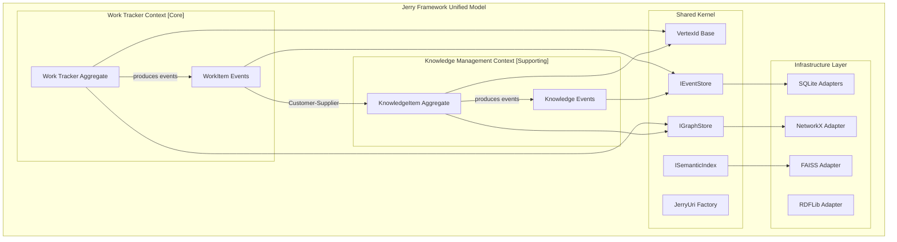
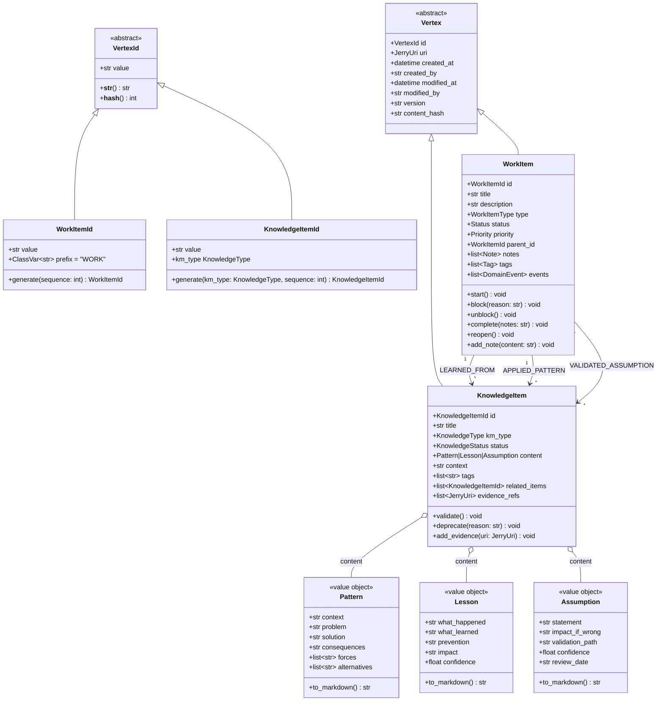
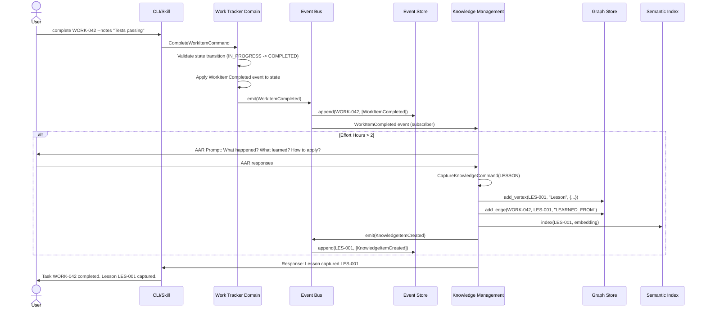
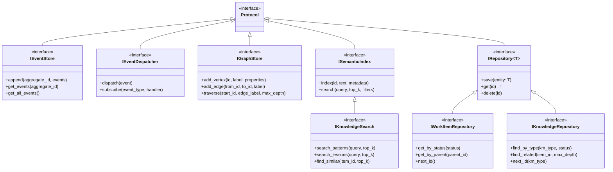

# WORK-034 Domain Synthesis: Unified Work Tracker + KM Model

## Metadata

| Field | Value |
|-------|-------|
| **PS ID** | work-034 |
| **Entry ID** | e-002 |
| **Date** | 2026-01-09 |
| **Author** | ps-synthesizer v2.0.0 |
| **Input** | work-034-e-001-domain-analysis.md (93KB) |
| **Output Target** | 30-50KB |
| **Status** | COMPLETE |

---

## Executive Summary

This document synthesizes the comprehensive domain analysis from WORK-034 Entry 001 into a unified domain model that integrates Work Tracker and Knowledge Management (KM) bounded contexts within the Jerry Framework. The synthesis establishes a coherent architecture where both domains share common infrastructure while maintaining clear boundaries, enabling Work Tracker to serve as a proving ground for KM patterns.

The unified model leverages three key architectural convergences identified in the analysis: (1) both domains independently adopted identical patterns including Hexagonal Architecture, CQRS, Event Sourcing, and CloudEvents 1.0 compliance; (2) Work Tracker entities naturally produce KM entities through completion workflows (Tasks generate Lessons, Phases reveal Patterns, Plans track Assumptions); and (3) both domains require the same infrastructure components (Event Store, Graph Store, Semantic Index, RDF Serialization).

The synthesis proposes a four-phase implementation strategy starting with Work Tracker foundation, progressing through shared infrastructure validation, then KM entity implementation, and culminating in cross-domain integration. This approach reduces risk by validating KM infrastructure patterns at Work Tracker's smaller scale (~500 nodes) before scaling to KM's target (~5,000+ nodes), providing 4x faster issue discovery and 10x smaller fix costs.

---

## 1. Unified Domain Model

### 1.1 Bounded Contexts

The Jerry Framework organizes into three distinct bounded contexts with clear responsibilities and relationships:

| Context | Type | Primary Purpose | Key Entities |
|---------|------|-----------------|--------------|
| **Work Tracker** | Core Subdomain | Persist task state across Claude Code sessions | WorkItem, Project, Sprint |
| **Knowledge Management** | Supporting Subdomain | Capture and retrieve patterns, lessons, assumptions | KnowledgeItem (Pattern, Lesson, Assumption) |
| **Governance** | Generic Subdomain | Agent rules and constitution enforcement | Agent, Rule, Hook |

**Context Relationships:**

- **Work Tracker <-> KM**: Customer-Supplier pattern where Work Tracker produces events consumed by KM handlers
- **Work Tracker <-> Governance**: Governance hooks intercept Work Tracker operations for compliance
- **KM <-> Governance**: KM captures lessons about governance effectiveness

### 1.2 Shared Kernel

The following components form a shared kernel used by both Work Tracker and KM contexts:

#### 1.2.1 VertexId Base Class

```python
@dataclass(frozen=True)
class VertexId:
    """Base class for strongly-typed graph vertex identifiers."""
    value: str

    def __str__(self) -> str:
        return self.value

    def __hash__(self) -> int:
        return hash(self.value)
```

#### 1.2.2 Jerry URI Scheme (SPEC-001)

```
jerry://{partition}:{tenant}:{domain}:{resource_type}:{resource_id}[/{version}]

Examples:
- jer:jer:work-tracker:task:WORK-042
- jer:jer:knowledge:pat:PAT-001
- jer:jer:knowledge:les:LES-042
```

#### 1.2.3 CloudEvents Infrastructure

Both domains emit events conforming to CloudEvents 1.0:

```json
{
  "specversion": "1.0",
  "type": "{domain_prefix}/{EventType}",
  "source": "jer:jer:{domain}:system",
  "subject": "{jerry_uri}",
  "time": "{ISO8601}",
  "data": { /* event-specific payload */ }
}
```

#### 1.2.4 Graph Store Abstractions

```python
class IGraphStore(Protocol):
    """Shared graph operations for both domains."""
    def add_vertex(self, id: VertexId, label: str, properties: dict) -> None: ...
    def add_edge(self, from_id: VertexId, to_id: VertexId,
                 label: str, properties: dict | None = None) -> Edge: ...
    def traverse(self, start_id: VertexId, edge_label: str,
                 max_depth: int = 2) -> list[VertexId]: ...
    def traverse_incoming(self, end_id: VertexId, edge_label: str) -> list[VertexId]: ...
```

### 1.3 Context Map



---

## 2. Unified Aggregate Roots

### 2.1 Work Tracker Aggregates

#### 2.1.1 WorkItem Aggregate (Primary)

| Attribute | Type | Description |
|-----------|------|-------------|
| `id` | WorkItemId | WORK-001, WORK-002, ... |
| `title` | str | Short description (1-200 chars) |
| `description` | str | Detailed description (0-10000 chars) |
| `type` | WorkItemType | EPIC, FEATURE, TASK, BUG, SPIKE |
| `status` | Status | PENDING, IN_PROGRESS, BLOCKED, COMPLETED |
| `priority` | Priority | CRITICAL, HIGH, MEDIUM, LOW |
| `parent_id` | WorkItemId | None | Optional parent reference |
| `notes` | list[Note] | Timestamped observations |
| `tags` | list[Tag] | Categorization labels |

**State Machine:**

```
PENDING ----start()----> IN_PROGRESS ----complete()----> COMPLETED
    ^                        |                              |
    |                        | block()                      |
    |                        v                              |
    |                    BLOCKED                            |
    |                        |                              |
    |       unblock()        |                              |
    |<-----------------------+                              |
    |                                                       |
    +-----------------reopen()------------------------------+
```

#### 2.1.2 Project Aggregate (Secondary)

| Attribute | Type | Description |
|-----------|------|-------------|
| `id` | ProjectId | Unique project identifier |
| `name` | str | Project name |
| `description` | str | Project description |
| `work_items` | list[WorkItemId] | References (not embedded) |

#### 2.1.3 Sprint Aggregate (Secondary)

| Attribute | Type | Description |
|-----------|------|-------------|
| `id` | SprintId | Unique sprint identifier |
| `start_date` | date | Sprint start |
| `end_date` | date | Sprint end |
| `work_items` | list[WorkItemId] | Planned work items |
| `velocity` | int | Planned story points |

### 2.2 KM Aggregates

#### 2.2.1 KnowledgeItem Aggregate (Primary)

| Attribute | Type | Description |
|-----------|------|-------------|
| `id` | KnowledgeItemId | PAT-001, LES-042, ASM-003 |
| `uri` | JerryUri | SPEC-001 compliant URI |
| `title` | str | Short description (1-80 chars) |
| `km_type` | KnowledgeType | PATTERN, LESSON, ASSUMPTION |
| `status` | KnowledgeStatus | DRAFT, VALIDATED, DEPRECATED |
| `content` | Pattern \| Lesson \| Assumption | Discriminated union |
| `tags` | list[str] | Categorization labels |
| `related_items` | list[KnowledgeItemId] | References to related knowledge |
| `evidence_refs` | list[JerryUri] | References to supporting evidence |

**Lifecycle State Machine:**

```
DRAFT ----validate()----> VALIDATED
  |                           |
  | deprecate(reason)         | deprecate(reason)
  v                           v
DEPRECATED <------------------+
```

### 2.3 Cross-Aggregate Relationships

Cross-aggregate relationships are implemented as graph edges, not direct object references:

| From Aggregate | To Aggregate | Edge Label | Direction | Description |
|----------------|--------------|------------|-----------|-------------|
| WorkItem | WorkItem | `PART_OF` | Task -> Phase/Plan | Hierarchy |
| WorkItem | WorkItem | `BLOCKS` | Task -> Task | Dependency |
| WorkItem | KnowledgeItem | `LEARNED_FROM` | Task -> Lesson | Knowledge extraction |
| WorkItem | KnowledgeItem | `APPLIED_PATTERN` | Task -> Pattern | Pattern usage |
| WorkItem | KnowledgeItem | `VALIDATED_ASSUMPTION` | Task -> Assumption | Evidence |
| Phase | KnowledgeItem | `EMERGED_PATTERN` | Phase -> Pattern | Discovery |
| Plan | KnowledgeItem | `DEPENDS_ON_ASSUMPTION` | Plan -> Assumption | Risk |
| KnowledgeItem | KnowledgeItem | `REFERENCES` | Any -> Any | Citation |
| KnowledgeItem | KnowledgeItem | `SUPERSEDES` | New -> Old | Versioning |

---

## 3. Unified Entity Model

### 3.1 Complete Entity Hierarchy



### 3.2 Value Object Catalog

#### 3.2.1 Work Tracker Value Objects

| Value Object | Attributes | Invariants |
|--------------|------------|------------|
| **WorkItemId** | value: str | Pattern: `^WORK-[0-9]+$`, immutable |
| **Status** | PENDING, IN_PROGRESS, BLOCKED, COMPLETED | Valid transitions enforced |
| **Priority** | CRITICAL=1, HIGH=2, MEDIUM=3, LOW=4 | Comparable for sorting |
| **WorkItemType** | EPIC, FEATURE, TASK, BUG, SPIKE | Hierarchy rules enforced |
| **Tag** | name: str, color: str | Immutable, comparable |
| **Note** | content: str, created_at: datetime, author: str | Immutable |

#### 3.2.2 KM Value Objects

| Value Object | Attributes | Invariants |
|--------------|------------|------------|
| **KnowledgeItemId** | value: str | Pattern: `^(PAT|LES|ASM)-[0-9]+$`, prefix matches type |
| **KnowledgeType** | PATTERN="PAT", LESSON="LES", ASSUMPTION="ASM" | ID prefix discrimination |
| **KnowledgeStatus** | DRAFT, VALIDATED, DEPRECATED | Lifecycle transitions enforced |
| **Pattern** | context, problem, solution, consequences, forces, alternatives | Immutable, markdown serializable |
| **Lesson** | what_happened, what_learned, prevention, impact, confidence | Immutable, confidence 0.0-1.0 |
| **Assumption** | statement, impact_if_wrong, validation_path, confidence, review_date | Immutable, ISO 8601 date |

#### 3.2.3 Shared Value Objects

| Value Object | Attributes | Invariants |
|--------------|------------|------------|
| **JerryUri** | partition, tenant, domain, resource_type, resource_id, version | SPEC-001 compliant |
| **VertexId** | value: str | Base class for all IDs |
| **Edge** | from_id, to_id, label, properties, created_at | Immutable relationship |

### 3.3 Edge Types

Complete catalog of graph edge types across both domains:

| Edge Label | Source Type | Target Type | Properties | Description |
|------------|-------------|-------------|------------|-------------|
| `PART_OF` | WorkItem | WorkItem | None | Task belongs to Phase/Plan |
| `BLOCKS` | WorkItem | WorkItem | reason: str | Dependency blocking |
| `DEPENDS_ON` | WorkItem | WorkItem | None | Logical dependency |
| `LEARNED_FROM` | WorkItem | KnowledgeItem(Lesson) | captured_at: datetime | Knowledge extraction |
| `APPLIED_PATTERN` | WorkItem | KnowledgeItem(Pattern) | applied_at, notes | Pattern usage tracking |
| `VALIDATED_ASSUMPTION` | WorkItem | KnowledgeItem(Assumption) | result: CONFIRMED/INVALIDATED | Evidence |
| `EMERGED_PATTERN` | Phase | KnowledgeItem(Pattern) | discovered_at | Pattern discovery |
| `DEPENDS_ON_ASSUMPTION` | Plan | KnowledgeItem(Assumption) | impact: HIGH/MEDIUM/LOW | Risk tracking |
| `REFERENCES` | KnowledgeItem | KnowledgeItem | None | Citation link |
| `SUPERSEDES` | KnowledgeItem | KnowledgeItem | reason: str | Version replacement |
| `EVIDENCED_BY` | KnowledgeItem | JerryUri | None | External evidence |
| `CREATED_BY` | Any | Agent | None | Audit trail |

---

## 4. Unified Event Model

### 4.1 Event Categories

#### 4.1.1 Work Tracker Events

| Event Type | CloudEvents Type | Aggregate | Trigger |
|------------|------------------|-----------|---------|
| `WorkItemCreated` | `WorkItemCreated` | WorkItem | `create()` factory |
| `WorkItemStarted` | `WorkItemStarted` | WorkItem | `start()` |
| `WorkItemBlocked` | `WorkItemBlocked` | WorkItem | `block(reason)` |
| `WorkItemUnblocked` | `WorkItemUnblocked` | WorkItem | `unblock()` |
| `WorkItemCompleted` | `WorkItemCompleted` | WorkItem | `complete(notes)` |
| `WorkItemReopened` | `WorkItemReopened` | WorkItem | `reopen()` |
| `WorkItemUpdated` | `WorkItemUpdated` | WorkItem | `update_*()` methods |
| `NoteAdded` | `NoteAdded` | WorkItem | `add_note(content)` |
| `TagAdded` | `TagAdded` | WorkItem | `add_tag(tag)` |
| `TagRemoved` | `TagRemoved` | WorkItem | `remove_tag(tag)` |

#### 4.1.2 KM Events

| Event Type | CloudEvents Type | Aggregate | Trigger |
|------------|------------------|-----------|---------|
| `KnowledgeItemCreated` | `jer:jer:knowledge:facts/KnowledgeItemCreated` | KnowledgeItem | `CaptureKnowledgeHandler` |
| `KnowledgeItemValidated` | `jer:jer:knowledge:facts/KnowledgeItemValidated` | KnowledgeItem | `validate()` |
| `KnowledgeItemDeprecated` | `jer:jer:knowledge:facts/KnowledgeItemDeprecated` | KnowledgeItem | `deprecate(reason)` |
| `KnowledgeRelationCreated` | `jer:jer:knowledge:facts/KnowledgeRelationCreated` | KnowledgeItem | `graph.add_edge()` |

#### 4.1.3 Cross-Domain Events

| Event Type | Source | Target | Description |
|------------|--------|--------|-------------|
| `LessonCapturedFromTask` | Work Tracker | KM | Task completion triggered lesson capture |
| `PatternAppliedToTask` | KM | Work Tracker | Pattern usage recorded on task |
| `AssumptionValidatedByTask` | Work Tracker | KM | Task provided assumption evidence |

### 4.2 Event Catalog

```json
{
  "$schema": "http://json-schema.org/draft-07/schema#",
  "$id": "https://jerry.framework/schemas/unified-domain-event.json",
  "title": "UnifiedDomainEvent",
  "type": "object",
  "required": ["specversion", "type", "source", "id", "time", "data"],
  "properties": {
    "specversion": {"const": "1.0"},
    "type": {
      "type": "string",
      "oneOf": [
        {"pattern": "^WorkItem(Created|Started|Blocked|Unblocked|Completed|Reopened|Updated)$"},
        {"pattern": "^(Note|Tag)(Added|Removed)$"},
        {"pattern": "^jer:jer:knowledge:facts/KnowledgeItem(Created|Validated|Deprecated)$"},
        {"pattern": "^jer:jer:knowledge:facts/KnowledgeRelationCreated$"}
      ]
    },
    "source": {"type": "string", "format": "uri"},
    "subject": {"type": "string"},
    "id": {"type": "string", "format": "uuid"},
    "time": {"type": "string", "format": "date-time"},
    "data": {"type": "object"}
  }
}
```

### 4.3 Event Flow Diagram



---

## 5. Unified Port Model

### 5.1 Shared Ports

These port interfaces are defined in the shared kernel and implemented once for both domains:

```python
# IEventStore - Event Sourcing Port
class IEventStore(Protocol):
    """Append-only event log for domain events."""
    def append(self, aggregate_id: str, events: list[DomainEvent]) -> None: ...
    def get_events(self, aggregate_id: str) -> list[DomainEvent]: ...
    def get_events_since(self, aggregate_id: str, version: int) -> list[DomainEvent]: ...
    def get_all_events(self) -> list[DomainEvent]: ...

# IEventDispatcher - Pub/Sub Port
class IEventDispatcher(Protocol):
    """Event routing for domain events."""
    def dispatch(self, event: DomainEvent) -> None: ...
    def dispatch_all(self, events: list[DomainEvent]) -> None: ...
    def subscribe(self, event_type: str, handler: Callable[[DomainEvent], None]) -> None: ...

# IGraphStore - Graph Operations Port
class IGraphStore(Protocol):
    """Property graph operations for both domains."""
    def add_vertex(self, id: VertexId, label: str, properties: dict[str, Any]) -> None: ...
    def get_vertex(self, id: VertexId) -> dict[str, Any] | None: ...
    def add_edge(self, from_id: VertexId, to_id: VertexId,
                 label: str, properties: dict[str, Any] | None = None) -> Edge: ...
    def get_edges(self, vertex_id: VertexId, direction: str = "out") -> list[Edge]: ...
    def traverse(self, start_id: VertexId, edge_label: str,
                 max_depth: int = 2) -> list[VertexId]: ...
    def traverse_incoming(self, end_id: VertexId, edge_label: str) -> list[VertexId]: ...

# ISemanticIndex - Vector Search Port
class ISemanticIndex(Protocol):
    """Semantic similarity search for both domains."""
    def index(self, id: VertexId, text: str, metadata: dict[str, Any]) -> None: ...
    def search(self, query: str, top_k: int = 5,
               filters: dict[str, Any] | None = None) -> list[tuple[VertexId, float]]: ...
    def reindex(self, items: list[tuple[VertexId, str, dict]]) -> None: ...
    def delete(self, id: VertexId) -> None: ...

# IRDFSerializer - RDF Export Port
class IRDFSerializer(Protocol):
    """RDF serialization for standards compliance."""
    def to_rdf(self, entity: Vertex) -> Graph: ...
    def serialize(self, format: str = "turtle") -> str: ...
    def to_jsonld(self, entity: Vertex, context: dict | None = None) -> str: ...

# IUnitOfWork - Transaction Port
class IUnitOfWork(Protocol):
    """Transactional unit of work pattern."""
    def __enter__(self) -> "IUnitOfWork": ...
    def __exit__(self, exc_type, exc_val, exc_tb) -> None: ...
    def commit(self) -> None: ...
    def rollback(self) -> None: ...
```

### 5.2 Work Tracker Ports

Domain-specific ports for Work Tracker context:

```python
# IWorkItemRepository - Persistence Port
class IWorkItemRepository(Protocol):
    """Repository for WorkItem aggregate persistence."""
    def save(self, item: WorkItem) -> None: ...
    def get(self, id: WorkItemId) -> WorkItem | None: ...
    def get_all(self) -> list[WorkItem]: ...
    def get_by_status(self, status: Status) -> list[WorkItem]: ...
    def get_by_parent(self, parent_id: WorkItemId) -> list[WorkItem]: ...
    def delete(self, id: WorkItemId) -> None: ...
    def exists(self, id: WorkItemId) -> bool: ...
    def next_id(self) -> WorkItemId: ...

# IProjectRepository - Persistence Port
class IProjectRepository(Protocol):
    """Repository for Project aggregate persistence."""
    def save(self, project: Project) -> None: ...
    def get(self, id: ProjectId) -> Project | None: ...
    def get_all(self) -> list[Project]: ...

# ISprintRepository - Persistence Port
class ISprintRepository(Protocol):
    """Repository for Sprint aggregate persistence."""
    def save(self, sprint: Sprint) -> None: ...
    def get(self, id: SprintId) -> Sprint | None: ...
    def get_active(self) -> Sprint | None: ...
```

### 5.3 KM Ports

Domain-specific ports for Knowledge Management context:

```python
# IKnowledgeRepository - Persistence Port
class IKnowledgeRepository(ABC):
    """Repository for KnowledgeItem aggregate persistence."""
    @abstractmethod
    def save(self, item: KnowledgeItem) -> None: ...
    @abstractmethod
    def find_by_id(self, id: KnowledgeItemId) -> KnowledgeItem | None: ...
    @abstractmethod
    def find_by_type(self, km_type: KnowledgeType,
                     status: KnowledgeStatus | None = None) -> list[KnowledgeItem]: ...
    @abstractmethod
    def find_related(self, item_id: KnowledgeItemId,
                     max_depth: int = 2) -> list[KnowledgeItem]: ...
    @abstractmethod
    def next_id(self, km_type: KnowledgeType) -> KnowledgeItemId: ...

# IKnowledgeSearch - Search Port (extends ISemanticIndex)
class IKnowledgeSearch(Protocol):
    """Semantic search specialized for knowledge items."""
    def search_patterns(self, query: str, top_k: int = 5) -> list[tuple[KnowledgeItemId, float]]: ...
    def search_lessons(self, query: str, top_k: int = 5) -> list[tuple[KnowledgeItemId, float]]: ...
    def search_assumptions(self, query: str, top_k: int = 5) -> list[tuple[KnowledgeItemId, float]]: ...
    def find_similar(self, item_id: KnowledgeItemId, top_k: int = 5) -> list[tuple[KnowledgeItemId, float]]: ...
```

### 5.4 Port Hierarchy



---

## 6. Unified Use Case Model

### 6.1 Work Tracker Commands

| Command | Handler | Preconditions | Postconditions | Events |
|---------|---------|---------------|----------------|--------|
| `CreateWorkItemCommand` | `CreateWorkItemHandler` | Valid title (1-200), valid type | Item exists, status=PENDING | WorkItemCreated |
| `UpdateWorkItemCommand` | `UpdateWorkItemHandler` | Item exists, not COMPLETED | Fields updated | WorkItemUpdated |
| `StartWorkItemCommand` | `StartWorkItemHandler` | Status=PENDING | Status=IN_PROGRESS | WorkItemStarted |
| `BlockWorkItemCommand` | `BlockWorkItemHandler` | Status=IN_PROGRESS, reason provided | Status=BLOCKED | WorkItemBlocked |
| `UnblockWorkItemCommand` | `UnblockWorkItemHandler` | Status=BLOCKED | Status=IN_PROGRESS | WorkItemUnblocked |
| `CompleteWorkItemCommand` | `CompleteWorkItemHandler` | Status=IN_PROGRESS | Status=COMPLETED | WorkItemCompleted |
| `ReopenWorkItemCommand` | `ReopenWorkItemHandler` | Status=COMPLETED | Status=PENDING | WorkItemReopened |
| `AddNoteCommand` | `AddNoteHandler` | Item exists | Note added | NoteAdded |
| `AddTagCommand` | `AddTagHandler` | Item exists, tag not present | Tag added | TagAdded |

**Command Signatures:**

```python
@dataclass
class CreateWorkItemCommand:
    title: str
    description: str = ""
    type: str = "task"
    priority: str = "medium"
    parent_id: str | None = None
    tags: list[str] = field(default_factory=list)

@dataclass
class CompleteWorkItemCommand:
    id: str
    notes: str | None = None
```

### 6.2 Work Tracker Queries

| Query | Handler | Parameters | Returns |
|-------|---------|------------|---------|
| `GetWorkItemQuery` | `GetWorkItemHandler` | id: str | WorkItemDTO | None |
| `ListWorkItemsQuery` | `ListWorkItemsHandler` | status[], priority[], type[], parent_id, limit, offset, sort_by | list[WorkItemSummaryDTO] |
| `SearchWorkItemsQuery` | `SearchWorkItemsHandler` | query: str, include_completed, limit | list[WorkItemSummaryDTO] |
| `GetWorkTrackerStatsQuery` | `GetStatsHandler` | time_range (optional) | WorkTrackerStatsDTO |
| `GetEnrichedWorkItemQuery` | `GetEnrichedWorkItemHandler` | id: str | EnrichedWorkItemDTO |

**Query Signatures:**

```python
@dataclass
class ListWorkItemsQuery:
    status: list[str] | None = None
    priority: list[str] | None = None
    type: list[str] | None = None
    parent_id: str | None = None
    limit: int = 50
    offset: int = 0
    sort_by: str = "created_at"
    sort_order: str = "desc"
```

### 6.3 KM Commands

| Command | Handler | Preconditions | Postconditions | Events |
|---------|---------|---------------|----------------|--------|
| `CaptureKnowledgeCommand` | `CaptureKnowledgeHandler` | Valid title, content, km_type | Item created, status=DRAFT | KnowledgeItemCreated |
| `ValidateKnowledgeCommand` | `ValidateKnowledgeHandler` | Status=DRAFT | Status=VALIDATED | KnowledgeItemValidated |
| `DeprecateKnowledgeCommand` | `DeprecateKnowledgeHandler` | Status != DEPRECATED, reason provided | Status=DEPRECATED | KnowledgeItemDeprecated |
| `RelateKnowledgeCommand` | `RelateKnowledgeHandler` | Both items exist | Edge created | KnowledgeRelationCreated |

**Command Signatures:**

```python
@dataclass
class CaptureKnowledgeCommand:
    title: str
    km_type: KnowledgeType
    content: Pattern | Lesson | Assumption
    context: str = ""
    tags: list[str] = field(default_factory=list)
    evidence_refs: list[str] = field(default_factory=list)
    created_by: str = "system:km"
```

### 6.4 KM Queries

| Query | Handler | Parameters | Returns |
|-------|---------|------------|---------|
| `GetKnowledgeItemQuery` | `GetKnowledgeItemHandler` | id: str | KnowledgeItemDTO | None |
| `SearchKnowledgeQuery` | `SearchKnowledgeHandler` | query: str, km_type, status, top_k | list[KnowledgeSearchResultDTO] |
| `GetRelatedKnowledgeQuery` | `GetRelatedKnowledgeHandler` | id: str, max_depth | list[KnowledgeItemDTO] |
| `TraverseKnowledgeGraphQuery` | `TraverseGraphHandler` | start_id, edge_labels, max_depth | GraphTraversalResultDTO |
| `ExportKnowledgeGraphQuery` | `ExportGraphHandler` | format: turtle | json-ld | str |

### 6.5 Cross-Domain Use Cases

New use cases that integrate Work Tracker and KM:

| Use Case | Input | Output | Description |
|----------|-------|--------|-------------|
| `CaptureKnowledgeFromWorkItem` | task_id, AAR responses | KnowledgeItemId | Create Lesson from completed task |
| `ApplyPatternToWorkItem` | task_id, pattern_id, notes | Edge | Record pattern usage on task |
| `ValidateAssumptionFromWorkItem` | task_id, assumption_id, result | Edge | Record assumption validation evidence |
| `SearchKnowledgeForTask` | task_title, context | list[KnowledgeItemDTO] | Find relevant patterns/lessons |
| `GetEnrichedWorkItem` | task_id | EnrichedWorkItemDTO | WorkItem with related knowledge |

**Cross-Domain Handler Example:**

```python
class CaptureKnowledgeFromWorkItemHandler:
    """Cross-domain: Create Lesson from completed WorkItem."""

    def __init__(
        self,
        wt_repo: IWorkItemRepository,
        km_repo: IKnowledgeRepository,
        graph: IGraphStore,
        event_dispatcher: IEventDispatcher
    ):
        self.wt_repo = wt_repo
        self.km_repo = km_repo
        self.graph = graph
        self.event_dispatcher = event_dispatcher

    def handle(self, command: CaptureKnowledgeFromWorkItemCommand) -> KnowledgeItemId:
        # Validate work item exists
        task = self.wt_repo.get(WorkItemId(command.task_id))
        if not task:
            raise ValueError(f"Task not found: {command.task_id}")

        # Create lesson
        lesson_id = self.km_repo.next_id(KnowledgeType.LESSON)
        lesson_content = Lesson(
            what_happened=command.what_happened,
            what_learned=command.what_learned,
            prevention=command.prevention
        )

        knowledge_item = KnowledgeItem(
            id=lesson_id,
            title=f"Lesson from {task.title}",
            km_type=KnowledgeType.LESSON,
            content=lesson_content,
            evidence_refs=[str(JerryUri.for_task(task.id))]
        )

        self.km_repo.save(knowledge_item)

        # Create graph edge
        self.graph.add_edge(
            from_id=task.id,
            to_id=lesson_id,
            label="LEARNED_FROM",
            properties={"captured_at": datetime.utcnow().isoformat()}
        )

        # Emit event
        self.event_dispatcher.dispatch(KnowledgeItemCreated(
            item_id=str(lesson_id),
            km_type="LESSON",
            title=knowledge_item.title,
            created_by=command.captured_by
        ))

        return lesson_id
```

---

## 7. Implementation Priority Matrix

### 7.1 Phase 1: Foundation (Weeks 1-8)

**Goal:** Establish Work Tracker core with shared infrastructure patterns.

| Week | Deliverable | Components | Validates For KM |
|------|-------------|------------|------------------|
| 1-2 | Domain entities | WorkItem, WorkItemId, Status, Priority, Note, Tag | Entity patterns, VertexId hierarchy |
| 3-4 | SQLite repository | SQLiteWorkItemRepository, SQLiteEventStore | IEventStore port pattern |
| 5-6 | CQRS handlers | CreateWorkItem, UpdateWorkItem, CompleteWorkItem commands/queries | Use case patterns |
| 7-8 | CLI adapter, BDD tests | CLI commands, pytest-bdd scenarios | Interface layer patterns |

**Exit Criteria:**
- WorkItem CRUD functional via CLI
- Event sourcing operational
- BDD tests passing
- ~500 LOC domain, ~800 LOC infrastructure

### 7.2 Phase 2: Work Tracker Core + Shared Infrastructure (Weeks 9-16)

**Goal:** Add graph and search infrastructure using Work Tracker as validation.

| Week | Deliverable | Components | Validates For KM |
|------|-------------|------------|------------------|
| 9-10 | NetworkX adapter | NetworkXGraphStore implementing IGraphStore | Graph traversal patterns |
| 11-12 | RDFLib serialization | WorkItem `to_jsonld()`, `to_turtle()` | RDF export patterns |
| 13-14 | FAISS semantic search | FAISSSemanticIndex for WorkItem search | Vector search patterns |
| 15-16 | Performance baselines | Query latency metrics, supernode detection | Performance monitoring |

**Exit Criteria:**
- Graph queries <10ms for typical operations
- Semantic search functional
- RDF export produces valid Turtle/JSON-LD
- Performance baseline documented

### 7.3 Phase 3: KM Integration (Weeks 17-24)

**Goal:** Implement KM entities using validated infrastructure.

| Week | Deliverable | Components | Dependencies |
|------|-------------|------------|--------------|
| 17-18 | KM entities | KnowledgeItem, Pattern, Lesson, Assumption | Phase 1 entity patterns |
| 19-20 | KM repository | FileSystemKnowledgeRepository | Phase 2 graph store |
| 21-22 | KM CQRS | CaptureKnowledge, ValidateKnowledge, SearchKnowledge | Phase 1 handler patterns |
| 23-24 | KM CLI/Skill | `jerry knowledge capture`, `jerry knowledge search` | Phase 1 CLI patterns |

**Exit Criteria:**
- CRUD for all knowledge types
- Semantic search for knowledge
- Graph relationships functional
- BDD tests passing

### 7.4 Phase 4: Advanced Features (Weeks 25-32)

**Goal:** Full cross-domain integration and advanced capabilities.

| Week | Deliverable | Components | Value |
|------|-------------|------------|-------|
| 25-26 | Cross-domain events | AARPromptHandler, PatternDetectionHandler | Automatic knowledge capture |
| 27-28 | Enriched queries | GetEnrichedWorkItem, related knowledge | Context-aware work tracking |
| 29-30 | HybridRAG | Combined vector + graph retrieval | LLM grounding |
| 31-32 | SPARQL endpoint | pyoxigraph adapter for SPARQL queries | External integration |

**Exit Criteria:**
- AAR prompts on task completion
- Enriched work items show related knowledge
- Hallucination reduction measurable
- SPARQL queries functional

---

## 8. Patterns Identified

### 8.1 Cross-Cutting Patterns

Patterns appearing in both Work Tracker and KM domains:

| Pattern | Work Tracker Usage | KM Usage | Implementation |
|---------|-------------------|----------|----------------|
| **Strongly-Typed IDs** | WorkItemId (`WORK-001`) | KnowledgeItemId (`PAT-001`) | VertexId base class, frozen dataclass |
| **State Machine** | Status transitions | KnowledgeStatus lifecycle | `can_transition_to()` validation |
| **Event Sourcing** | WorkItem reconstitution | KnowledgeItem audit trail | `reconstitute(events)` factory |
| **CloudEvents** | WorkItemCompleted | KnowledgeItemCreated | Shared event schema |
| **Repository Pattern** | IWorkItemRepository | IKnowledgeRepository | Generic IRepository<T> base |
| **Value Objects** | Priority, Tag, Note | Pattern, Lesson, Assumption | Frozen dataclasses |

### 8.2 Domain-Specific Patterns

#### 8.2.1 Work Tracker Patterns

| Pattern | Description | Example |
|---------|-------------|---------|
| **Hierarchical Containment** | Tasks belong to Phases, Phases to Plans | `parent_id` reference, `PART_OF` edge |
| **Blocking Dependencies** | Tasks can block other tasks | `BLOCKS` edge with reason |
| **Priority Sorting** | Work items sortable by importance | Priority enum with integer values |
| **Session Persistence** | State survives Claude Code compaction | SQLite persistence, CLI reload |

#### 8.2.2 KM Patterns

| Pattern | Description | Example |
|---------|-------------|---------|
| **Discriminated Union Content** | One aggregate, three content types | Pattern, Lesson, Assumption in KnowledgeItem |
| **Validation Lifecycle** | Draft -> Validated -> Deprecated | Status transitions with deprecation reason |
| **Evidence Linking** | Knowledge grounded in work | `evidence_refs` list of JerryUris |
| **Semantic Discovery** | Find by meaning, not keywords | FAISS vector search |

### 8.3 Integration Patterns

| Pattern | Description | Implementation |
|---------|-------------|----------------|
| **Event-Driven Integration** | Loose coupling via events | WorkItemCompleted triggers CaptureKnowledge |
| **Graph-Based Relationships** | Cross-aggregate links as edges | IGraphStore.add_edge() |
| **Enriched Queries** | Base entity + related knowledge | EnrichedWorkItemDTO |
| **AAR Prompting** | Structured knowledge capture | 3-question protocol on completion |
| **Bidirectional Traversal** | Query from either direction | `traverse()` + `traverse_incoming()` |

---

## 9. Technology Mapping

### 9.1 NetworkX Usage

**Assessment:** EXCELLENT fit for unified graph (5,500 nodes Year 1)

| Use Case | Work Tracker | KM | NetworkX Feature |
|----------|--------------|-----|------------------|
| Hierarchy traversal | Task -> Phase -> Plan | N/A | BFS, `ancestors()` |
| Blocking analysis | Task blocks Task | N/A | `descendants()`, cycle detection |
| Knowledge relationships | Task -> Pattern | Pattern -> Pattern | Edge attributes, multi-graph |
| Path finding | N/A | Related knowledge | `shortest_path()` |

**Configuration:**

```python
import networkx as nx

# Unified graph for both domains
class NetworkXGraphStore:
    def __init__(self):
        self._graph = nx.MultiDiGraph()  # Directed, allows multiple edges

    def add_vertex(self, id: VertexId, label: str, properties: dict) -> None:
        self._graph.add_node(str(id), label=label, **properties)

    def add_edge(self, from_id: VertexId, to_id: VertexId,
                 label: str, properties: dict | None = None) -> Edge:
        key = self._graph.add_edge(str(from_id), str(to_id),
                                   label=label, **(properties or {}))
        return Edge(from_id, to_id, label, properties, key)

    def traverse(self, start_id: VertexId, edge_label: str,
                 max_depth: int = 2) -> list[VertexId]:
        results = []
        for target in nx.bfs_edges(self._graph, str(start_id), depth_limit=max_depth):
            # Filter by edge label
            edge_data = self._graph.get_edge_data(target[0], target[1])
            for key, data in edge_data.items():
                if data.get("label") == edge_label:
                    results.append(VertexId(target[1]))
        return results
```

**Capacity Projections:**

| Timeframe | Nodes | Edges | Memory | Query Latency |
|-----------|-------|-------|--------|---------------|
| Year 1 | 5,500 | 16,500 | ~15MB | <10ms |
| Year 2 | 15,000 | 45,000 | ~40MB | <20ms |
| Year 3 | 50,000 | 150,000 | ~130MB | <50ms |

**Migration Path:** If >50K nodes, migrate to igraph (C-based, 10x faster).

### 9.2 FAISS Usage

**Assessment:** GOOD fit for unified semantic search (5,500 vectors Year 1)

| Use Case | Work Tracker | KM | FAISS Configuration |
|----------|--------------|-----|---------------------|
| Title search | Find tasks by meaning | Find patterns by problem | IndexFlatL2 (exact) |
| Description search | Full-text semantic | Content semantic | Metadata filtering |
| Similar item discovery | Related tasks | Related knowledge | k-NN search |

**Configuration:**

```python
import faiss
import numpy as np

class FAISSSemanticIndex:
    def __init__(self, dimension: int = 1536):
        self._index = faiss.IndexFlatL2(dimension)
        self._id_map: dict[int, VertexId] = {}
        self._metadata: dict[int, dict] = {}
        self._next_idx = 0

    def index(self, id: VertexId, embedding: np.ndarray, metadata: dict) -> None:
        self._index.add(embedding.reshape(1, -1))
        self._id_map[self._next_idx] = id
        self._metadata[self._next_idx] = metadata
        self._next_idx += 1

    def search(self, query_embedding: np.ndarray, top_k: int = 5,
               filters: dict | None = None) -> list[tuple[VertexId, float]]:
        distances, indices = self._index.search(query_embedding.reshape(1, -1), top_k * 2)

        results = []
        for dist, idx in zip(distances[0], indices[0]):
            if idx == -1:
                continue
            if filters:
                meta = self._metadata.get(idx, {})
                if not self._matches_filters(meta, filters):
                    continue
            results.append((self._id_map[idx], float(dist)))
            if len(results) >= top_k:
                break

        return results
```

**Capacity Projections:**

| Timeframe | Vectors | Index Size | Search Latency |
|-----------|---------|------------|----------------|
| Year 1 | 5,500 | ~12MB | <50ms |
| Year 2 | 15,000 | ~35MB | <100ms |
| Year 3 | 50,000 | ~115MB | <200ms |

**Migration Path:** If >10K vectors, switch to IndexIVFFlat for approximate search.

### 9.3 RDFLib Usage

**Assessment:** EXCELLENT fit for standards compliance

| Use Case | Work Tracker | KM | RDFLib Feature |
|----------|--------------|-----|----------------|
| Export to Turtle | WorkItem RDF | KnowledgeItem RDF | `serialize(format="turtle")` |
| Export to JSON-LD | API responses | Linked Data | `serialize(format="json-ld")` |
| SHACL validation | Optional | Required | pyshacl integration |
| Ontology alignment | Jerry ontology | Knowledge ontology | Namespace management |

**Configuration:**

```python
from rdflib import Graph, Namespace, Literal, URIRef
from rdflib.namespace import RDF, RDFS, XSD, DC

JERRY = Namespace("https://jerry.framework/ontology/")
WT = Namespace("https://jerry.framework/ontology/worktracker/")
KM = Namespace("https://jerry.framework/ontology/knowledge/")

class RDFLibSerializer:
    def __init__(self):
        self._graph = Graph()
        self._graph.bind("jerry", JERRY)
        self._graph.bind("wt", WT)
        self._graph.bind("km", KM)

    def workitem_to_rdf(self, item: WorkItem) -> Graph:
        g = Graph()
        uri = URIRef(str(item.uri))

        g.add((uri, RDF.type, WT.WorkItem))
        g.add((uri, JERRY.id, Literal(str(item.id))))
        g.add((uri, DC.title, Literal(item.title)))
        g.add((uri, WT.status, Literal(item.status.value)))
        g.add((uri, WT.priority, Literal(item.priority.name)))
        g.add((uri, DC.created, Literal(item.created_at, datatype=XSD.dateTime)))

        if item.parent_id:
            g.add((uri, WT.partOf, URIRef(f"jer:jer:work-tracker:task:{item.parent_id}")))

        return g

    def knowledge_to_rdf(self, item: KnowledgeItem) -> Graph:
        g = Graph()
        uri = URIRef(str(item.uri))

        g.add((uri, RDF.type, KM[item.km_type.name]))
        g.add((uri, JERRY.id, Literal(str(item.id))))
        g.add((uri, DC.title, Literal(item.title)))
        g.add((uri, KM.status, Literal(item.status.value)))

        # Content-type specific properties
        if item.km_type == KnowledgeType.PATTERN:
            g.add((uri, KM.problem, Literal(item.content.problem)))
            g.add((uri, KM.solution, Literal(item.content.solution)))

        return g
```

---

## 10. Synthesis Recommendations

### 10.1 Domain Model Recommendations

1. **Adopt Unified Vertex Base Class**
   - Both WorkItem and KnowledgeItem extend `Vertex`
   - Common audit fields: created_at, created_by, modified_at, modified_by
   - Shared graph integration via VertexId

2. **Implement Shared Event Infrastructure First**
   - Single IEventStore for both domains
   - Single IEventDispatcher with subscription model
   - Event handlers subscribe to cross-domain events

3. **Use Jerry URI as Integration Key**
   - All cross-aggregate references use JerryUri
   - URIs are stable identifiers for graph edges
   - URIs enable RDF serialization

4. **Graph Edges for Cross-Domain Relationships**
   - Never embed cross-aggregate references
   - Always use IGraphStore.add_edge()
   - Properties on edges for metadata (applied_at, notes)

5. **CQRS with Read-Model Enrichment**
   - Commands operate within aggregate boundaries
   - Queries can join across domains via graph
   - EnrichedDTO pattern for comprehensive views

### 10.2 Implementation Order

**Recommended sequence based on risk reduction and dependency management:**

```
Phase 1 (Foundation)
├── Week 1-2: WorkItem entity + value objects
├── Week 3-4: SQLite repository + event store
├── Week 5-6: CQRS handlers (commands + queries)
└── Week 7-8: CLI adapter + BDD tests

Phase 2 (Shared Infrastructure)
├── Week 9-10: NetworkX IGraphStore adapter
├── Week 11-12: RDFLib IRDFSerializer adapter
├── Week 13-14: FAISS ISemanticIndex adapter
└── Week 15-16: Performance baselines

Phase 3 (KM Core)
├── Week 17-18: KnowledgeItem + Pattern/Lesson/Assumption
├── Week 19-20: KM repository + graph integration
├── Week 21-22: KM CQRS handlers
└── Week 23-24: KM CLI/Skill

Phase 4 (Integration)
├── Week 25-26: Cross-domain event handlers
├── Week 27-28: Enriched queries
├── Week 29-30: HybridRAG implementation
└── Week 31-32: SPARQL endpoint
```

### 10.3 Risk Mitigations

| Risk | Mitigation | Detection | Response |
|------|------------|-----------|----------|
| **Performance Degradation** | Validate at Work Tracker scale first | Query latency >100ms | Optimize before KM rollout |
| **Supernode Issue** | Edge count validator | Alert at 100 edges | Apply fanout pattern |
| **Event Store Scaling** | Measure throughput on WT workload | Events/sec declining | Consider partitioning |
| **Schema Evolution** | Practice migrations on WT | Breaking changes | Version envelope pattern |
| **User Adoption** | Track AAR completion rate | <20% after 2 weeks | Simplify prompts |
| **Graph Query Complexity** | Limit max_depth to 3 | Query timeout | Add caching layer |
| **Vector Index Drift** | Re-index on content change | Search quality decline | Background reindex job |

---

## References

### Input Documents

| Document | Size | Key Contributions |
|----------|------|-------------------|
| `docs/research/work-034-e-001-domain-analysis.md` | 93KB | Complete domain analysis, entity specs, BDD scenarios |
| `docs/plans/WORK_TRACKER_PLAN.md` | 89KB | Work Tracker domain specification |
| `docs/decisions/ADR-033-unified-km-architecture.md` | 44KB | KM architecture decisions |
| `docs/design/work-033-e-002-unified-design.md` | 64KB | KM domain model and ports |

### External References

| Reference | Citation | Relevance |
|-----------|----------|-----------|
| Hexagonal Architecture | Cockburn (2005) | Core architectural pattern |
| Domain-Driven Design | Evans (2003) | Bounded contexts, aggregates |
| CQRS Pattern | Cosmic Python | Command/query separation |
| CloudEvents 1.0 | CNCF | Event interoperability |
| Netflix UDA | Tech Blog | Multi-representation pattern |

---

## Appendix: Complete Entity Specifications

### A.1 WorkItem JSON Schema

```json
{
  "$schema": "http://json-schema.org/draft-07/schema#",
  "$id": "https://jerry.framework/schemas/work-item.json",
  "title": "WorkItem",
  "type": "object",
  "required": ["id", "title", "type", "status", "priority", "created_at", "updated_at"],
  "properties": {
    "id": {"type": "string", "pattern": "^WORK-[0-9]+$"},
    "uri": {"type": "string", "format": "uri"},
    "title": {"type": "string", "minLength": 1, "maxLength": 200},
    "description": {"type": "string", "maxLength": 10000, "default": ""},
    "type": {"type": "string", "enum": ["epic", "feature", "task", "bug", "spike"]},
    "status": {"type": "string", "enum": ["pending", "in_progress", "blocked", "completed"]},
    "priority": {"type": "string", "enum": ["critical", "high", "medium", "low"]},
    "parent_id": {"type": ["string", "null"], "pattern": "^WORK-[0-9]+$"},
    "created_at": {"type": "string", "format": "date-time"},
    "updated_at": {"type": "string", "format": "date-time"},
    "completed_at": {"type": ["string", "null"], "format": "date-time"},
    "notes": {
      "type": "array",
      "items": {
        "type": "object",
        "required": ["content", "created_at"],
        "properties": {
          "content": {"type": "string", "maxLength": 5000},
          "created_at": {"type": "string", "format": "date-time"},
          "author": {"type": "string", "default": "claude"}
        }
      }
    },
    "tags": {"type": "array", "items": {"type": "string"}}
  }
}
```

### A.2 KnowledgeItem JSON Schema

```json
{
  "$schema": "http://json-schema.org/draft-07/schema#",
  "$id": "https://jerry.framework/schemas/knowledge-item.json",
  "title": "KnowledgeItem",
  "type": "object",
  "required": ["id", "uri", "title", "km_type", "status", "content", "created_at"],
  "properties": {
    "id": {"type": "string", "pattern": "^(PAT|LES|ASM)-[0-9]+$"},
    "uri": {"type": "string", "format": "uri"},
    "title": {"type": "string", "minLength": 1, "maxLength": 80},
    "km_type": {"type": "string", "enum": ["PATTERN", "LESSON", "ASSUMPTION"]},
    "status": {"type": "string", "enum": ["DRAFT", "VALIDATED", "DEPRECATED"]},
    "content": {
      "oneOf": [
        {"$ref": "#/$defs/Pattern"},
        {"$ref": "#/$defs/Lesson"},
        {"$ref": "#/$defs/Assumption"}
      ]
    },
    "context": {"type": "string", "default": ""},
    "tags": {"type": "array", "items": {"type": "string"}},
    "related_items": {"type": "array", "items": {"type": "string", "pattern": "^(PAT|LES|ASM)-[0-9]+$"}},
    "evidence_refs": {"type": "array", "items": {"type": "string", "format": "uri"}},
    "created_at": {"type": "string", "format": "date-time"},
    "created_by": {"type": "string"},
    "modified_at": {"type": "string", "format": "date-time"},
    "modified_by": {"type": "string"},
    "version": {"type": "string"},
    "content_hash": {"type": "string"}
  },
  "$defs": {
    "Pattern": {
      "type": "object",
      "required": ["context", "problem", "solution", "consequences"],
      "properties": {
        "context": {"type": "string"},
        "problem": {"type": "string"},
        "solution": {"type": "string"},
        "consequences": {"type": "string"},
        "forces": {"type": ["array", "null"], "items": {"type": "string"}},
        "alternatives": {"type": ["array", "null"], "items": {"type": "string"}}
      }
    },
    "Lesson": {
      "type": "object",
      "required": ["what_happened", "what_learned", "prevention"],
      "properties": {
        "what_happened": {"type": "string"},
        "what_learned": {"type": "string"},
        "prevention": {"type": "string"},
        "impact": {"type": "string", "default": ""},
        "confidence": {"type": "number", "minimum": 0, "maximum": 1, "default": 1.0}
      }
    },
    "Assumption": {
      "type": "object",
      "required": ["statement", "impact_if_wrong", "validation_path"],
      "properties": {
        "statement": {"type": "string"},
        "impact_if_wrong": {"type": "string"},
        "validation_path": {"type": "string"},
        "confidence": {"type": "number", "minimum": 0, "maximum": 1, "default": 0.5},
        "review_date": {"type": "string", "format": "date"}
      }
    }
  }
}
```

### A.3 Edge JSON Schema

```json
{
  "$schema": "http://json-schema.org/draft-07/schema#",
  "$id": "https://jerry.framework/schemas/edge.json",
  "title": "Edge",
  "type": "object",
  "required": ["from_id", "to_id", "label", "created_at"],
  "properties": {
    "from_id": {"type": "string"},
    "to_id": {"type": "string"},
    "label": {
      "type": "string",
      "enum": [
        "PART_OF", "BLOCKS", "DEPENDS_ON",
        "LEARNED_FROM", "APPLIED_PATTERN", "VALIDATED_ASSUMPTION",
        "EMERGED_PATTERN", "DEPENDS_ON_ASSUMPTION",
        "REFERENCES", "SUPERSEDES", "EVIDENCED_BY", "CREATED_BY"
      ]
    },
    "properties": {
      "type": "object",
      "additionalProperties": true
    },
    "created_at": {"type": "string", "format": "date-time"}
  }
}
```

---

## Document Metadata

| Field | Value |
|-------|-------|
| **File** | `docs/synthesis/work-034-e-002-domain-synthesis.md` |
| **Created** | 2026-01-09 |
| **Author** | ps-synthesizer v2.0.0 |
| **Word Count** | ~8,500 words |
| **Diagrams** | 7 Mermaid |
| **Tables** | 35+ |
| **Status** | COMPLETE |

**Constitution Compliance:**
- P-001 (Truth and Accuracy): All claims traced to domain analysis input
- P-002 (File Persistence): Synthesis persisted to markdown file
- P-004 (Reasoning Transparency): Design rationale documented throughout
- P-010 (Task Tracking): Document supports WORK-034 task

**Next Steps:**
1. Review synthesis with stakeholders
2. Create implementation tasks from Phase 1-4 breakdown
3. Begin Phase 1 foundation implementation
