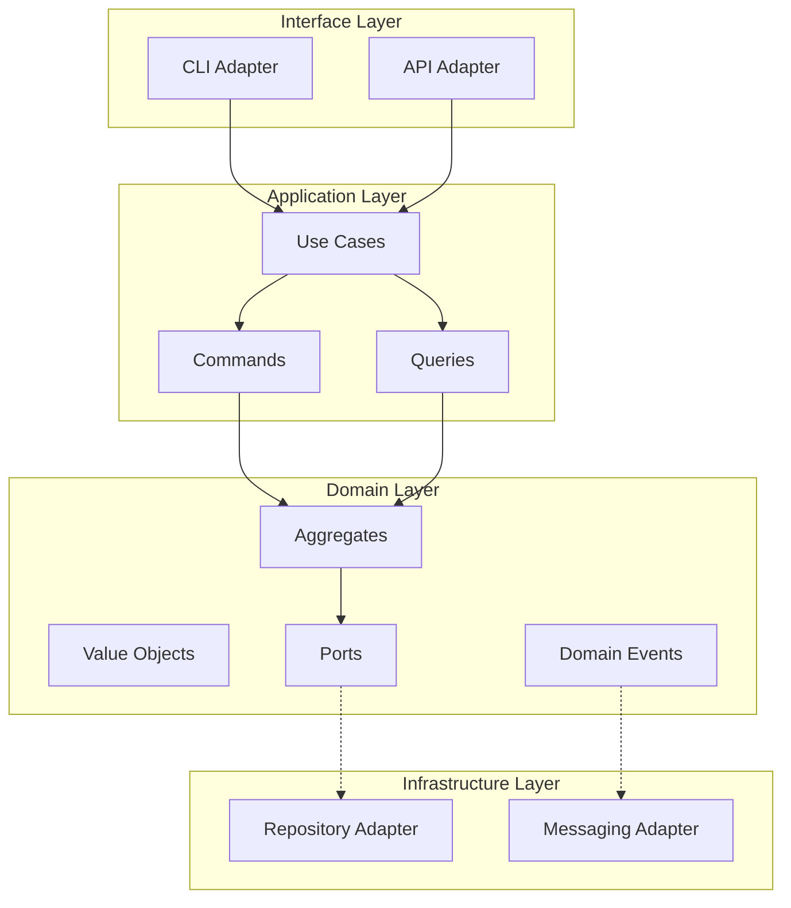

# Architecture Skill

> System design guidance and architectural analysis for Jerry framework.

---

## Purpose

The Architecture skill provides guidance for system design, architecture review,
and structural analysis. It helps maintain hexagonal architecture principles
and ensures consistent design decisions.

---

## Commands

### Analyze Component

Analyze a component's architectural compliance.

```
@architecture analyze <path> [--depth DEPTH]
```

**Arguments:**
- `path`: Path to component (file or directory)
- `--depth`: Analysis depth (`surface`, `deep`) (default: `surface`)

**Example:**
```
@architecture analyze src/domain/
```

**Output:**
```
Architecture Analysis: src/domain/
━━━━━━━━━━━━━━━━━━━━━━━━━━━━━━━━━━

Layer: Domain (Innermost)
Compliance: ✓ PASS

Checks:
  ✓ No external package imports
  ✓ No imports from application/
  ✓ No imports from infrastructure/
  ✓ No imports from interface/
  ✓ Entities use dataclasses
  ✓ Value objects are frozen

Components Found:
  - aggregates/work_item.py (Aggregate Root)
  - aggregates/project.py (Aggregate Root)
  - value_objects/status.py (Value Object)
  - ports/repository.py (Secondary Port)

Recommendations:
  - Consider adding domain events for state changes
```

---

### Generate Diagram

Generate architecture diagrams.

```
@architecture diagram <type> [--output PATH] [--format FORMAT]
```

**Arguments:**
- `type`: `hexagonal`, `component`, `sequence`, `data-flow`
- `--output`: Output file path
- `--format`: `mermaid`, `plantuml`, `ascii` (default: `mermaid`)

**Example:**
```
@architecture diagram hexagonal --format mermaid
```

**Output:**


---

### Review Design

Review a design document or proposed change.

```
@architecture review <path> [--checklist CHECKLIST]
```

**Arguments:**
- `path`: Path to design document or code
- `--checklist`: Checklist to apply (`hexagonal`, `ddd`, `solid`, `all`)

**Example:**
```
@architecture review docs/design/AUTH_DESIGN.md --checklist hexagonal
```

**Output:**
```
Architecture Review: AUTH_DESIGN.md
━━━━━━━━━━━━━━━━━━━━━━━━━━━━━━━━━━━

Checklist: Hexagonal Architecture

Domain Layer:
  ✓ Business logic isolated from infrastructure
  ✓ Entities enforce invariants
  ⚠ Missing domain events for state changes

Ports:
  ✓ IUserRepository defined as protocol
  ✓ ITokenService defined as protocol
  ✗ INotifier port missing for notifications

Adapters:
  ✓ JWTTokenAdapter implements ITokenService
  ✓ SQLiteUserRepository implements IUserRepository
  ⚠ Consider adding InMemory adapters for testing

Dependency Direction:
  ✓ Domain has no outward dependencies
  ✓ Application depends only on domain
  ✓ Infrastructure implements domain ports

Overall: PASS with recommendations

Recommendations:
1. Add UserRegistered domain event
2. Define INotifier port for email notifications
3. Create InMemoryUserRepository for unit tests
```

---

### Document Decision

Create an Architecture Decision Record (ADR).

```
@architecture decision <title> [--status STATUS]
```

**Arguments:**
- `title`: Decision title
- `--status`: `proposed`, `accepted`, `deprecated`, `superseded`

**Example:**
```
@architecture decision "Use SQLite for persistence"
```

**Creates:** `docs/design/ADR_001_sqlite_persistence.md`

**Template:**
```markdown
# ADR-001: Use SQLite for Persistence

**Status**: Proposed
**Date**: 2026-01-07
**Author**: Claude

## Context

{What is the issue that we're seeing that is motivating this decision?}

## Decision

We will use SQLite for persistence because...

## Consequences

### Positive
- {Benefit 1}
- {Benefit 2}

### Negative
- {Drawback 1}
- {Drawback 2}

### Neutral
- {Observation}

## Alternatives Considered

| Option | Pros | Cons | Decision |
|--------|------|------|----------|
| SQLite | ... | ... | Selected |
| PostgreSQL | ... | ... | Rejected |
| File-based | ... | ... | Rejected |

## References

- {Link to relevant documentation}
```

---

## Architectural Principles

### Hexagonal Architecture (Ports & Adapters)

> "Allow an application to equally be driven by users, programs, automated test
> or batch scripts, and to be developed and tested in isolation from its eventual
> run-time devices and databases."
> — Alistair Cockburn

**Key Rules:**
1. Domain layer has NO external dependencies
2. Dependencies point inward (outer → inner)
3. Ports define contracts (interfaces)
4. Adapters implement contracts

### Domain-Driven Design (DDD)

**Tactical Patterns Used:**
- **Aggregates**: Consistency boundaries (WorkItem, Project)
- **Entities**: Objects with identity
- **Value Objects**: Immutable values (Status, Priority)
- **Domain Events**: Facts that happened (WorkItemCompleted)
- **Repositories**: Collection-like interface for aggregates

### CQRS (Command Query Responsibility Segregation)

- **Commands**: Write operations, return None or events
- **Queries**: Read operations, return DTOs

---

## Layer Dependency Rules

```
┌─────────────────────────────────────────┐
│           Interface Layer               │
│  (CLI, API - may import all layers)     │
├─────────────────────────────────────────┤
│         Infrastructure Layer            │
│  (may import domain, application)       │
├─────────────────────────────────────────┤
│          Application Layer              │
│  (may import domain only)               │
├─────────────────────────────────────────┤
│            Domain Layer                 │
│  (NO external imports - stdlib only)    │
└─────────────────────────────────────────┘
```

---

## References

- Cockburn, A. (2005). "[Hexagonal Architecture](https://alistair.cockburn.us/hexagonal-architecture/)"
- Evans, E. (2003). "Domain-Driven Design: Tackling Complexity in the Heart of Software"
- Vernon, V. (2013). "Implementing Domain-Driven Design"
- Martin, R. (2017). "Clean Architecture"
