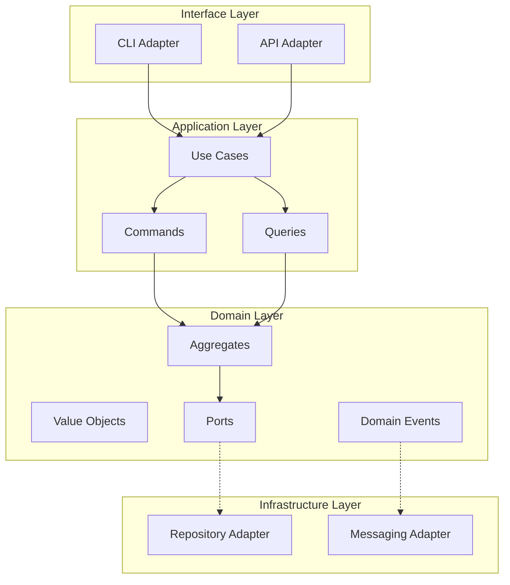

# Architecture Skill

> **Version:** 1.0.0
> **Framework:** Jerry Architecture (ARCH)
> **Constitutional Compliance:** Jerry Constitution v1.0

---

## Document Sections

| Section | Purpose |
|---------|---------|
| [Purpose](#purpose) | What this skill does |
| [When to Use This Skill](#when-to-use-this-skill) | Activation triggers |
| [Available Agents](#available-agents) | Agent registry for this skill |
| [Commands](#commands) | CLI commands and examples |
| [Architectural Principles](#architectural-principles) | Core design principles |
| [Layer Dependency Rules](#layer-dependency-rules) | Import boundary enforcement |
| [Templates](#templates) | Available templates |
| [Constitutional Compliance](#constitutional-compliance) | Principle mapping |
| [Integration with Other Skills](#integration-with-other-skills) | Cross-skill workflows |
| [Quick Reference](#quick-reference) | Common tasks and decision workflows |
| [Routing Disambiguation](#routing-disambiguation) | When this skill is the wrong choice |
| [References](#references) | Canonical sources |

---

## Document Audience (Triple-Lens)

This SKILL.md serves multiple audiences:

| Level | Audience | Sections to Focus On |
|-------|----------|---------------------|
| **L0 (ELI5)** | New users, stakeholders | [Purpose](#purpose), [When to Use](#when-to-use-this-skill), [Architectural Principles](#architectural-principles) |
| **L1 (Engineer)** | Developers implementing features | [Commands](#commands), [Layer Dependency Rules](#layer-dependency-rules), [References](#references) |
| **L2 (Architect)** | System designers | [Architectural Principles](#architectural-principles), [Constitutional Compliance](#constitutional-compliance) |

---

## Purpose

The Architecture skill provides guidance for system design, architecture review,
and structural analysis. It helps maintain hexagonal architecture principles
and ensures consistent design decisions.

### Key Capabilities

- **Architectural Analysis** - Verify hexagonal architecture compliance
- **Diagram Generation** - Create architecture visualizations (Mermaid, PlantUML, ASCII)
- **Design Review** - Assess designs against DDD, SOLID, and hexagonal patterns
- **Decision Documentation** - Create and manage Architecture Decision Records (ADRs)
- **Layer Compliance** - Enforce dependency direction rules
- **Pattern Guidance** - Apply tactical DDD patterns (aggregates, entities, value objects)

---

## When to Use This Skill

Activate when:

- Designing a new system or major component
- Creating an Architecture Decision Record (ADR)
- Reviewing existing architecture for compliance
- Analyzing layer dependencies and port/adapter structure
- Generating architecture diagrams
- Validating that domain layer has no external dependencies
- Applying Domain-Driven Design (DDD) tactical patterns
- Documenting trade-offs between architectural approaches

---

## Available Agents

This skill provides command-based analysis rather than agent-based workflows. Commands are invoked via natural language or explicit requests.

| Command | Purpose | Output Location |
|---------|---------|-----------------|
| `analyze` | Verify architectural compliance of a component | Console + optional file |
| `diagram` | Generate architecture visualizations | Console or specified file path |
| `review` | Review design documents against checklists | Console + optional file |
| `decision` | Create an Architecture Decision Record | `docs/design/ADR_NNN_*.md` |

---

## Commands

### Analyze Component

Analyze a component's architectural compliance.

```
@architecture analyze <path> [--depth DEPTH]
```

**Arguments:**
- `path`: Path to component (file or directory)
- `--depth`: Analysis depth (`surface`, `deep`) (default: `surface`)

**Example:**
```
@architecture analyze src/domain/
```

**Output:**
```
Architecture Analysis: src/domain/
━━━━━━━━━━━━━━━━━━━━━━━━━━━━━━━━━━

Layer: Domain (Innermost)
Compliance: ✓ PASS

Checks:
  ✓ No external package imports
  ✓ No imports from application/
  ✓ No imports from infrastructure/
  ✓ No imports from interface/
  ✓ Entities use dataclasses
  ✓ Value objects are frozen

Components Found:
  - aggregates/work_item.py (Aggregate Root)
  - aggregates/project.py (Aggregate Root)
  - value_objects/status.py (Value Object)
  - ports/repository.py (Secondary Port)

Recommendations:
  - Consider adding domain events for state changes
```

---

### Generate Diagram

Generate architecture diagrams.

```
@architecture diagram <type> [--output PATH] [--format FORMAT]
```

**Arguments:**
- `type`: `hexagonal`, `component`, `sequence`, `data-flow`
- `--output`: Output file path
- `--format`: `mermaid`, `plantuml`, `ascii` (default: `mermaid`)

**Example:**
```
@architecture diagram hexagonal --format mermaid
```

**Output:**


---

### Review Design

Review a design document or proposed change.

```
@architecture review <path> [--checklist CHECKLIST]
```

**Arguments:**
- `path`: Path to design document or code
- `--checklist`: Checklist to apply (`hexagonal`, `ddd`, `solid`, `all`)

**Example:**
```
@architecture review docs/design/AUTH_DESIGN.md --checklist hexagonal
```

**Output:**
```
Architecture Review: AUTH_DESIGN.md
━━━━━━━━━━━━━━━━━━━━━━━━━━━━━━━━━━━

Checklist: Hexagonal Architecture

Domain Layer:
  ✓ Business logic isolated from infrastructure
  ✓ Entities enforce invariants
  ⚠ Missing domain events for state changes

Ports:
  ✓ IUserRepository defined as protocol
  ✓ ITokenService defined as protocol
  ✗ INotifier port missing for notifications

Adapters:
  ✓ JWTTokenAdapter implements ITokenService
  ✓ SQLiteUserRepository implements IUserRepository
  ⚠ Consider adding InMemory adapters for testing

Dependency Direction:
  ✓ Domain has no outward dependencies
  ✓ Application depends only on domain
  ✓ Infrastructure implements domain ports

Overall: PASS with recommendations

Recommendations:
1. Add UserRegistered domain event
2. Define INotifier port for email notifications
3. Create InMemoryUserRepository for unit tests
```

---

### Document Decision

Create an Architecture Decision Record (ADR).

```
@architecture decision <title> [--status STATUS]
```

**Arguments:**
- `title`: Decision title
- `--status`: `proposed`, `accepted`, `deprecated`, `superseded`

**Example:**
```
@architecture decision "Use SQLite for persistence"
```

**Creates:** `docs/design/ADR_001_sqlite_persistence.md`

**Template:**
```markdown
# ADR-001: Use SQLite for Persistence

**Status**: Proposed
**Date**: 2026-01-07
**Author**: Claude

## Context

{What is the issue that we're seeing that is motivating this decision?}

## Decision

We will use SQLite for persistence because...

## Consequences

### Positive
- {Benefit 1}
- {Benefit 2}

### Negative
- {Drawback 1}
- {Drawback 2}

### Neutral
- {Observation}

## Alternatives Considered

| Option | Pros | Cons | Decision |
|--------|------|------|----------|
| SQLite | ... | ... | Selected |
| PostgreSQL | ... | ... | Rejected |
| File-based | ... | ... | Rejected |

## References

- {Link to relevant documentation}
```

---

## Architectural Principles

### Hexagonal Architecture (Ports & Adapters)

> "Allow an application to equally be driven by users, programs, automated test
> or batch scripts, and to be developed and tested in isolation from its eventual
> run-time devices and databases."
> — Alistair Cockburn

**Key Rules:**
1. Domain layer has NO external dependencies
2. Dependencies point inward (outer → inner)
3. Ports define contracts (interfaces)
4. Adapters implement contracts

### Domain-Driven Design (DDD)

**Tactical Patterns Used:**
- **Aggregates**: Consistency boundaries (WorkItem, Project)
- **Entities**: Objects with identity
- **Value Objects**: Immutable values (Status, Priority)
- **Domain Events**: Facts that happened (WorkItemCompleted)
- **Repositories**: Collection-like interface for aggregates

### CQRS (Command Query Responsibility Segregation)

- **Commands**: Write operations, return None or events
- **Queries**: Read operations, return DTOs

---

## Layer Dependency Rules

```
┌─────────────────────────────────────────┐
│           Interface Layer               │
│  (CLI, API - may import all layers)     │
├─────────────────────────────────────────┤
│         Infrastructure Layer            │
│  (may import domain, application)       │
├─────────────────────────────────────────┤
│          Application Layer              │
│  (may import domain only)               │
├─────────────────────────────────────────┤
│            Domain Layer                 │
│  (NO external imports - stdlib only)    │
└─────────────────────────────────────────┘
```

---

## Templates

Architecture artifacts should use standardized templates to ensure consistency.

**Location:** `.context/templates/`

| Template | Use For | Path |
|----------|---------|------|
| `adr.md` | Architecture Decision Records | `docs/knowledge/exemplars/templates/adr.md` |

**Usage:** When creating a new ADR, reference the template to ensure consistent structure and sections.

---

## Constitutional Compliance

All architecture work adheres to the **Jerry Constitution v1.0**:

| Principle | Requirement | Implementation |
|-----------|-------------|----------------|
| P-002: File Persistence | All outputs persisted to files | ADRs written to `docs/design/`, diagrams to specified paths |
| P-004: Explicit Provenance | Reasoning and sources documented | ADRs include context, alternatives considered, consequences |
| P-011: Evidence-Based | Recommendations tied to evidence | Architecture reviews cite specific violations or compliance |
| H-07: Domain Layer Isolation | Domain MUST NOT import external layers | `analyze` command verifies import boundaries |
| H-07: Application Layer Isolation | Application MUST NOT import infrastructure/interface | `analyze` command verifies layer dependencies |
| H-07: Composition Root Exclusivity | Only bootstrap.py instantiates infrastructure | Architecture test enforces this rule |
| H-10: One Class Per File | Each file contains exactly ONE public class | AST check enforces this rule |

---

## Integration with Other Skills

The architecture skill integrates with other Jerry skills:

| Skill | Integration Point | Example |
|-------|------------------|---------|
| `/problem-solving` | `ps-architect` creates ADRs | Architecture decisions documented via ps-architect agent |
| `/nasa-se` | `nse-architecture` formal trade studies | NASA SE process informs architecture decisions |
| `/orchestration` | Multi-phase design workflows | Orchestrated architecture review processes |

**Cross-Skill Handoff:**
- `ps-architect` output → `architecture review` command for validation
- `nse-architecture` trade study → `architecture decision` for ADR creation

---

## Quick Reference

### Common Tasks

| Task | Command / Approach | Output |
|------|--------------------|--------|
| Verify layer compliance | `@architecture analyze src/domain/` | Console report with pass/fail |
| Generate hexagonal diagram | `@architecture diagram hexagonal --format mermaid` | Mermaid diagram |
| Review design document | `@architecture review docs/design/AUTH_DESIGN.md --checklist hexagonal` | Checklist report |
| Create an ADR | `@architecture decision "Use SQLite for persistence"` | `docs/design/ADR_NNN_*.md` |
| Check import boundaries | `@architecture analyze src/ --depth deep` | Full dependency analysis |

### Decision Workflow Summary

| Step | Action | Artifact |
|------|--------|----------|
| 1. Identify need | Recognize architectural choice required | Problem statement |
| 2. Research options | Use `/problem-solving` for analysis | Research findings |
| 3. Evaluate trade-offs | Use `/nasa-se` for formal trade study | Trade study matrix |
| 4. Document decision | `@architecture decision "<title>"` | ADR in `docs/design/` |
| 5. Validate compliance | `@architecture analyze <path>` | Compliance report |

---

## Routing Disambiguation

> When this skill is the wrong choice and what happens if misrouted.

| Condition | Use Instead | Consequence of Misrouting |
|-----------|-------------|--------------------------|
| Root cause analysis or debugging needed | `/problem-solving` (ps-investigator) | Architecture methodology (layer dependency rules, CQRS patterns, hexagonal structure) applied to investigation tasks produces structural design artifacts instead of causal chains; root cause not isolated |
| Requirements engineering or V&V needed | `/nasa-se` | Requirements expressed as architectural decisions; V&V traceability lost; compliance gaps not detected |
| Offensive security testing or penetration testing | `/red-team` | Architecture compliance checks applied to offensive engagement produce structural diagrams instead of attack narratives; engagement methodology entirely absent |
| Adversarial quality review or tournament scoring | `/adversary` | Architecture review checklists applied instead of adversarial strategy templates; S-014 scoring rubric not loaded |
| Security hardening or threat modeling | `/eng-team` | Architecture skill lacks STRIDE/DREAD methodology; security-specific governance layers (OWASP, NIST SSDF) not available |
| Multi-agent workflow coordination | `/orchestration` | Architecture commands are single-step operations; no state tracking, checkpointing, or sync barrier capability |

---

## References

- Cockburn, A. (2005). "[Hexagonal Architecture](https://alistair.cockburn.us/hexagonal-architecture/)"
- Evans, E. (2003). "Domain-Driven Design: Tackling Complexity in the Heart of Software"
- Vernon, V. (2013). "Implementing Domain-Driven Design"
- Martin, R. (2017). "Clean Architecture"
- Jerry Architecture Standards: `.context/rules/architecture-standards.md`
- Jerry Constitution: `docs/governance/JERRY_CONSTITUTION.md`

---

*Skill Version: 1.0.0*
*Constitutional Compliance: Jerry Constitution v1.0*
*Last Updated: 2026-02-16*
