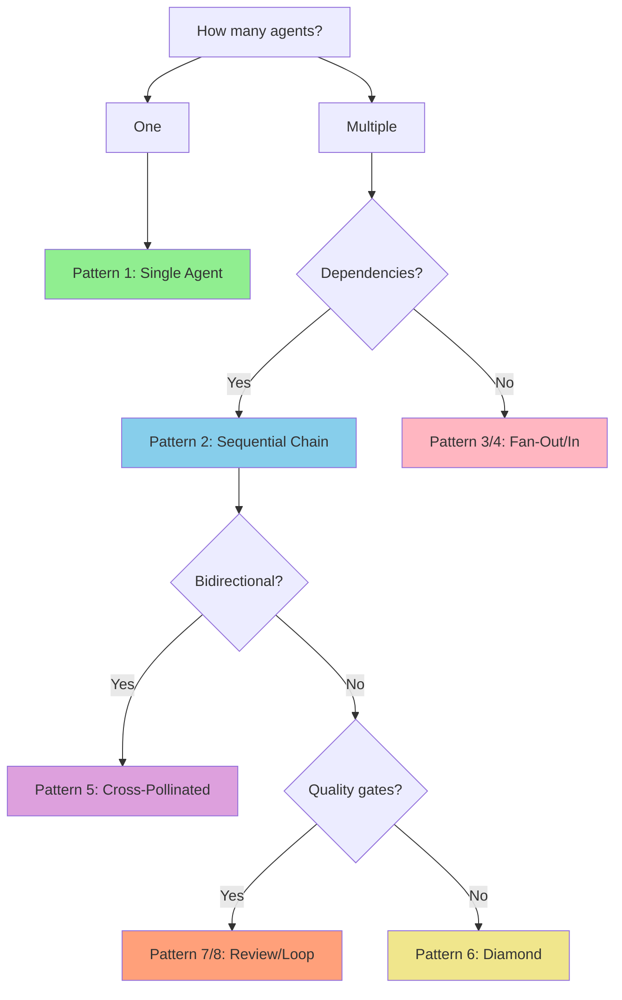

# Orchestration Playbook

> **Version:** 3.2.0
> **Skill:** orchestration
> **Purpose:** Multi-agent workflow coordination with sync barriers and state checkpointing
> **Updated:** 2026-01-12 - Added YAML frontmatter (WI-SAO-064), Triple-lens refactoring (SAO-INIT-007)

---

## Document Overview

```
+============================================================================+
|                       TRIPLE-LENS COGNITIVE FRAMEWORK                       |
+=============================================================================+
|                                                                             |
|    L0 (ELI5)          L1 (Engineer)         L2 (Architect)                 |
|    ----------         -------------         --------------                 |
|    WHAT & WHY    ->   HOW (commands)   ->   CONSTRAINTS                    |
|    Metaphors          Invocations           Anti-patterns                  |
|    Intent             File paths            Boundaries                     |
|    Analogies          Input/Output          Invariants                     |
|                                                                             |
|    "Explains to       "Executable           "Prevents                      |
|     newcomers"         instructions"          mistakes"                    |
|                                                                             |
+=============================================================================+
```

**Target Audience:**
- **L0**: Anyone (stakeholders, newcomers, non-technical)
- **L1**: Engineers executing the skill
- **L2**: Architects designing workflows, debugging issues

---

# L0: The Big Picture (ELI5)

> *This section explains WHAT orchestration does and WHY it matters using metaphors and analogies.*

## What Is Orchestration?

### The Conductor Metaphor

```
+===================================================================+
|                     THE ORCHESTRA CONDUCTOR                        |
+===================================================================+
|                                                                   |
|   Think of orchestration like conducting an orchestra:            |
|                                                                   |
|                           +-------+                               |
|                           |CONDUCT|                               |
|                           |  OR   |                               |
|                           +---+---+                               |
|                               |                                   |
|         +-----------+---------+---------+-----------+             |
|         |           |         |         |           |             |
|         v           v         v         v           v             |
|    +--------+  +--------+  +------+  +------+  +-------+          |
|    |STRINGS |  | BRASS  |  |WINDS |  |PERCUS|  | CHOIR |          |
|    +--------+  +--------+  +------+  +------+  +-------+          |
|                                                                   |
|   - You don't play instruments yourself                          |
|   - You coordinate WHEN each section plays                       |
|   - You ensure they HARMONIZE together                           |
|   - You handle tempo changes and dynamics                        |
|                                                                   |
|   Same with agents:                                               |
|   - Orchestrator doesn't do research/analysis itself             |
|   - It coordinates WHEN each agent executes                      |
|   - It ensures their outputs CONNECT together                    |
|   - It handles checkpoints and error recovery                    |
|                                                                   |
+===================================================================+
```

**Plain English:**
Orchestration is the skill that coordinates multiple specialized agents working together on complex problems. Instead of one agent doing everything, you have specialists working in parallel with their findings combined at key checkpoints.

### Why Does This Matter?

| Without Orchestration | With Orchestration |
|-----------------------|--------------------|
| One agent does everything, often poorly | Specialists handle their domains well |
| Context window fills up quickly | Work is distributed, context preserved |
| No checkpoints, progress lost on failure | State saved at barriers, can resume |
| No cross-pollination of insights | Findings flow between pipelines |
| Sequential bottleneck | Parallel execution where possible |

### When Do I Use This?

```
DECISION GUIDE:
---------------

START: How many agents needed?
       |
  +----+----+
  |         |
  v         v
ONE       MULTIPLE
  |         |
  v         v
Single    Are outputs connected?
Agent     |
     +----+----+
     |         |
     v         v
    YES        NO
     |         |
     v         v
  Orchestrate  Fan-Out
  (sync barriers)  (parallel)
```

**Activation Keywords:** "orchestration", "multi-agent", "workflow", "cross-pollinated", "sync barrier", "pipeline"

**Use Orchestration When:**
- Task requires 3+ agents working together
- Outputs from one track inform another track
- You need checkpoints to survive context loss
- Complex problem benefits from multiple perspectives

---

## The Cast of Characters

> *Meet the specialists you can coordinate*

```
+=========================================================================+
|                         AGENT FAMILIES                                   |
+=========================================================================+
|                                                                         |
|    PROBLEM-SOLVING (ps-*)         NASA SYSTEMS ENGINEERING (nse-*)     |
|    ----------------------         --------------------------------      |
|    +---------------+              +----------------+                    |
|    | ps-researcher | Explore      | nse-requirements| Requirements     |
|    +---------------+              +----------------+                    |
|    +---------------+              +----------------+                    |
|    | ps-analyst    | Root cause   | nse-verification| V&V              |
|    +---------------+              +----------------+                    |
|    +---------------+              +----------------+                    |
|    | ps-architect  | Decisions    | nse-risk        | Risk mgmt        |
|    +---------------+              +----------------+                    |
|    +---------------+              +----------------+                    |
|    | ps-validator  | Validation   | nse-architecture| Trade studies    |
|    +---------------+              +----------------+                    |
|    +---------------+              +----------------+                    |
|    | ps-synthesizer| Patterns     | nse-reviewer    | Tech reviews     |
|    +---------------+              +----------------+                    |
|    +---------------+              +----------------+                    |
|    | ps-reviewer   | Quality      | nse-integration | ICDs             |
|    +---------------+              +----------------+                    |
|    +---------------+              +----------------+                    |
|    | ps-investigator| Debug       | nse-configuration| Baselines       |
|    +---------------+              +----------------+                    |
|    +---------------+              +----------------+                    |
|    | ps-reporter   | Status       | nse-reporter    | Status           |
|    +---------------+              +----------------+                    |
|                                                                         |
+=========================================================================+
```

| Agent Family | Like a... | Does What |
|--------------|-----------|-----------|
| `ps-*` | Research team | Explores options, analyzes problems, makes decisions |
| `nse-*` | Engineering team | Requirements, verification, risk, reviews |
| Orchestrator | Conductor | Coordinates all agents, manages state |

---

# L1: How To Use It (Engineer)

> *This section provides executable instructions: commands, invocations, file paths.*

## Quick Start

### The 30-Second Version

1. **Initialize artifacts** - "Initialize orchestration for PROJ-XXX"
2. **Execute agents** - "Execute agent-a-001 for Phase 1"
3. **Update state** - "Update orchestration: agent complete"
4. **Cross barriers** - "Cross barrier with findings exchange"
5. **Synthesize** - "Create final synthesis"

### Minimal Example

```
User: "Initialize orchestration for PROJ-002 with a cross-pollinated
      pipeline using problem-solving and nasa-systems-engineering skills"

Claude: [Creates ORCHESTRATION_PLAN.md with workflow diagram]
        [Creates ORCHESTRATION_WORKTRACKER.md for tactical tracking]
        [Creates ORCHESTRATION.yaml as machine-readable SSOT]
        [Returns workflow ID: sao-crosspoll-20260112-001]
```

---

## Orchestration Patterns

> See [ORCHESTRATION_PATTERNS.md](../shared/ORCHESTRATION_PATTERNS.md) for complete pattern catalog with L0/L1/L2 for each pattern.

### Pattern Selection Decision Tree

```
PATTERN SELECTION:
------------------

START: How many agents?
       |
  +----+----+
  |         |
  v         v
ONE       MULTIPLE
  |         |
  v         v
Pattern 1   Dependencies?
(Single)    |
       +----+----+
       |         |
       v         v
      YES        NO
       |         |
       v         v
   Pattern 2   Pattern 3/4
   (Sequential) (Fan-Out/In)
       |
       v
   Bidirectional?
       |
  +----+----+
  |         |
  v         v
 YES        NO
  |         |
  v         v
Pattern 5   Quality gates?
(Cross-Poll) |
        +----+----+
        |         |
        v         v
       YES        NO
        |         |
        v         v
   Pattern 7/8   Pattern 6
   (Review/Loop) (Diamond)
```

### Pattern Selection (Mermaid)

For rendering in GitHub/IDE:



### Pattern Summary

| # | Pattern | When to Use | Cognitive Mode |
|---|---------|-------------|----------------|
| 1 | **Single Agent** | Direct task, no coordination | Depends on agent |
| 2 | **Sequential Chain** | Order-dependent state passing | Convergent |
| 3 | **Fan-Out** | Parallel independent research | Divergent |
| 4 | **Fan-In** | Aggregate multiple outputs | Convergent |
| 5 | **Cross-Pollinated** | Bidirectional pipeline exchange | Mixed |
| 6 | **Divergent-Convergent** | Explore then converge (diamond) | Divergent -> Convergent |
| 7 | **Review Gate** | Quality checkpoint (SRR/PDR/CDR) | Convergent |
| 8 | **Generator-Critic** | Iterative refinement loop | Convergent |

---

## Invocation Methods

### Method 1: Natural Language (Recommended)

Describe your workflow. Orchestrator selects the right pattern.

```
"Create a cross-pollinated pipeline with ps and nse skills"
-> Pattern 5 (Cross-Pollinated)

"Research three topics in parallel"
-> Pattern 3 (Fan-Out)

"Get ps-architect to review nse-requirements output"
-> Pattern 7 (Review Gate)

"Iterate until quality threshold 0.85 is met"
-> Pattern 8 (Generator-Critic)
```

### Method 2: Explicit Pattern Request

Name the pattern directly:

```
"Use sequential chain pattern: researcher -> analyst -> architect"
"Apply fan-out with 3 parallel researchers"
"Set up generator-critic loop with max 3 iterations"
```

### Method 3: Full Workflow Specification

Provide complete workflow structure:

```
"Initialize cross-pollinated pipeline:
 - Pipeline A: ps-researcher -> ps-analyst -> ps-architect
 - Pipeline B: nse-requirements -> nse-verification -> nse-risk
 - Barriers after phases 1 and 2
 - Final synthesis combining both tracks"
```

---

## Workflow: Cross-Pollinated Pipeline

### Phase 1: Plan the Workflow

**Goal:** Create comprehensive orchestration plan with workflow diagram.

**Steps:**

1. Define pipelines and their purposes
2. Identify phases within each pipeline
3. Assign agents to phases
4. Define sync barriers and cross-pollination artifacts
5. Create ASCII workflow diagram

**Artifacts Created:**
- `ORCHESTRATION_PLAN.md` - Strategic context
- `ORCHESTRATION.yaml` - Machine-readable state (SSOT)
- `ORCHESTRATION_WORKTRACKER.md` - Tactical tracking

**Example ORCHESTRATION.yaml:**

```yaml
workflow:
  id: "sao-crosspoll-20260112-001"
  name: "Jerry Design Canon Extraction"
  pattern: "cross-pollinated-pipeline"

pipelines:
  pipeline_a:
    name: "Problem-Solving Track"
    short_alias: "ps"
    agents: ["ps-researcher", "ps-analyst", "ps-architect"]
  pipeline_b:
    name: "Systems Engineering Track"
    short_alias: "nse"
    agents: ["nse-requirements", "nse-verification", "nse-risk"]

barriers:
  - id: "barrier-1"
    after_phases: ["ps-phase-1", "nse-phase-1"]
    cross_pollinate: true
  - id: "barrier-2"
    after_phases: ["ps-phase-2", "nse-phase-2"]
    cross_pollinate: true
```

### Phase 2: Execute Pipeline Phases

**Goal:** Run agents according to execution queue.

**For each execution group:**

1. Check group status in ORCHESTRATION.yaml
2. If READY, execute agents (parallel or sequential)
3. After each agent completes:
   - Update agent status in ORCHESTRATION.yaml
   - Register artifact path
   - Update metrics
4. When all agents in group complete, create checkpoint

**State Updates:**

```yaml
# Before agent execution
agents:
  - id: "agent-a-001"
    status: "PENDING"
    artifact: null

# After agent execution (resolved path with agent-level isolation)
agents:
  - id: "agent-a-001"
    status: "COMPLETE"
    artifact: "orchestration/sao-crosspoll-20260112-001/ps/phase-1/agent-a-001/research.md"
```

### Phase 3: Cross Barriers

**Goal:** Exchange findings between pipelines at sync barriers.

**For each barrier:**

1. Verify all prerequisite phases are COMPLETE
2. Extract key findings from pipeline A
3. Create cross-pollination artifact (a->b)
4. Extract key findings from pipeline B
5. Create cross-pollination artifact (b->a)
6. Mark barrier as COMPLETE
7. Create checkpoint

**Barrier Artifact Format:**

```markdown
# Barrier N: {Direction} Cross-Pollination

> **Source Pipeline:** {pipeline}
> **Target Pipeline:** {pipeline}
> **Phase Transition:** {from_phase} -> {to_phase}

## Key Findings
{extracted findings}

## For Target Pipeline
{how to use these findings}
```

### Phase 4: Final Synthesis

**Goal:** Create consolidated synthesis of all workflow findings.

**Steps:**

1. Verify all phases COMPLETE
2. Verify all barriers COMPLETE
3. Read all phase artifacts
4. Read all barrier artifacts
5. Extract cross-cutting patterns
6. Create synthesis with L0/L1/L2
7. Mark workflow as COMPLETE

---

## Agent Reference

| Agent | When to Use | Output Key | Output Location |
|-------|-------------|------------|-----------------|
| `ps-researcher` | Exploration, options | `research_output` | `docs/research/` |
| `ps-analyst` | Root cause, trade-offs | `analysis_output` | `docs/analysis/` |
| `ps-architect` | Design decisions | `architecture_output` | `docs/decisions/` |
| `ps-validator` | Requirements check | `validation_output` | `docs/analysis/` |
| `ps-synthesizer` | Pattern extraction | `synthesis_output` | `docs/synthesis/` |
| `ps-reviewer` | Quality assessment | `review_output` | `docs/reviews/` |
| `ps-investigator` | Debugging | `investigation_output` | `docs/investigations/` |
| `ps-reporter` | Status updates | `report_output` | `docs/reports/` |
| `nse-requirements` | Shall statements | `requirements_output` | `requirements/` |
| `nse-verification` | V&V, VCRM | `verification_output` | `verification/` |
| `nse-risk` | Risk register | `risk_output` | `risks/` |
| `nse-architecture` | Trade studies | `arch_output` | `architecture/` |
| `nse-reviewer` | SRR/PDR/CDR | `review_output` | `reviews/` |

---

## Output Locations

All orchestration artifacts are persisted:

```
projects/{PROJECT}/
|-- orchestration/
|   |-- {workflow-id}/
|   |   |-- ORCHESTRATION_PLAN.md
|   |   |-- ORCHESTRATION_WORKTRACKER.md
|   |   |-- ORCHESTRATION.yaml (SSOT)
|   |   |-- ps/                        # Pipeline A artifacts
|   |   |   |-- phase-1/
|   |   |   |   |-- agent-a-001/
|   |   |   |   |   |-- research.md
|   |   |-- nse/                       # Pipeline B artifacts
|   |   |   |-- phase-1/
|   |   |   |   |-- agent-b-001/
|   |   |   |   |   |-- requirements.md
|   |   |-- barriers/
|   |   |   |-- barrier-1-ps-to-nse.md
|   |   |   |-- barrier-1-nse-to-ps.md
|   |   |-- checkpoints/
|   |   |   |-- CP-001.json
|   |   |   |-- CP-002.json
|   |   |-- synthesis/
|   |   |   |-- final-synthesis.md
```

---

## Common Scenarios

### Scenario: Agent Fails

```yaml
# In ORCHESTRATION.yaml
agents:
  - id: "agent-a-001"
    status: "FAILED"
    artifact: null

blockers:
  active:
    - id: "BLK-001"
      description: "agent-a-001 failed: Task tool connection error"
      blocking: ["barrier-1"]
      severity: "HIGH"
```

**Resolution Options:**

1. **Retry:** Re-execute the agent
2. **Manual:** Create artifact manually
3. **Skip:** Mark as COMPLETE with justification

### Scenario: Resume from Checkpoint

```
"Resume orchestration from checkpoint CP-003"
```

**Steps:**
1. Read checkpoint recovery_point
2. Reset agents after checkpoint to PENDING
3. Continue execution from recovery point

### Scenario: Add Agent Mid-Workflow

1. Update ORCHESTRATION.yaml phases.agents
2. Add to appropriate execution_queue group
3. Update metrics.agents_total
4. Continue execution

---

## Tips and Best Practices

### 1. Update State Immediately

After every agent completion, update ORCHESTRATION.yaml immediately.
Don't batch updates.

### 2. Create Checkpoints Frequently

At minimum, create checkpoints:
- After each phase completes
- After each barrier is crossed
- Before any risky operation

### 3. Keep Artifacts Small

Cross-pollination artifacts should be summaries, not full copies.
Reference original artifacts rather than duplicating content.

### 4. Use Parallel Execution Wisely

Only parallelize truly independent work.
If agents share inputs, run sequentially to avoid race conditions.

### 5. Monitor Metrics

Check progress regularly:
- agents_executed vs agents_total
- phases_complete vs phases_total
- agent_success_rate

---

## Troubleshooting

### Problem: ORCHESTRATION.yaml Out of Sync

**Symptoms:** Markdown documents don't match YAML state

**Fix:**
1. YAML is SSOT - trust it over markdown
2. Regenerate markdown from YAML
3. Or manually reconcile and update both

### Problem: Barrier Stuck

**Symptoms:** Barrier status stays PENDING despite phases complete

**Check:**
1. All prerequisite phases are truly COMPLETE
2. No FAILED agents in prerequisite phases
3. No active blockers preventing barrier

### Problem: Context Window Issues

**Symptoms:** Claude loses track of workflow state

**Fix:**
1. Read ORCHESTRATION.yaml (it's the SSOT)
2. Check latest checkpoint for recovery
3. Use resumption.files_to_read list

---

## Adversarial Quality Integration

> Quality enforcement is embedded by default into every orchestrated workflow.
> All constants reference `.context/rules/quality-enforcement.md` (SSOT).

### Phase Gate Protocol

Every phase transition and every sync barrier includes a standardized quality gate. The orchestrator (main context) enforces this protocol -- agents do not self-assess for gate purposes.

```
PHASE GATE PROTOCOL:
--------------------

Step 1: CREATOR produces deliverable
        │
        ▼
Step 2: Self-review (S-010, H-15)
        Creator applies Self-Refine before submission
        │
        ▼
Step 3: CRITIC scores deliverable
        Using S-014 (LLM-as-Judge) with 6-dimension rubric
        + S-002 (Devil's Advocate) to challenge assumptions
        + S-007 (Constitutional AI Critique) for rule compliance
        │
        ├── Score >= 0.92 ──► PASS ──► Proceed to next phase/barrier
        │
        └── Score < 0.92 ──► REVISE
                              │
                              ▼
Step 4: REVISION
        Creator receives critic feedback
        + S-003 (Steelman) strengthens weakest arguments
        Return to Step 3
        │
        ▼
Step 5: CIRCUIT BREAKER (after 3 iterations)
        If still < 0.92 after 3 cycles ──► ESCALATE
        Human review required (AE-006)
```

**Scoring Dimensions** (from quality-enforcement SSOT):

| Dimension | Weight | What It Measures |
|-----------|--------|------------------|
| Completeness | 0.20 | All required elements present |
| Internal Consistency | 0.20 | No contradictions within deliverable |
| Methodological Rigor | 0.20 | Sound reasoning, proper frameworks used |
| Evidence Quality | 0.15 | Claims supported by citations |
| Actionability | 0.15 | Results usable by next phase |
| Traceability | 0.10 | Links to source requirements/decisions |

### Entry/Exit Criteria for Barrier Quality Gates

Every sync barrier has explicit entry and exit criteria that MUST be satisfied.

**Entry Criteria** (all must be true before gate starts):

| # | Criterion | Verification |
|---|-----------|-------------|
| 1 | All agents in prerequisite phases have status COMPLETE | Check ORCHESTRATION.yaml |
| 2 | All phase artifacts exist at registered paths | Glob for artifact files |
| 3 | No active blockers on the barrier | Check blockers.active list |
| 4 | Creator self-review completed (S-010, H-15) | Self-review evidence in artifact |

**Exit Criteria** (all must be true before next phase starts):

| # | Criterion | Verification |
|---|-----------|-------------|
| 1 | Quality score >= 0.92 weighted composite (H-13) | Recorded in quality.barrier_scores |
| 2 | Minimum 3 creator-critic-revision iterations completed | Iteration count >= 3 |
| 3 | Cross-pollination artifacts created for both directions | a_to_b and b_to_a artifacts exist |
| 4 | Constitutional compliance verified (S-007, H-18) | No constitutional violations found |
| 5 | Barrier marked COMPLETE in ORCHESTRATION.yaml | barrier.status == COMPLETE |

### Quality Gates in Non-Barrier Patterns

The adversarial quality gate protocol applies to all orchestration patterns, not only cross-pollinated pipelines with sync barriers. For patterns without explicit barriers, quality gates are enforced at phase boundaries.

**Sequential Pipeline:** The quality gate is applied between each phase. Phase N output is reviewed before Phase N+1 begins. The same threshold (>= 0.92) and minimum iterations (3) apply.

**Fan-Out / Fan-In:** At fan-out, the source deliverable passes through a quality gate before dispatch. At fan-in convergence, each incoming deliverable passes through a quality gate before synthesis begins.

**Divergent-Convergent (Diamond):** All divergent outputs are reviewed at the diamond merge point before convergence proceeds.

**Review Gate (Pattern 7):** The review gate IS the quality gate -- SRR/PDR/CDR reviews serve as the adversarial critic.

**Generator-Critic (Pattern 8):** Each iteration of the loop IS a creator-critic-revision cycle. The loop exits when score >= 0.92 or circuit breaker triggers.

### Cross-Pollination Enhancement with Adversarial Strategy Selection

When crossing a sync barrier, the adversarial strategy set is selected based on the workflow's criticality level. The orch-planner determines criticality at plan time; orch-tracker enforces it at execution time.

**Strategy Selection by Criticality** (from quality-enforcement SSOT):

| Criticality | At Barrier: Apply These | Rationale |
|-------------|------------------------|-----------|
| C1 (Routine) | S-010 (Self-Refine) only | Low-risk, fast cycle |
| C2 (Standard) | S-014 (LLM-as-Judge) + S-002 (Devil's Advocate) + S-007 (Constitutional) | Standard quality gate -- target operating layer |
| C3 (Significant) | C2 + S-004 (Pre-Mortem) + S-013 (Inversion) | Deep review of cross-pollination artifacts |
| C4 (Critical) | All 10 selected strategies | Tournament-level review |

**Cross-Pollination Adversarial Flow:**

```
Pipeline A Phase N ──────────────────────► Pipeline B Phase N
       │                                        │
       ▼                                        ▼
  A completes                              B completes
       │                                        │
       └───────────┐          ┌─────────────────┘
                   ▼          ▼
            ╔═══════════════════════╗
            ║   BARRIER QUALITY     ║
            ║   GATE                ║
            ║                       ║
            ║  1. A-to-B handoff:   ║
            ║     Critic reviews    ║
            ║     A's findings      ║
            ║     (score >= 0.92)   ║
            ║                       ║
            ║  2. B-to-A handoff:   ║
            ║     Critic reviews    ║
            ║     B's findings      ║
            ║     (score >= 0.92)   ║
            ║                       ║
            ║  3. Both PASS?        ║
            ║     → Cross-pollinate ║
            ║     → Proceed         ║
            ╚═══════════════════════╝
                   │          │
                   ▼          ▼
          Pipeline A      Pipeline B
          Phase N+1       Phase N+1
```

### Quality State in ORCHESTRATION.yaml

The orch-tracker records quality scores in the `quality` section of ORCHESTRATION.yaml. See the schema extension in SKILL.md for the full structure.

**Minimum quality state to track:**

```yaml
quality:
  threshold: 0.92              # SSOT constant (H-13)
  criticality: "C2"           # Determined by orch-planner
  scoring_mechanism: "S-014"  # LLM-as-Judge

  phase_scores:
    {phase_id}:
      {pipeline_alias}:
        score: {float}
        iterations: {int}
        status: PASS|REVISE|ESCALATED

  barrier_scores:
    {barrier_id}:
      a_to_b:
        score: {float}
        iterations: {int}
        status: PASS|REVISE|ESCALATED
      b_to_a:
        score: {float}
        iterations: {int}
        status: PASS|REVISE|ESCALATED
```

---

# L2: Architecture & Constraints

> *This section documents what NOT to do, boundaries, invariants, and design rationale.*

## Anti-Pattern Catalog

### AP-001: Recursive Subagent Spawning

```
+===================================================================+
| ANTI-PATTERN: Recursive Subagent Spawning                         |
+===================================================================+
|                                                                   |
| SYMPTOM:    Agents spawning agents spawning agents...             |
|             Stack overflow. Context explosion.                    |
|                                                                   |
| CAUSE:      Orchestrator creates subagent which creates another   |
|             subagent, violating P-003 (No Recursive Subagents)    |
|                                                                   |
| IMPACT:     - Context window exhausted                            |
|             - Untraceable execution path                          |
|             - State impossible to checkpoint                      |
|             - Violates Jerry Constitution P-003                   |
|                                                                   |
| FIX:        Maximum ONE level of nesting:                         |
|             Orchestrator -> Worker (end)                          |
|             Never: Orchestrator -> Worker -> Sub-Worker           |
|                                                                   |
+===================================================================+
```

**Example (Bad):**
```
Orchestrator spawns:
  -> ps-researcher spawns:
    -> ps-analyst spawns:        <-- VIOLATION
      -> ps-validator            <-- EXPLOSION
```

**Example (Good):**
```
Orchestrator coordinates:
  -> ps-researcher (direct)
  -> ps-analyst (direct)
  -> ps-validator (direct)
  [All same nesting level]
```

---

### AP-002: State Amnesia

```
+===================================================================+
| ANTI-PATTERN: State Amnesia                                       |
+===================================================================+
|                                                                   |
| SYMPTOM:    Agent starts work without reading previous state.     |
|             Repeats work already done. Contradicts findings.      |
|                                                                   |
| CAUSE:      Agent invoked without passing session context or      |
|             without reading ORCHESTRATION.yaml first              |
|                                                                   |
| IMPACT:     - Wasted compute on duplicate work                    |
|             - Inconsistent findings                               |
|             - Cannot resume after context compaction              |
|                                                                   |
| FIX:        ALWAYS pass session_context to agents.                |
|             ALWAYS read ORCHESTRATION.yaml at workflow resume.    |
|                                                                   |
+===================================================================+
```

**Example (Bad):**
```
Task(ps-analyst, "Analyze the problem")
# No context about what's already been researched
```

**Example (Good):**
```
Task(ps-analyst, "Analyze based on research_output from ps-researcher")
# OR
Task(ps-analyst, context=session_context)
# Where session_context includes previous findings
```

---

### AP-003: Barrier Bypass

```
+===================================================================+
| ANTI-PATTERN: Barrier Bypass                                      |
+===================================================================+
|                                                                   |
| SYMPTOM:    Phase 2 agents start before barrier-1 is crossed.     |
|             Cross-pollination never happens. Pipelines diverge.   |
|                                                                   |
| CAUSE:      Eager execution without checking barrier status.      |
|             Dependencies not enforced in execution queue.         |
|                                                                   |
| IMPACT:     - No cross-pollination (defeats purpose of pattern)   |
|             - Pipeline A unaware of Pipeline B findings           |
|             - Final synthesis has gaps                            |
|                                                                   |
| FIX:        ALWAYS check barrier.status before next phase.        |
|             Barriers are BLOCKING - never optional.               |
|                                                                   |
+===================================================================+
```

**Visualization:**

```
CORRECT:                              WRONG:
---------                             ------

Phase 1A ----+                        Phase 1A ------> Phase 2A
             |                                           |
             v                                           |
        [BARRIER]                        (no barrier)    |
             |                                           v
Phase 1B ----+                        Phase 1B ------> Phase 2B

             |
             v
        Phase 2A
        Phase 2B
```

---

### AP-004: Checkpoint Neglect

```
+===================================================================+
| ANTI-PATTERN: Checkpoint Neglect                                  |
+===================================================================+
|                                                                   |
| SYMPTOM:    Context compaction occurs. All progress lost.         |
|             Hours of agent work unrecoverable.                    |
|                                                                   |
| CAUSE:      No checkpoints created between phases.                |
|             State only in context window, not persisted.          |
|                                                                   |
| IMPACT:     - Complete restart required                           |
|             - Wasted compute and time                             |
|             - User frustration                                    |
|                                                                   |
| FIX:        Create checkpoint after EVERY phase completion.       |
|             Create checkpoint before ANY risky operation.         |
|             Minimum: one checkpoint per barrier.                  |
|                                                                   |
+===================================================================+
```

---

## Constraints & Boundaries

### Hard Constraints (Cannot Violate)

| ID | Constraint | Rationale |
|----|------------|-----------|
| HC-001 | Maximum ONE level of agent nesting | P-003 Jerry Constitution |
| HC-002 | ORCHESTRATION.yaml is SSOT | Single source of truth for recovery |
| HC-003 | Barriers are blocking (never optional) | Cross-pollination is the point |
| HC-004 | Checkpoints required at phase boundaries | Context rot survival |
| HC-005 | Agent outputs must be persisted to files | P-002 File Persistence |
| HC-006 | Quality gate >= 0.92 at phase transitions and barriers | H-13 quality-enforcement SSOT |
| HC-007 | Creator-critic-revision cycle (min 3 iterations) at barriers | H-14 quality-enforcement SSOT |

### Soft Constraints (Should Not Violate)

| ID | Constraint | When to Relax |
|----|------------|---------------|
| SC-001 | Parallel execution for independent agents | If debugging, run sequential |
| SC-002 | Agent output in designated directory | If special output format needed |
| SC-003 | Cross-pollination at every barrier | If tracks truly independent |

---

## Invariants

> *Conditions that must ALWAYS be true*

```
INVARIANT CHECKLIST:
--------------------

[X] INV-001: ORCHESTRATION.yaml exists before any agent execution
           Violation: Agents cannot report status, no recovery

[X] INV-002: workflow.id is unique across all orchestrations
           Violation: Artifact collisions, wrong state loaded

[X] INV-003: All agents in a phase complete before barrier starts
           Violation: Incomplete data flows to next phase

[X] INV-004: Barrier artifacts exist before next phase starts
           Violation: No cross-pollination, pipelines diverge

[X] INV-005: Checkpoint contains full recovery state
           Violation: Cannot resume after context compaction

[X] INV-006: Quality score >= 0.92 before proceeding past any gate
           Violation: Low-quality artifacts propagate, compounding errors

[X] INV-007: Creator-critic-revision cycle completed at every barrier
           Violation: Unreviewed cross-pollination, hidden assumption propagation
```

---

## State Management

### Session Context Schema v1.0.0

> See [ORCHESTRATION_PATTERNS.md](../shared/ORCHESTRATION_PATTERNS.md) for full schema documentation.

```yaml
session_context:
  version: "1.0.0"
  session_id: "uuid-v4"
  source_agent: "ps-researcher"
  target_agent: "ps-analyst"
  handoff_timestamp: "2026-01-12T10:30:00Z"
  state_output_key: "research_output"
  cognitive_mode: "convergent"
  payload:
    findings: [ ... ]
    confidence: 0.85
    next_hint: "ps-architect"
```

### Circuit Breaker (Pattern 8: Generator-Critic)

```yaml
circuit_breaker:
  max_iterations: 3          # Hard limit - prevents infinite loops
  quality_threshold: 0.92    # Exit condition - aligned with H-13 quality-enforcement SSOT
  escalation: human_review   # After 3 fails -> human intervention
```

---

## Cross-Skill Integration

### Handoff Matrix

```
CROSS-SKILL HANDOFF:
--------------------

  +---------------+                   +------------------+
  | ps-architect  |------------------>| nse-architecture |
  | (decisions)   |  design handoff   | (trade studies)  |
  +---------------+                   +------------------+

  +---------------+                   +------------------+
  | ps-analyst    |------------------>| nse-risk         |
  | (root cause)  |  risk handoff     | (mitigation)     |
  +---------------+                   +------------------+

  +-----------------+                 +---------------+
  | nse-requirements|---------------->| ps-architect  |
  | (shall stmts)   | decision need   | (ADR)         |
  +-----------------+                 +---------------+
```

| Source Agent | Target Agent | Handoff Context |
|--------------|--------------|-----------------|
| `ps-architect` | `nse-architecture` | Design decisions for trade study |
| `ps-analyst` | `nse-risk` | Root cause for risk register |
| `nse-requirements` | `ps-architect` | Requirements for ADR |
| `ps-researcher` | `nse-requirements` | Research for shall statements |

---

## Design Rationale

### Why Cross-Pollinated Pipeline?

**Context:** Complex problems benefit from multiple perspectives (engineering + systems).

**Decision:** Two parallel pipelines with bidirectional information exchange at barriers.

**Consequences:**
- (+) Richer analysis from multiple viewpoints
- (+) Each skill contributes domain expertise
- (+) Findings inform each other at key points
- (-) More complex to coordinate
- (-) Requires checkpoint discipline

### Why YAML as SSOT?

**Context:** Need reliable state recovery after context compaction.

**Decision:** Machine-readable YAML is the single source of truth.

**Consequences:**
- (+) Parseable for automated recovery
- (+) Unambiguous status tracking
- (+) Git-friendly for history
- (-) Markdown docs may drift (regenerate from YAML)

### Why Maximum One Level Nesting?

**Context:** Recursive agent spawning causes context explosion.

**Decision:** Hard constraint P-003 - orchestrator -> worker only.

**Consequences:**
- (+) Predictable execution depth
- (+) Checkpointable state
- (+) Traceable execution path
- (-) Complex workflows require orchestrator coordination

---

## Templates Reference

| Template | Location | Purpose |
|----------|----------|---------|
| ORCHESTRATION_PLAN.template.md | `skills/orchestration/templates/` | Strategic context |
| ORCHESTRATION_WORKTRACKER.template.md | `skills/orchestration/templates/` | Tactical tracking |
| ORCHESTRATION.template.yaml | `skills/orchestration/templates/` | State skeleton |

---

## References

- [ORCHESTRATION_PATTERNS.md](../shared/ORCHESTRATION_PATTERNS.md) - 8 canonical patterns with L0/L1/L2
- [AGENT_TEMPLATE_CORE.md](../shared/AGENT_TEMPLATE_CORE.md) - Agent definition format
- [Jerry Constitution](../../docs/governance/JERRY_CONSTITUTION.md) - P-003 No Recursive Subagents

---

## Quick Reference Card

| Task | Prompt |
|------|--------|
| Initialize workflow | `"Initialize orchestration for {project}"` |
| Execute agent | `"Execute {agent-id} for Phase {n}"` |
| Update state | `"Update orchestration: {agent} complete"` |
| Cross barrier | `"Cross barrier with findings exchange"` |
| Create checkpoint | `"Create checkpoint CP-{n}"` |
| Resume workflow | `"Resume orchestration from checkpoint CP-{n}"` |
| Check status | `"Show orchestration status"` |
| Final synthesis | `"Create final orchestration synthesis"` |

---

*Playbook Version: 3.2.0*
*Skill: orchestration*
*Constitutional Compliance: Jerry Constitution v1.0*
*Enhancement: EN-709 Adversarial quality integration (phase gates, barrier quality, strategy selection)*
*Last Updated: 2026-02-14*
*Template: PLAYBOOK_TEMPLATE.md v1.0.0*
