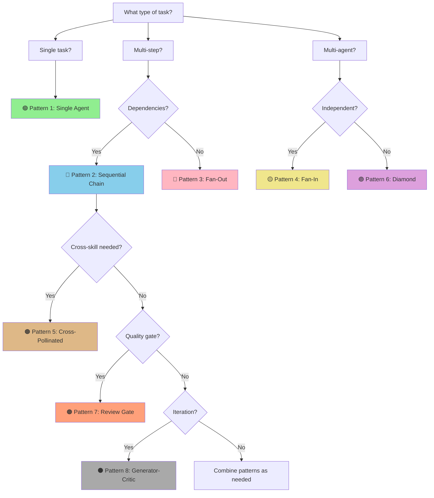

# Orchestration Patterns Reference

> **Version:** 1.0.0
> **Source:** SAO-INIT-007 Deep Research (DISCOVERY-008)
> **Last Updated:** 2026-01-12

This document defines the 8 canonical orchestration patterns for multi-agent workflows in Jerry.

---

## Pattern Overview

```
╔═══════════════════════════════════════════════════════════════════════════════════════╗
║                          8 ORCHESTRATION PATTERNS                                      ║
╠═══════════════════════════════════════════════════════════════════════════════════════╣
║                                                                                       ║
║  BASIC PATTERNS                    ADVANCED PATTERNS                                  ║
║  ───────────────                   ─────────────────                                  ║
║  ┌─────────────────┐               ┌─────────────────┐                               ║
║  │ 1. SINGLE       │               │ 5. CROSS-       │                               ║
║  │    AGENT        │               │    POLLINATED   │                               ║
║  └─────────────────┘               └─────────────────┘                               ║
║  ┌─────────────────┐               ┌─────────────────┐                               ║
║  │ 2. SEQUENTIAL   │               │ 6. DIVERGENT-   │                               ║
║  │    CHAIN        │               │    CONVERGENT   │                               ║
║  └─────────────────┘               └─────────────────┘                               ║
║  ┌─────────────────┐               ┌─────────────────┐                               ║
║  │ 3. FAN-OUT      │               │ 7. REVIEW       │                               ║
║  │    (Parallel)   │               │    GATE         │                               ║
║  └─────────────────┘               └─────────────────┘                               ║
║  ┌─────────────────┐               ┌─────────────────┐                               ║
║  │ 4. FAN-IN       │               │ 8. GENERATOR-   │                               ║
║  │    (Aggregate)  │               │    CRITIC LOOP  │                               ║
║  └─────────────────┘               └─────────────────┘                               ║
║                                                                                       ║
╚═══════════════════════════════════════════════════════════════════════════════════════╝
```

---

## Pattern 1: Single Agent

### L0 (ELI5)

**Metaphor:** Like calling a specialist directly - you don't need a receptionist if you know exactly who to call.

### L1 (Engineer)

```
TOPOLOGY:
─────────

     ┌────────┐         ┌────────┐         ┌────────┐
     │ INPUT  │────────►│ AGENT  │────────►│ OUTPUT │
     └────────┘         └────────┘         └────────┘
```

**Invocation:**
```
Task(ps-researcher, "Research API authentication patterns")
Task(ps-analyst, "Analyze this error log")
Task(nse-requirements, "Review these requirements")
```

**Use When:**
- Task maps to single agent's specialty
- No coordination overhead needed
- Direct invocation is sufficient

### L2 (Architect)

**Anti-Pattern:** Using orchestration wrapper for single agent adds unnecessary overhead.

**State Management:** None (stateless invocation)

**Cognitive Mode:** Depends on agent (convergent/divergent)

---

## Pattern 2: Sequential Chain

### L0 (ELI5)

**Metaphor:** Like a relay race - each runner passes the baton to the next. The second runner can't start until they receive the baton.

### L1 (Engineer)

```
TOPOLOGY:
─────────

┌────────┐    ┌────────┐    ┌────────┐    ┌────────┐
│Agent A │───►│Agent B │───►│Agent C │───►│Agent D │
└────────┘    └────────┘    └────────┘    └────────┘
     │             │             │             │
     ▼             ▼             ▼             ▼
state_a       state_b       state_c       state_d
(passed)      (passed)      (passed)      (final)
```

**Invocation:**
```
1. Task(ps-researcher, "Research {topic}")
   → research_output
2. Task(ps-analyst, "Analyze from research_output")
   → analysis_output
3. Task(ps-architect, "Design from analysis_output")
   → architecture_output
4. Task(ps-reviewer, "Review architecture_output")
   → review_output
```

**Use When:**
- Each agent's output is next agent's input
- Order matters (dependencies between steps)
- Linear workflow with clear progression

### L2 (Architect)

**State Handoff Schema v1.0.0:**
```yaml
session_context:
  version: "1.0.0"
  session_id: "uuid"
  source_agent: "ps-researcher"
  target_agent: "ps-analyst"
  state_output_key: "research_output"
  payload: { ... }
```

**Cognitive Mode:** Typically convergent (narrowing toward goal)

**Anti-Pattern:** Breaking the chain by not passing state - each agent starts from scratch.

---

## Pattern 3: Fan-Out (Parallel)

### L0 (ELI5)

**Metaphor:** Like sending multiple detectives to investigate different leads simultaneously. They don't talk to each other - they just gather information in parallel.

### L1 (Engineer)

```
TOPOLOGY:
─────────

               ┌────────────────┐
               │  COORDINATOR   │
               └───────┬────────┘
      ┌────────────────┼────────────────┐
      │                │                │
      ▼                ▼                ▼
 ┌────────┐       ┌────────┐       ┌────────┐
 │Agent A │       │Agent B │       │Agent C │
 └────────┘       └────────┘       └────────┘
      │                │                │
      ▼                ▼                ▼
  output_a         output_b         output_c
```

**Invocation (Parallel):**
```
# Launch in parallel (single message with multiple Task calls)
Task(ps-researcher, "Research approach A")
Task(ps-researcher, "Research approach B")
Task(ps-researcher, "Research approach C")
```

**Use When:**
- Tasks are independent (no shared state)
- Latency reduction needed
- Multiple perspectives on same input

### L2 (Architect)

**CRITICAL:** Fan-out MUST be followed by sync barrier before any agent reads others' outputs (prevents race conditions).

**Cognitive Mode:** Divergent (expanding options/perspectives)

**Anti-Pattern:** Unbounded parallelism without barriers causes race conditions.

```
WRONG:                              RIGHT:
──────                              ──────
┌──────┬──────┬──────┬──────┐      ┌──────┬──────┐
│  A   │  B   │  C   │  D   │      │  A   │  B   │ ← Group 1
│  ↓   │  ↓   │  ↓   │  ↓   │      └──┬───┴──┬───┘
│ ALL PARALLEL (race cond!) │         │      │
└──────┴──────┴──────┴──────┘      ╔══▼══════▼══╗
                                   ║  BARRIER   ║
                                   ╚══════╤═════╝
                                   ┌──────┴──────┐
                                   │  C   │  D   │ ← Group 2
                                   └──────┴──────┘
```

---

## Pattern 4: Fan-In (Aggregation)

### L0 (ELI5)

**Metaphor:** Like a team meeting where everyone shares their findings. A note-taker (synthesizer) combines all the reports into one summary.

### L1 (Engineer)

```
TOPOLOGY:
─────────

     ┌────────┐       ┌────────┐       ┌────────┐
     │Agent A │       │Agent B │       │Agent C │
     └────┬───┘       └────┬───┘       └────┬───┘
          │                │                │
          ▼                ▼                ▼
      output_a         output_b         output_c
          │                │                │
          └────────────────┼────────────────┘
                           │
                  ╔════════▼════════╗
                  ║  SYNC BARRIER   ║
                  ╚════════╤════════╝
                           │
                   ┌───────▼───────┐
                   │  SYNTHESIZER  │
                   └───────────────┘
```

**Invocation:**
```
# After fan-out completes (barrier)
Task(ps-synthesizer, "Synthesize findings from: output_a, output_b, output_c")
```

**Synthesizer Agents:**
- `ps-synthesizer`: Pattern finding, connection mapping
- `orch-synthesizer`: Multi-agent output consolidation
- `nse-reporter`: Status aggregation from all NSE agents

**Use When:**
- Multiple outputs need consolidation
- Cross-referencing is required
- Unified deliverable from diverse inputs

### L2 (Architect)

**Cognitive Mode:** Convergent (narrowing to synthesis)

**Anti-Pattern:** Synthesizing before barrier - incomplete inputs lead to partial conclusions.

---

## Pattern 5: Cross-Pollinated Pipeline

### L0 (ELI5)

**Metaphor:** Like two research teams working on related problems. At checkpoints, they share findings so each can benefit from the other's discoveries before continuing.

### L1 (Engineer)

```
TOPOLOGY:
─────────

     ┌─────────────────────────────────────────────────┐
     │                PARALLEL TRACKS                   │
     │                                                 │
     │   TRACK A              TRACK B                  │
     │   ────────             ────────                 │
     │   ┌───────┐            ┌───────┐               │
     │   │ A-1   │            │ B-1   │               │
     │   └───┬───┘            └───┬───┘               │
     │       │                    │                    │
     │       ▼                    ▼                    │
     │   ┌───────┐            ┌───────┐               │
     │   │ A-2   │◄──────────►│ B-2   │ ◄── BARRIER   │
     │   └───┬───┘            └───┬───┘               │
     │       │     CROSS         │                    │
     │       │   POLLINATE       │                    │
     │       ▼                    ▼                    │
     │   ┌───────┐            ┌───────┐               │
     │   │ A-3   │            │ B-3   │               │
     │   └───────┘            └───────┘               │
     └─────────────────────────────────────────────────┘
```

**Invocation:**
```
# Track A and Track B run in parallel
# At barrier, outputs exchange
Track A: ps-architect → (barrier) → ps-architect (refined)
Track B: nse-verification → (barrier) → nse-verification (updated)

# Cross-pollination: A's design informs B's verification, B's gaps inform A's refinement
```

**Use When:**
- Multiple skill families contribute to same goal
- ps-* and nse-* need to exchange findings
- Iterative refinement with cross-domain input

### L2 (Architect)

**Barrier Semantics:**
- Bidirectional: Both tracks pause at barrier
- State exchange: Outputs become available to other track
- Configurable: Can specify which outputs to share

**Cross-Skill Handoff Examples:**
```
ps-architect (design) ────► nse-verification (validates)
nse-verification (gaps) ──► ps-architect (refines)
```

**Cognitive Mode:** Mixed (divergent → barrier → convergent)

---

## Pattern 6: Divergent-Convergent (Diamond)

### L0 (ELI5)

**Metaphor:** Like brainstorming then voting. First, generate many ideas (diverge). Then, evaluate and pick the best one (converge).

### L1 (Engineer)

```
TOPOLOGY:
─────────

                      ┌────────────┐
                      │   ENTRY    │
                      │   POINT    │
                      └─────┬──────┘
                            │
                   ┌────────┴────────┐
                   │   DIVERGENT     │ ← EXPLORE OPTIONS
                   │   PHASE         │
                   └────────┬────────┘
            ┌───────────────┼───────────────┐
            ▼               ▼               ▼
       ┌────────┐      ┌────────┐      ┌────────┐
       │Option A│      │Option B│      │Option C│
       └────┬───┘      └────┬───┘      └────┬───┘
            │               │               │
            └───────────────┼───────────────┘
                            │
                   ┌────────┴────────┐
                   │   CONVERGENT    │ ← SELECT BEST
                   │   PHASE         │
                   └────────┬────────┘
                            │
                      ┌─────▼──────┐
                      │   EXIT     │
                      │   POINT    │
                      └────────────┘
```

**Invocation:**
```
# Divergent phase (parallel)
Task(ps-architect, "Design Option A: microservices")
Task(ps-architect, "Design Option B: monolith")
Task(ps-architect, "Design Option C: serverless")

# [BARRIER]

# Convergent phase
Task(ps-analyst, "Compare options, recommend best path")
```

**Use When:**
- Solution space needs exploration before commitment
- Multiple viable approaches exist
- Trade-off analysis required

### L2 (Architect)

**Agent Mapping:**
- Divergent phase: `ps-researcher`, `ps-architect` (generate options)
- Convergent phase: `ps-analyst`, `ps-critic` (evaluate options)

**Cognitive Mode:** Divergent (top) → Convergent (bottom)

---

## Pattern 7: Review Gate

### L0 (ELI5)

**Metaphor:** Like a quality checkpoint at a factory. Products can't move to the next stage until they pass inspection. If they fail, they go back for fixes.

### L1 (Engineer)

```
TOPOLOGY:
─────────

     ┌────────────┐
     │  PRODUCER  │
     │   AGENT    │
     └─────┬──────┘
           │
           ▼
     ┌────────────┐
     │  ARTIFACT  │
     │  (Draft)   │
     └─────┬──────┘
           │
           ▼
  ╔════════════════════╗
  ║    REVIEW GATE     ║
  ║    ┌──────────┐    ║
  ║    │ REVIEWER │    ║
  ║    │  AGENT   │    ║
  ║    └─────┬────┘    ║
  ║          │         ║
  ║    ┌─────▼─────┐   ║
  ║    │  PASS?    │   ║
  ║    └─────┬─────┘   ║
  ╚══════════╪═════════╝
        ┌────┴────┐
        ▼         ▼
    ┌──────┐  ┌──────┐
    │ YES  │  │  NO  │──► Feedback loop to producer
    └──┬───┘  └──────┘
       │
       ▼
  ┌─────────┐
  │  NEXT   │
  │  STAGE  │
  └─────────┘
```

**Invocation:**
```
# Producer creates artifact
Task(ps-architect, "Design authentication system")

# Review gate
Task(ps-reviewer, "Review design against criteria")
# OR for NASA reviews:
Task(nse-reviewer, "Conduct SRR", review_type="SRR")
```

**Reviewer Agents:**
- `ps-reviewer`: General quality assessment
- `nse-reviewer`: NASA technical reviews (SRR, PDR, CDR, TRR, FRR, etc.)
- `ps-critic`: Adversarial review (poke holes)

**NASA Review Types:**
```
SRR  - System Requirements Review
SDR  - System Design Review
PDR  - Preliminary Design Review
CDR  - Critical Design Review
SIR  - System Integration Review
TRR  - Test Readiness Review
SAR  - System Acceptance Review
ORR  - Operational Readiness Review
FRR  - Flight Readiness Review
PLAR - Post-Launch Assessment Review
PFAR - Post-Flight Assessment Review
CERR - Critical Events Readiness Review
```

**Use When:**
- Quality checkpoint before progression
- NASA technical reviews
- Code review before merge

### L2 (Architect)

**Cognitive Mode:** Convergent (assess against criteria)

**Anti-Pattern:** Skipping reviews. Each review builds on the previous. Skipping = technical debt.

---

## Pattern 8: Generator-Critic Loop

### L0 (ELI5)

**Metaphor:** Like a writer and editor working together. The writer creates a draft, the editor provides feedback, the writer revises. Repeat until the editor approves or they've tried 3 times.

### L1 (Engineer)

```
TOPOLOGY:
─────────

              ┌─────────────────────────────────┐
              │                                 │
              │      ┌───────────────┐         │
              │      │   GENERATOR   │         │
              │      │    AGENT      │         │
              │      └───────┬───────┘         │
              │              │                  │
              │              ▼                  │
              │      ┌───────────────┐         │
              │      │   ARTIFACT    │         │
              │      │   (Draft v.N) │         │
              │      └───────┬───────┘         │
              │              │                  │
              │              ▼                  │
              │      ┌───────────────┐         │
              │      │    CRITIC     │         │
              │      │    AGENT      │         │
              │      └───────┬───────┘         │
              │              │                  │
              │         ┌────┴────┐            │
              │         ▼         ▼            │
              │     Score <    Score ≥         │
              │     0.85       0.85            │
              │       │           │            │
              │       │           ▼            │
              └───────┘    ┌───────────┐       │
                           │   EXIT    │       │
             REFINE LOOP   │  (Final)  │       │
                           └───────────┘       │
```

**Invocation:**
```python
iteration = 0
quality_score = 0

while quality_score < 0.85 and iteration < 3:
    # Generate/refine
    Task(ps-architect, f"{'Create' if iteration == 0 else 'Refine'} solution")

    # Critique
    result = Task(ps-critic, "Evaluate solution quality, return score 0-1")
    quality_score = result.score
    iteration += 1

if iteration >= 3 and quality_score < 0.85:
    # Escalate to human
    notify_user("Quality threshold not met after 3 iterations")
```

### L2 (Architect)

**Circuit Breaker Parameters:**
```yaml
circuit_breaker:
  max_iterations: 3          # Hard limit - prevents infinite loops
  quality_threshold: 0.85    # Exit condition - "good enough"
  escalation: human_review   # After 3 fails → human intervention
```

**Agent Mapping:**
- Generator: `ps-architect`, `ps-synthesizer`
- Critic: `ps-critic`, `ps-reviewer`, `nse-reviewer`

**Cognitive Mode:** Alternating (divergent generation → convergent critique)

**Anti-Pattern:** No circuit breaker - infinite refinement loop.

---

## Pattern Selection Decision Tree

```
╔═══════════════════════════════════════════════════════════════════════════════════════╗
║                         PATTERN SELECTION DECISION TREE                                ║
╠═══════════════════════════════════════════════════════════════════════════════════════╣
║                                                                                       ║
║                          START: What type of task?                                    ║
║                                     │                                                 ║
║                    ┌────────────────┼────────────────┐                               ║
║                    ▼                ▼                ▼                               ║
║              Single task?     Multi-step?      Multi-agent?                          ║
║                    │                │                │                               ║
║                    ▼                ▼                ▼                               ║
║            ┌────────────┐   Dependencies?    Independent?                            ║
║            │ PATTERN 1  │         │                │                                 ║
║            │ Single     │    ┌────┴────┐     ┌────┴────┐                            ║
║            │ Agent      │    ▼         ▼     ▼         ▼                            ║
║            └────────────┘  Yes        No   Yes        No                            ║
║                             │          │    │          │                            ║
║                             ▼          ▼    ▼          ▼                            ║
║                        ┌────────┐ ┌────────┐ ┌────────┐ ┌────────┐                  ║
║                        │PATTERN │ │PATTERN │ │PATTERN │ │PATTERN │                  ║
║                        │   2    │ │   3    │ │   4    │ │   6    │                  ║
║                        │Sequent.│ │Fan-Out │ │Fan-In  │ │Diamond │                  ║
║                        └────────┘ └────────┘ └────────┘ └────────┘                  ║
║                                                                                       ║
║                          Cross-skill needed?                                          ║
║                                │                                                      ║
║                           ┌────┴────┐                                                ║
║                           ▼         ▼                                                ║
║                         Yes        No                                                ║
║                           │         │                                                ║
║                           ▼         ▼                                                ║
║                     ┌────────┐  Quality gate?                                        ║
║                     │PATTERN │       │                                               ║
║                     │   5    │  ┌────┴────┐                                          ║
║                     │X-Pollin│  ▼         ▼                                          ║
║                     └────────┘ Yes        No                                         ║
║                                 │          │                                         ║
║                                 ▼          ▼                                         ║
║                           ┌────────┐  Iteration?                                     ║
║                           │PATTERN │       │                                         ║
║                           │   7    │  ┌────┴────┐                                    ║
║                           │Review  │  ▼         ▼                                    ║
║                           │Gate    │ Yes   Combine patterns                          ║
║                           └────────┘  │                                              ║
║                                       ▼                                              ║
║                                 ┌────────┐                                           ║
║                                 │PATTERN │                                           ║
║                                 │   8    │                                           ║
║                                 │Gen-Crit│                                           ║
║                                 └────────┘                                           ║
║                                                                                       ║
╚═══════════════════════════════════════════════════════════════════════════════════════╝
```

### Decision Tree (Mermaid)

For rendering in GitHub/IDE:



---

## Agent State Output Keys

| Agent | State Key | Next Hint | Cognitive Mode |
|-------|-----------|-----------|----------------|
| ps-researcher | research_output | ps-analyst | divergent |
| ps-analyst | analysis_output | ps-architect | convergent |
| ps-architect | architecture_output | ps-validator | divergent |
| ps-validator | validation_output | ps-synthesizer | convergent |
| ps-critic | critique_output | (generator) | convergent |
| ps-investigator | investigation_output | ps-analyst | divergent |
| ps-reporter | report_output | (terminal) | convergent |
| ps-reviewer | review_output | (conditional) | convergent |
| ps-synthesizer | synthesis_output | ps-reporter | convergent |
| nse-requirements | requirements_output | nse-verification | convergent |
| nse-verification | verification_output | nse-reviewer | convergent |
| nse-reviewer | review_output | (conditional) | convergent |
| nse-reporter | report_output | (terminal) | convergent |
| nse-risk | risk_output | nse-reviewer | convergent |
| nse-architecture | architecture_output | nse-integration | divergent |
| nse-integration | integration_output | nse-verification | convergent |
| nse-configuration | configuration_output | nse-qa | convergent |
| nse-qa | qa_output | nse-reporter | convergent |
| nse-explorer | exploration_output | (context-dependent) | divergent |

---

## Cross-Skill Handoff Matrix

```
┌──────────────────────────────────────────────────────────────────────────────┐
│                         CROSS-SKILL HANDOFFS (ps ↔ nse)                       │
├──────────────────────────────────────────────────────────────────────────────┤
│                                                                              │
│   PROBLEM-SOLVING → NASA SE                                                  │
│   ─────────────────────────                                                  │
│   ps-architect (design) ────► nse-architecture (formal architecture)         │
│   ps-analyst (root cause) ──► nse-risk (risk assessment)                     │
│   ps-validator (check) ─────► nse-verification (V&V matrix)                  │
│                                                                              │
│   NASA SE → PROBLEM-SOLVING                                                  │
│   ─────────────────────────                                                  │
│   nse-requirements ─────────► ps-architect (design to requirements)          │
│   nse-verification (gaps) ──► ps-investigator (investigate gaps)             │
│   nse-reviewer (RIDs) ──────► ps-analyst (analyze RID root cause)            │
│                                                                              │
└──────────────────────────────────────────────────────────────────────────────┘
```

---

## Session Context Schema v1.0.0

```yaml
session_context:
  version: "1.0.0"
  session_id: "uuid-v4"
  source_agent: "agent-name"
  target_agent: "agent-name"
  handoff_timestamp: "ISO-8601"
  state_output_key: "key_name"
  cognitive_mode: "convergent|divergent"
  payload:
    findings: [ ... ]
    confidence: 0.0-1.0
    next_hint: "suggested_next_agent"
```

---

## References

- **Source:** SAO-INIT-007 plan.md (extracted 2026-01-12)
- **Discovery:** DISCOVERY-008 (8 patterns identified)
- **Discovery:** DISCOVERY-009 (session context schema formalized)
- **Constitution:** P-003 (No Recursive Subagents)

---

*Version 1.0.0 - Created 2026-01-12*
*Extracted from SAO-INIT-007 deep research*
