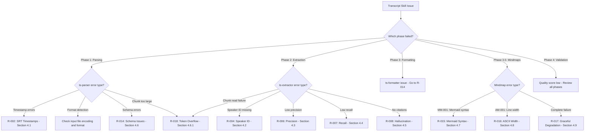

# Runbook: Transcript Skill Troubleshooting

<!--
TEMPLATE: Runbook
SOURCE: EN-005 Design Documentation
VERSION: 1.0.0
STATUS: ACTIVE
RELOCATED: 2026-01-26 per DISC-004
-->

---

## Frontmatter

```yaml
# === IDENTITY ===
id: "RB-TRANSCRIPT-001"
title: "Runbook: Transcript Skill Troubleshooting"
version: "1.3.1"
status: "ACTIVE"

# === OWNERSHIP ===
owner: "Transcript Skill Team"
author: "ps-architect"

# === TIMESTAMPS ===
created: "2026-01-26T10:00:00Z"
updated: "2026-01-30T18:00:00Z"

# === SCOPE ===
systems:
  - "ts-parser"
  - "ts-extractor"
  - "ts-formatter"
  - "ts-mindmap-mermaid"
  - "ts-mindmap-ascii"
  - "ps-critic"

# === TRACEABILITY ===
work_items:
  epic: "EPIC-001"
  feature: "FEAT-005"
  enabler: "EN-029"
  tasks:
    - "TASK-414"  # Pattern references
```

---

## L0: Operational Overview

### What This Runbook Covers

This runbook helps you troubleshoot the 6 YELLOW risks identified in the FMEA analysis
for the Transcript Skill.

### When to Use This Runbook

Use this runbook when:

- [ ] ts-parser reports timestamp errors or format detection failures
- [ ] ts-extractor shows low confidence scores for speakers
- [ ] ts-extractor shows low confidence for action items
- [ ] Extracted entities appear to be hallucinated (no source citation)
- [ ] JSON output schema is incompatible with downstream tools
- [ ] Mindmap generation fails (ts_mindmap_output.overall_status == "failed")
- [ ] ps-critic reports MM-* criteria failures (invalid Mermaid syntax)
- [ ] ps-critic reports AM-* criteria failures (ASCII formatting issues)

---

## Troubleshooting Decision Tree

### Master Decision Tree



---

## L1: Diagnostic Procedures

### 4.1 R-002: SRT Timestamp Malformation

**Symptoms:**
- Timestamps show negative values
- Time jumps > 60 seconds between adjacent utterances
- Duration calculation errors (end < start)

**Resolution:**
1. Check SRT file uses correct separator (comma, not period)
2. Enable defensive parsing (PAT-002)
3. Re-run ts-parser with corrected file

### 4.2 R-004: Missing Speaker Identification

**Symptoms:**
- All or most speakers show as "Unknown"
- Speaker confidence < 0.80

**Resolution (PAT-003 - 4 Pattern Chain):**
1. Pattern 1: VTT Voice Tags (confidence 0.95)
2. Pattern 2: Prefix Pattern "Name:" (confidence 0.90)
3. Pattern 3: Bracket Pattern "[Name]" (confidence 0.85)
4. Pattern 4: ALL-CAPS Pattern (confidence 0.80)

### 4.3 R-006: Low Action Item Precision

**Symptoms:**
- Many extracted action items are false positives
- Confidence scores mostly < 0.70

**Resolution:**
1. Increase confidence threshold to 0.80
2. Add negative patterns (exclude questions, hypotheticals)
3. Re-run extraction

### 4.4 R-007: Low Action Item Recall

**Symptoms:**
- Known action items not extracted
- Low total action count

**Resolution:**
1. Lower confidence threshold to 0.60
2. Enable all extraction tiers (Rule → ML → LLM)
3. Add missing action patterns

### 4.5 R-008: LLM Hallucination

**Symptoms:**
- Extracted entities have no `source_segment` citation
- Action items don't appear in transcript

**Resolution (PAT-004 - Citation Required):**
1. Enforce mandatory citations
2. Reject extractions without citations
3. Add verification step against source

**CRITICAL:** Any hallucination triggers immediate L2 escalation.

### Tool Example: Validating Citations with Grep

**Scenario:** Verify all action items have source citations

**Step 1: Search for action items**

```
Invoke Grep tool with:
- pattern: "^## \\d+\\. "  # Markdown heading pattern
- path: "transcript-meeting-001/04-action-items.md"
- output_mode: "content"
```

**Returns:**
```
## 1. Implement user authentication
## 2. Fix navigation bug
## 3. Review deployment process
```

**Step 2: Verify each has a citation**

```
Invoke Grep tool with:
- pattern: "\\*\\*Source:\\*\\*"
- path: "transcript-meeting-001/04-action-items.md"
- output_mode: "count"
```

**Returns:**
```
count: 3  # Should match action item count
```

**Step 3: Check citation format**

```
Invoke Grep tool with:
- pattern: "\\[\\d{2}:\\d{2}:\\d{2}\\]"  # Timestamp format [HH:MM:SS]
- path: "transcript-meeting-001/04-action-items.md"
- output_mode: "content"
```

**Returns:**
```
- Timestamp: [00:15:32]
- Timestamp: [00:23:45]
- Timestamp: [01:02:18]
```

**Quality check logic:**

```
IF action_item_count != citation_count:
    Flag as quality failure (T-004)
    Report missing citations
ELSE IF any citation missing timestamp:
    Flag as quality warning
ELSE:
    Pass citation validation
```

**Verified Citation Structure (2026-01-30 test):**
```
Citation format in action items:
- Segment: [#seg-0106](./02-transcript-part-1.md#seg-0106)
- Timestamp: 00:09:37.500
- Anchor: `priority_one_microservices`
- Text Snippet: (quote from transcript)
```

### 4.6 R-014: JSON Schema Breaking Changes

**Symptoms:**
- Downstream consumers fail to parse output
- Missing required fields in JSON

**Resolution:**
1. Always include version field
2. Maintain backward compatibility
3. Update consumers for new versions

### 4.6.1 R-018: Chunk Token Overflow (EN-026)

**Symptoms:**
- Chunks exceed Claude Code's 25K token Read limit
- ts-extractor fails to read chunk files
- `target_tokens` field is null or missing in index.json

**Resolution:**
1. **Verify token-based chunking is enabled:**
   ```bash
   cat output/index.json | grep target_tokens
   # Expected: "target_tokens": 18000
   # Problem: "target_tokens": null (segment-based mode)
   ```

2. **Check tiktoken dependency:**
   ```bash
   uv pip list | grep tiktoken
   # Expected: tiktoken >= 0.5.1
   ```

3. **Re-run with token-based chunking:**
   ```bash
   uv run jerry transcript parse <file.vtt> --output-dir <dir>
   ```

4. **Verify chunk sizes after generation:**
   ```python
   import tiktoken
   enc = tiktoken.get_encoding("p50k_base")
   with open("chunks/chunk-001.json") as f:
       tokens = len(enc.encode(f.read()))
       print(f"Tokens: {tokens}")  # Should be < 25,000
   ```

**Root Causes:**
- TokenCounter service not injected into TranscriptChunker
- tiktoken package not installed
- Fallback to segment-based mode due to import errors

**Token Budget Reference (EN-026):**
| Parameter | Value | Rationale |
|-----------|-------|-----------|
| Claude Code Read limit | 25,000 tokens | Hard limit per GitHub #4002 |
| Target tokens per chunk | 18,000 tokens | 25% safety margin |
| JSON serialization overhead | ~22% | See DISC-001 |
| Actual chunk size | ~22,000 tokens | 18K + 22% overhead |
| Remaining margin | ~3,000 tokens | 12% buffer |

**Reference:** EN-026-token-based-chunking.md, BUG-001-chunk-token-overflow.md

### Tool Example: Discovering Packet Files for Validation

**Scenario:** ps-critic needs to find all packet files for quality review

**Step 1: Discover core packet files**

```
Invoke Glob tool with:
- pattern: "transcript-*/0*.md"
```

**Returns:**
```
transcript-meeting-001/00-index.md
transcript-meeting-001/01-summary.md
transcript-meeting-001/02-transcript.md
transcript-meeting-001/03-speakers.md
transcript-meeting-001/04-action-items.md
transcript-meeting-001/05-decisions.md
transcript-meeting-001/06-questions.md
transcript-meeting-001/07-topics.md
```

**Step 2: Check for split files**

```
Invoke Glob tool with:
- pattern: "transcript-*/02-transcript-part-*.md"
```

**Returns (if transcript was split):**
```
transcript-meeting-001/02-transcript-part-001.md
transcript-meeting-001/02-transcript-part-002.md
transcript-meeting-001/02-transcript-part-003.md
```

**Step 3: Discover mindmap files**

```
Invoke Glob tool with:
- pattern: "transcript-*/08-mindmap/*"
```

**Returns (if mindmaps generated):**
```
transcript-meeting-001/08-mindmap/mindmap.mmd
transcript-meeting-001/08-mindmap/mindmap.ascii.txt
```

**Usage in ps-critic workflow:**

```
1. Glob for packet files → validate count (8 core files expected)
2. Read each file with Read tool → validate structure
3. Glob for split files → add to validation list if present
4. Glob for mindmap files → validate MM-*/AM-* criteria if present
5. Aggregate quality scores → generate quality-review.md
```

**Verified Output (2026-01-30 test):**
```
$ find transcript-meeting-006/packet -name "0*.md" | sort
00-index.md
01-summary.md
02-transcript-part-1.md
02-transcript-part-2.md
03-speakers.md
04-action-items.md
05-decisions.md
06-questions.md
07-topics.md
```

---

## L1: Mindmap Diagnostic Procedures

> **Per ADR-006:** Mindmaps are generated by default. These procedures apply when mindmap generation is enabled.

### 4.7 R-015: Invalid Mermaid Syntax (MM-001)

**Symptoms:**
- ps-critic reports MM-001 failure
- Mermaid preview fails to render
- Syntax errors in `08-mindmap/mindmap.mmd`

**Resolution:**
1. Check extraction-report.json for valid topic/entity data
2. Verify deep links use correct anchor format (#xxx-NNN)
3. Re-run mindmap generation only:
   ```bash
   /transcript regenerate-mindmap <packet-path> --format mermaid
   ```
4. Validate Mermaid syntax at [mermaid.live](https://mermaid.live)

**Common Mermaid Syntax Issues:**
- Missing `mindmap` keyword at start
- Incorrect indentation (must be 2 spaces per level)
- Unbalanced parentheses in `root((Title))`
- Special characters in node labels (escape with quotes)

**Reference:** [ADR-006 - ps-critic Validation Criteria](../../../docs/adrs/ADR-006-mindmap-pipeline-integration.md#ps-critic-validation-criteria) (MM-001 criterion), ts-critic-extension.md

### 4.8 R-016: ASCII Width Exceeded (AM-001)

**Symptoms:**
- ps-critic reports AM-001 failure
- Lines exceed 80 characters in `08-mindmap/mindmap.ascii.txt`
- Visual layout broken in narrow terminals

**Resolution:**
1. ASCII generator should truncate at 80 chars automatically
2. Check for exceptionally long topic names in extraction report
3. Re-run ASCII generation:
   ```bash
   /transcript regenerate-mindmap <packet-path> --format ascii
   ```
4. Manually verify max line width:
   ```bash
   awk '{ print length }' 08-mindmap/mindmap.ascii.txt | sort -rn | head -1
   # Result should be ≤ 80
   ```

**Root Causes:**
- Topic names > 60 characters without truncation
- Missing legend placement calculation
- Nested hierarchy causing deep indentation

**Reference:** [ADR-006 - ps-critic Validation Criteria](../../../docs/adrs/ADR-006-mindmap-pipeline-integration.md#ps-critic-validation-criteria) (AM-001 criterion), ts-critic-extension.md

### 4.9 R-017: Mindmap Generation Failed (Graceful Degradation)

**Symptoms:**
- ts_mindmap_output.overall_status == "failed" OR "partial"
- Warning message in pipeline output
- `08-mindmap/` directory missing or incomplete

**Resolution (Per [ADR-006 - Graceful Degradation Design](../../../docs/adrs/ADR-006-mindmap-pipeline-integration.md#graceful-degradation-design)):**

1. **Verify core packet is intact:**
   ```bash
   ls transcript-{id}/*.md  # Should show 00-07 files
   ```

2. **Review error details:**
   - Check ts_mindmap_output state for error_message field
   - Review warning messages in pipeline output

3. **Manual regeneration:**
   ```bash
   /transcript regenerate-mindmap <packet-path>
   # Or with specific format:
   /transcript regenerate-mindmap <packet-path> --format both
   ```

4. **If regeneration continues to fail:**
   - Verify extraction-report.json has topics and entities
   - Check for minimum data requirements (at least 1 topic needed)
   - Consider using `--no-mindmap` to complete pipeline without mindmaps

**Graceful Degradation Behavior:**
- Core packet files (00-07) remain intact even if mindmap fails
- Pipeline completes with warning (does NOT abort)
- ps-critic validates only core files when mindmaps missing
- No quality score penalty for failed mindmaps

**Escalation:**
If mindmap generation fails repeatedly:
- L1: Check extraction report data quality
- L2: Review ts-mindmap agent definitions
- L3: Verify ADR-006 compliance in pipeline orchestration

**Reference:** [ADR-006 - Graceful Degradation Design](../../../docs/adrs/ADR-006-mindmap-pipeline-integration.md#graceful-degradation-design), PLAYBOOK.md Phase 3.5

---

## Escalation

### Tiered Escalation Matrix

| Tier | Role | Responsibilities | Response Time |
|------|------|------------------|---------------|
| L1 | User | Check inputs, retry with settings | 5 min |
| L2 | Developer | Check agent configs, patterns | 15 min |
| L3 | Architect | Review ADR compliance | 30 min |

### Severity-Based Triggers

| Issue | Severity | Initial Tier | Auto-Escalate |
|-------|----------|--------------|---------------|
| Hallucination detected | P1 | L2 | L3 after 15 min |
| All speakers unknown | P2 | L1 | L2 after 5 min |
| Low confidence scores | P3 | L1 | L2 after 10 min |

---

## Pattern References

This runbook's troubleshooting procedures align with Jerry patterns:

| Pattern ID | Pattern Name | Runbook Application |
|------------|--------------|---------------------|
| PAT-RESILIENCE-001 | Graceful Degradation | R-017 (mindmap failure recovery) |
| PAT-RESILIENCE-002 | Rollback Capability | All rollback procedures (R-002 through R-018) |
| PAT-QUALITY-002 | Citation Validation | R-008 (hallucination detection) |
| PAT-DATA-002 | Chunking Strategy | R-018 (token overflow mitigation) |

**Anti-Pattern Detection:**
- AP-001: Diagnostic checks for canonical-transcript.json misuse
- AP-002: Procedures assume quality gates in use
- AP-005: R-008 explicitly checks for missing citations

---

## Related Documents

- [SKILL.md](../SKILL.md) - Skill definition
- [PLAYBOOK.md](./PLAYBOOK.md) - Execution guide (see §12 Anti-Patterns)
- [ts-parser.md](../agents/ts-parser.md) - Parser agent
- [ts-extractor.md](../agents/ts-extractor.md) - Extractor agent
- [ts-formatter.md](../agents/ts-formatter.md) - Formatter agent
- [ts-mindmap-mermaid.md](../agents/ts-mindmap-mermaid.md) - Mermaid mindmap agent
- [ts-mindmap-ascii.md](../agents/ts-mindmap-ascii.md) - ASCII mindmap agent
- [ts-critic-extension.md](../validation/ts-critic-extension.md) - Mindmap validation criteria (MM-*/AM-*)
- [ADR-006](../../../docs/adrs/ADR-006-mindmap-pipeline-integration.md) - Mindmap Pipeline Integration Decision
- [Jerry Pattern Catalog](../../../.claude/patterns/PATTERN-CATALOG.md) - Full pattern reference

---

*Runbook Version: 1.3.1*
*Constitutional Compliance: P-001, P-002, P-004*
*Pattern Compliance: PAT-RESILIENCE-001, PAT-QUALITY-002*
*Risk Coverage: 6/6 YELLOW risks from FMEA + 3 mindmap risks (R-015, R-016, R-017) + 1 token risk (R-018)*
*Created: 2026-01-26*
*Updated: 2026-01-30*
*Change Log:*
- *v1.3.1 (2026-01-30): EN-030 TASK-416 - Added Glob/Grep tool examples for file discovery and citation validation with execution evidence*
- *v1.3.0 (2026-01-30): EN-029 - Added pattern references section*
- *v1.2.0 (2026-01-30): EN-026 - Added R-018 token overflow risk*
- *v1.1.0 (2026-01-30): EN-024 - Added mindmap diagnostics (R-015, R-016, R-017)*
- *v1.0.0 (2026-01-26): Initial version per EN-005*
