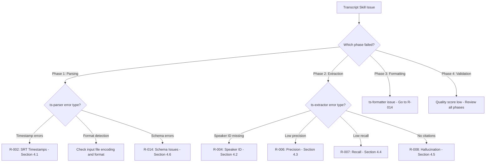

# Runbook: Transcript Skill Troubleshooting

<!--
TEMPLATE: Runbook
SOURCE: EN-005 Design Documentation
VERSION: 1.0.0
STATUS: ACTIVE
RELOCATED: 2026-01-26 per DISC-004
-->

---

## Frontmatter

```yaml
# === IDENTITY ===
id: "RB-TRANSCRIPT-001"
title: "Runbook: Transcript Skill Troubleshooting"
version: "1.0.0"
status: "ACTIVE"

# === OWNERSHIP ===
owner: "Transcript Skill Team"
author: "ps-architect"

# === TIMESTAMPS ===
created: "2026-01-26T10:00:00Z"
updated: "2026-01-26T14:00:00Z"

# === SCOPE ===
systems:
  - "ts-parser"
  - "ts-extractor"
  - "ts-formatter"
```

---

## L0: Operational Overview

### What This Runbook Covers

This runbook helps you troubleshoot the 6 YELLOW risks identified in the FMEA analysis
for the Transcript Skill.

### When to Use This Runbook

Use this runbook when:

- [ ] ts-parser reports timestamp errors or format detection failures
- [ ] ts-extractor shows low confidence scores for speakers
- [ ] ts-extractor shows low confidence for action items
- [ ] Extracted entities appear to be hallucinated (no source citation)
- [ ] JSON output schema is incompatible with downstream tools

---

## Troubleshooting Decision Tree

### Master Decision Tree



---

## L1: Diagnostic Procedures

### 4.1 R-002: SRT Timestamp Malformation

**Symptoms:**
- Timestamps show negative values
- Time jumps > 60 seconds between adjacent utterances
- Duration calculation errors (end < start)

**Resolution:**
1. Check SRT file uses correct separator (comma, not period)
2. Enable defensive parsing (PAT-002)
3. Re-run ts-parser with corrected file

### 4.2 R-004: Missing Speaker Identification

**Symptoms:**
- All or most speakers show as "Unknown"
- Speaker confidence < 0.80

**Resolution (PAT-003 - 4 Pattern Chain):**
1. Pattern 1: VTT Voice Tags (confidence 0.95)
2. Pattern 2: Prefix Pattern "Name:" (confidence 0.90)
3. Pattern 3: Bracket Pattern "[Name]" (confidence 0.85)
4. Pattern 4: ALL-CAPS Pattern (confidence 0.80)

### 4.3 R-006: Low Action Item Precision

**Symptoms:**
- Many extracted action items are false positives
- Confidence scores mostly < 0.70

**Resolution:**
1. Increase confidence threshold to 0.80
2. Add negative patterns (exclude questions, hypotheticals)
3. Re-run extraction

### 4.4 R-007: Low Action Item Recall

**Symptoms:**
- Known action items not extracted
- Low total action count

**Resolution:**
1. Lower confidence threshold to 0.60
2. Enable all extraction tiers (Rule → ML → LLM)
3. Add missing action patterns

### 4.5 R-008: LLM Hallucination

**Symptoms:**
- Extracted entities have no `source_segment` citation
- Action items don't appear in transcript

**Resolution (PAT-004 - Citation Required):**
1. Enforce mandatory citations
2. Reject extractions without citations
3. Add verification step against source

**CRITICAL:** Any hallucination triggers immediate L2 escalation.

### 4.6 R-014: JSON Schema Breaking Changes

**Symptoms:**
- Downstream consumers fail to parse output
- Missing required fields in JSON

**Resolution:**
1. Always include version field
2. Maintain backward compatibility
3. Update consumers for new versions

---

## Escalation

### Tiered Escalation Matrix

| Tier | Role | Responsibilities | Response Time |
|------|------|------------------|---------------|
| L1 | User | Check inputs, retry with settings | 5 min |
| L2 | Developer | Check agent configs, patterns | 15 min |
| L3 | Architect | Review ADR compliance | 30 min |

### Severity-Based Triggers

| Issue | Severity | Initial Tier | Auto-Escalate |
|-------|----------|--------------|---------------|
| Hallucination detected | P1 | L2 | L3 after 15 min |
| All speakers unknown | P2 | L1 | L2 after 5 min |
| Low confidence scores | P3 | L1 | L2 after 10 min |

---

## Related Documents

- [SKILL.md](../SKILL.md) - Skill definition
- [PLAYBOOK.md](./PLAYBOOK.md) - Execution guide
- [ts-parser.md](../agents/ts-parser.md) - Parser agent
- [ts-extractor.md](../agents/ts-extractor.md) - Extractor agent
- [ts-formatter.md](../agents/ts-formatter.md) - Formatter agent

---

*Runbook Version: 1.0.0*
*Constitutional Compliance: P-002 (persisted), P-004 (provenance)*
*Risk Coverage: 6/6 YELLOW risks from FMEA*
*Created: 2026-01-26*
*Relocated: 2026-01-26 per DISC-004*
