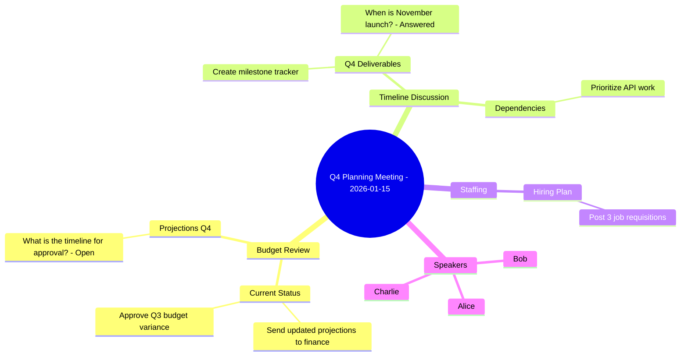

# Mermaid Mindmap Examples and Reference

> Extracted from `ts-mindmap-mermaid.md` to reduce agent definition context footprint.
> These examples and reference tables are Tier 3 supplementary content loaded on demand.

---

## Sample Mermaid Mindmap Output



> **Note:** The `%%` lines are Mermaid comments and will not render. They provide
> traceability to source segments for ADR-003 compliance. For clickable deep links,
> see the companion `mindmap.ascii.txt` file.

---

## Deep Link Reference Table Format

The reference table is appended as a comment block at the end of the `.mmd` file:

```
%% === DEEP LINK REFERENCE ===
%% Action Items: act-001→seg-006, act-002→seg-013, act-003→seg-019...
%% Decisions: dec-001→seg-010, dec-002→seg-018, dec-003→seg-025...
%% Questions: que-001→seg-009, que-002→seg-023, que-003→seg-027...
%% Topics: top-001→seg-001..008, top-002→seg-009..013...
%% ============================
```

---

## Document History

| Version | Date | Author | Changes |
|---------|------|--------|---------|
| 1.0.0 | 2026-01-28 | Claude | Initial agent definition per EN-009 TASK-001 |
| 1.0.1 | 2026-01-30 | Claude | **CORRECTED** output directory from `07-mindmap/` to `08-mindmap/` per EN-024:DISC-001 |
| 1.1.0 | 2026-01-30 | Claude | **CRITICAL FIX** - Removed invalid markdown link syntax from examples. Mermaid mindmaps only support plain text nodes. Added deep link reference comment block strategy for ADR-003 compliance. |
| 1.2.0 | 2026-01-30 | Claude | **COMPLIANCE:** Added PAT-AGENT-001 YAML sections per EN-027 (identity, capabilities, guardrails, validation, constitution, session_context). Addresses GAP-A-001, GAP-A-004, GAP-A-007, GAP-A-009, GAP-Q-001 for FEAT-005 Phase 1. Note: Version updated from 1.1.0 to 1.2.0 to reflect compliance updates. |
| 1.2.1 | 2026-01-30 | Claude | **REFINEMENT:** G-027 Iteration 2 compliance fixes. Expanded guardrails (6 validation rules), output filtering (6 filters), post-completion checks (8 checks), constitution (6 principles with P-022 referencing syntax limitations). Added template variable validation ranges. Session context customized for mindmap generation workflow. |
| 1.2.2 | 2026-01-30 | Claude | **MODEL-CONFIG:** Added model configuration support per EN-031 TASK-422. Added default_model and model_override to identity section. Added model override input validation rule. Added model_config to session_context.on_receive and expected_inputs. Consumes CP-2 (agent schema patterns) and CP-1 (model parameter syntax). |

### Related Documents

**Backlinks:**
- [EN-009-mindmap-generator.md](../../../projects/PROJ-008-transcript-skill/work/EPIC-001-transcript-skill/FEAT-002-implementation/EN-009-mindmap-generator/EN-009-mindmap-generator.md) - Parent enabler
- [ADR-003](../../../projects/PROJ-008-transcript-skill/work/EPIC-001-transcript-skill/FEAT-001-analysis-design/EN-004-architecture-decisions/docs/adrs/adr-003.md) - Bidirectional Linking
- [extraction-report.json](../test_data/schemas/extraction-report.json) - Input schema

**Forward Links:**
- [SKILL.md](../SKILL.md) - Skill definition
- [ts-mindmap-ascii.md](../agents/ts-mindmap-ascii.md) - ASCII fallback agent
