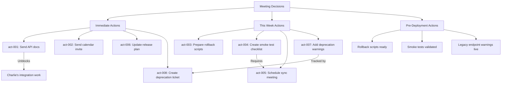

# Action Items

**Packet ID:** live-test-en024-mindmap-verification
**Total Action Items:** 8
**Tier 1 (High Priority):** 5
**Tier 2 (Medium Priority):** 3

---

## Summary Table

| ID | Assignee | Action | Due | Tier | Source |
|----|----------|--------|-----|------|--------|
| [act-001](#act-001) | Bob | Send API Swagger documentation to Charlie | After meeting | 1 | [→ seg-006](02-transcript.md#seg-006) |
| [act-002](#act-002) | Diana | Send test review calendar invite for Thursday afternoon | ASAP | 1 | [→ seg-013](02-transcript.md#seg-013) |
| [act-003](#act-003) | Bob | Prepare rollback scripts for deployment | Tomorrow | 1 | [→ seg-019](02-transcript.md#seg-019) |
| [act-004](#act-004) | Charlie | Create smoke test checklist for deployment (with Diana) | This week | 2 | [→ seg-020](02-transcript.md#seg-020) |
| [act-005](#act-005) | Diana | Block calendar time with Charlie for smoke test sync | ASAP | 2 | [→ seg-022](02-transcript.md#seg-022) |
| [act-006](#act-006) | Alice | Update release plan document with deployment decisions | ASAP | 1 | [→ seg-026](02-transcript.md#seg-026) |
| [act-007](#act-007) | Bob | Add deprecation warnings to legacy login API response headers | This week | 2 | [→ seg-028](02-transcript.md#seg-028) |
| [act-008](#act-008) | Bob | Create ticket for legacy endpoint deprecation | After meeting | 1 | [→ seg-030](02-transcript.md#seg-030) |

---

## By Assignee

### Bob (4 items)
1. [act-001](#act-001) - Send API Swagger documentation to Charlie [Tier 1]
2. [act-003](#act-003) - Prepare rollback scripts for deployment [Tier 1]
3. [act-007](#act-007) - Add deprecation warnings to legacy API [Tier 2]
4. [act-008](#act-008) - Create legacy endpoint deprecation ticket [Tier 1]

### Diana (2 items)
1. [act-002](#act-002) - Send test review calendar invite [Tier 1]
2. [act-005](#act-005) - Block calendar time with Charlie [Tier 2]

### Charlie (1 item)
1. [act-004](#act-004) - Create smoke test checklist with Diana [Tier 2]

### Alice (1 item)
1. [act-006](#act-006) - Update release plan document [Tier 1]

---

## Detailed Action Items

### {#act-001} act-001: Send API Swagger documentation to Charlie

**Assignee:** Bob
**Due Date:** After this meeting
**Tier:** 1 (High Priority)
**Confidence:** 0.95

**Context:**
Charlie completed the login form UI but is blocked on API integration testing. Bob committed to sending the Swagger documentation to unblock Charlie's work.

**Quote:**
> "I'll send you the Swagger documentation after this meeting."

**Source:** [→ seg-006](02-transcript.md#seg-006) at 0:00:52

**Dependencies:**
- Unblocks Charlie's API integration testing
- Prerequisite for Charlie's password reset flow implementation

**Success Criteria:**
- Charlie receives Swagger documentation
- Charlie can begin API integration testing

---

### {#act-002} act-002: Send test review calendar invite for Thursday afternoon

**Assignee:** Diana
**Due Date:** ASAP
**Tier:** 1 (High Priority)
**Confidence:** 0.90

**Context:**
Diana drafted test cases for authentication flow and requested a team review session. Team confirmed Thursday afternoon availability, so Diana committed to sending the calendar invite.

**Quote:**
> "I'll send out the calendar invite."

**Source:** [→ seg-013](02-transcript.md#seg-013) at 0:02:15

**Dependencies:**
- Follows decision [dec-001](05-decisions.md#dec-001) (Thursday afternoon test review)
- Required for test case validation before deployment

**Success Criteria:**
- Calendar invite sent to all team members
- Meeting room/video conference reserved
- Test cases shared with attendees before meeting

---

### {#act-003} act-003: Prepare rollback scripts for deployment

**Assignee:** Bob
**Due Date:** Tomorrow
**Tier:** 1 (High Priority)
**Confidence:** 0.92

**Context:**
As part of deployment planning, Bob proactively committed to preparing rollback scripts as a safety measure for the Monday the 15th production deployment.

**Quote:**
> "I will prepare the rollback scripts as a safety measure. That's assigned to me for tomorrow."

**Source:** [→ seg-019](02-transcript.md#seg-019) at 0:04:00

**Dependencies:**
- Critical for deployment risk mitigation
- Required before Monday the 15th deployment ([dec-002](05-decisions.md#dec-002))

**Success Criteria:**
- Rollback scripts created and tested
- Scripts documented and reviewed
- Emergency rollback procedure established

---

### {#act-004} act-004: Create smoke test checklist for deployment (with Diana)

**Assignee:** Charlie (collaborating with Diana)
**Due Date:** This week
**Tier:** 2 (Medium Priority)
**Confidence:** 0.88

**Context:**
Alice requested Charlie work with Diana to create a smoke test checklist for the deployment. Charlie agreed and planned to sync with Diana after the meeting.

**Quote:**
> "Charlie, can you work with Diana to create a smoke test checklist for the deployment?"

**Source:** [→ seg-020](02-transcript.md#seg-020) at 0:04:18

**Dependencies:**
- Requires coordination between Charlie (frontend) and Diana (QA)
- Supports deployment safety for [dec-002](05-decisions.md#dec-002)
- Related to [act-005](#act-005) (calendar sync)

**Success Criteria:**
- Comprehensive smoke test checklist created
- Both frontend and backend critical paths covered
- Checklist reviewed and approved by team

---

### {#act-005} act-005: Block calendar time with Charlie for smoke test sync

**Assignee:** Diana
**Due Date:** ASAP
**Tier:** 2 (Medium Priority)
**Confidence:** 0.85

**Context:**
Diana agreed to block calendar time with Charlie to collaborate on the smoke test checklist ([act-004](#act-004)).

**Quote:**
> "I'll block some time on our calendars."

**Source:** [→ seg-022](02-transcript.md#seg-022) at 0:04:45

**Dependencies:**
- Enables [act-004](#act-004) (smoke test checklist creation)
- Facilitates Charlie-Diana collaboration

**Success Criteria:**
- Meeting time scheduled with Charlie
- Sufficient time allocated for smoke test discussion
- Meeting occurs before deployment planning finalization

---

### {#act-006} act-006: Update release plan document with deployment decisions

**Assignee:** Alice
**Due Date:** ASAP
**Tier:** 1 (High Priority)
**Confidence:** 0.90

**Context:**
Alice committed to updating the release plan document with the decisions made during the meeting, including deployment date, phased rollout strategy, and action items.

**Quote:**
> "I'll update the release plan document with these decisions."

**Source:** [→ seg-026](02-transcript.md#seg-026) at 0:05:45

**Dependencies:**
- Captures [dec-002](05-decisions.md#dec-002) (Monday the 15th deployment)
- Captures [dec-003](05-decisions.md#dec-003) (phased rollout approach)
- Provides stakeholder communication material

**Success Criteria:**
- Release plan updated with deployment date
- Phased rollout strategy documented
- Action items and owners captured
- Document shared with stakeholders

---

### {#act-007} act-007: Add deprecation warnings to legacy login API response headers

**Assignee:** Bob
**Due Date:** This week
**Tier:** 2 (Medium Priority)
**Confidence:** 0.87

**Context:**
Bob committed to adding deprecation warnings to the legacy login endpoint API response headers as part of the parallel operation strategy for the new authentication system.

**Quote:**
> "I need to add deprecation warnings to the API response headers."

**Source:** [→ seg-028](02-transcript.md#seg-028) at 0:06:15

**Dependencies:**
- Supports 2-week parallel operation decision
- Provides migration path for API consumers
- Related to [act-008](#act-008) (deprecation tracking)

**Success Criteria:**
- Deprecation warning headers added to legacy endpoint
- Warning message includes sunset date (2+ weeks)
- Warning points to new authentication documentation

---

### {#act-008} act-008: Create ticket for legacy endpoint deprecation

**Assignee:** Bob
**Due Date:** After this meeting
**Tier:** 1 (High Priority)
**Confidence:** 0.88

**Context:**
Bob committed to creating a tracking ticket for the legacy endpoint deprecation after the meeting to ensure the parallel operation period is tracked and sunset is managed.

**Quote:**
> "I'll create the ticket after this meeting."

**Source:** [→ seg-030](02-transcript.md#seg-030) at 0:06:48

**Dependencies:**
- Tracks legacy endpoint sunset timeline
- Related to [act-007](#act-007) (deprecation warnings)
- Ensures 2+ week parallel operation is monitored

**Success Criteria:**
- Ticket created in tracking system
- Sunset date defined (2+ weeks from deployment)
- Monitoring/alerting configured for legacy endpoint usage

---

## Action Item Flow

---

## Tier Classification

### Tier 1: High Priority (5 items)
Items that are critical for deployment success or have immediate dependencies:
- [act-001](#act-001) - Unblocks Charlie
- [act-002](#act-002) - Required for test planning
- [act-003](#act-003) - Deployment risk mitigation
- [act-006](#act-006) - Stakeholder communication
- [act-008](#act-008) - Deprecation tracking

### Tier 2: Medium Priority (3 items)
Important supporting actions that enable quality and coordination:
- [act-004](#act-004) - Deployment quality assurance
- [act-005](#act-005) - Team coordination
- [act-007](#act-007) - User migration support

---

## Navigation

- [← Back to Index](00-index.md)
- [View Full Transcript →](02-transcript.md)
- [View Decisions →](05-decisions.md)
- [View Questions →](06-questions.md)

---

*Generated by ts-formatter agent | Transcript Skill v1.0*
