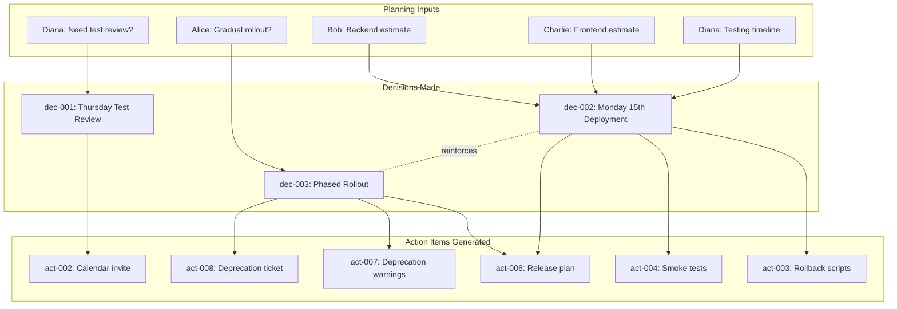

# Decisions

**Packet ID:** live-test-en024-mindmap-verification
**Total Decisions:** 3

---

## Summary Table

| ID | Decision | Decided By | Confidence | Source |
|----|----------|------------|------------|--------|
| [dec-001](#dec-001) | Schedule test case review session for Thursday afternoon | Alice | 0.95 | [→ seg-010](02-transcript.md#seg-010) |
| [dec-002](#dec-002) | Target Monday the 15th for production deployment | Team | 0.92 | [→ seg-018](02-transcript.md#seg-018) |
| [dec-003](#dec-003) | Use phased rollout approach for new authentication | Team | 0.90 | [→ seg-025](02-transcript.md#seg-025) |

---

## Detailed Decisions

### {#dec-001} dec-001: Schedule test case review session for Thursday afternoon

**Decided By:** Alice
**Confidence:** 0.95 (High)
**Decision Type:** Scheduling

**Context:**
Diana requested a test case review session to validate the authentication flow test cases she drafted. Alice polled the team for availability and decided on Thursday afternoon after confirming all team members were available.

**Rationale:**
Team availability confirmed for Thursday afternoon.

**Quote:**
> "Good question. Let's go with Thursday afternoon for the review. Does that work for everyone?"

**Source:** [→ seg-010](02-transcript.md#seg-010) at 0:01:48

**Related Question:** [que-001](06-questions.md#que-001) - Can we schedule a test case review session this week?

**Stakeholders:**
- **Requestor:** Diana (needs team validation of test cases)
- **Participants:** Bob, Charlie, Diana (all confirmed availability)

**Impact:**
- Enables test case validation before deployment
- Unblocks Diana's test planning work
- Provides forum for team alignment on testing strategy

**Action Items Generated:**
- [act-002](04-action-items.md#act-002) - Diana to send calendar invite

**Confirmation Trail:**
1. Diana asked: [seg-009](02-transcript.md#seg-009) - "Can we schedule a test case review session this week?"
2. Alice proposed: [seg-010](02-transcript.md#seg-010) - "Let's go with Thursday afternoon"
3. Bob confirmed: [seg-011](02-transcript.md#seg-011) - "Thursday works for me"
4. Charlie confirmed: [seg-012](02-transcript.md#seg-012) - "I'm free Thursday afternoon"
5. Diana accepted: [seg-013](02-transcript.md#seg-013) - "Perfect. I'll send out the calendar invite"

---

### {#dec-002} dec-002: Target Monday the 15th for production deployment

**Decided By:** Team (Alice announced after team input)
**Confidence:** 0.92 (High)
**Decision Type:** Release Planning

**Context:**
Team discussed deployment timeline based on component completion estimates. Bob estimated backend ready by next Friday (with weekend migration), Charlie estimated frontend ready by Wednesday, and Diana required 3 days for regression testing.

**Rationale:**
Based on backend ready next Friday, frontend ready Wednesday, and 3 days testing needed.

**Quote:**
> "So we're looking at a Monday release. We decided to target Monday the 15th for production deployment."

**Source:** [→ seg-018](02-transcript.md#seg-018) at 0:03:40

**Input Data:**
- **Backend estimate:** Ready by next Friday (Bob) - [seg-015](02-transcript.md#seg-015)
- **Frontend estimate:** Ready by Wednesday (Charlie) - [seg-016](02-transcript.md#seg-016)
- **Testing requirement:** 3 days regression testing (Diana) - [seg-017](02-transcript.md#seg-017)
- **Migration constraint:** Weekend window needed (Bob) - [seg-015](02-transcript.md#seg-015)

**Timeline Calculation:**
```
Backend complete:     Friday (Week N)
Weekend migration:    Saturday-Sunday
Frontend complete:    Wednesday (Week N)
Testing begins:       Wednesday (Week N)
Testing complete:     Monday (Week N+1) [3 days]
Deployment target:    Monday the 15th (Week N+1)
```

**Stakeholders:**
- **Stakeholders:** Requesting release date
- **Development:** Bob (backend), Charlie (frontend)
- **QA:** Diana (testing)
- **Coordination:** Alice (release management)

**Impact:**
- Sets firm deployment target for stakeholders
- Provides 3-day buffer for regression testing
- Allows weekend migration window for database changes
- Aligns team work priorities

**Dependencies:**
- Assumes no major blockers during development
- Requires successful API integration (Charlie-Bob handoff)
- Contingent on 3-day testing timeline being sufficient

**Risk Mitigation:**
- [act-003](04-action-items.md#act-003) - Rollback scripts prepared by Bob
- [act-004](04-action-items.md#act-004) - Smoke test checklist created
- Phased rollout strategy ([dec-003](#dec-003)) to minimize blast radius

**Action Items Generated:**
- [act-003](04-action-items.md#act-003) - Bob to prepare rollback scripts
- [act-004](04-action-items.md#act-004) - Charlie and Diana to create smoke test checklist
- [act-006](04-action-items.md#act-006) - Alice to update release plan document

---

### {#dec-003} dec-003: Use phased rollout approach for new authentication

**Decided By:** Team (consensus after Bob's proposal)
**Confidence:** 0.90 (High)
**Decision Type:** Deployment Strategy

**Context:**
Alice asked how to handle the feature flag for the new authentication system. Bob proposed a phased rollout approach, and Diana confirmed it aligns with the testing strategy.

**Rationale:**
Start with internal users, then expand to 10% of production traffic to align with testing strategy.

**Quote:**
> "That aligns with our testing strategy. We agreed to use the phased rollout approach."

**Source:** [→ seg-025](02-transcript.md#seg-025) at 0:05:32

**Related Question:** [que-002](06-questions.md#que-002) - Should we do a gradual rollout?

**Phased Rollout Plan:**
1. **Phase 1:** Internal users only
   - Team can dogfood the new authentication
   - Quick feedback loop for issues
   - No customer impact if problems occur

2. **Phase 2:** 10% of production traffic
   - Controlled expansion
   - Monitor metrics and error rates
   - Ability to roll back if needed

3. **Phase 3+:** (Implied, not explicitly discussed)
   - Gradual expansion based on Phase 2 results

**Stakeholders:**
- **Proposal:** Bob (backend developer) - [seg-024](02-transcript.md#seg-024)
- **QA Alignment:** Diana (testing strategy) - [seg-025](02-transcript.md#seg-025)
- **Approval:** Alice (team lead)

**Impact:**
- Reduces risk of authentication failures affecting all users
- Provides controlled testing environment (internal users)
- Allows monitoring and validation at small scale (10%)
- Enables quick rollback if issues discovered

**Alignment:**
- **Testing Strategy:** Diana confirmed alignment with QA approach
- **Deployment Safety:** Complements rollback scripts ([act-003](04-action-items.md#act-003))
- **User Experience:** Minimizes blast radius of potential issues

**Technical Requirements:**
- Feature flag implementation for authentication system
- User segmentation capability (internal vs. external, percentage-based)
- Monitoring and alerting for authentication metrics
- Rollback mechanism for feature flag

**Alternative Considered:**
- **Big Bang Deployment:** All users at once (implicitly rejected)
  - Higher risk
  - Larger potential user impact
  - Harder to rollback

**Related Decisions:**
- Complements legacy endpoint parallel operation (2+ week window)
- Supports [dec-002](#dec-002) deployment timeline

**Action Items Generated:**
- [act-006](04-action-items.md#act-006) - Alice to document in release plan
- [act-007](04-action-items.md#act-007) - Bob to add deprecation warnings to legacy endpoint
- [act-008](04-action-items.md#act-008) - Bob to create deprecation tracking ticket

---

## Decision Flow



---

## Decision Impact Matrix

| Decision | Immediate Impact | Long-term Impact | Risk Level |
|----------|------------------|------------------|------------|
| [dec-001](#dec-001) | Test review scheduled | Validated test cases, better QA coverage | Low |
| [dec-002](#dec-002) | Deployment date set | Stakeholder alignment, team focus | Medium |
| [dec-003](#dec-003) | Phased rollout planned | Controlled risk, better monitoring | Low-Medium |

**Risk Level Explanation:**
- **dec-001:** Low risk - scheduling decision with full team buy-in
- **dec-002:** Medium risk - date commitment with dependencies on estimates
- **dec-003:** Low-Medium risk - phased approach reduces deployment risk but adds complexity

---

## Decision Confidence Analysis

All decisions rated with high confidence (0.90+):

- **dec-001:** 0.95 - Clear team consensus, immediate confirmation from all members
- **dec-002:** 0.92 - Based on concrete estimates from all technical owners
- **dec-003:** 0.90 - Explicit QA alignment confirmation, technical consensus

**Confidence Factors:**
- Team participation in decision-making
- Explicit verbal confirmations captured
- Technical estimates from subject matter experts
- Risk mitigation actions identified

---

## Navigation

- [← Back to Index](00-index.md)
- [View Full Transcript →](02-transcript.md)
- [View Action Items →](04-action-items.md)
- [View Questions →](06-questions.md)

---

*Generated by ts-formatter agent | Transcript Skill v1.0*
