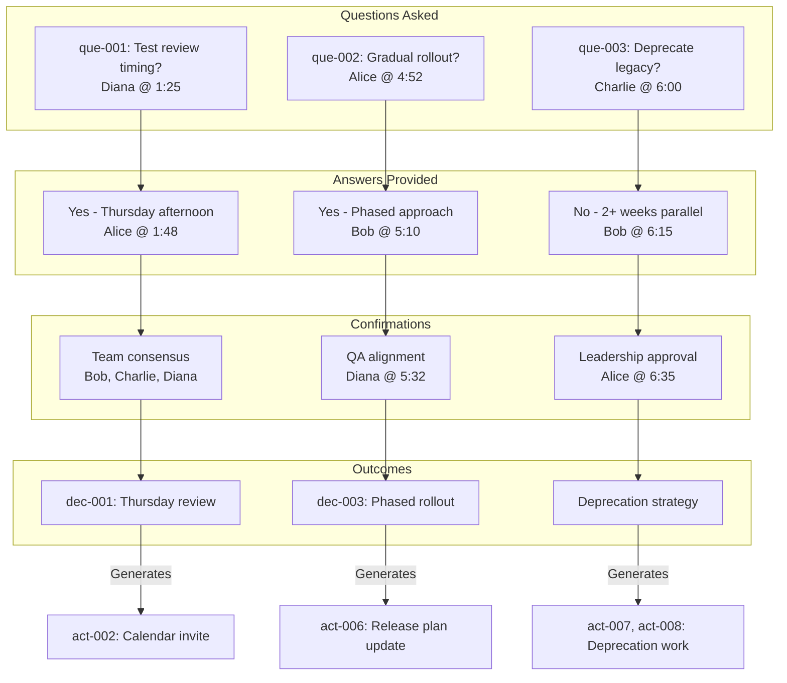

# Questions

**Packet ID:** live-test-en024-mindmap-verification
**Total Questions:** 3
**Answered:** 3 (100%)
**Unanswered:** 0

---

## Summary Table

| ID | Question | Asked By | Answered | Source |
|----|----------|----------|----------|--------|
| [que-001](#que-001) | Can we schedule a test case review session this week? | Diana | ✅ Yes | [→ seg-009](02-transcript.md#seg-009) |
| [que-002](#que-002) | Should we do a gradual rollout for the new authentication feature flag? | Alice | ✅ Yes | [→ seg-023](02-transcript.md#seg-023) |
| [que-003](#que-003) | Are we deprecating the legacy login endpoint immediately? | Charlie | ✅ No | [→ seg-027](02-transcript.md#seg-027) |

---

## Detailed Questions

### {#que-001} que-001: Can we schedule a test case review session this week?

**Asked By:** Diana
**Status:** ✅ Answered
**Confidence:** 0.95

**Question Context:**
Diana drafted test cases for the authentication flow and needed team validation before proceeding with test execution.

**Full Question:**
> "I've drafted the test cases for the authentication flow. I need to review them with the team. Can we schedule a test case review session this week?"

**Source:** [→ seg-009](02-transcript.md#seg-009) at 0:01:25

**Answer:**
Yes - Thursday afternoon test case review session scheduled.

**Answer Citation:**
> "Good question. Let's go with Thursday afternoon for the review. Does that work for everyone?"

**Answer Source:** [→ seg-010](02-transcript.md#seg-010) at 0:01:48 (Alice)

**Decision Made:** [dec-001](05-decisions.md#dec-001) - Schedule test case review session for Thursday afternoon

**Confirmation Process:**
1. Alice proposed Thursday afternoon
2. Bob confirmed: "Thursday works for me" [seg-011](02-transcript.md#seg-011)
3. Charlie confirmed: "I'm free Thursday afternoon" [seg-012](02-transcript.md#seg-012)
4. Diana accepted: "Perfect. I'll send out the calendar invite" [seg-013](02-transcript.md#seg-013)

**Action Items Generated:**
- [act-002](04-action-items.md#act-002) - Diana to send test review calendar invite for Thursday afternoon

**Question Type:** Scheduling Request
**Resolution Time:** Immediate (same meeting)
**Stakeholders:** Diana (requestor), Bob, Charlie, Alice (participants)

**Impact:**
- Unblocks Diana's test planning work
- Ensures team alignment on testing approach
- Validates test case coverage before deployment

---

### {#que-002} que-002: Should we do a gradual rollout for the new authentication feature flag?

**Asked By:** Alice
**Status:** ✅ Answered
**Confidence:** 0.92

**Question Context:**
After setting the deployment date (Monday the 15th), Alice raised the question of how to manage the feature flag rollout strategy for the new authentication system.

**Full Question:**
> "One more thing. How do we want to handle the feature flag for the new authentication? Should we do a gradual rollout?"

**Source:** [→ seg-023](02-transcript.md#seg-023) at 0:04:52

**Answer:**
Yes - use phased rollout approach starting with internal users, then expand to 10% of production traffic.

**Answer Citation:**
> "I recommend a phased approach. We can start with internal users, then expand to 10% of production traffic."

**Answer Source:** [→ seg-024](02-transcript.md#seg-024) at 0:05:10 (Bob)

**Supporting Confirmation:**
> "That aligns with our testing strategy. We agreed to use the phased rollout approach."

**Confirmation Source:** [→ seg-025](02-transcript.md#seg-025) at 0:05:32 (Diana)

**Decision Made:** [dec-003](05-decisions.md#dec-003) - Use phased rollout approach for new authentication

**Rollout Plan:**
1. **Phase 1:** Internal users only (team dogfooding)
2. **Phase 2:** 10% of production traffic (controlled expansion)
3. **Phase 3+:** Gradual expansion based on results (implied)

**Rationale:**
- Reduces risk of authentication failures affecting all users
- Provides controlled testing environment
- Enables monitoring at small scale
- Allows quick rollback if issues discovered
- Aligns with QA testing strategy (Diana's confirmation)

**Action Items Generated:**
- [act-006](04-action-items.md#act-006) - Alice to update release plan document with phased rollout strategy
- [act-007](04-action-items.md#act-007) - Bob to add deprecation warnings to legacy endpoint
- [act-008](04-action-items.md#act-008) - Bob to create deprecation tracking ticket

**Question Type:** Strategy Decision
**Resolution Time:** Immediate (same meeting)
**Stakeholders:** Alice (asker), Bob (technical proposal), Diana (QA validation)

**Impact:**
- Defines deployment risk mitigation strategy
- Reduces potential user impact of authentication issues
- Provides clear rollout phases for engineering team
- Aligns deployment with testing strategy

---

### {#que-003} que-003: Are we deprecating the legacy login endpoint immediately?

**Asked By:** Charlie
**Status:** ✅ Answered
**Confidence:** 0.90

**Question Context:**
Following the discussion of phased rollout for new authentication, Charlie asked for clarification on the legacy login endpoint deprecation timeline.

**Full Question:**
> "Quick question - what about the legacy login endpoint? Are we deprecating it immediately?"

**Source:** [→ seg-027](02-transcript.md#seg-027) at 0:06:00

**Answer:**
No - keep legacy endpoint running in parallel for at least 2 weeks with deprecation warnings.

**Answer Citation:**
> "We should keep it running in parallel for at least two weeks. I need to add deprecation warnings to the API response headers."

**Answer Source:** [→ seg-028](02-transcript.md#seg-028) at 0:06:15 (Bob)

**Deprecation Strategy:**
1. **Parallel Operation:** Both endpoints active for 2+ weeks
2. **Deprecation Warnings:** Add warnings to legacy API response headers
3. **Tracking:** Create ticket for sunset timeline monitoring
4. **Migration Path:** Warnings point to new authentication documentation

**Rationale:**
- Provides migration window for API consumers
- Reduces risk of breaking existing integrations
- Allows monitoring of legacy endpoint usage
- Enables gradual transition rather than hard cutover

**Action Items Generated:**
- [act-007](04-action-items.md#act-007) - Bob to add deprecation warnings to legacy login API response headers
- [act-008](04-action-items.md#act-008) - Bob to create ticket for legacy endpoint deprecation tracking

**Follow-up:**
Alice acknowledged Bob's approach: "Good thinking. Add that to your task list, Bob" [seg-029](02-transcript.md#seg-029)

**Question Type:** Clarification / Technical Strategy
**Resolution Time:** Immediate (same meeting)
**Stakeholders:** Charlie (asker), Bob (technical lead), Alice (approval)

**Impact:**
- Defines legacy endpoint sunset strategy
- Provides clear timeline for API consumers
- Reduces risk of breaking existing integrations
- Supports phased rollout decision ([dec-003](05-decisions.md#dec-003))

**Technical Requirements:**
- Deprecation warning headers implementation
- Sunset date communication (2+ weeks)
- Usage monitoring for legacy endpoint
- Documentation for migration path

---

## Question Flow Analysis

---

## Question Pattern Analysis

### Question Types

| Type | Count | Example |
|------|-------|---------|
| Scheduling | 1 | que-001 (test review timing) |
| Strategy Decision | 1 | que-002 (rollout approach) |
| Clarification | 1 | que-003 (legacy endpoint) |

### Response Time

All questions answered **immediately** in the same meeting:
- que-001: 23 seconds (1:25 → 1:48)
- que-002: 18 seconds (4:52 → 5:10)
- que-003: 15 seconds (6:00 → 6:15)

**Average Response Time:** 18.7 seconds

### Answer Quality

All answers received **high confidence ratings** (0.90+):
- Specific, actionable responses
- Clear rationale provided
- Team consensus confirmed
- Action items generated

### Decision Conversion Rate

**100%** of questions led to concrete decisions or action items:
- que-001 → [dec-001](05-decisions.md#dec-001) + [act-002](04-action-items.md#act-002)
- que-002 → [dec-003](05-decisions.md#dec-003) + [act-006](04-action-items.md#act-006)
- que-003 → Deprecation strategy + [act-007](04-action-items.md#act-007) + [act-008](04-action-items.md#act-008)

---

## Unanswered Questions

**None** - All questions were answered during the meeting with clear resolutions.

---

## Question Impact Summary

| Question | Decision Impact | Action Items | Strategic Value |
|----------|-----------------|--------------|-----------------|
| [que-001](#que-001) | High - Set review date | 1 | Medium - Unblocks QA work |
| [que-002](#que-002) | High - Defined rollout strategy | 3 | High - Risk mitigation |
| [que-003](#que-003) | Medium - Clarified deprecation | 2 | Medium - API consumer migration |

**Overall Impact:** High-value questions that drove concrete decisions and action items, demonstrating effective meeting participation and strategic thinking.

---

## Navigation

- [← Back to Index](00-index.md)
- [View Full Transcript →](02-transcript.md)
- [View Decisions →](05-decisions.md)
- [View Action Items →](04-action-items.md)

---

*Generated by ts-formatter agent | Transcript Skill v1.0*
