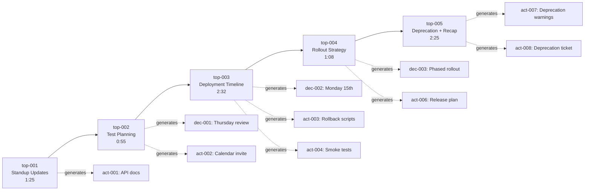

# Topic Segments

**Packet ID:** live-test-en024-mindmap-verification
**Total Topics:** 5
**Duration:** 8 minutes 25 seconds

---

## Topic Summary

| Topic | Title | Duration | Segments | Key Outcomes |
|-------|-------|----------|----------|--------------|
| [top-001](#top-001) | Daily Standup Updates | 1:25 (0:00-1:25) | 8 | Individual updates, API doc commitment |
| [top-002](#top-002) | Test Planning and Review Scheduling | 0:55 (1:25-2:20) | 5 | Thursday review scheduled |
| [top-003](#top-003) | Deployment Timeline and Release Planning | 2:32 (2:20-4:52) | 9 | Monday 15th deployment set |
| [top-004](#top-004) | Feature Flag and Rollout Strategy | 1:08 (4:52-6:00) | 4 | Phased rollout agreed |
| [top-005](#top-005) | Legacy Endpoint Deprecation and Action Items Summary | 2:25 (6:00-8:25) | 13 | Deprecation plan, recap complete |

---

## Detailed Topic Breakdown

### {#top-001} top-001: Daily Standup Updates

**Time Range:** 0:00:00 - 0:01:25 (1 minute 25 seconds)
**Segments:** 8 ([seg-001](02-transcript.md#seg-001) through [seg-008](02-transcript.md#seg-008))
**Speakers:** Alice (5), Bob (2), Charlie (1)

**Summary:**
Traditional standup format where team members reported yesterday's work, today's plans, and blockers. Bob completed API authentication module, Charlie completed login UI but is blocked on API integration, and Alice queued up Diana for test planning update.

**Key Points:**
- Bob finished API authentication module
- Charlie completed login form UI
- Charlie blocked on API integration (needs documentation)
- Bob committed to send Swagger documentation after meeting

**Entities Extracted:**
- [act-001](04-action-items.md#act-001) - Bob to send API Swagger documentation to Charlie

**Segment Breakdown:**

| Time | Speaker | Content Type | Key Point |
|------|---------|--------------|-----------|
| 0:00 | Alice | Opening | Meeting start |
| 0:06 | Alice | Facilitation | Bob to kick off updates |
| 0:12 | Bob | Standup Update | API auth module done, migration scripts next, no blockers |
| 0:26 | Alice | Transition | Acknowledge Bob, cue Charlie |
| 0:32 | Charlie | Standup Update | Login UI done, blocked on API, password reset next |
| 0:52 | Bob | Commitment | API endpoints ready, will send Swagger docs |
| 1:05 | Charlie | Acknowledgment | Unblocked, thanks Bob |
| 1:12 | Alice | Transition | Cue Diana for test planning update |

**Outcome:**
Charlie's blocker resolved in-meeting through Bob's commitment to send documentation.

**Transition:**
Alice pivots from standup updates to Diana's test planning discussion at 1:12.

---

### {#top-002} top-002: Test Planning and Review Scheduling

**Time Range:** 0:01:25 - 0:02:20 (55 seconds)
**Segments:** 5 ([seg-009](02-transcript.md#seg-009) through [seg-013](02-transcript.md#seg-013))
**Speakers:** Diana (2), Alice (1), Bob (1), Charlie (1)

**Summary:**
Diana requested a test case review session for the authentication flow test cases she drafted. Alice proposed Thursday afternoon, polled the team for availability, and all members confirmed. Diana committed to sending the calendar invite.

**Key Points:**
- Diana drafted test cases for authentication flow
- Team review needed before execution
- Thursday afternoon works for all team members
- Decision made to schedule review session

**Entities Extracted:**
- [que-001](06-questions.md#que-001) - Can we schedule a test case review session this week?
- [dec-001](05-decisions.md#dec-001) - Schedule test case review session for Thursday afternoon
- [act-002](04-action-items.md#act-002) - Diana to send test review calendar invite

**Segment Breakdown:**

| Time | Speaker | Content Type | Key Point |
|------|---------|--------------|-----------|
| 1:25 | Diana | Question | Test cases drafted, need team review this week? |
| 1:48 | Alice | Decision | Thursday afternoon proposed |
| 2:05 | Bob | Confirmation | Thursday works |
| 2:10 | Charlie | Confirmation | Free Thursday afternoon |
| 2:15 | Diana | Acceptance | Will send calendar invite |

**Decision Flow:**
1. Diana asks for review session
2. Alice proposes Thursday afternoon
3. Team confirms availability (Bob, Charlie)
4. Diana accepts and commits to sending invite

**Outcome:**
Clear decision with action item assigned (Diana to send invite).

**Transition:**
Alice transitions to deployment timeline discussion at 2:20 with "Before we wrap up..."

---

### {#top-003} top-003: Deployment Timeline and Release Planning

**Time Range:** 0:02:20 - 0:04:52 (2 minutes 32 seconds)
**Segments:** 9 ([seg-014](02-transcript.md#seg-014) through [seg-022](02-transcript.md#seg-022))
**Speakers:** Alice (4), Bob (2), Charlie (2), Diana (2)

**Summary:**
Detailed discussion of deployment timeline based on component readiness estimates. Team calculated deployment date as Monday the 15th based on backend (next Friday), frontend (Wednesday), and 3-day testing window. Bob committed to rollback scripts, Charlie and Diana agreed to collaborate on smoke test checklist.

**Key Points:**
- Stakeholders asking about release date
- Backend ready by next Friday (needs weekend migration)
- Frontend ready by Wednesday (pending API integration)
- 3 days regression testing required
- Monday the 15th deployment target set
- Rollback scripts and smoke tests planned

**Entities Extracted:**
- [dec-002](05-decisions.md#dec-002) - Target Monday the 15th for production deployment
- [act-003](04-action-items.md#act-003) - Bob to prepare rollback scripts
- [act-004](04-action-items.md#act-004) - Charlie to create smoke test checklist with Diana
- [act-005](04-action-items.md#act-005) - Diana to block calendar time with Charlie

**Segment Breakdown:**

| Time | Speaker | Content Type | Key Point |
|------|---------|--------------|-----------|
| 2:20 | Alice | Context | Stakeholders asking for release date |
| 2:45 | Bob | Estimate | Backend ready next Friday, weekend migration needed |
| 3:05 | Charlie | Estimate | Frontend ready Wednesday (if API integration smooth) |
| 3:22 | Diana | Requirement | 3 days regression testing after integration |
| 3:40 | Alice | Decision | Monday the 15th deployment target |
| 4:00 | Bob | Commitment | Will prepare rollback scripts (tomorrow) |
| 4:18 | Alice | Assignment | Charlie + Diana create smoke test checklist |
| 4:35 | Charlie | Acceptance | Will sync with Diana after meeting |
| 4:45 | Diana | Commitment | Will block calendar time |

**Timeline Calculation:**
```
Component Readiness:
- Backend:  Friday (Week N) + weekend migration
- Frontend: Wednesday (Week N)
- Testing:  Wednesday → Monday (3 days)
Result: Monday the 15th (Week N+1)
```

**Risk Mitigation Identified:**
- Rollback scripts (Bob)
- Smoke test checklist (Charlie + Diana)
- Weekend migration window (database changes)

**Outcome:**
Firm deployment date with risk mitigation actions assigned.

**Transition:**
Alice shifts to rollout strategy at 4:52 with "One more thing..."

---

### {#top-004} top-004: Feature Flag and Rollout Strategy

**Time Range:** 0:04:52 - 0:06:00 (1 minute 8 seconds)
**Segments:** 4 ([seg-023](02-transcript.md#seg-023) through [seg-026](02-transcript.md#seg-026))
**Speakers:** Alice (2), Bob (1), Diana (1)

**Summary:**
Alice raised the question of feature flag handling for new authentication. Bob proposed a phased rollout (internal users → 10% production traffic). Diana confirmed this aligns with testing strategy. Team agreed on phased approach, and Alice committed to updating release plan document.

**Key Points:**
- Feature flag strategy needed for new authentication
- Phased rollout proposed: internal users first, then 10%
- QA confirms alignment with testing strategy
- Reduces risk through controlled expansion

**Entities Extracted:**
- [que-002](06-questions.md#que-002) - Should we do a gradual rollout for the new authentication feature flag?
- [dec-003](05-decisions.md#dec-003) - Use phased rollout approach for new authentication
- [act-006](04-action-items.md#act-006) - Alice to update release plan document

**Segment Breakdown:**

| Time | Speaker | Content Type | Key Point |
|------|---------|--------------|-----------|
| 4:52 | Alice | Question | How to handle feature flag? Gradual rollout? |
| 5:10 | Bob | Proposal | Phased: internal users → 10% production traffic |
| 5:32 | Diana | Validation | Aligns with testing strategy, agreed |
| 5:45 | Alice | Commitment | Will update release plan document |

**Phased Rollout Strategy:**
1. **Phase 1:** Internal users (team dogfooding)
2. **Phase 2:** 10% production traffic (controlled expansion)
3. **Phase 3+:** Gradual expansion (implied, based on results)

**Rationale:**
- Risk mitigation through controlled rollout
- Quick feedback loop from internal users
- Ability to monitor and rollback at small scale
- Alignment with QA testing approach

**Outcome:**
Clear rollout strategy with QA alignment confirmed.

**Transition:**
Charlie raises legacy endpoint question at 6:00.

---

### {#top-005} top-005: Legacy Endpoint Deprecation and Action Items Summary

**Time Range:** 0:06:00 - 0:08:25 (2 minutes 25 seconds)
**Segments:** 13 ([seg-027](02-transcript.md#seg-027) through [seg-039](02-transcript.md#seg-039))
**Speakers:** Charlie (2), Bob (2), Alice (7), Diana (1)

**Summary:**
Charlie asked about legacy login endpoint deprecation. Bob explained 2+ week parallel operation with deprecation warnings. Alice acknowledged and asked Bob to create tracking ticket. Alice then recapped all action items by assignee. Team confirmed no questions and meeting adjourned.

**Key Points:**
- Legacy endpoint kept parallel for 2+ weeks (not immediate deprecation)
- Deprecation warnings added to API response headers
- Tracking ticket created for sunset timeline
- Complete action item recap by Alice covering all assignments

**Entities Extracted:**
- [que-003](06-questions.md#que-003) - Are we deprecating the legacy login endpoint immediately?
- [act-007](04-action-items.md#act-007) - Bob to add deprecation warnings to legacy API
- [act-008](04-action-items.md#act-008) - Bob to create legacy endpoint deprecation ticket

**Segment Breakdown:**

| Time | Speaker | Content Type | Key Point |
|------|---------|--------------|-----------|
| 6:00 | Charlie | Question | Deprecate legacy endpoint immediately? |
| 6:15 | Bob | Answer | Keep parallel 2+ weeks, add deprecation warnings |
| 6:35 | Alice | Acknowledgment | Good thinking, add to task list |
| 6:48 | Bob | Commitment | Will create ticket after meeting |
| 6:55 | Alice | Transition | Recap action items |
| 7:10 | Alice | Recap | Bob's 3 action items |
| 7:25 | Alice | Recap | Charlie's 2 action items |
| 7:38 | Alice | Recap | Diana's 2 action items |
| 7:50 | Alice | Recap | Alice's 1 action item + questions check |
| 8:00 | Bob | Confirmation | All clear |
| 8:05 | Charlie | Confirmation | Good to go |
| 8:10 | Diana | Confirmation | No questions |
| 8:15 | Alice | Closing | Meeting adjourned |

**Action Items Recap (by Alice):**

**Bob (3 items):**
1. Send API documentation to Charlie
2. Prepare rollback scripts
3. Add deprecation warnings to legacy endpoint

**Charlie (2 items):**
1. Implement password reset
2. Work with Diana on smoke test checklist

**Diana (2 items):**
1. Send test review invite for Thursday
2. Complete test case documentation

**Alice (1 item):**
1. Update release plan with decisions

**Legacy Endpoint Deprecation Strategy:**
- Parallel operation: 2+ weeks minimum
- Deprecation warnings: API response headers
- Tracking: Ticket for sunset timeline
- Migration path: Documentation for API consumers

**Outcome:**
Complete action item recap with team confirmation, meeting adjourned professionally.

---

## Topic Flow Diagram



---

## Topic Characteristics

### Duration Distribution

| Topic | Duration | Percentage | Density (entities/min) |
|-------|----------|------------|------------------------|
| top-001 | 1:25 | 16.8% | 0.71 |
| top-002 | 0:55 | 10.9% | 3.27 |
| top-003 | 2:32 | 30.2% | 1.58 |
| top-004 | 1:08 | 13.5% | 2.65 |
| top-005 | 2:25 | 28.7% | 1.24 |

**Observations:**
- **Highest density:** top-002 (Test Planning) - short but high-value
- **Longest duration:** top-003 (Deployment Timeline) - most complex discussion
- **Most entities:** top-003 and top-005 - deployment planning and wrap-up

### Speaker Distribution by Topic

| Topic | Alice | Bob | Charlie | Diana | Primary Driver |
|-------|-------|-----|---------|-------|----------------|
| top-001 | 5 | 2 | 1 | 0 | Alice (facilitation) |
| top-002 | 1 | 1 | 1 | 2 | Diana (initiated) |
| top-003 | 4 | 2 | 2 | 2 | Team (collaborative) |
| top-004 | 2 | 1 | 0 | 1 | Bob (technical proposal) |
| top-005 | 7 | 2 | 2 | 1 | Alice (recap/closing) |

**Observations:**
- Alice facilitated most topics (dominant in 3 of 5)
- Diana drove test planning discussion despite fewest total segments
- Deployment timeline was most collaborative (all 4 participants active)

---

## Conversation Flow Analysis

### Meeting Structure

**Act 1: Information Gathering (0:00 - 2:20)**
- Topics: top-001, top-002
- Purpose: Status updates and immediate needs
- Outcome: Blockers identified, test review scheduled

**Act 2: Strategic Planning (2:20 - 6:00)**
- Topics: top-003, top-004
- Purpose: Deployment and rollout strategy
- Outcome: Deployment date set, phased rollout agreed

**Act 3: Details and Wrap-up (6:00 - 8:25)**
- Topic: top-005
- Purpose: Legacy endpoint clarification and action recap
- Outcome: Complete action item list, team alignment confirmed

### Transitions

All topic transitions were **smooth and intentional**:
1. Standup → Test Planning: Natural progression (Alice cued Diana)
2. Test Planning → Deployment: "Before we wrap up..." (Alice)
3. Deployment → Rollout: "One more thing..." (Alice)
4. Rollout → Deprecation: Question from Charlie (natural)
5. Deprecation → Recap: "Let's recap the action items" (Alice)

**Facilitation Quality:** High - Alice managed transitions effectively, ensuring all topics were covered.

---

## Entity Generation by Topic

| Topic | Action Items | Decisions | Questions | Total Entities |
|-------|--------------|-----------|-----------|----------------|
| top-001 | 1 | 0 | 0 | 1 |
| top-002 | 1 | 1 | 1 | 3 |
| top-003 | 3 | 1 | 0 | 4 |
| top-004 | 1 | 1 | 1 | 3 |
| top-005 | 2 | 0 | 1 | 3 |
| **Total** | **8** | **3** | **3** | **14** |

**Entity Generation Rate:** 1.66 entities per minute (14 entities / 8.42 minutes)

---

## Navigation

- [← Back to Index](00-index.md)
- [View Full Transcript →](02-transcript.md)
- [View Action Items →](04-action-items.md)
- [View Decisions →](05-decisions.md)
- [View Questions →](06-questions.md)

---

*Generated by ts-formatter agent | Transcript Skill v1.0*
