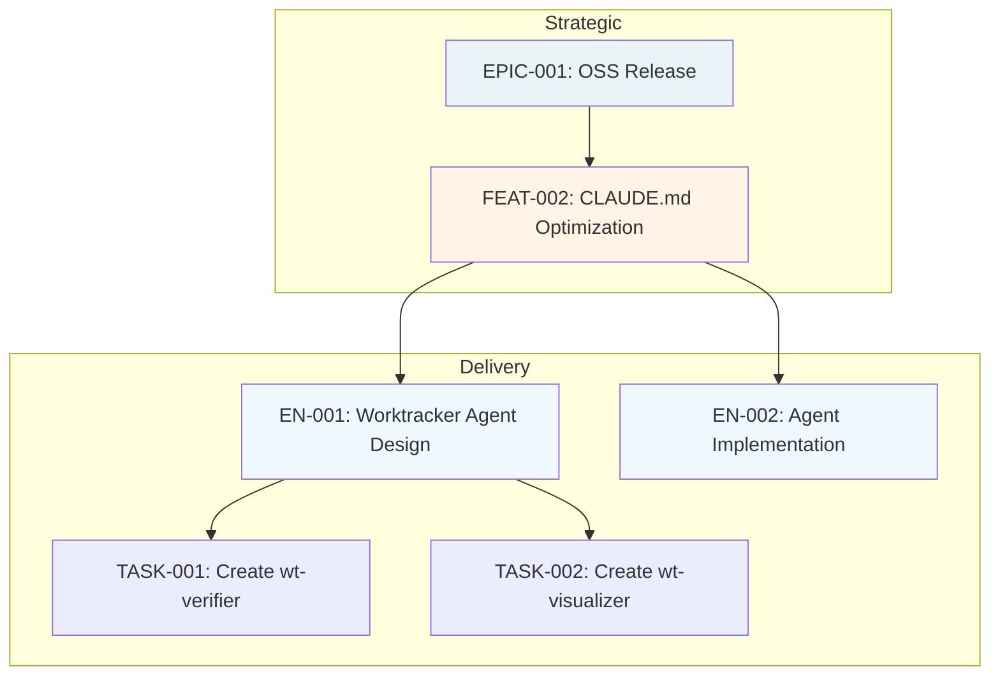
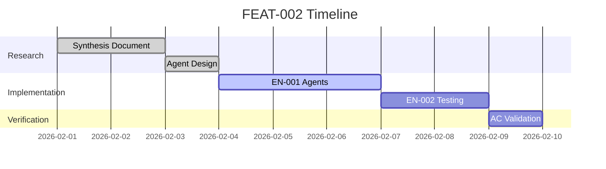
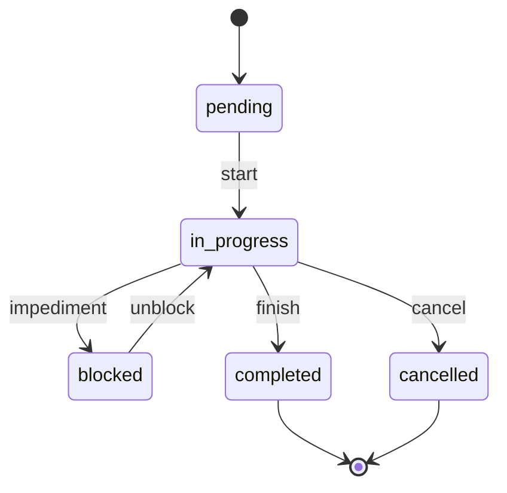
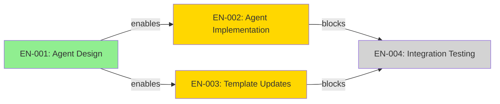
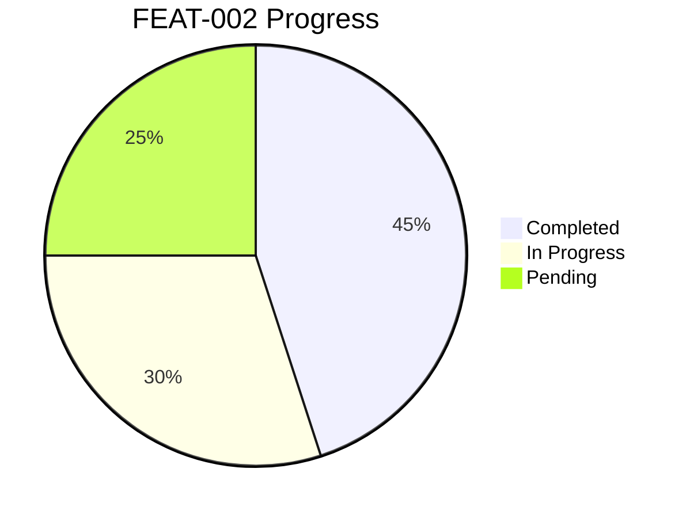

# WT Visualizer: Diagram Examples

> Complete Mermaid diagram examples for each supported diagram type. Reference for wt-visualizer output generation.

## Hierarchy Diagram Example



## Timeline Diagram Example



## Status Diagram Example



## Dependency Diagram Example



## Progress Diagram Example



## Diagram File Output Structure

```markdown
# {Entity-ID} {Diagram-Type} Diagram

**Generated:** {ISO-8601-timestamp}
**Root Entity:** {entity-id}
**Diagram Type:** {diagram-type}
**Entities Included:** {count}
**Max Depth Reached:** {depth}

---

## Diagram

(mermaid code block here)

---

## Metadata

- **Entities Visualized:** {list-of-entity-ids}
- **Relationships Shown:** {count}
- **Status Color Coding:** {enabled|disabled}
- **Warnings:** {any-warnings-or-limitations}

---

*Generated by wt-visualizer v1.0.0*
```
